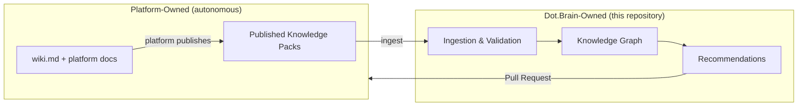
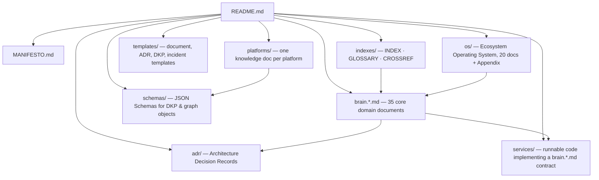

# Dot.Brain

**Dot.Brain is the collective intelligence layer of the Dot Ecosystem** — its knowledge graph, reasoning engine, learning engine, memory orchestrator, and recommendation engine. It is not another application; it is the ecosystem's digital brain, designed to remain the source of truth for every current and future Dot platform for 20+ years.

> **Related documents:** [MANIFESTO.md](MANIFESTO.md) · [brain.identity.md](brain.identity.md) · [brain.architecture.md](brain.architecture.md) · [indexes/INDEX.md](indexes/INDEX.md) · [adr/ADR-0001-repository-structure.md](adr/ADR-0001-repository-structure.md)

---

## What Dot.Brain IS

- The **knowledge graph** connecting all 21 Dot platforms.
- The **ingestion point** for Knowledge Packs (DKPs) published by platforms.
- The **reasoning and recommendation engine** that proposes improvements back to platforms — always via Pull Requests.
- The **memory orchestrator** (working with Dot.Memory) and the **learning engine** that converts every success, failure, incident, and experiment into verified, reusable knowledge.
- **Auditable by design**: every insight carries a confidence score (0.00–1.00) and a provenance chain.

## What Dot.Brain is NOT

- ❌ Not a wiki host for platforms. Platforms own their local knowledge (`wiki.md`, platform docs).
- ❌ Not an editor of platform-owned files. **Dot.Brain proposes; platforms decide.**
- ❌ Not an application with end-user UI. It serves platforms, agents, and stewards.
- ❌ Not an engagement-maximization engine. Ethical optimization only (learning, mastery, business growth — never addiction).

## The Ownership Boundary


*Knowledge flows in via published Knowledge Packs; improvements flow back only as Pull Requests that platforms accept or reject. Approved knowledge is never overwritten — it is superseded with full provenance.*

## How Platforms Interact with Dot.Brain

1. **Register** — drop one manifest-driven knowledge document in `platforms/` and register in [brain.platforms.md](brain.platforms.md). *Invariant: nothing else in this repository changes when a platform joins. If a new platform requires an architecture change, the architecture is wrong.*
2. **Publish** — emit Knowledge Packs conforming to schemas in `schemas/` (defined by [brain.dkp.md](brain.dkp.md)).
3. **Receive** — accept or reject Pull Requests generated by Dot.Brain recommendations.
4. **Query** — consume the graph via APIs defined in [brain.api.md](brain.api.md) and search per [brain.search.md](brain.search.md).

## Repository Map


*`os/` sits one level above `brain.*.md`: ecosystem-wide operating doctrine (how ~20 platforms are built, secured, owned) versus Dot.Brain's own detailed technical specification. See [os/README.md](os/README.md).*
*`services/` is new as of `brain.market_intelligence.md`: most `brain.*.md` documents are contracts each platform implements in its own stack, but a document may host its own reference implementation directly in this repository when it defines a capability Dot.Brain itself runs (e.g. `services/market-research/` implements `brain.market_intelligence.md`).*
*Every document is reachable within two clicks of this README — directly, or via `indexes/INDEX.md`.*

## Annotated Repository Tree

Format: `path — purpose · owner (Agent Colony) · primary consumers`

```
dot-brain/
├── README.md                        # Entry point & boundary definition · Repository Steward Agent · everyone
├── MANIFESTO.md                     # Canonical Dot Intelligence Manifesto · Governance Agent · everyone
├── os/                               # Ecosystem Operating System — 20 docs + Appendix, one level above brain.*.md · Repository Steward Agent · owner, all AI agents
├── brain.identity.md                # What the brain is, mission, scope · Governance Agent · executives, new contributors
├── brain.architecture.md            # System architecture & component model · Architecture Agent · platform engineers
├── brain.vision.md                  # 20-year vision & roadmap horizons · Governance Agent · executives
├── brain.reasoning.md               # Reasoning engine design & inference rules · Reasoning Agent · AI agents
├── brain.learning.md                # Continuous learning loops · Learning Agent · AI agents
├── brain.memory.md                  # Memory orchestration (with Dot.Memory) · Memory Agent · platform engineers
├── brain.dkp.md                     # Dot Knowledge Pack spec & lifecycle · Architecture Agent · platform engineers
├── brain.platforms.md               # Platform registry (single registration point) · Registry Agent · all platforms
├── brain.relationships.md           # Cross-platform relationship model · Knowledge Agent · AI agents
├── brain.agents.md                  # Agent Colony architecture & duties · Governance Agent · AI agents
├── brain.analytics.md               # Intelligence analytics (with Dot.Analytics) · Data Agent · executives
├── brain.design.md                  # Design standards (with Dot.Design) · UX Agent · UX, engineers
├── brain.security.md                # Security, privacy, threat model · Security Agent · security reviewers
├── brain.api.md                     # API surface & contracts · Architecture Agent · platform engineers
├── brain.search.md                  # Search & retrieval architecture · Architecture Agent · platform engineers
├── brain.semantic.md                # Ontology & semantic layer · Knowledge Agent · AI agents
├── brain.telemetry.md               # Telemetry & observability · Data Agent · SRE, security reviewers
├── brain.workflows.md               # Ingestion→reasoning→PR workflows · Architecture Agent · platform engineers
├── brain.metrics.md                 # Metric definitions (measure before feature) · Data Agent · executives
├── brain.recommendations.md         # Recommendation engine & PR generation · Reasoning Agent · all platforms
├── brain.future.md                  # Future integration surface · Registry Agent · executives
├── brain.evolution.md               # Self-evolution mechanics & guardrails · Evolution Agent · governance
├── brain.dopemine.md                # Ethical engagement intelligence · Dopamine Agent · Dot.Dopemine, governance
├── brain.community.md               # Community knowledge flows (Dot.Pulse) · Community Agent · Dot.Pulse
├── brain.business.md                # Business intelligence & automation · Business Agent · executives
├── brain.governance.md              # Governance model & approval chains · Governance Agent · human approvers
├── brain.resilience.md              # Resilience & Continuity Framework (anti-fragility) · Resilience Agent · SRE
├── brain.cushion.md                 # Financial/resource shock-absorption dimension registry (distinct from SRE resilience) · Business Agent · platform engineers, executives
├── brain.market_intelligence.md     # Market/competitor/customer research contract — fact hierarchy, research-memory schema, governance · Business Agent · platform engineers, executives
├── brain.experiments.md             # Experiment registry & protocols · Evolution Agent · AI agents
├── brain.failures.md                # Failure knowledge base (incidents → assets) · Resilience Agent · SRE, all
├── brain.success.md                 # Success pattern library · Learning Agent · all platforms
├── brain.events.md                  # Event taxonomy & event-driven contracts · Architecture Agent · platform engineers
├── brain.patterns.md                # Architectural & knowledge patterns · Architecture Agent · engineers
├── brain.personas.md                # Reader/user personas served by the brain · UX Agent · UX, docs
├── brain.operating_model.md         # How humans + agents run the brain · Governance Agent · everyone
├── adr/
│   └── ADR-0001-repository-structure.md  # This structure's decision record · Architecture Agent · engineers
├── schemas/                         # JSON Schemas (DKP, graph objects) · Architecture Agent · platform engineers
├── templates/                       # Document/ADR/DKP/incident templates · Repository Steward Agent · contributors
├── platforms/                       # One knowledge doc per platform · Registry Agent + platform owner · that platform
│   ├── dot-brain.md
│   ├── dot-memory.md
│   ├── dot-analytics.md
│   ├── dot-pulse.md
│   ├── dot-plug.md
│   ├── dot-mines.md
│   ├── dot-notify.md
│   ├── dot-billing.md
│   ├── dot-charts.md
│   ├── dot-farms.md
│   ├── dot-hr.md
│   ├── dot-dopemine.md
│   ├── dot-emall.md
│   ├── dot-ehail.md
│   ├── dot-agents.md
│   ├── dot-auction.md
│   ├── dot-central.md
│   ├── dot-projects.md
│   ├── dot-tasks.md
│   ├── dot-design.md
│   ├── dot-finance.md
│   ├── dot-files.md
│   ├── dot-docs.md
│   ├── dot-forms.md
│   ├── dot-sheet.md
│   ├── dot-engage.md
│   ├── dot-press.md
│   └── dot-tutor.md
├── indexes/
│   ├── INDEX.md                     # Master persona-based navigation · Repository Steward Agent · everyone
│   ├── GLOSSARY.md                  # Canonical term definitions · Knowledge Agent · everyone
│   └── CROSSREF.md                  # Machine-readable cross-reference map · Knowledge Agent · AI agents
└── services/                        # Dot.Brain's own runnable code, one directory per brain.*.md that hosts an implementation · Business Agent · Dot.Brain itself
    └── market-research/             # Implements brain.market_intelligence.md · Business Agent · Dot.Brain itself
```

All `platforms/*.md` documents follow `templates/platform-knowledge.template.md` (defined by prompt 03 — referenced here, not written here).

## Document Ownership Matrix

| Document | Owning Agent | Reviewing Agent | Human Approver Role | Review Cadence |
|---|---|---|---|---|
| README.md, indexes/, templates/ | Repository Steward Agent | Governance Agent | Chief Intelligence Architect | Quarterly |
| MANIFESTO.md, brain.governance.md, brain.operating_model.md | Governance Agent | Dopamine Agent | Chief Intelligence Architect | Semi-annual |
| brain.identity.md, brain.vision.md | Governance Agent | Documentation Agent | Executive Sponsor | Semi-annual |
| brain.architecture.md, brain.patterns.md, adr/ | Architecture Agent | Security Agent | Chief Architect | Quarterly |
| brain.reasoning.md, brain.semantic.md | Reasoning / Knowledge Agents | Architecture Agent | Chief AI Engineer | Quarterly |
| brain.learning.md, brain.success.md | Learning Agent | Data Agent | Chief AI Engineer | Quarterly |
| brain.memory.md | Memory Agent | Architecture Agent | Chief AI Engineer | Quarterly |
| brain.dkp.md, schemas/ | Architecture Agent | Testing + Security Agents | Chief Knowledge Engineer | Quarterly |
| brain.platforms.md, brain.future.md, platforms/ | Registry Agent (domain agents co-own their platform doc per charter, incl. People/Logistics/Delivery/Extension per ADR-0010) | Knowledge Agent | Chief Knowledge Engineer | Monthly |
| brain.relationships.md, indexes/CROSSREF.md | Knowledge Agent | Reasoning Agent | Chief Knowledge Engineer | Monthly |
| brain.agents.md | Governance Agent | Documentation Agent | Chief AI Engineer | Quarterly |
| brain.analytics.md, brain.metrics.md, brain.business.md | Data / Business Agents | Governance Agent | Executive Sponsor | Quarterly |
| brain.design.md, brain.personas.md | UX Agent | Documentation Agent | UX Architect | Semi-annual |
| brain.security.md, brain.telemetry.md | Security / Data Agents | Architecture Agent | Security Officer | Monthly |
| brain.api.md, brain.search.md, brain.events.md, brain.workflows.md | Architecture Agent | Testing Agent | Chief Architect | Quarterly |
| brain.recommendations.md | Reasoning Agent | Dopamine Agent | Chief AI Engineer | Quarterly |
| brain.evolution.md, brain.experiments.md | Evolution Agent | Governance Agent | Chief AI Engineer | Quarterly |
| brain.dopemine.md, brain.community.md | Dopamine / Community Agents | Governance Agent | Ethics Officer | Quarterly |
| brain.resilience.md, brain.failures.md | Resilience Agent | Security Agent | SRE Lead | Monthly |
| brain.cushion.md, brain.market_intelligence.md, services/ | Business Agent | Data Agent | Executive Sponsor | Quarterly |

## Front-Matter Standard

Every document in this repository begins with this YAML front-matter (applied by prompt 03 to all generated documents):

```yaml
---
title: <Document title>
version: <semver, e.g. 1.0.0>
status: draft | active | deprecated
owners: [<Human approver role>, <Owning agent>]
last-review: <YYYY-MM-DD>
---
```

Followed by a one-paragraph purpose statement and a "Related documents" cross-link block. Every document ends with a change log table and open questions.

## Contribution Rules

**Humans:**
- All changes via Pull Request; approver per the ownership matrix above.
- Significant decisions require a new ADR in `adr/` before merge.
- Never delete approved knowledge — supersede it (bump version, mark predecessor `deprecated`, link both ways).

**AI agents:**
- Agents may only modify documents they own per the ownership matrix; all changes via PR reviewed by the designated reviewing agent and human approver.
- Every agent-authored change must include confidence score and provenance chain in the PR description.
- Agents NEVER edit platform-owned files in platform repositories — recommendations go out as PRs to those repositories.

## Where Does New Knowledge Belong?

| You have… | It goes to… |
|---|---|
| A new platform joining the ecosystem | New file in `platforms/` + one registry row in `brain.platforms.md` |
| A significant design decision | New `adr/ADR-####-<slug>.md` |
| A new DKP or graph object shape | `schemas/<name>.schema.json` + reference in `brain.dkp.md` |
| An incident, outage, or failure lesson | `brain.failures.md` (via incident template in `templates/`) |
| A proven success pattern | `brain.success.md` / `brain.patterns.md` |
| A new term | `indexes/GLOSSARY.md` |
| Cross-domain knowledge about the brain itself | The matching `brain.<domain>.md` |

---

## Change Log

| Version | Date | Author | Change |
|---|---|---|---|
| 1.0.0 | 2026-08-01 | Repository Architect (prompt 01) | Initial repository structure, ownership matrix, contribution rules |
| 1.1.0 | 2026-08-01 | Repository Architect + Agent Colony Architect (prompts 01+04, joint) | F-03: reconciled ownership matrix and tree annotations with the 24-agent roster in brain.agents.md; removed phantom agents (Identity, DKP, Graph, Colony, Analytics, Metrics, Design, Semantic, Telemetry, API, Search, Event, Workflow, Recommendation, Experiment, Ethics) |
| 1.1.1 | 2026-08-01 | Repository Reviewer (prompt 07, AI) | Ownership matrix: domain-agent co-ownership of platform docs noted (28-agent roster per ADR-0010) |
| 1.2.0 | 2026-08-01 | Repository Steward Agent | Added `os/` — the Ecosystem Operating System document set (see ADR-0012); repository map and annotated tree updated to reference it |
| 1.3.0 | 2026-08-02 | Repository Steward Agent | Registered 7 more platforms (dot-files, dot-docs, dot-forms, dot-sheet, dot-engage, dot-press, dot-tutor) — added to the annotated tree; brain.platforms.md updated to 28 of 28 platforms registered. |
| 1.4.0 | 2026-08-07 | Dot.Brain truth-reconciliation pass | Registered `infodot` — the ecosystem's own SSO hub had no platform document or registry row at all (`platforms/dot-infodot.md`, brain.platforms.md §2), despite every other platform's cross-platform relationship depending on it. Ecosystem is now 29 of 29 real, discovered platforms registered (28 prior + infodot). Also landed an ecosystem-wide verified-infrastructure pass across all 26 buildable platforms (legal/branding/auth standardization, Laravel Boost, code-quality + security patching) — see brain.platforms.md v1.0.21 for the full summary and each `platforms/<platform>.md` §"Verified Infrastructure State (2026-08-07)" for per-platform detail. |
| 1.5.0 | 2026-08-08 | Truth-reconciliation pass | Registered `brain.cushion.md` and `brain.market_intelligence.md` — both existed in the repository but were missing from the annotated tree, ownership matrix, and change log. Added `services/` as a first-class repository-tree entry (previously undocumented) now that `brain.market_intelligence.md` has a real reference implementation at `services/market-research/`. |

## Open Questions

- Should `schemas/` be versioned per-schema directory (e.g., `schemas/dkp/v1/`) once DKP v2 emerges? (Deferred to ADR when needed.)
