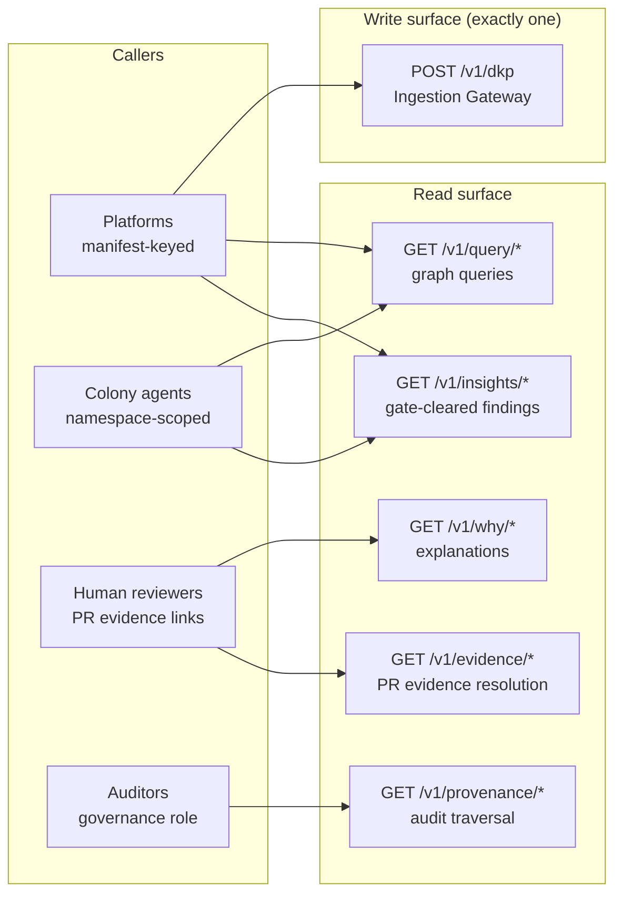

# API Surface & Contracts

Purpose: define every network surface Dot.Brain exposes — what can be asked of the brain, by whom, in what shape, and with what guarantees. The defining property of this surface: **one write endpoint (DKP ingestion), everything else read-only.** The brain's other output channels are the PR Generator ([brain.workflows.md](brain.workflows.md) §6, structural changes only) and Notify-routed Insight delivery ([ADR-0017](adr/ADR-0017-outbound-insight-delivery.md), informational only) — neither is directly commandable; the read surface above is the only thing external callers can ask for.

> **Related documents:** [brain.architecture.md](brain.architecture.md) §3 — the Query & Explanation API component · [brain.workflows.md](brain.workflows.md) §6 — the evidence links this API resolves · [brain.memory.md](brain.memory.md) §3 — the retrieval contracts backing every endpoint · [brain.dkp.md](brain.dkp.md) — the ingestion contract · [brain.governance.md](brain.governance.md) — the Why-block standard rendered by explanation endpoints.

---

## 1. Surface map

There is no `PUT`, no `PATCH`, no `DELETE` anywhere on the surface. Graph mutation happens only through validated ingestion and internal agent workflows — an API consumer cannot edit knowledge, by construction.

## 2. Endpoint contracts

| Endpoint | Backing contract ([brain.memory.md](brain.memory.md) §3) | Consumer | Returns |
|---|---|---|---|
| `POST /v1/dkp` | — (write path, [brain.workflows.md](brain.workflows.md) W1) | Platforms | `202` + receipt ID, or `4xx` + `DKP_*` code |
| `GET /v1/query/nodes/{id}`, `/v1/query/search` | `retrieve.context` | Platforms, agents | Active nodes/edges with confidence, `valid_until`, temperature/staleness metadata |
| `GET /v1/why/{conclusion\|recommendation}` | `retrieve.explain` | Humans (persona-scoped) | Rendered Why block: evidence chain, mechanism, uncertainty statement |
| `GET /v1/evidence/{ref}` | `retrieve.explain` | PR reviewers | Resolution of an evidence link embedded in a PR body (§4) |
| `GET /v1/provenance/{id}` | `retrieve.provenance` | Governance role only | Full chain across all temperatures, including Cold (async: `202` + poll URL when Cold retrieval needed) |
| `GET /v1/insights/{id}` | `recordInsight`/`getInsight` (`services/insight-delivery`) | Platforms, agents | One gate-cleared Insight: statement, domain, evidence, `valid_until`, classification-filtered |
| `GET /v1/insights/search` | `searchInsights` (`services/insight-delivery`) | Platforms, agents | Insights matching domain/scope/platform filters, most-recent-first |

Guarantees inherited from the retrieval contracts: results are never silently altered (narrowed only, by classification/dormancy); superseded knowledge appears only via explicit supersession-chain traversal; every response carries the graph-state timestamp it was computed against.

## 3. Authentication & scoping

- **Platforms:** the same Ed25519 keys registered in their manifest sign API requests (one key system ecosystem-wide; revocation propagates identically to ingestion, within one validation cycle).
- **Agents:** internal namespace-scoped credentials per [brain.agents.md](brain.agents.md); an agent's API scope equals its shared-memory scope — no privilege gained by going through the front door.
- **Evidence links:** capability URLs — unguessable, single-recommendation-scoped, valid for the PR's lifetime + 1 year (audit tail). A leaked link exposes exactly one evidence chain at the receiving platform's classification level, nothing more.
- **Classification enforcement:** every response filtered by the caller's clearance before serialization; a filtered-out element leaves a visible `[restricted: n items]` marker rather than a silent gap — reviewers must know the chain has redactions (`explainability` over cosmetics).

## 4. Evidence-link semantics (owed by W5)

Every PR body from the PR Generator embeds evidence links of the form `https://brain.dot/evidence/{capability-token}`. Resolution contract:

1. Returns the *frozen* evidence chain as it existed at PR-open time (from the ledger), plus a clearly separated "current state" diff — if a supporting edge was later retracted, the reviewer sees both the original basis and the change. A recommendation is judged on what was known, audited on what changed.
2. Renders per the caller's persona (§5) at the receiving platform's classification.
3. Never links raw internals: node payloads are rendered views, ledger hashes shown for verification but storage is unreachable.
4. Resolution events are ledger-logged — "did anyone actually read the evidence?" becomes answerable (feeds the `dkp.pr_decision_rate` review).

## 5. Persona-scoped explanations (owed by retrieve.explain)

`/v1/why/*` renders one canonical evidence chain into persona registers defined by the UX Agent (persona catalog: [brain.personas.md](brain.personas.md)):

| Persona (via role claim) | Rendering |
|---|---|
| Platform engineer | Full chain, inference rules named, confidence math shown |
| Domain operator (e.g., site manager) | Mechanism paragraph, plain-language uncertainty, no formula internals — but a "show full chain" escalation link, always |
| Executive | Impact framing, confidence band, single weakest-link sentence |
| Auditor | Chain + ledger hashes + sign-off records |

Invariant: personas change *presentation depth*, never *content truth* — all render from the same chain, and any persona can escalate to the full chain. Comprehension sampling per persona feeds Loop C ([brain.learning.md](brain.learning.md)).

## 6. Versioning, limits, errors

- **Versioning:** URL-versioned (`/v1/`); breaking changes follow the ADR-0003 dual-version window (18-month sunset). Response schemas published in `schemas/` like all other contracts; `x-` extension fields ignored by clients per DKP convention.
- **Rate limits:** per-key budgets from platform manifests; `429` with `Retry-After`. Read-surface limits are generous — the brain *wants* to be queried; only provenance traversals (Cold-touching) are conservatively budgeted.
- **Errors:** `DKP_*` codes on the write path ([brain.dkp.md](brain.dkp.md) §7); read path uses `API_*` codes (`API_UNAUTHORIZED`, `API_FORBIDDEN_CLASSIFICATION`, `API_NOT_FOUND`, `API_GONE_SUPERSEDED` — with a pointer to the successor, `API_RETRY_COLD` — async retrieval pending). `API_GONE_SUPERSEDED` returning a successor pointer is deliberate: even a stale reference teaches the caller where knowledge went.

## 7. Worked example — a Dot.Farms reviewer clicks the evidence link

The second-generation rain-prepositioning PR ([brain.learning.md](brain.learning.md) §5) is under review:

1. The logistics manager clicks the evidence link → `/v1/evidence/{token}`, role claim: domain operator.
2. Response: mechanism paragraph (rain → ramp restrictions → cycle-time loss → staging benefit), the depot-capacity constraint node *explicitly cited as consumed input* (the learning from the first rejection, visible), uncertainty statement naming single-site evidence as the weakest link, and the frozen-vs-current diff showing no changes since PR-open.
3. She escalates once to the full chain — the I3 sign-off record and the 5.2 h realized-impact observation from Kolomela are two links deep. Resolution logged.
4. She merges. The PR Generator's outcome pack notes evidence was resolved before decision — a signal Loop C correlates with comprehension scores.

## 8. Health metrics

Registered in [brain.metrics.md](brain.metrics.md): `explainability.human_comprehension_score ≥ 4/5` (§5 output quality), `identity.boundary_violations = 0` (no write surface beyond ingestion), `governance.decision_trails_complete = 100%` (provenance endpoint completeness). Proposed pending registration: `api.evidence_resolution_rate` (evidence links resolved before PR decision; low values mean recommendations are being judged unread — a finding, whatever the acceptance rate says).

---

## Change Log

| Version | Date | Author | Change |
|---|---|---|---|
| 1.0.0 | 2026-08-01 | Brain Document Generator (prompt 03, AI) | Initial surface: one-write-endpoint principle, five endpoint contracts, capability-URL evidence links with frozen-vs-current semantics, persona-scoped explanations, API_* error codes |

## Open Questions

| Question | Owner → Approver |
|---|---|
| ~~Register `api.evidence_resolution_rate` in brain.metrics.md~~ Resolved 2026-08-01: registered in [brain.metrics.md](brain.metrics.md) §4.9 | Architecture Agent → Chief Architect |
| Public read-only "why" access for platform end-users (the standing identity/architecture open question — this API is where it would land) | Architecture Agent → Executive Sponsor |
| GraphQL or query-language surface for agent consumers vs. keeping REST-only simplicity? Needs evidence of query-pattern pain first | Architecture Agent → Chief Architect |
