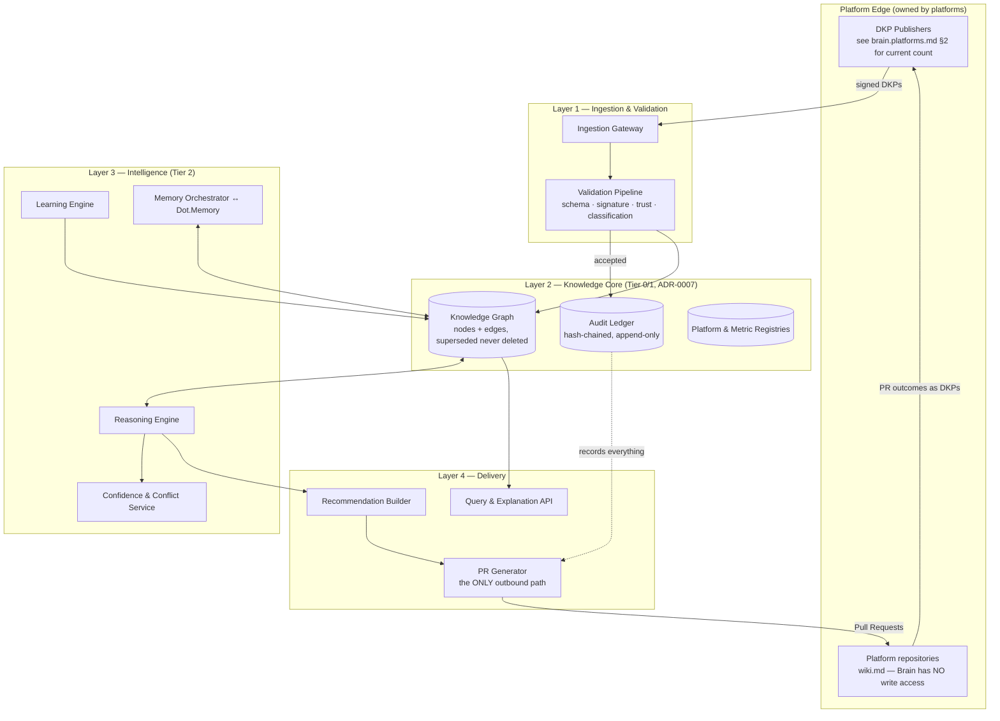
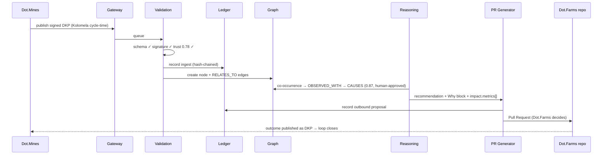

# System Architecture & Component Model

Purpose: the structural blueprint of Dot.Brain — its layers, components, data flows, storage tiers, and extension points. Every other technical document (DKP protocol, graph model, workflows, APIs) describes one part of the machine defined here.

> **Related documents:** [brain.identity.md](brain.identity.md) — what this architecture serves · [brain.dkp.md](brain.dkp.md) — the ingestion contract · [brain.relationships.md](brain.relationships.md) — the graph this machinery maintains · [brain.agents.md](brain.agents.md) — who operates it · [adr/ADR-0001-repository-structure.md](adr/ADR-0001-repository-structure.md), [adr/ADR-0006-audit-ledger-design.md](adr/ADR-0006-audit-ledger-design.md), [adr/ADR-0007-rto-rpo-tier-model.md](adr/ADR-0007-rto-rpo-tier-model.md) — decisions this document implements.

---

## 1. Architectural principles

Derived from the [Manifesto](MANIFESTO.md), in precedence order when they conflict:

1. **The boundary is architectural, not procedural.** No component has write credentials to any platform repository; outbound influence exists only as a PR generator. Principle 4 is enforced by absence of capability, not by policy.
2. **Append-only core.** The ledger and graph never overwrite; supersession is the only mutation. Anything rebuildable (indexes, caches, projections) is derived and disposable.
3. **Explainability is a pipeline stage, not a report.** A recommendation physically cannot leave the system without its Why block and evidence chain attached — the PR generator takes them as required inputs.
4. **Zero-change extensibility.** A new platform touches the registry and nothing else (proven in [brain.platforms.md](brain.platforms.md) §4).
5. **Fail toward safety.** Any component failure degrades to "propose nothing" — never to "propose without validation".

## 2. Layer model

The loop closes at the platform edge: PR outcomes return as Knowledge Packs, feeding the Learning Engine — the architecture *is* the learning loop.

## 3. Component responsibilities

| Component | Responsibility | Spec | Operating agent |
|---|---|---|---|
| Ingestion Gateway | Receive, authenticate, rate-limit, queue DKPs; retry semantics | [brain.dkp.md](brain.dkp.md) §8 | Registry |
| Validation Pipeline | Schema (draft 2020-12), Ed25519/JCS signature (ADR-0002), trust lookup, classification, `DKP_*` error codes | [brain.dkp.md](brain.dkp.md) §4 | Testing (rules), Security (gates) |
| Audit Ledger | Hash-chained append-only record of every ingest, decision, override, PR | [adr/ADR-0006](adr/ADR-0006-audit-ledger-design.md) | Governance |
| Knowledge Graph | Nodes (`dot:node:…`) + edges (`dot:edge:…`), lifecycle & supersession | [brain.relationships.md](brain.relationships.md) | Knowledge |
| Registries | Platform manifests, metric registry projections | [brain.platforms.md](brain.platforms.md), [brain.metrics.md](brain.metrics.md) | Registry, Data |
| Reasoning Engine | Inference over the graph, causal-bar enforcement, Why-block synthesis | [brain.reasoning.md](brain.reasoning.md) | Reasoning |
| Learning Engine | Outcome ingestion, trust/confidence updates, pattern detection | [brain.learning.md](brain.learning.md) | Learning, Evolution |
| Memory Orchestrator | Tiering hot/warm/cold with Dot.Memory, retrieval contracts, forgetting policy | [brain.memory.md](brain.memory.md) | Memory |
| Confidence & Conflict Service | Confidence math, CONTRADICTS resolution ladder | [brain.dkp.md](brain.dkp.md) §5–6 | Reasoning, Governance (arbiter) |
| Recommendation Builder | Assemble recommendation payloads: confidence + evidence + triple impact | [schemas/recommendation.schema.json](schemas/recommendation.schema.json) | Reasoning, gated by Dopamine |
| PR Generator | Render recommendation → PR against target platform repo; sole outbound writer | [brain.workflows.md](brain.workflows.md) | Governance-supervised |
| Query & Explanation API | Read-only graph queries and "why" traversals for agents & platforms | [brain.api.md](brain.api.md) | Architecture |

## 4. Data flow — one pack, end to end

Failure at any stage stops forward flow (principle 5); the ledger entry for the failure is itself knowledge ([brain.resilience.md](brain.resilience.md)).

## 5. Storage tiers & continuity

Mapped to [adr/ADR-0007](adr/ADR-0007-rto-rpo-tier-model.md):

| Tier | Components | RTO / RPO | Rationale |
|---|---|---|---|
| T0 | Audit Ledger | 1 h / 0 | Zero-loss: the trail is the trust |
| T1 | Knowledge Graph, Registries | 4 h / 5 min | Core asset; rebuild edges from ledger if needed |
| T2 | Reasoning, Learning, Memory, Confidence services | 12 h / 1 h | Stateless-ish; state derives from T0/T1 |
| T3 | Query API, caches, index projections | 48 h / 24 h | Fully regenerable |

Recovery order is strictly T0 → T3; the graph is authoritative over every projection.

## 6. Security & trust boundaries

- **Inbound:** only signed DKPs through the Gateway; no direct graph writes from outside. Platform keys registered via manifest ([schemas/platform-manifest.schema.json](schemas/platform-manifest.schema.json)); revocation takes effect at the Gateway within one validation cycle.
- **Internal:** agents act under least-privilege namespaces ([brain.agents.md](brain.agents.md) §shared-memory); only the Knowledge Agent writes graph structure, only Governance writes trust scores.
- **Outbound:** the PR Generator holds per-platform scoped tokens capable of *opening PRs only* — no merge, no push to default branches. `identity.boundary_violations = 0, always` ([brain.metrics.md](brain.metrics.md) §4.1) monitors this continuously.
- Full threat model: [brain.security.md](brain.security.md); this section defines the boundaries it must defend.

## 7. Extension points

| Change | What it touches | What it must NOT touch |
|---|---|---|
| New platform | Registry row + manifest + `platforms/` doc | Any Layer 1–4 component |
| New knowledge type | New `schemas/*.schema.json` + DKP payload registration | Envelope, ledger, graph engine |
| New edge type | ADR + [brain.relationships.md](brain.relationships.md) §3 | Existing edge semantics |
| New agent | Charter + roster row (ADR if beyond scope of an existing duty) | Other agents' namespaces |
| New metric | Registry row in [brain.metrics.md](brain.metrics.md) | Existing metric definitions (supersede only) |
| DKP v2 | Dual-version window per [adr/ADR-0003](adr/ADR-0003-dkp-versioning-policy.md), 18-month sunset | v1 packs during the window |

## 8. Health metrics

Registered in [brain.metrics.md](brain.metrics.md) §4.2–4.3; the architecture-specific view: `dkp.ingest_latency_p95 ≤ 15 min` (Layer 1 throughput), `knowledge.provenance_completeness = 100%` (Layer 2 integrity), `governance.ledger_integrity_checks_passed 4/4` (T0 health), `identity.boundary_violations = 0` (outbound containment).

---

## Change Log

| Version | Date | Author | Change |
|---|---|---|---|
| 1.0.0 | 2026-08-01 | Brain Document Generator (prompt 03, AI) | Initial architecture: 5 principles, 4-layer model, 12-component matrix, end-to-end data flow, ADR-0007 tier mapping, security boundaries, extension points |
| 1.0.1 | 2026-08-10 | Brain core-doc sweep | Refreshed against real repo state: §3's component matrix pointed brain.reasoning.md, brain.learning.md, brain.memory.md, brain.api.md, brain.workflows.md, and §6's brain.security.md all at "(pending)" — all six now exist as complete, active documents, corrected to real links. §2's Layer Model diagram's hardcoded "21 platforms" DKP-publisher count (stale against brain.platforms.md's now-29-row registry) replaced with a pointer to brain.platforms.md §2 so it can't drift again |
| 1.0.2 | 2026-08-10 | Brain core-doc sweep | Fixed three broken ADR links found while cross-checking brain.governance.md's citation of the same ADRs: ADR-0006 was linked as `adr/ADR-0006-audit-ledger.md` (real file: `-design.md`), ADR-0007 as `adr/ADR-0007-rto-rpo-tiers.md` (real file: `-tier-model.md`), in both §Related-documents and inline citations |

## Open Questions

| Question | Owner → Approver |
|---|---|
| Graph store technology selection (property graph vs. RDF/triple store) — needs an ADR with benchmark evidence before implementation | Architecture Agent → Chief Architect |
| Should the Query & Explanation API be exposed read-only to platform end-users (ties to the open question in brain.identity.md)? | Architecture Agent → Executive Sponsor |
| ~~Event-driven vs. polling for PR-outcome return path~~ Resolved 2026-08-01: event-driven with polling fallback, [brain.events.md](brain.events.md) §5 | Architecture Agent → Chief Architect |
