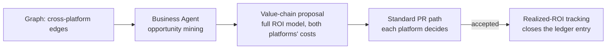

# Business Intelligence & Value Accounting

Purpose: the economic leg of the People & Value cluster. Defines how the Brain's cost is justified (the ROI model the quarterly evolution report already cites), how duplicate-effort-avoided is counted honestly, how the Business Agent detects cross-platform value chains, and the internal economics of knowledge exchange — what platforms pay, and deliberately don't, to learn from each other. The discipline throughout is symmetric with the rest of the repository: **a value claim is a prediction that must verify**, held to the same evidentiary bar as any recommendation.

> **Related documents:** [brain.success.md](brain.success.md) — verified wins are the ROI ledger's numerator · [brain.analytics.md](brain.analytics.md) — co-owned analysis products, confound rules · [brain.recommendations.md](brain.recommendations.md) — impact declarations this document's accounting settles · [brain.governance.md](brain.governance.md) §monthly evolution report · agents/business.charter.md — realized-vs-projected discipline.

---

## 1. Principle: the Brain justifies itself the way it justifies everything else

The Brain demands evidence chains from every platform; it cannot exempt its own existence. Three rules:

1. **Full cost side, always.** ROI models include compute, storage, agent review time, *human review time* (the operating model's cadences priced at loaded rates), and platform integration effort. A benefits-only model is proxy laundering in a suit — the Business Agent's own charter makes ROI-model honesty a 100% rubric item.
2. **Realized beats projected.** Projections open the ledger entry; only verified outcomes ([brain.success.md](brain.success.md) intake) close it. The charter target — realized ≥ 50% of projection on ≥ 60% of accepted proposals — is the calibration gauge: systematic overshoot is ROI inflation and feeds the Business Agent's trust score directly.
3. **Unverifiable value is not counted.** Morale, "alignment", brand — real, but they enter the narrative section of the evolution report, never the ROI line. The number the Executive Sponsor reads contains only claims that could have failed.

## 2. The ROI model

Quarterly, per the evolution report:

$$\text{ROI}_q = \frac{V_{\text{verified}} + D_{\text{avoided}}}{C_{\text{run}} + C_{\text{human}} + C_{\text{integration}}}$$

- **V_verified** — sum of measured deltas from `verified` recommendations that quarter, monetized by the *platform's* own conversion (the platform states what a cycle-time hour or a false finding costs; the Brain never invents domain prices).
- **D_avoided** — duplicate-effort-avoided (§3).
- **Cost terms** — run (compute/storage), human (cadence hours × loaded rate, from [brain.operating_model.md](brain.operating_model.md) §3), integration (platform-side effort attested by platform teams, not estimated centrally).

Reported with its trend, never alone as a scalar: a young Brain runs ROI < 1 legitimately while the graph compounds; the Executive Sponsor's real question is the slope and the date the model predicted crossover — a prediction that, like all others, verifies or misses.

## 3. Duplicate-effort-avoided: the honesty rules

The most gameable number in the model, so the tightest rules:

| Rule | Rationale |
|---|---|
| Counted only when a platform *attests* it was about to invest and stood down citing an existing pack/pattern | No central "they would surely have built it" imputation |
| Priced at the *avoided platform's* estimate, capped at the original solution's actual cost | Nobody avoids more than the original spent |
| One count per avoidance — reuse of the same pattern by a third platform is a *new* attested avoidance, not a multiplier on the first | No compounding fictions |
| Near-duplicate detection findings (Evolution Engine) enter as *leads*, valued at zero until the stand-down attestation lands | Detection is not avoidance |

The attestation is a signed pack referencing the reused artifact — which means D_avoided is graph-queryable and auditable, not a spreadsheet claim.

## 4. Value-chain detection and knowledge exchange economics

Example chain shape (the canonical one from the design brief): Dot.Farms produce → Dot.Emall listing → Dot.Billing settlement → Dot.Analytics reporting — detected as co-occurring entities across platform packs, proposed as one recommendation *per platform* (sovereignty: no platform is committed by another's acceptance).

**Exchange economics — knowledge is deliberately not billed.** Platforms pay membership (their integration and publishing effort), not per-query or per-pack fees, because metering knowledge would create the exact incentive the MANIFESTO prohibits: hoarding, and optimizing for billable exchange volume (an engagement metric in disguise — the Dopamine Agent would reject the pricing model itself). The asymmetric-benefit concern (Dot.Trade consumes much, publishes little) is handled with light-touch measures: `registry.publish_consume_ratio` visible per platform at quarterly review, chronic free-riding escalated as a *governance* conversation, never a paywall.

## 5. Worked example — the wet-season thread, priced

S-2026-001/P-2026-001 hit the Q3 evolution report:

- **V_verified:** Kolomela −64% false findings × the platform's attested cost-per-false-finding (dispatch hours) = R 1.9 M/quarter; Sishen replication adds R 1.1 M. Platform-priced, Brain-verified.
- **D_avoided:** Sishen's team attests it had a moisture-model build scoped (R 800 k); stood down citing P-2026-001. Counted once, capped under Kolomela's original E3 + integration cost — enters at R 800 k.
- **Costs:** the experiment, review hours across the E3's gate passes, both integrations — R 1.4 M all-in.
- **Ledger close:** projected ROI 1.8, realized 2.7 — an *overshoot*, which is also logged; systematic undershoot of projections is sandbagging, and calibration cuts both ways.
- The third site that reuses the pattern next year opens a fresh attestation — the chain compounds in the graph, not in the arithmetic.

## 6. Health metrics

Registered in [brain.metrics.md](brain.metrics.md): `identity.cross_platform_lesson_reuse` (rising — the volume guard on all value claims) · `analytics.findings_packed_ratio ≥ 80%`. Also registered (§4.9, 1.5.0): `business.realized_vs_projected_roi` (≥ 50% of projection on ≥ 60% of accepted proposals — the charter target made registry-official) and `business.davoided_attestation_rate` (100% — every D_avoided rand traces to a signed stand-down attestation). `registry.publish_consume_ratio` (§4, reviewed per platform) is used above as a live signal but is **not yet registered** in brain.metrics.md — see Open Questions.

---

## Change Log

| Version | Date | Author | Change |
|---|---|---|---|
| 1.0.0 | 2026-08-01 | Brain Document Generator (prompt 03, AI) | Initial model: self-applied evidence bar, quarterly ROI formula with platform-priced value, four honesty rules for duplicate-effort-avoided, value-chain detection path, no-metering exchange economics, priced wet-season example |
| 1.0.1 | 2026-08-10 | Brain core-doc sweep | §6 previously claimed `registry.publish_consume_ratio` was "Registered in brain.metrics.md" alongside two metrics that actually are — it isn't; corrected and moved to Open Questions rather than left silently wrong |

## Open Questions

| Question | Owner → Approver |
|---|---|
| ~~Register `business.realized_vs_projected_roi` and `business.davoided_attestation_rate` in brain.metrics.md §4.9 (new batch: 2)~~ Registered in [brain.metrics.md](brain.metrics.md) §4.9 (1.5.0) | Business Agent → Executive Sponsor |
| Register `registry.publish_consume_ratio` in brain.metrics.md's `registry.*` namespace (§4.7) — §4/§6 above already specify it as per-platform, reviewed quarterly, but it was never actually added to the registry | Business Agent → Executive Sponsor |
| Loaded-rate source for C_human: finance-system feed or annual flat assumption reviewed by the Executive Sponsor? | Business Agent → Executive Sponsor |
| Chronic free-rider escalation (§4): define "chronic" numerically, or leave to governance judgment for the first year? | Governance Agent → Executive Sponsor |
