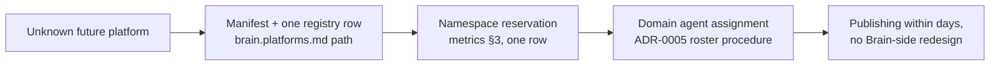

# Future Horizons & Extension Surface

Purpose: the dated roadmap [brain.evolution.md](brain.evolution.md) §5 defers to and [brain.vision.md](brain.vision.md) §2 constrains — plus the extension surface for platforms and capabilities that don't exist yet ([brain.platforms.md](brain.platforms.md)'s forward reference). Division of labor: **vision owns the stage order and arrival evidence; this document owns dates, sequencing rationale, and re-planning rules; evolution owns the change mechanics that execute entries.** A dated horizon here is a prediction, and predictions verify or miss — the roadmap is held to the same calibration discipline as everything else.

> **Related documents:** [brain.vision.md](brain.vision.md) — undated stages this roadmap walks · [brain.evolution.md](brain.evolution.md) — mechanics per entry · [brain.business.md](brain.business.md) §2 — the crossover prediction restated here with its date · [brain.platforms.md](brain.platforms.md) — onboarding path new platforms follow · [brain.metrics.md](brain.metrics.md) §3 — namespace registration the reservations below feed.

---

## 1. Horizons — dated, sequenced, justified

| Horizon | Window | Capabilities | Sequencing rationale (why not earlier/later) | Vision stage served |
|---|---|---|---|---|
| **H1 — Foundations live** | 2026 H2 | Ingestion, validation, graph + ledger, W1–W6 workflows, gate agents active, first 5 platforms publishing | Everything else consumes these; no dependency admits deferral | S1 |
| **H2 — Loops closed** | 2027 H1 | All four learning loops on real outcome data; first metrics registration passes retired into routine; ADR-0010 embedding model selected; golden-pack drift audits running | Loops need ≥ 2 quarters of W5/W6 outcome volume — earlier closure trains on noise | S2 |
| **H3 — Transfer at scale** | 2027 H2 – 2028 | I4 analogy transfer tuned per domain pair; pattern catalog ≥ 20 proven entries; 15+ platforms; first E4 human-subject experiment | Requires H2's calibrated trust — transfer amplifies whatever calibration exists, good or bad | S3 |
| **H4 — Crossover** | 2029 H1 (prediction, ±2 quarters) | Sustained ROI_q > 1 for two consecutive quarters — the [brain.business.md](brain.business.md) §2 crossover, dated | Value compounds on H3's reuse volume; predicted from current `identity.cross_platform_lesson_reuse` slope | S4 |
| **H5 — Ambient** | 2030+ | All 21+ platforms designing Brain-first; end-user "why" surface (the standing identity/api open question, decided by then); external-ecosystem federation *evaluated* (not committed) | Federation before internal quiet ubiquity would export immaturity | S5 |

Entries within a horizon still follow evolution's problem-evidence rule: a capability listed here is *scheduled intent*, not exemption from its ADR, experiment, or gate path.

## 2. Re-planning: early and late are both findings

Monthly, the Registry Agent compares horizon progress against vision arrival evidence; re-planning is rule-bound, not vibes-bound:

- **Late:** an evidence trend ≥ 2 quarters behind its horizon triggers a re-plan entry — slip the date *and record the miss* in the calibration ledger (a slipped horizon silently redated is roadmap drift, per evolution §2's boundary). Root cause goes to the failure catalog if process-class.
- **Early:** arrival evidence landing ahead of date does **not** auto-pull the next horizon forward — it triggers a review asking whether the evidence is real or Goodharted (early arrival on a rising activity metric with flat outcome metrics is vision §4's busy-but-off-course pattern inverted).
- **Crossover discipline:** H4's date is a registered prediction; hitting it late is a miss, hitting it early is logged for calibration exactly like the business ledger's overshoot rule — calibration cuts both ways.
- Horizon *content* changes (add/drop capabilities) are parametric changes under evolution's ledger; horizon *order* changes would violate vision §2 and require the quasi-frozen ceremony.

## 3. Extension surface — building for platforms that don't exist

The extensibility invariant, forward-projected: **onboarding an unforeseen platform must never require changing a frozen-floor document.** Concretely reserved now:

- **Namespaces:** `<domain>.*` pattern stays open-ended; reserved-word protection for future brain-level namespaces is metrics' open question and lands there.
- **Schema headroom:** payload `type` enum is extensible by registration; new knowledge types (e.g., regulatory, genomic) are one schema PR + CROSSREF row, no engine change.
- **Roster headroom:** ADR-0005's add procedure and evolution §3's split rules mean colony growth is routine; H3's 15-platform mark assumes ~2 domain-agent additions per year.
- **Explicitly *not* reserved:** federation protocols, token/pricing surfaces (would contradict the no-metering rule), and any end-user write path — absence here is a decision, recorded.

## 4. Worked example — re-planning H2 from real evidence

March 2027: the monthly check finds Loop C comprehension trending at target but Loop A trust calibration one quarter behind — W5 outcome volume from the first 5 platforms is 40% under H1's assumption. Per §2: H2's loop-closure date slips one quarter, the miss is logged (assumption error: PR decision rate, not platform count, drives volume), and the calibration ledger gains a lesson — future volume assumptions cite `dkp.pr_decision_rate`, not platform counts. H3 does *not* auto-slip: its dependency is calibration quality, re-checked at H2's new date. One late horizon, one recorded miss, one sharpened planning assumption — the roadmap got smarter by being wrong on the record.

## 5. Health metrics

Registered in [brain.metrics.md](brain.metrics.md): `registry.median_onboarding_time` (the extension surface's live test) · `identity.cross_platform_lesson_reuse` (H4's predictor slope) · `evolution.unregistered_change_findings = 0` (covers silent horizon redating). Also registered (§4.9, 1.5.0): `future.horizon_date_calibration` (share of horizon dates hit within stated tolerance — the roadmap's realized-vs-projected) and `future.replan_misses_logged = 100%` (every slipped date has a ledger entry with a root-cause assumption).

---

## Change Log

| Version | Date | Author | Change |
|---|---|---|---|
| 1.0.0 | 2026-08-01 | Brain Document Generator (prompt 03, AI) | Initial roadmap: five dated horizons with sequencing rationale mapped to vision stages, H4 crossover prediction (2029 H1 ±2 quarters), rule-bound re-planning (late/early both findings), extension surface with explicit non-reservations, H2 re-plan worked example |
| 1.0.1 | 2026-08-10 | Brain core-doc sweep | §5 cited `registry.onboarding_days`, which was never a real registered metric — the actual one is `registry.median_onboarding_time` (brain.metrics.md §4.7); corrected |

## Open Questions

| Question | Owner → Approver |
|---|---|
| ~~Register `future.horizon_date_calibration` and `future.replan_misses_logged` in brain.metrics.md §4.9 (batch now 6 with business's and design's)~~ Registered in [brain.metrics.md](brain.metrics.md) §4.9 (1.5.0) | Registry Agent → Chief Knowledge Engineer |
| H5 federation evaluation criteria — draft the ADR skeleton now (cheap) or wait until H4 evidence makes it non-hypothetical? | Governance Agent → Executive Sponsor |
| H4's ±2-quarter tolerance — is a symmetric band right, or should early arrival carry a wider tolerance than late? | Business Agent → Executive Sponsor |
