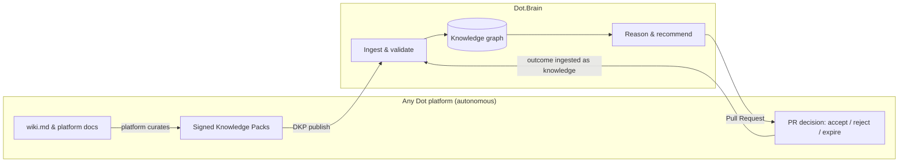

# brain.identity — What Dot.Brain Is

Purpose: the canonical definition of Dot.Brain — what it is, what it is not, the ownership boundary it never crosses, and how it relates to its two closest siblings, Dot.Memory and Dot.Agents. Read by everyone: it is the first domain document a new contributor, executive, or platform team encounters, and every other `brain.*` document assumes it.

> **Related documents:**
> - [README.md](README.md) — repository entry point; summarizes this identity and maps the repository built around it.
> - [MANIFESTO.md](MANIFESTO.md) — the six principles this identity operationalizes.
> - [brain.dkp.md](brain.dkp.md) — the only protocol by which knowledge crosses the boundary defined here.
> - [brain.vision.md](brain.vision.md) — where this identity leads over 20 years.
> - [brain.governance.md](brain.governance.md) — how the boundary and the manifesto are enforced.

---

## 1. Definition

**Dot.Brain is the collective intelligence layer of the Dot Ecosystem** — its knowledge graph, reasoning engine, learning engine, memory orchestrator, and recommendation engine. It exists so that every interaction anywhere in the ecosystem makes every platform smarter, without any platform surrendering its autonomy.

Dot.Brain is **not an application**. It has no end-user product surface. Its users are platforms, AI agents, and the humans who steward them. Its output is *explained, measurable, reversible intelligence* — delivered exclusively as Knowledge Pack acknowledgments, query responses, and Pull Requests.

### Identity in one sentence per audience

| Audience | Dot.Brain is… |
|---|---|
| Executive | The compounding asset that turns the ecosystem's platforms ([brain.platforms.md](brain.platforms.md) §2 for the current count) into one learning organization |
| Platform engineer | A publish/subscribe knowledge peer that validates your packs and sends you evidence-backed PRs |
| AI agent | The governed graph you read from, reason over, and propose to — never write to directly |
| Security reviewer | A signed, audited, tenant-isolated knowledge system with human approval gates on impact |
| End user of any Dot platform | Invisible — experienced only as platforms that keep getting better, explainably |

## 2. What Dot.Brain IS / IS NOT

| IS | IS NOT |
|---|---|
| A knowledge graph relating every entity, event, insight, and lesson across platforms | A database platforms must build against |
| A reasoning engine producing explained, confidence-scored conclusions | An oracle whose word is final — platforms decide |
| A learning engine that improves from every outcome, including failure | A model-training service or MLOps platform |
| A memory orchestrator (policy) working with Dot.Memory (storage) | The storage layer itself |
| A recommendation engine bound by the PR contract | An auto-deployer of changes |
| An anti-fragile ledger where incidents become assets | A blame record |

## 3. The Ownership Boundary

The boundary is the single most important architectural fact in the ecosystem:

**Platforms own their knowledge. Dot.Brain owns the connections, the reasoning, and the proposals.**

- Platforms own `wiki.md` and all platform docs. Dot.Brain **never** edits them.
- Knowledge enters only as published, signed Knowledge Packs ([brain.dkp.md](brain.dkp.md)).
- Intelligence leaves only as Pull Requests platforms accept, reject, or let expire. **Silence ≠ consent.**
- Approved knowledge is never overwritten — superseded with full provenance, forever.

*Knowledge flows in only via DKP; intelligence flows out only via PRs; every PR outcome flows back in as new knowledge — the loop that makes the ecosystem smarter every day.*

## 4. The Manifesto, Applied

How each principle shows up concretely in Dot.Brain behavior:

| Principle | Operationalized as |
|---|---|
| 1. Every interaction makes the ecosystem smarter | All packs, PR outcomes (including rejections and expiries), and incidents are ingested, related, versioned — nothing discarded |
| 2. Every improvement is explainable | Every conclusion ships with an evidence chain + confidence formula inputs ([brain.reasoning.md](brain.reasoning.md)); unexplainable ⇒ unshippable |
| 3. Every recommendation is measurable | Mandatory business/user/dopamine impact declarations with metric, baseline, target — validated at the schema level |
| 4. Every platform remains autonomous | The ownership boundary (§3) and PR contract; enforced by governance, not goodwill |
| 5. Knowledge helps people decide better | Persona-adapted explanations ([brain.personas.md](brain.personas.md)); human-centered design outranks technical elegance |
| 6. Every failure strengthens the ecosystem | `incident_report` packs, zero-decay lessons, advisory fan-out to platforms sharing the vulnerable pattern |

## 5. Relationship to Dot.Memory and Dot.Agents

The three intelligence platforms divide responsibility cleanly:

| Concern | Dot.Brain | Dot.Memory | Dot.Agents |
|---|---|---|---|
| Role | **Reasons** — relates, infers, recommends | **Stores** — durable semantic memory, tiers, retrieval | **Executes** — orchestrates agents that act |
| Owns | Graph semantics, confidence, provenance policy, recommendations | Persistence, embeddings at rest, retrieval SLAs | Agent runtimes, task execution, tool access |
| Analogy | Cortex | Hippocampus & long-term storage | Motor system |

- Dot.Brain defines *what* is remembered, for how long, and with what supersession rules ([brain.memory.md](brain.memory.md)); Dot.Memory implements the storage and retrieval contracts.
- Dot.Brain governs the knowledge agents may use and receives their contributions as first-class AI contributions (permanently flagged, trust-scored); Dot.Agents runs them. The Agent Colony that maintains *this repository* is specified in [brain.agents.md](brain.agents.md).

## 6. Worked Example: One Insight, Whole-Ecosystem Identity in Action

Scenario (mining, drawn from the [worked DKP example](templates/knowledge-pack.example.md)):

1. **Dot.Mines** publishes a pack: haul-truck cycle time spikes 12.4% after shift change at Kolomela (insight + metric + recommendation, signed by an AI analyst agent and a human engineer — both accountable).
2. **Dot.Brain** validates, recomputes confidence (0.83), relates it to the Kolomela dispatch workflow node, and — because impact is cross-platform — routes T3 approval, then opens a PR against **Dot.Central** proposing dispatch warm-handover, with rollback plan and three impact metrics.
3. Dot.Central **decides**. Accept or reject, the outcome returns to the graph, adjusting trust scores and future recommendation thresholds.
4. Months later, **Dot.Farms** publishes a harvest-logistics pack showing an equivalent "cold handover" pattern in truck scheduling. The graph matches the pattern; the verified Kolomela lesson fans out as an advisory PR to Dot.Farms — *a mining lesson improving agriculture*, with the full provenance chain attached.

Every identity claim in this document is visible in that flow: boundary respected, everything explained, everything measured, autonomy preserved, humans helped, failure-to-lesson machinery armed.

## 7. Metrics of Success

Identity is working when, measured quarterly ([brain.metrics.md](brain.metrics.md) owns definitions):

| Metric | Target |
|---|---|
| `identity.boundary_violations` (Brain writes to platform-owned files) | **0, always** |
| `dkp.pr_decision_rate` (PRs decided vs expired) | ≥ 80% decided |
| `dkp.pr_acceptance_rate` | ≥ 40% and rising (proposals worth making) |
| `knowledge.provenance_completeness` (nodes with full chain) | 100% |
| `identity.cross_platform_lesson_reuse` (lessons applied outside origin platform / quarter) | ≥ 5 and rising |
| `explainability.human_comprehension_score` (reviewer-rated, sampled PRs) | ≥ 4/5 |

## 8. Open Questions

| Question | Owner |
|---|---|
| Should Dot.Brain expose a read-only "why" endpoint directly to end users of platforms (explainability surfaced beyond engineers)? | Governance Agent → Executive Sponsor |
| Does Dot.Pulse community content require a modified boundary statement (user-generated vs platform-curated knowledge)? | Community Agent → Chief Knowledge Engineer |
| Formal legal identity of AI contributors for POPIA/GDPR accountability | Security Agent → Security Officer |

## Change Log

| Version | Date | Author | Change |
|---|---|---|---|
| 1.0.0 | 2026-08-01 | Brain Document Generator (prompt 03, AI) | Initial complete identity document |
| 1.0.1 | 2026-08-01 | Repository Reviewer (prompt 07, AI) | Reviewer edit: fixed 12 broken `../` relative links (root-level file) |
| 1.0.2 | 2026-08-10 | Brain core-doc sweep | §1's "21 platforms" hardcoded count (stale against brain.platforms.md's now-29-row registry) replaced with a pointer instead of a number that will just drift again. Also corrected front-matter `version` (was still 1.0.0 despite the 1.0.1 changelog row above already existing) |
