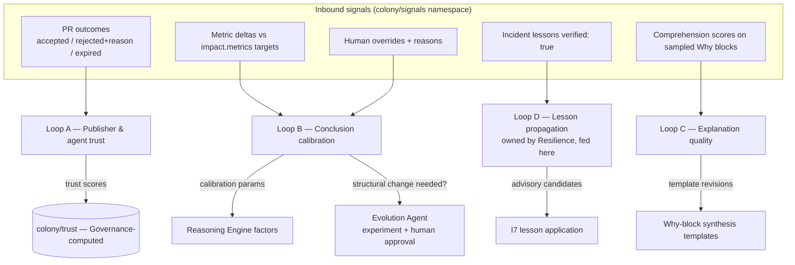

# Continuous Learning Loops

Purpose: specify how Dot.Brain learns — how outcomes flow back in, how trust and confidence are updated from reality, how explanation quality improves itself, and the guardrails that keep learning from becoming drift. This is the third intelligence-layer engine ([brain.architecture.md](brain.architecture.md) §3), closing the loops that [brain.reasoning.md](brain.reasoning.md) opens.

> **Related documents:** [brain.reasoning.md](brain.reasoning.md) — produces the conclusions whose outcomes are learned from · [brain.dkp.md](brain.dkp.md) §5 — trust formula updated here · [brain.resilience.md](brain.resilience.md) — the incident-learning loop (owned there, fed from here) · [brain.metrics.md](brain.metrics.md) — every loop's success is measured · [brain.agents.md](brain.agents.md) — Learning and Evolution Agent duties.

---

## 1. Learning doctrine

1. **Learn from outcomes, not activity.** A PR opened teaches nothing; a PR accepted, rejected, or expired — with the receiving platform's stated reason — teaches. Outcomes are the only training signal.
2. **Every update is bounded.** No single outcome moves any trust or calibration value by more than the per-loop step cap (§4). Learning is a gradient, never a jump — one bad quarter cannot destroy a publisher, one lucky hit cannot mint an oracle.
3. **Learning changes parameters, never rules.** Loops tune the *values* in registered formulas (trust weights via ADR, transfer factors, decay half-lives). Changing a rule or formula *structure* is evolution, not learning — it exits to the Evolution Agent's experiment pipeline and human approval ([brain.evolution.md](brain.evolution.md), pending).
4. **Negative knowledge is knowledge.** Rejections, failed experiments, and overrides are packed, related, and reused with the same machinery as successes (Manifesto principle 6).

## 2. The four loops

### Loop A — Trust
Updates the [brain.dkp.md](brain.dkp.md) §5 formula inputs (`w1·accuracy + w2·review + w3·(1−incidents)`, weights 0.5/0.3/0.2):
- `accuracy` — rolling ratio of a source's packs whose claims survive 12 months unretracted.
- `review` — reviewer-rubric scores from the colony review process.
- `incidents` — validated incidents traced to the source's knowledge.
Weights themselves are ADR-locked; changing them is a Loop-exit to Evolution (doctrine 3).

### Loop B — Calibration
Compares predicted vs. realized outcomes per inference type: I3 causal edges that get retracted lower the effective evidence bar tolerance (i.e., the bar rises); I4 analogy transfers that succeed on a domain pair raise that pair's transfer factor (the open question in [brain.reasoning.md](brain.reasoning.md) resolves here once data exists). Human overrides count double-weight — the engine is being told directly that it was miscalibrated.

### Loop C — Explanation
Why blocks scoring < 4/5 comprehension are clustered by failure mode (jargon, missing mechanism, wrong persona register); synthesis templates are revised as versioned artifacts in `colony/rubrics`, and the revision's effect is itself measured next sampling cycle.

### Loop D — Lessons
Specified in [brain.resilience.md](brain.resilience.md); restated contract only: verified lessons enter with **zero age decay** (λ = 0) and become I7 inputs. This loop is the anti-fragility engine and is deliberately owned by the Resilience Agent, not the Learning Agent — separation prevents lesson verification from being softened to improve learning metrics.

## 3. Outcome ingestion contract

Outcomes arrive as ordinary Knowledge Packs (no side channel — the boundary applies to learning too):

| Outcome | Packed as | Minimum payload |
|---|---|---|
| PR decision | event (`recommendation.decided`) | decision, reason text, latency |
| Impact realization | metric observations vs. `impact.metrics[]` targets | metric ID, window, delta |
| Override | event (`conclusion.overridden`) | conclusion ID, human reason (mandatory, free text) |
| Comprehension sample | insight | score 1–5, failure mode tags |

An outcome referencing an unknown conclusion or recommendation ID is rejected (`DKP_REF_MISSING`, the standard referential-validation code of [brain.dkp.md](brain.dkp.md) §4) — the loop only learns from things it actually did.

## 4. Guardrails against drift

| Guardrail | Rule |
|---|---|
| **Step cap** | Trust: ±0.05 per source per month. Calibration factors: ±0.02 per quarter. Template revisions: one live revision per template per cycle |
| **No self-referential reward** | A loop may not optimize a metric it produces. Loop C is scored by human sampling, never by a model's own fluency estimate |
| **Structural changes exit to humans** | New inference type, new formula shape, new loop ⇒ Evolution Agent experiment + Chief AI Engineer approval (doctrine 3) |
| **Reversibility** | Every parameter update is ledger-recorded with its evidence; any update can be rolled back by Governance without data loss |
| **Frozen floor** | Hard invariants (`* = 0, always` metrics, the causal bar's three requirements, the Dopamine prohibition) are not learnable parameters — no loop can touch them |
| **Quarterly drift audit** | Data Agent replays a fixed golden-pack benchmark through current parameters; divergence beyond tolerance pauses the offending loop pending human review |

## 5. Worked example — learning from the Kolomela recommendation

Continuing the chain audited in [brain.reasoning.md](brain.reasoning.md) §7:

1. Dot.Farms rejects the first rain-prepositioning PR: *"depot capacity constraint makes 3-day pre-positioning infeasible"*. Packed as `recommendation.decided`.
2. **Loop A:** Dot.Mines' trust unaffected (its claim was accurate); the *recommendation* failed on receiving-side constraints, and attribution distinguishes the two.
3. **Loop B:** I4's mining→agriculture transfer factor takes a −0.02 step; more importantly, the rejection reason spawns a graph node — "depot capacity" becomes a `PART_OF` constraint entity the Reasoning Engine must consume in future Dot.Farms chains.
4. Second-generation recommendation six weeks later includes the capacity constraint, proposes 1-day staging instead: accepted. `dkp.pr_acceptance_rate` numerator +1; realized impact lands at 5.2 h avoided vs. the ≥ 4 h target ([brain.metrics.md](brain.metrics.md) §6), corroborating the CAUSES edge.
5. **Loop C:** the accepted PR's Why block samples at 5/5; the rejected one's 3/5 ("didn't acknowledge our constraints") tags a new failure mode — *receiving-context blindness* — and the synthesis template gains a mandatory "known constraints of the receiving platform" line.
6. Net: one rejection produced a constraint entity, a calibration step, a template improvement, and an accepted successor. Nothing was discarded.

## 6. Health metrics

Registered in [brain.metrics.md](brain.metrics.md): `dkp.pr_acceptance_rate ≥ 40% rising` (loops working end-to-end), `colony.override_rate ≤ 5% falling` (calibration), `colony.mean_trust_score ≥ 0.70 stable` (Loop A sanity), `explainability.human_comprehension_score ≥ 4/5` (Loop C), `resilience.lesson_adoption_rate ≥ 50%` (Loop D). Also registered (§4.9): `learning.parameter_rollbacks` (0 per quarter — rollbacks mean a guardrail caught drift late).

---

## Change Log

| Version | Date | Author | Change |
|---|---|---|---|
| 1.0.0 | 2026-08-01 | Brain Document Generator (prompt 03, AI) | Initial spec: learning doctrine, four loops, outcome ingestion contract, six drift guardrails, Kolomela rejection-to-acceptance worked example |
| 1.0.1 | 2026-08-01 | Repository Reviewer batch (prompt 07, AI) | Reviewer edit: aligned rejection code to existing `DKP_REF_MISSING` (no new code needed) |
| 1.0.2 | 2026-08-10 | Brain core-doc sweep | §6 said `learning.parameter_rollbacks` was "proposed pending registration" while the Open Questions section directly below already recorded it as resolved/registered — corrected to match. Front-matter `version` also still said 1.0.0 despite the 1.0.1 row above already existing |

## Open Questions

| Question | Owner → Approver |
|---|---|
| ~~Register `learning.parameter_rollbacks` in brain.metrics.md~~ Resolved 2026-08-01: registered in [brain.metrics.md](brain.metrics.md) §4.9 | Learning Agent → Chief AI Engineer |
| Golden-pack benchmark composition and tolerance thresholds for the quarterly drift audit | Data Agent + Testing Agent → Chief AI Engineer |
| Should override reasons be structured (taxonomy) rather than free text, to make Loop B attribution automatic? | Learning Agent → Chief AI Engineer |
