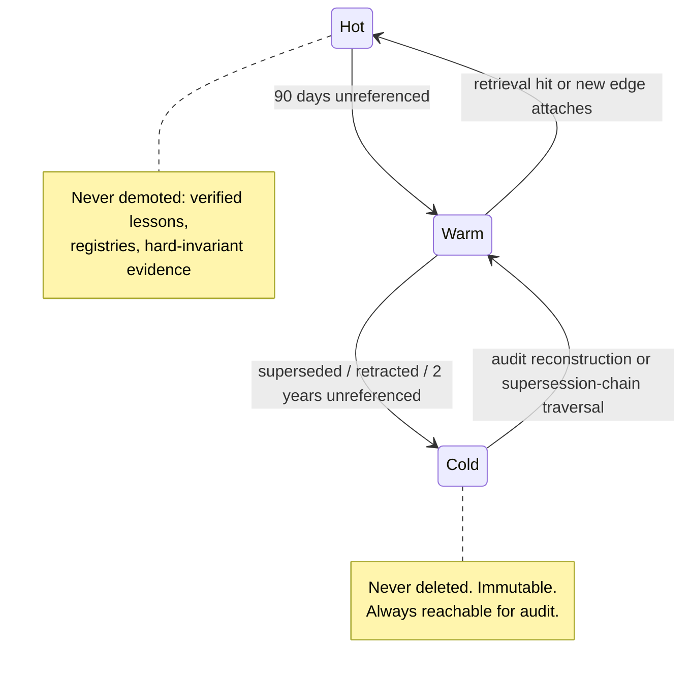

# Memory Orchestration

Purpose: specify how Dot.Brain remembers — the tiering of knowledge between hot, warm, and cold storage in partnership with Dot.Memory, the retrieval contracts every consumer relies on, and the forgetting policy that keeps a never-delete system from drowning in its own history. This completes the intelligence layer of [brain.architecture.md](brain.architecture.md) §3.

> **Related documents:** [brain.architecture.md](brain.architecture.md) — the Memory Orchestrator component and T0–T3 continuity tiers · [brain.relationships.md](brain.relationships.md) — the lifecycle states (dormant/superseded/retracted) that drive tiering · [brain.dkp.md](brain.dkp.md) — age decay and classification · [brain.platforms.md](brain.platforms.md) — Dot.Memory's registry entry · [adr/ADR-0007-rto-rpo-tiers.md](adr/ADR-0007-rto-rpo-tiers.md) — continuity commitments per tier.

---

## 1. Division of labor with Dot.Memory

Dot.Memory is a **platform**, and the boundary applies to it exactly as to Dot.Mines: the orchestrator (Brain-side) decides *what* is remembered at which temperature and under which contract; Dot.Memory operates the storage substrate and publishes its own operational knowledge as DKPs.

| Concern | Owner |
|---|---|
| Tiering policy, promotion/demotion rules, retrieval contracts, forgetting policy | Memory Orchestrator (this spec, Memory Agent) |
| Storage engines, replication, encryption at rest, capacity | Dot.Memory (its own repo — Brain proposes changes only via PR) |
| Audit Ledger (T0) | **Never delegated** — the ledger stays Brain-internal (ADR-0006); Dot.Memory holds replicas, not authority |

The interface is contractual: the orchestrator calls Dot.Memory through versioned storage contracts registered in Dot.Memory's platform manifest; a Dot.Memory outage degrades retrieval latency, never correctness (the graph remains authoritative, [brain.architecture.md](brain.architecture.md) §5).

## 2. Temperature tiers

Distinct from ADR-0007's *continuity* tiers (T0–T3, about recovery); temperature is about *access*:

| Tier | Contents | Latency contract | Backing |
|---|---|---|---|
| **Hot** | Active nodes/edges referenced in the last 90 days; all `LEARNED_FROM` lessons (always hot, λ = 0); registries; `colony/*` namespaces | ≤ 50 ms p95 | Graph store + `colony/graph-cache` projections |
| **Warm** | Active but unreferenced 90 days–2 years; provisional conclusions; dormant edges (confidence < 0.50) | ≤ 2 s p95 | Dot.Memory warm store |
| **Cold** | Superseded and retracted knowledge; expired conclusions; full ledger history beyond the online window | ≤ 5 min (async retrieval) | Dot.Memory cold archive, immutable |

Promotion is demand-driven and automatic; demotion is policy-driven and ledger-logged. **Nothing skips Cold to deletion** — see §4.

## 3. Retrieval contracts

Every consumer gets a named contract; consumers may not bypass contracts to hit storage directly (least-privilege, [brain.agents.md](brain.agents.md) namespaces):

| Contract | Consumer | Guarantee |
|---|---|---|
| `retrieve.context` | Reasoning Engine | Hot inputs for an inference: active nodes/edges above dormancy, with confidence and `valid_until` attached — never returns superseded knowledge unless explicitly requested by supersession-chain traversal |
| `retrieve.lessons` | Reasoning (I7), Resilience Agent | All verified lessons matching a risk pattern; always hot, zero decay |
| `retrieve.provenance` | Governance Agent, auditors | Full chain for any node/conclusion/PR, across all temperatures, including Cold — completeness beats latency |
| `retrieve.history` | Learning Agent | Outcome time-series for calibration windows; read-only over ledger projections |
| `retrieve.explain` | Query & Explanation API | Persona-scoped "why" traversals; respects classification propagation ([brain.relationships.md](brain.relationships.md) §6.5) |

Contract rules: results always carry temperature + staleness metadata; a contract can *narrow* what a consumer sees (classification, dormancy) but never *alter* content; contract versions follow semver with the ADR-0003 dual-version window.

## 4. Forgetting policy

Dot.Brain forgets by **losing salience, never losing record**:

1. **Supersede** — the only mutation. Old versions demote toward Cold with the supersession chain intact.
2. **Dormancy** — confidence decay below 0.50 removes knowledge from inference (`retrieve.context` stops returning it) while it remains retrievable by provenance and history contracts.
3. **Expiry** — `valid_until` passes: same as dormancy, plus the node is flagged for the Knowledge Agent to seek a successor observation.
4. **Never-forget set** — verified lessons (λ = 0), the ledger, hard-invariant evidence, and arbitration precedents are exempt from all demotion below Hot/Warm.
5. **Legal erasure** — the one genuine tension with never-delete. Person-level data should not be in the graph at all ([brain.reasoning.md](brain.reasoning.md) §3 forbids person-level inference; classification gates at ingestion). Where erasure obligations still bite (e.g., personal data inside pack payloads), the standing design is **crypto-shredding**: payload encrypted per data subject, key destruction renders it unreadable while ledger hashes stay intact. Formal adoption requires the ADR already flagged in [brain.governance.md](brain.governance.md)'s open questions — restated here, not resolved here.

## 5. Worked example — three retrievals, one pack

The Kolomela cycle-time node ([templates/knowledge-pack.example.md](templates/knowledge-pack.example.md)) through its life:

1. **Month 0–6 (Hot):** `retrieve.context` serves it to the Reasoning Engine chain of [brain.reasoning.md](brain.reasoning.md) §7 at ≤ 50 ms; every retrieval refreshes its 90-day reference clock.
2. **Month 6:** the drainage-upgrade pack supersedes it ([brain.relationships.md](brain.relationships.md) §7.5). The old node demotes to Warm with its SUPERSEDES chain; `retrieve.context` now returns only the successor. The CAUSES edge's corroborated outcome (5.2 h avoided, [brain.learning.md](brain.learning.md) §5) is already banked in Loop B — forgetting the node does not forget what was learned from it.
3. **Month 30 (Cold):** a governance audit reconstructs the original recommendation. `retrieve.provenance` pulls the superseded node, the retired edge, the Why block, and the ledger entries from Cold in one async traversal — complete chain, minutes not forensics.

## 6. Health metrics

Registered in [brain.metrics.md](brain.metrics.md) where they exist: `knowledge.provenance_completeness = 100%` (no chain broken by tiering), `governance.decision_trails_complete = 100%` (Cold retrievability proven at each audit), `dkp.ingest_latency_p95 ≤ 15 min` (write path unimpeded). Also registered, homed in [platforms/dot-memory.md](platforms/dot-memory.md) §11 rather than the main registry (see Open Questions): `memory.context_latency_p95` (this doc's proposed ≤ 50 ms hot target is per-operation; the SLA contract's p95 ≤ 800 ms is end-to-end context assembly — different units, not a contradiction) and `memory.cold_retrieval_failures` (0 — a failed audit retrieval is an incident, not a metric miss).

---

## Change Log

| Version | Date | Author | Change |
|---|---|---|---|
| 1.0.0 | 2026-08-01 | Brain Document Generator (prompt 03, AI) | Initial spec: Dot.Memory division of labor, three temperature tiers, five retrieval contracts, five-part forgetting policy, lifecycle worked example |
| 1.0.1 | 2026-08-01 | Repository Reviewer (prompt 07, AI) | Straggler-metric OQ struck (homed in platforms/dot-memory.md §11); per-op vs end-to-end latency units clarified |
| 1.0.2 | 2026-08-10 | Brain core-doc sweep | §6 still said the two memory metrics were "proposed pending registration" despite the Open Questions section immediately below already recording them as resolved/homed elsewhere — corrected to match |

## Open Questions

| Question | Owner → Approver |
|---|---|
| ~~Register `memory.context_latency_p95` and `memory.cold_retrieval_failures` in brain.metrics.md (per its §1 gate)~~ **Resolved 2026-08-01:** homed in [platforms/dot-memory.md](platforms/dot-memory.md) §11 per brain.metrics.md §4.8. Note: this doc's proposed ≤ 50 ms hot target is per-operation; the SLA contract's p95 ≤ 800 ms is end-to-end context assembly — not a contradiction, different units | Memory Agent → Chief AI Engineer |
| ~~Crypto-shredding ADR for legal erasure~~ Resolved 2026-08-01 by [adr/ADR-0009-crypto-shredding-legal-erasure.md](adr/ADR-0009-crypto-shredding-legal-erasure.md) | Security Agent → Chief Architect + Ethics Officer |
| Should the 90-day hot window be per-domain (trading knowledge cools in days, mining patterns in years)? | Memory Agent → Chief Knowledge Engineer |
