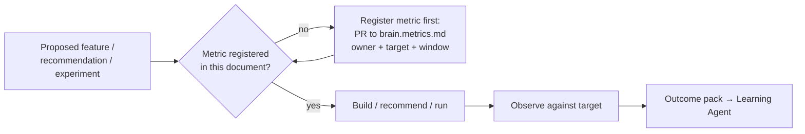

# Metric Definitions & Measurement Standard

Purpose: the single registry and definition standard for every metric in the Dot.Brain ecosystem. Manifesto principle 3 — *define the metric before defining the feature* — is enforced here: no recommendation, experiment, or capability ships without a metric already registered in this document.

> **Related documents:** [MANIFESTO.md](MANIFESTO.md) — principle 3 · [brain.relationships.md](brain.relationships.md), [brain.agents.md](brain.agents.md), [brain.resilience.md](brain.resilience.md), [brain.governance.md](brain.governance.md), [brain.identity.md](brain.identity.md), [brain.platforms.md](brain.platforms.md) — namespace owners whose metrics are registered here · [schemas/metric.schema.json](schemas/metric.schema.json) — machine-readable metric payload.

---

## 1. The rule: measure before feature

Enforcement points:
- [schemas/recommendation.schema.json](schemas/recommendation.schema.json) requires `impact.metrics[]` — each entry must resolve to a metric ID registered here.
- The Governance Agent rejects experiment proposals ([brain.experiments.md](brain.experiments.md) §1 pre-registration) whose success metric is unregistered.
- The Testing Agent validates that metric IDs referenced anywhere in the repository exist in §4.

## 2. Metric definition standard

Every metric is defined by exactly these fields (mirrored in [schemas/metric.schema.json](schemas/metric.schema.json)):

| Field | Rule |
|---|---|
| `id` | `namespace.metric_name`, lower snake_case; percentile suffixes `_p50`/`_p95`; window suffixes `_12m` etc. |
| `type` | `counter` \| `ratio` \| `gauge` \| `duration` \| `score` |
| `unit` | SI or explicit (`days`, `%`, `0–1`, `count`) |
| `source` | The system/event stream that produces observations (never "manual" without a named cadence) |
| `owner` | Owning agent (per namespace, §3) |
| `target` | Numeric threshold or trend direction; "0, always" marks a hard invariant |
| `window` | Evaluation window and review cadence |
| `why` | One line: which decision this metric informs — a metric no decision depends on is deleted |

Rules:
- **Supersede, never redefine.** Changing a metric's meaning requires a new ID; the old one is marked `superseded-by` and kept for historical comparability.
- **Every metric has a Why.** Same standard as decisions ([brain.governance.md](brain.governance.md)).
- **No vanity metrics.** If no target or trend commitment can be stated, it is telemetry, not a metric (lives in [brain.telemetry.md](brain.telemetry.md), which defines the promotion path back into this registry).

## 3. Namespace registry

| Namespace | Owner (agent) | Defined in |
|---|---|---|
| `identity.*`, `explainability.*` | Governance | [brain.identity.md](brain.identity.md) §health, registered §4.1 |
| `dkp.*`, `knowledge.*` | Knowledge | [brain.dkp.md](brain.dkp.md), registered §4.2 |
| `graph.*` | Knowledge (computed by Data) | [brain.relationships.md](brain.relationships.md) §8, registered §4.3 |
| `colony.*` | Governance | [brain.agents.md](brain.agents.md) §metrics, registered §4.4 |
| `governance.*` | Governance | [brain.governance.md](brain.governance.md), registered §4.5 |
| `resilience.*` | Resilience | [brain.resilience.md](brain.resilience.md), registered §4.6 |
| `registry.*` | Registry | [brain.platforms.md](brain.platforms.md), registered §4.7 |
| `reasoning.*`, `learning.*`, `workflows.*`, `api.*` | Owning engine agent (Reasoning / Learning / Architecture) | Engine specs, registered §4.9 |
| `security.*`, `events.*`, `search.*` | Security / Architecture / Architecture | [brain.security.md](brain.security.md), [brain.events.md](brain.events.md), [brain.search.md](brain.search.md), registered §4.9 |
| `semantic.*`, `telemetry.*`, `analytics.*`, `experiments.*`, `evolution.*` | Knowledge / Data / Data / Evolution / Evolution | [brain.semantic.md](brain.semantic.md), [brain.telemetry.md](brain.telemetry.md), [brain.analytics.md](brain.analytics.md), [brain.experiments.md](brain.experiments.md), [brain.evolution.md](brain.evolution.md), registered §4.9 |
| `dopemine.*`, `community.*`, `personas.*` | Dopamine / Community / UX | [brain.dopemine.md](brain.dopemine.md), [brain.community.md](brain.community.md), [brain.personas.md](brain.personas.md), registered §4.10 |
| `failures.*`, `operating.*`, `success.*`, `patterns.*` | Resilience / Governance / Learning / Architecture | [brain.failures.md](brain.failures.md), [brain.operating_model.md](brain.operating_model.md), [brain.success.md](brain.success.md), [brain.patterns.md](brain.patterns.md), registered §4.9 |
| `business.*`, `design.*`, `future.*` | Business / UX / Registry | [brain.business.md](brain.business.md), [brain.design.md](brain.design.md), [brain.future.md](brain.future.md), registered §4.9 |
| `<domain>.*` (e.g., `mining.*`) | Domain agent for that platform | Platform docs + Knowledge Packs, §4.8 |

New namespaces require one registry row here + owning agent; no ADR needed (extensibility by registration).

## 4. Metric registry

Targets are canonical here; source documents cite, this document defines.

### 4.1 Identity & explainability (hard invariants first)

| ID | Type | Target | Window | Why |
|---|---|---|---|---|
| `identity.boundary_violations` | counter | **0, always** | continuous | Detects any Brain write to platform-owned files — manifesto principle 4 |
| `identity.cross_platform_lesson_reuse` | counter | ≥ 5/quarter, rising | quarterly | Proves the ecosystem is smarter than its parts |
| `explainability.human_comprehension_score` | score (1–5) | ≥ 4 | quarterly sample | Unexplainable ⇒ unshippable, verified with humans |

### 4.2 Knowledge flow (DKP)

| ID | Type | Target | Window | Why |
|---|---|---|---|---|
| `dkp.pr_decision_rate` | ratio | ≥ 80% decided (vs expired) | quarterly | Are platforms engaging with proposals at all |
| `dkp.pr_acceptance_rate` | ratio | ≥ 40%, rising | quarterly | Are proposals worth making |
| `dkp.validation_rejection_rate` | ratio | ≤ 10% | monthly | Publisher-side schema/signature quality |
| `dkp.ingest_latency_p95` | duration | ≤ 15 min | monthly | Freshness of the graph vs. reality |
| `knowledge.provenance_completeness` | ratio | 100% (hard gate) | continuous | Every node auditable to origin |

### 4.3 Graph health

| ID | Type | Target | Window | Why |
|---|---|---|---|---|
| `graph.orphan_node_ratio` | ratio | < 10% after 30 days | monthly | Unconnected nodes are backlog, not assets |
| `graph.cross_platform_edge_ratio` | ratio | ≥ 40% | monthly | Cross-platform edges are the product |
| `graph.causal_edge_survival_12m` | ratio | ≥ 85% | rolling 12 m | Is the §4.2 causal bar in brain.relationships.md high enough |
| `graph.contradiction_resolution_p50` | duration | ≤ 14 days | monthly | Unresolved conflict poisons inference |
| `graph.edge_evidence_completeness` | ratio | 100% (hard gate) | continuous | Edges without evidence are rejected |

### 4.4 Agent Colony

| ID | Type | Target | Window | Why |
|---|---|---|---|---|
| `colony.self_merge_violations` | counter | **0, always** | continuous | Hard limit — no agent approves its own work |
| `colony.review_loop_size2_count` | counter | 0 | monthly | Mutual-approval pairs undermine review integrity |
| `colony.pr_acceptance_rate` | ratio | ≥ 50% | quarterly | Colony output quality |
| `colony.mean_trust_score` | gauge (0–1) | ≥ 0.70, stable | monthly | Colony health at a glance |
| `colony.override_rate` | ratio | ≤ 5%, falling | quarterly | Humans overriding often = colony miscalibrated |
| `colony.lesson_propagation_latency` | duration | ≤ 72 h | per incident | Speed of anti-fragility |

### 4.5 Governance

| ID | Type | Target | Window | Why |
|---|---|---|---|---|
| `governance.decision_trails_complete` | ratio | 100% (audit sample) | quarterly | Everything auditable |
| `governance.ledger_integrity_checks_passed` | counter | 4/4 per year | quarterly | Hash-chain unbroken (ADR-0006) |
| `governance.unexplained_recommendations_shipped` | counter | **0, always** | continuous | Manifesto principle 2 |
| `governance.ethics_gate_bypasses` | counter | **0, always** | continuous | The gate is not optional |
| `governance.audit_findings_closed_within_quarter` | ratio | ≥ 90% | quarterly | Findings don't rot |
| `governance.why_block_comprehension` | score (1–5) | ≥ 4 | quarterly sample | Why blocks written for humans, not compliance |

### 4.6 Resilience

| ID | Type | Target | Window | Why |
|---|---|---|---|---|
| `resilience.repeat_incident_rate` | ratio | declining every quarter | quarterly | **The defining anti-fragility metric** |
| `resilience.mttd_p50` | duration | declining trend | quarterly | Detection improving |
| `resilience.mttr_p50` | duration | declining trend | quarterly | Recovery improving |
| `resilience.lessons_verified_within_30d` | ratio | 100% | monthly | Unverified lessons don't propagate |
| `resilience.lesson_adoption_rate` | ratio | ≥ 50% | quarterly | Advisories worth accepting |
| `resilience.drills_passed` | counter | 8/8 per year | quarterly | RTO/RPO tiers (ADR-0007) proven, not assumed |
| `resilience.rto_rpo_breaches` | counter | 0 | per incident | Tier commitments held |

### 4.7 Platform registry

| ID | Type | Target | Window | Why |
|---|---|---|---|---|
| `registry.onboarding_invariant_violations` | counter | **0, always** | per onboarding | Six-step invariant is invariant |
| `registry.median_onboarding_time` | duration | ≤ 5 days | quarterly | Manifest → first ingested pack |
| `registry.stale_entries` | counter | 0 at monthly audit | monthly | Registry = reality |
| `registry.platforms_at_full_loop` | ratio | 100% within 2 quarters | quarterly | Registration ≠ integration |
| `registry.manifest_validation_turnaround` | duration | ≤ 24 h | monthly | Onboarding friction |

### 4.8 Domain metrics
Domain metrics (e.g., `mining.cycle_time_p50` from the [Kolomela example](templates/knowledge-pack.example.md)) are defined by the publishing platform in its Knowledge Pack against [schemas/metric.schema.json](schemas/metric.schema.json), owned by the platform's domain agent, and registered in that platform's `platforms/dot-<name>.md` file — not here. This document registers only brain-level metrics; the namespace registry (§3) prevents collisions.

### 4.9 Engine calibration (registered from engine-spec proposals)

| ID | Type | Target | Window | Why |
|---|---|---|---|---|
| `reasoning.conclusion_reversal_rate` | ratio | ≤ 5% | quarterly | Issued conclusions later retracted — is the inference bar calibrated ([brain.reasoning.md](brain.reasoning.md) §8) |
| `learning.parameter_rollbacks` | counter | 0 | quarterly | A rollback means a drift guardrail caught a bad update late ([brain.learning.md](brain.learning.md) §6) |
| `workflows.gate_rejection_rate` | ratio (per gate) | reviewed, no fixed target | quarterly | Near-zero ⇒ rubber-stamp gates; persistently high ⇒ upstream miscalibration — both are findings ([brain.workflows.md](brain.workflows.md) §9) |
| `api.evidence_resolution_rate` | ratio | ≥ 60%, rising | quarterly | Evidence links resolved before PR decision — low means recommendations judged unread ([brain.api.md](brain.api.md) §8) |
| `security.key_rotation_compliance` | ratio | 100% within policy windows | quarterly | Stale keys widen the signature-forgery window ([brain.security.md](brain.security.md) §6) |
| `security.mean_revocation_latency` | duration | ≤ 1 validation cycle | per revocation | Revocation speed verified, not assumed — a revoked key that still validates is a live threat ([brain.security.md](brain.security.md) §6) |
| `events.webhook_delivery_p95` | duration | ≤ 60 s | monthly | Slow event delivery silently degrades the PR-outcome path to polling ([brain.events.md](brain.events.md) §7) |
| `events.sequence_gap_rate` | ratio (per publisher) | ≤ 0.1% | monthly | Sequence gaps mean lost reality ([brain.events.md](brain.events.md) §7) |
| `search.freshness_p95` | duration | ≤ 5 min | monthly | Write-to-searchable latency — stale indexes hide knowledge that exists ([brain.search.md](brain.search.md) §6) |
| `search.relevance_regression_pass_rate` | ratio | 100% on golden query suite | per index/model change | Reranking or embedding changes must not silently lose recall ([brain.search.md](brain.search.md) §6) |
| `semantic.same_as_candidate_precision` | ratio | ≥ 0.80 on reviewed sample | quarterly | Below means the SAME_AS suggestion threshold or the model is wrong ([brain.semantic.md](brain.semantic.md) §7) |
| `semantic.unmapped_term_ratio` | ratio | reviewed, declining | monthly | Persistent growth means the taxonomy lags the ecosystem's actual domains ([brain.semantic.md](brain.semantic.md) §7) |
| `telemetry.unconsumed_signal_families` | counter | reviewed, trending to 0 | monthly | Telemetry hoarding is a liability, not an asset ([brain.telemetry.md](brain.telemetry.md) §3) |
| `telemetry.collection_gap_minutes` | duration | ≤ 5 min/month per golden-signal stream | monthly | You cannot observe an outage with an observability outage ([brain.telemetry.md](brain.telemetry.md) §6) |
| `analytics.findings_packed_ratio` | ratio | ≥ 80% within 30 days | quarterly | Actionable findings become DKPs, not decaying dashboards ([brain.analytics.md](brain.analytics.md) §1) |
| `analytics.product_consumer_attestation` | ratio | 100% at quarterly review | quarterly | Every analysis product has a named consumer or is retired ([brain.analytics.md](brain.analytics.md) §2) |
| `experiments.preregistration_compliance` | ratio | **100%, always** | continuous | An unregistered experiment is a protocol violation, incident-logged ([brain.experiments.md](brain.experiments.md) §1) |
| `experiments.negative_result_packing_rate` | ratio | 100% within 30 days | quarterly | The file-drawer guard — unpacked failures are how ecosystems repeat mistakes ([brain.experiments.md](brain.experiments.md) §1) |
| `evolution.unregistered_change_findings` | counter | 0 per drift audit | quarterly | The evolution/drift boundary held ([brain.evolution.md](brain.evolution.md) §2) |
| `evolution.rollback_points_verified` | ratio | 100% | quarterly | An untested rollback point is a hope, not a control ([brain.evolution.md](brain.evolution.md) §4) |
| `failures.pir_completion_within_5d` | ratio | 100% | monthly | A PIR that waits loses the details that matter ([brain.failures.md](brain.failures.md) §2) |
| `failures.entries_with_what_worked` | ratio | 100% | monthly | Half-incident reviews are a taxonomy violation ([brain.failures.md](brain.failures.md) §2) |
| `operating.escalation_sla_breaches` | counter | 0 | quarterly | Silence is never a decision — unanswered escalations auto-raise ([brain.operating_model.md](brain.operating_model.md) §4) |
| `operating.ritual_rubber_stamp_findings` | counter | reviewed, no fixed target | quarterly | ~100% approval with zero recorded reasons marks delegation candidates, not diligence ([brain.operating_model.md](brain.operating_model.md) §3) |
| `success.entries_with_counterfactual` | ratio | **100%, always** | per entry | A success claim without a counterfactual is an anecdote, and a defect ([brain.success.md](brain.success.md) §1) |
| `success.replication_rate` | ratio | reviewed, rising | annual | Single-context entries tested in a second context within 12 months — an untested library is a scrapbook ([brain.success.md](brain.success.md) §6) |
| `patterns.condition_check_compliance` | ratio | 100% | quarterly | Pattern citations without recorded condition checks forfeit pattern-grade confidence ([brain.patterns.md](brain.patterns.md) §3) |
| `patterns.sentinel_coverage` | ratio | 100% of active patterns | quarterly | A pattern nobody is watching is a future incident ([brain.patterns.md](brain.patterns.md) §2) |
| `business.realized_vs_projected_roi` | ratio | ≥ 50% of projection on ≥ 60% of accepted proposals | quarterly | ROI inflation feeds the Business Agent's trust score directly ([brain.business.md](brain.business.md) §1) |
| `business.davoided_attestation_rate` | ratio | **100%, always** | per D_avoided entry | Every duplicate-effort rand traces to a signed stand-down attestation ([brain.business.md](brain.business.md) §3) |
| `design.notification_precision` | ratio | ≥ 90% | quarterly | A notification that prompts no decision was noise ([brain.design.md](brain.design.md) §6) |
| `design.surface_retirement_rate` | counter | reviewed, no fixed target | annual | Zero retirements means unanswered questions are accumulating pixels ([brain.design.md](brain.design.md) §6) |
| `future.horizon_date_calibration` | ratio | reviewed, rising | annual | The roadmap's realized-vs-projected — horizon dates hit within stated tolerance ([brain.future.md](brain.future.md) §2) |
| `future.replan_misses_logged` | ratio | 100% | per re-plan | A slipped date without a ledgered root-cause assumption is roadmap drift ([brain.future.md](brain.future.md) §2) |

### 4.10 Domain/culture policy calibration

| ID | Type | Target | Window | Why |
|---|---|---|---|---|
| `dopemine.gate_overturn_rate` | ratio | ≤ 10%; zero-over-a-year is its own finding | quarterly | High ⇒ gate miscalibrated strict; zero ⇒ nobody appeals ([brain.dopemine.md](brain.dopemine.md) §7) |
| `dopemine.guard_breach_rate` | counter | 0 sustained breaches | continuous | A guard metric that stays breached means shipped harm ([brain.dopemine.md](brain.dopemine.md) §5) |
| `community.aggregation_floor_holds` | counter | reviewed, no fixed target | quarterly | Chronically high means themes are sliced too thin ([brain.community.md](brain.community.md) §3) |
| `community.reputation_contamination_incidents` | counter | **0, always** | continuous | Reputation must never set trust scores ([brain.community.md](brain.community.md) §4) |
| `personas.escalation_rate` | ratio (per persona) | reviewed, no fixed target | semi-annual | Chronically high ⇒ default register too shallow; near-zero everywhere ⇒ invisible escalation link ([brain.personas.md](brain.personas.md) §6) |
| `personas.default_fallback_rate` | ratio | reviewed, declining | semi-annual | High unmapped-role traffic means the resolver lags the actual audience ([brain.personas.md](brain.personas.md) §6) |

## 5. Anti-gaming safeguards

- **Paired metrics.** Every rate metric with a target is paired with a volume guard (e.g., `dkp.pr_acceptance_rate` can't be gamed by proposing less: `identity.cross_platform_lesson_reuse` must rise simultaneously). The Data Agent reports pairs together, never alone.
- **Dopamine prohibition.** Engagement-maximization metrics (session length, streaks, notification CTR as a target) are prohibited as optimization targets ecosystem-wide; the Dopamine Agent gate rejects any recommendation whose impact block optimizes one — [brain.dopemine.md](brain.dopemine.md) carries the full policy, including the proxy-laundering trace.
- **Goodhart review.** Quarterly, the Governance Agent samples one metric and asks: "if the colony optimized only this, what breaks?" Findings become target or pairing adjustments logged here.

## 6. Worked example — registering a metric before a feature

The Reasoning Agent wants to ship rain-forecast logistics recommendations to Dot.Farms (from the [brain.relationships.md](brain.relationships.md) §7 edge chain).

1. Before generating the recommendation, it checks §4: no metric captures "pre-positioning benefit". Blocked at the §1 gate.
2. It PRs this document: `agriculture.rain_prepositioning_delay_avoided` (duration, owner Agriculture Agent, target ≥ 4 h avoided per event, quarterly window, why: "quantifies whether cross-platform weather intelligence changes farm-logistics outcomes"). Registered in Dot.Farms' platform doc per §4.8, namespace row already exists.
3. Recommendation ships with `impact.metrics[]` referencing the new ID; six months later the Learning Agent's outcome pack shows median 5.2 h avoided → the CAUSES edge gains corroboration, and the metric survives its first Goodhart review.

---

## Change Log

| Version | Date | Author | Change |
|---|---|---|---|
| 1.0.0 | 2026-08-01 | Brain Document Generator (prompt 03, AI) | Initial standard: definition fields, namespace registry, 33 brain-level metrics consolidated from 7 source documents, anti-gaming safeguards, worked example |
| 1.1.0 | 2026-08-01 | Repository Reviewer batch (prompt 07, AI) | Registered §4.9 engine-calibration metrics proposed by the four engine specs (reasoning, learning, workflows, api) + their namespaces in §3 |
| 1.2.0 | 2026-08-01 | Brain Document Generator (prompt 03, AI) | Registered the 12-ID pending batch: §4.9 + security/events/search rows, new §4.10 domain/culture calibration (dopemine, community, personas); namespaces added in §3; §5 dopemine reference now live |
| 1.3.0 | 2026-08-01 | Brain Document Generator (prompt 03, AI) | Registered the 10-ID batch in §4.9 (semantic, telemetry, analytics, experiments, evolution ×2 each); five namespaces added in §3. Registry now 59 brain-level metrics |
| 1.4.0 | 2026-08-01 | Brain Document Generator (prompt 03, AI) | Registered the 8-ID batch in §4.9 (failures, operating, success, patterns ×2 each); four namespaces added in §3. Registry now 67 brain-level metrics |
| 1.5.0 | 2026-08-01 | Brain Document Generator (prompt 03, AI) | Registered the 6-ID batch in §4.9 (business, design, future ×2 each); three namespaces added in §3. Registry now 73 brain-level metrics — brain.* corpus complete with a clean registry |
| 1.5.1 | 2026-08-10 | Brain core-doc sweep | The running per-batch metric count reached 73 by 1.5.0's own cumulative arithmetic, but a direct row count of §4 today gives 77 — a 4-metric discrepancy somewhere in the batch history that wasn't re-audited batch-by-batch here (not worth reconstructing without more signal than a bare count difference). Recorded honestly rather than silently corrected: §4 currently contains 77 registered brain-level metric rows, verified by direct count |

## Open Questions

| Question | Owner → Approver |
|---|---|
| Should hard-invariant metrics (`*, always = 0`) page humans immediately rather than surface at cadence review? | Resilience Agent → SRE Lead |
| Automated CI check that every `impact.metrics[]` ID resolves against this registry — build now or wait for brain.workflows.md? | Testing Agent → Chief Architect |
| Do domain-metric namespaces need reserved-word protection against future brain-level namespaces? | Data Agent → Chief Knowledge Engineer |
