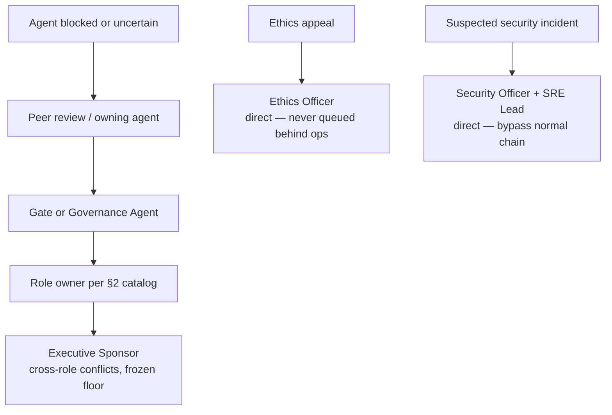

# Operating Model

Purpose: how humans and the agent colony actually work together, day to day. Other documents define *what* the system does; this one answers the new team member's questions: who are the humans, what lands on whose desk and when, how do I escalate, and what does "working with a colony" feel like in practice. This fills INDEX's new-contributor reading-order step 4 and consolidates the human role catalog currently scattered across every approver column in the repository.

> **Related documents:** [brain.governance.md](brain.governance.md) — decision rights this document schedules · [brain.agents.md](brain.agents.md) — the 28-agent roster (the other half of the org chart) · [indexes/INDEX.md](indexes/INDEX.md) — reading orders · [MANIFESTO.md](MANIFESTO.md) — the principles everyone here serves.

---

## 1. The one-sentence model

**Agents do the recurring work; humans hold the judgment calls; the ledger holds everyone to account.** Humans are not the colony's operators — they are its approvers, calibrators, and appeal courts. If a human is doing something an agent should (routine review, metric collection) or an agent is doing something a human must (frozen-floor changes, T4 sign-offs), the operating model is broken and that observation is itself a finding.

## 2. Human role catalog

Consolidated from the approver columns across all documents — these nine roles are the complete set; a new approver title anywhere else in the repo is an inconsistency to file:

| Role | Holds judgment over | Appears as approver in |
|---|---|---|
| **Executive Sponsor** | Value: is the Brain worth it; frozen-floor changes; drift-ratification policy | metrics, analytics, identity, evolution |
| **Chief Intelligence Architect** | The repository's coherence as a whole; self-knowledge questions | README/indexes ownership, platforms |
| **Chief AI Engineer** | Colony behavior: roster, trust mechanics, inference/learning parameters, model upgrades | agents, reasoning, learning, memory, semantic, experiments, evolution, recommendations |
| **Chief Knowledge Engineer** | Knowledge quality: graph, taxonomy, community distillation, corroboration rules | relationships, community, dkp, workflows advisories |
| **Chief Architect** | Technical structure: schemas, storage/graph tech, API surface, CI tooling | architecture, api, events, search, CROSSREF |
| **Security Officer** | Confidentiality, keys, classification, external audit access | security, telemetry, community privacy, failures redaction |
| **Ethics Officer** | The engagement conscience: gate appeals, prohibited-list changes, E4 experiments, erasure co-signs | dopemine, governance §5, ADR-0009 |
| **SRE Lead** | Operations: drills, paging policy, PIR discipline, resilience targets | resilience, failures, telemetry dashboards |
| **UX Architect** | How the Brain speaks to people: personas, design, comprehension | personas, design |

One person may hold several roles in a small team; the *roles* stay distinct so hand-off is a personnel change, not a redesign.

## 3. Cadences — what lands on whose desk

| Cadence | Ritual | Humans | Inputs (produced by agents) |
|---|---|---|---|
| **Continuous** | T3/T4 sign-offs, gate-escalations (second rejections), hard-invariant pages | Role owner per §2 | Recommendation payloads with Why blocks |
| **Weekly** | Incident digest; open-PR/expiry watch | SRE Lead; Chief Knowledge Engineer | Resilience digest; workflow queue stats |
| **Monthly** | Security review; failures/PIR review; taxonomy review; telemetry retention review | Security Officer, SRE Lead, Chief Knowledge Engineer | Per monthly review-cadence front-matter |
| **Quarterly** | Colony health report; Goodhart review; evolution report; drift audit; gate-overturn review; comprehension sampling | Chief AI Engineer, Governance side, Ethics Officer, Executive Sponsor | Analytics product catalog ([brain.analytics.md](brain.analytics.md) §2) |
| **Semi-annual / Annual** | Persona/design reviews; key rotation; erasure drill; MANIFESTO re-affirmation | UX Architect; Security Officer; Executive Sponsor | Calibration metrics, drill results |

Human review effort is a budgeted resource: agents *prepare* every ritual (the human reads a rendered product, never raw data), and any ritual whose human routinely rubber-stamps it is a candidate for delegation downward — measured, like everything, by override and finding rates.

## 4. Escalation paths

Three rules: escalation always lands with a *role*, not a person's inbox; ethics appeals and security incidents skip the ladder; and an escalation unanswered past its tier's SLA auto-raises one level — silence is never a decision ([brain.recommendations.md](brain.recommendations.md)'s expiry-is-an-answer principle, applied internally).

## 5. Working with a colony — the new team member's orientation

What is genuinely different from a normal engineering team:

- **You review proposals, not drafts.** Agents arrive with evidence chains, confidence figures, and Why blocks. Your job is judgment — is the weakest link acceptable? — not wordsmithing. Gates reject; they never edit, and neither should you: send it back with a reason, which becomes knowledge.
- **Your overrides teach.** Rejecting agent output with a recorded reason is double-weighted in Loop B ([brain.learning.md](brain.learning.md)) — the most valuable single act a human performs here. An unexplained override teaches nothing and costs the same.
- **Your questions are queries.** Before asking a colleague, ask `/v1/why` or search — the ecosystem's whole point is that the answer's provenance comes with it. If the answer isn't there, *that* is worth reporting (unserved queries feed the capability roadmap).
- **Blamelessness is structural, not polite.** PIRs naming people are returned unaccepted ([brain.failures.md](brain.failures.md)); the symmetry extends to agents — nobody here, human or agent, is punished for detected failure, only for hidden ones.
- **Nothing you decide is off the record.** T3/T4 sign-offs, gate overrides, appeals — all ledger-recorded. This is protection, not surveillance: your reasoning at decision time is what defends the decision later.
- **Where to write things down:** the routing table in [README.md](README.md) §"where does knowledge go" is authoritative; when in doubt, a DKP through the front door beats a note in a wiki nobody validates.

## 6. Worked example — one week, one human

A newly-arrived Chief Knowledge Engineer's first week, as the operating model prescribes:

- **Mon:** weekly expiry watch — two Dot.Trade recommendations expiring Friday, undecided; per §4, nudges via the Registry Agent, doesn't ping the platform directly (respect for the boundary is also human discipline).
- **Tue:** taxonomy review (monthly) — reads the Knowledge Agent's prepared product: 3 unmapped-term promotions proposed, 1 SAME_AS candidate held; approves two, sends one back with a reason. The reason enters Loop B.
- **Wed:** a T3 sign-off arrives: cross-classification SAME_AS merge. Reads the Why block at engineer depth, checks the weakest link (single-source corroboration), rejects with reason — the second rejection auto-escalates a related payload to the Chief AI Engineer per the two-rejection rule.
- **Thu:** notices their own recurring question ("which platforms cite this edge?") takes four queries to answer; files it as an unserved-query lead for the capability roadmap.
- **Fri:** signs the week's ledger attestations. Total raw data read: none. Total judgment calls: five, all recorded, all teaching.

## 7. Health metrics

Registered in [brain.metrics.md](brain.metrics.md): `colony.override_rate ≤ 5%, falling` (humans overriding often = colony miscalibrated; the operating model's calibration gauge) · `governance.decision_trails_complete = 100%` · `governance.why_block_comprehension ≥ 4/5` (humans can actually exercise the judgment assigned to them). Also registered (§4.9, 1.4.0): `operating.escalation_sla_breaches` (0 — silence is never a decision) and `operating.ritual_rubber_stamp_findings` (reviewed quarterly — rituals with ~100% approval and zero recorded reasons are delegation candidates, not diligence).

---

## Change Log

| Version | Date | Author | Change |
|---|---|---|---|
| 1.0.0 | 2026-08-01 | Brain Document Generator (prompt 03, AI) | Initial model: one-sentence division of labor, nine-role human catalog consolidated from approver columns, cadence table, escalation paths with skip rules, colony-orientation guide, one-week worked example |
| 1.0.1 | 2026-08-10 | Brain core-doc sweep | Corrected "24-agent roster" to 28 (brain.agents.md's own ADR-0010 update) and struck "design (pending)" — brain.design.md is a complete, active document |

## Open Questions

| Question | Owner → Approver |
|---|---|
| ~~Register `operating.escalation_sla_breaches` and `operating.ritual_rubber_stamp_findings` in brain.metrics.md §4.9 (batch now 4 with failures')~~ Registered in [brain.metrics.md](brain.metrics.md) §4.9 (1.4.0) | Governance Agent → Executive Sponsor |
| Escalation SLAs per tier (§4) are asserted but not quantified — set initial values now or calibrate from the first quarter's data? | Governance Agent → Executive Sponsor |
| Chief Intelligence Architect vs. Executive Sponsor boundary: who owns MANIFESTO re-affirmation if they diverge? | Governance Agent → Executive Sponsor |
