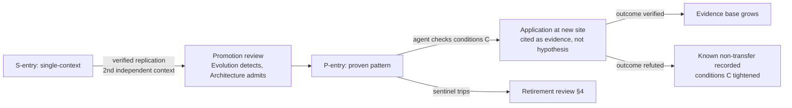

# Pattern Catalog

Purpose: the promotion target [brain.success.md](brain.success.md) §1 and §5 point at. A **pattern** is knowledge that has stopped being about one place: replicated across independent contexts, corroborated, and stated in transferable form. This document defines the proven-pattern format, the boundary against single-context successes and against lessons, and — because contexts drift — the rules for retiring a pattern that has quietly stopped being true. Detection is the Evolution Agent's job ([brain.evolution.md](brain.evolution.md)); catalog stewardship is the Architecture Agent's.

> **Related documents:** [brain.success.md](brain.success.md) — where entries come from · [brain.failures.md](brain.failures.md) — lessons, the durable counterpart · [brain.relationships.md](brain.relationships.md) — corroboration and decay mechanics patterns inherit · [brain.reasoning.md](brain.reasoning.md) — I4 analogy transfer, the pattern-application engine · adr/ — architectural patterns with decision history.

---

## 1. The three-way boundary: success, lesson, pattern

| | Single-context success | Lesson (from failures) | Proven pattern |
|---|---|---|---|
| **Claim shape** | "This worked *there*, once, verified" | "Never do X / always check Y" | "Under conditions C, doing X reliably produces Y" |
| **Decay** | Normal age decay | λ = 0, earned ([brain.failures.md](brain.failures.md) §3) | Slow decay, **conditional on context checks passing** (§4) |
| **Transfer** | Hypothesis only (I4, ×0.60) | Universal within scope | Presumptively transferable *where conditions C hold* |
| **Lives in** | brain.success.md library | Failure catalog + never-forget set | This catalog |

The load-bearing difference is the **applicability-conditions clause**. A success doesn't need one (it happened where it happened); a lesson's scope is its class; a pattern *is* its conditions — a pattern stated without explicit conditions C is a superstition with replication data, and is returned.

## 2. Proven-pattern format

Entry `P-<year>-<seq>`, mandatory fields:

- **Statement** — the "under conditions C, X produces Y" sentence, one sentence.
- **Applicability conditions (C)** — explicit, checkable predicates (domain features, scale bounds, data preconditions). These are what an applying agent must verify *before* citing the pattern.
- **Evidence base** — ≥ 2 independent-context S-entries (or ADR + verified outcomes for architectural patterns), with links; corroboration computed per [brain.relationships.md](brain.relationships.md) (×1.10/context, cap 1.30).
- **Known non-transfers** — contexts where application was attempted and failed, with the refuted S-entry link. A pattern with zero known non-transfers has simply not been tested at its edges.
- **Context sentinels** — the 1–3 registered metric IDs or graph conditions whose movement signals that C may no longer hold (the retirement tripwire, §4).
- **Kind** — `knowledge` (domain regularity) | `architectural` (design shape, usually paired with an ADR) | `process` (colony/working practice, e.g. the conditional-pass gate pattern from [brain.dopemine.md](brain.dopemine.md) §6).

## 3. Promotion and application

Application discipline: an agent citing a pattern must record *which conditions it checked* — the graph edge carries the pattern ID plus the condition checklist. A pattern applied without condition checks is treated by gates as an I4 analogy (×0.60), not pattern-grade evidence: skipping the checklist forfeits exactly the confidence the replication earned.

## 4. Retirement: patterns rot at the conditions, not the claim

Contexts drift — climates shift, platforms re-architect, user populations change. A pattern is rarely refuted head-on; instead its conditions C silently stop holding. Three retirement mechanisms:

1. **Sentinel trip:** a context sentinel (§2) moves outside its stated band → automatic retirement review. Outcomes: re-verify (evidence refreshed), tighten C (narrower but alive), or retire.
2. **Non-transfer accumulation:** when known non-transfers reach parity with supporting contexts, the pattern demotes to `contested` — citable only as provisional, pending a discriminating experiment ([brain.experiments.md](brain.experiments.md)).
3. **Staleness:** no verified application in 24 months → `dormant`, per the standard confidence bands. Dormant is not deleted: like refuted S-entries, a retired pattern is retained with its retirement reason — "this used to be true, and here is when it stopped" is itself pattern-grade knowledge about drift.

Retirement is a parametric change under [brain.evolution.md](brain.evolution.md)'s ledger rules: registered intent, rollback point, ratified outcome — a pattern quietly dropped from the catalog without a ledger entry is drift, not evolution.

## 5. Worked example — P-2026-001

S-2026-001 ([brain.success.md](brain.success.md) §5) replicates at Sishen: the haul-road recommendation verifies there at −51%. Promotion review:

- **Statement:** "Under lateritic haul-road conditions with seasonal rainfall > 400 mm, moisture-indexed inspection scheduling reduces false cycle-time findings by ≥ 40%."
- **Conditions C:** lateritic road base · seasonal rainfall band · moisture telemetry available at daily resolution.
- **Evidence:** Kolomela (−64%, E3-controlled) + Sishen (−51%, verified) → corroboration ×1.20.
- **Known non-transfers:** none yet — flagged, not celebrated; the Evolution Agent queues a dry-climate probe (E2) to find the edge.
- **Sentinels:** regional rainfall anomaly index; moisture-sensor coverage ratio. If Sishen's sensors are decommissioned, the pattern doesn't fail — condition C fails, and the tripwire fires before a bad application does.
- Two years later, a drought cycle trips the rainfall sentinel: review tightens C to the wet-season months only. The pattern survives narrower — retirement rules working as intended.

**Condition-family review queue (recorded 2026-08-01, from F-06 platform sessions):**

| Candidate | Source | Status |
|---|---|---|
| Wet-season schedule calibration | [platforms/dot-projects.md](platforms/dot-projects.md) | Candidate replication — shares the rainfall-band condition; C-check pending (road-base predicate does not apply; may seed a sibling pattern rather than extend P-2026-001) |
| Conveyor transfer-point moisture finding | [platforms/dot-tasks.md](platforms/dot-tasks.md) | Candidate replication — moisture-telemetry condition holds; C-check pending |
| Road-surface transfer to e-hailing corridors | [platforms/dot-ehail.md](platforms/dot-ehail.md) | **Recorded non-transfer** — fills the "none yet" gap above; conditions C hold as stated (lateritic base absent on paved corridors) |

## 6. Health metrics

Registered in [brain.metrics.md](brain.metrics.md): `evolution.unregistered_change_findings = 0` (covers unledgered pattern retirement). Also registered (§4.9, 1.4.0): `patterns.condition_check_compliance = 100%` (applications citing patterns without recorded condition checks) and `patterns.sentinel_coverage = 100%` (active patterns with live sentinels — a pattern nobody is watching is a future incident). `learning.lessons_effective` (applications of promoted knowledge succeeding, ≥ 70%) is used above as a live concept but is **not yet registered** in brain.metrics.md — see Open Questions.

---

## Change Log

| Version | Date | Author | Change |
|---|---|---|---|
| 1.0.0 | 2026-08-01 | Brain Document Generator (prompt 03, AI) | Initial catalog: success/lesson/pattern boundary table, P-entry format with mandatory applicability conditions and context sentinels, condition-checked application discipline, three retirement mechanisms under evolution ledger rules, P-2026-001 example |
| 1.0.1 | 2026-08-01 | Repository Reviewer (prompt 07, AI) | P-2026-001 condition-family review queue recorded (two candidates, one non-transfer) — clears F-07-05 |
| 1.0.2 | 2026-08-10 | Brain core-doc sweep | §6 claimed `learning.lessons_effective` was "Registered in brain.metrics.md" — it isn't, anywhere. Corrected and moved to Open Questions |

## Open Questions

| Question | Owner → Approver |
|---|---|
| ~~Register `patterns.condition_check_compliance` and `patterns.sentinel_coverage` in brain.metrics.md §4.9 (batch now 8 — registration pass approaching)~~ Registered in [brain.metrics.md](brain.metrics.md) §4.9 (1.4.0) | Architecture Agent → Chief Architect |
| Register `learning.lessons_effective` in brain.metrics.md (owner: Learning Agent per the `learning.*` namespace) — §6 already specifies it as ≥ 70%, but it was never actually added to the registry | Architecture Agent → Chief AI Engineer |
| Architectural patterns: does every `architectural`-kind entry require a paired ADR, or only those that changed a frozen-adjacent structure? | Architecture Agent → Chief Architect |
| `contested` demotion threshold (non-transfer parity) — is 1:1 too aggressive for patterns with many supporting contexts? | Evolution Agent → Chief AI Engineer |
