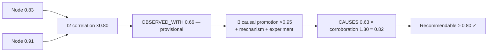

# Reasoning Engine Design & Inference Rules

Purpose: specify how Dot.Brain reasons — which inferences are permitted over the knowledge graph, how confidence composes through inference chains, how Why blocks are synthesized, and the guardrails that make every conclusion explainable and every recommendation defensible. Manifesto principle 2 is operationalized here: **unexplainable ⇒ unshippable**.

> **Related documents:** [brain.architecture.md](brain.architecture.md) §3 — the Reasoning Engine component this specifies · [brain.relationships.md](brain.relationships.md) — the edge taxonomy reasoned over · [brain.dkp.md](brain.dkp.md) §5 — the node confidence formula extended here · [brain.governance.md](brain.governance.md) — the Why block standard · [brain.metrics.md](brain.metrics.md) — targets cited in §8.

---

## 1. What the engine is (and is not)

The Reasoning Engine is a **graph-inference service** that turns validated knowledge into candidate conclusions with attached evidence chains. It is:

- **Deterministic in its rules.** Every inference type is enumerated in §3; conclusions from unlisted inference types are architecturally impossible.
- **Conservative by default.** When evidence is ambiguous, the output is a lower-confidence conclusion or an open question — never a confident guess.
- **Explainable by construction.** The evidence chain is built *during* inference, not reconstructed afterward; a conclusion object without a complete chain fails serialization.

It is **not** a free-form generative model. Generative components may draft Why-block prose (§5), but only from a completed evidence chain, and the chain — not the prose — is authoritative.

## 2. Conclusion object

Every inference produces a conclusion with:

| Field | Rule |
|---|---|
| `id` | `dot:conclusion:<uuid>` |
| `type` | Inference type from §3 |
| `inputs[]` | Node/edge IDs consumed (≥ 1, all must be `active` and above dormancy threshold) |
| `confidence` | Composed per §4 |
| `evidence_chain[]` | Ordered inference steps: rule applied, inputs, intermediate confidence |
| `why` | Human-readable Why block per §5 |
| `status` | `candidate` → `reviewed` → `issued` \| `discarded` (never deleted; ledger-recorded) |

## 3. Permitted inference types

| # | Type | Pattern | Confidence factor | Guard |
|---|---|---|---|---|
| I1 | **Aggregation** | N observations of one metric → trend/summary node | 0.95 | ≥ 5 observations, single source of unit truth ([brain.metrics.md](brain.metrics.md)) |
| I2 | **Correlation** | Statistical co-movement → `OBSERVED_WITH` edge | 0.80 | Test + window declared in evidence chain |
| I3 | **Causal promotion** | `OBSERVED_WITH` (≥ 0.70) + mechanism + experiment/expert → `CAUSES` | 0.95 | The full causal bar of [brain.relationships.md](brain.relationships.md) §4.2; human sign-off recorded |
| I4 | **Analogy transfer** | Verified pattern on platform A → *candidate* for structurally similar platform B | 0.60 | Requires `SAME_AS`/`PART_OF` structural similarity ≥ 0.70; output always `candidate`, never auto-issued |
| I5 | **Contradiction detection** | Two claims, incompatible values, same entity+window → `CONTRADICTS` edge | n/a (flag) | Immediately enters the resolution ladder ([brain.dkp.md](brain.dkp.md) §6) |
| I6 | **Temporal projection** | Trend + stable mechanism → bounded forecast | 0.70 × horizon decay | Horizon ≤ observed history length; mandatory `valid_until` |
| I7 | **Lesson application** | `LEARNED_FROM` lesson + matching risk pattern elsewhere → advisory | 0.90 | Lesson must be `verified: true`; zero age decay (λ = 0) |

**Forbidden inferences** (rejected at rule-registry level, each rejection ledger-logged):
- Transitive causality (`A CAUSES B`, `B CAUSES C` ⇏ `A CAUSES C`) — re-clear I3 or nothing.
- Inference over `dormant`, `superseded`, or `retracted` inputs.
- Any chain that would optimize a prohibited engagement metric ([brain.metrics.md](brain.metrics.md) §5) — checked before issue, enforced again at the Dopamine gate.
- Conclusions about individuals (persons) — the engine reasons about operations, entities, and aggregates; person-level inference is out of scope by classification rule.

## 4. Confidence composition

Chains compose multiplicatively over the weakest path:

`chain_confidence = min(input_confidences) × Π(inference_factors) × corroboration`

- `min(input_confidences)` — a chain is never stronger than its weakest input (same rule as edges).
- `Π(inference_factors)` — the §3 factor per step; long chains decay naturally, which is intended: **depth must be earned with evidence, not free**.
- `corroboration` — ×1.10 per independent chain reaching the same conclusion (cap 1.30); ×0.70 if any active `CONTRADICTS` touches an input.
- Thresholds mirror [brain.relationships.md](brain.relationships.md) §4.3: ≥ 0.80 recommendable, 0.50–0.79 provisional (internal use, flagged), < 0.50 discarded as a conclusion but retained as a ledger record.

## 5. Why-block synthesis

Every issued conclusion carries a Why block ([brain.governance.md](brain.governance.md) standard), synthesized in three fixed steps:

1. **Chain rendering** — the evidence chain is rendered verbatim: each step's rule, inputs (linked node/edge IDs), and intermediate confidence. Machine-checked for completeness.
2. **Mechanism statement** — one paragraph, written for the *receiving persona* (site manager ≠ platform engineer; persona adaptation rules come from the UX Agent). No step may appear in prose that is absent from the chain.
3. **Uncertainty statement** — what would change this conclusion: the active contradictions, the `valid_until`, and the single weakest link in the chain, named explicitly.

Quality is measured, not assumed: `explainability.human_comprehension_score ≥ 4/5` on sampled PRs ([brain.metrics.md](brain.metrics.md) §4.1). Below-threshold samples become Learning Engine inputs against the synthesis templates.

## 6. Human interaction points

| Point | Trigger | Human role |
|---|---|---|
| Causal sign-off | Every I3 promotion | Domain expert or Chief Knowledge Engineer approves mechanism |
| Conflict arbitration | I5 with Δconfidence < 0.20 | Named arbiter decides; decision becomes a ledger-recorded precedent |
| Analogy review | Every I4 candidate | Receiving platform's domain agent + human approver before it can become a recommendation |
| Override | Any issued conclusion | Human override always wins; the override reason is ingested as knowledge (`colony.override_rate` tracks calibration) |

## 7. Worked example — Kolomela chain, audited

Continuing [brain.relationships.md](brain.relationships.md) §7:

1. **I1** aggregates 6 months of `mining.cycle_time_p50` (0.95 factor, 180 observations) → trend node at 0.83.
2. **I2** correlates against Dot.Central rainfall (test: seasonal-adjusted correlation, declared window) → `OBSERVED_WITH` at `min(0.83, 0.91) × 0.80 = 0.66`, provisional.
3. **I3** finds the mechanism (waterlogged ramps → speed restrictions), cites the dry-season natural experiment, gets Chief Knowledge Engineer sign-off → `CAUSES` at `0.66 × 0.95 = 0.63`, corroborated by an independent chain from pit-dispatch telemetry → ×1.30 = **0.82, recommendable**.
4. **I4** proposes analogy transfer to Dot.Farms harvest logistics (structural similarity via shared weather-entity `SAME_AS`, 0.74) → candidate at 0.60 × … = 0.49 → **not recommendable alone**; issued instead as an open question to the Agriculture Agent, which commissions its own I2 on farm data.
5. The Why block names the weakest link (single-site evidence) and `valid_until` (drainage upgrade would supersede) — which is exactly what happens six months later.

The audit reconstruction of this chain from the ledger takes minutes, not forensics ([brain.governance.md](brain.governance.md) §8).

## 8. Health metrics

Registered in [brain.metrics.md](brain.metrics.md); the reasoning view: `graph.causal_edge_survival_12m ≥ 85%` (I3 bar calibration), `explainability.human_comprehension_score ≥ 4/5` (§5 quality), `governance.unexplained_recommendations_shipped = 0` (hard invariant), `colony.override_rate ≤ 5%` (engine calibration vs. human judgment). Also registered (§4.9): `reasoning.conclusion_reversal_rate` — issued conclusions later retracted; target ≤ 5%/quarter.

---

## Change Log

| Version | Date | Author | Change |
|---|---|---|---|
| 1.0.0 | 2026-08-01 | Brain Document Generator (prompt 03, AI) | Initial engine spec: conclusion object, 7 permitted + 4 forbidden inference types, chain confidence composition, Why-block synthesis, human interaction points, audited Kolomela chain |
| 1.0.1 | 2026-08-10 | Brain core-doc sweep | §8 still said `reasoning.conclusion_reversal_rate` was "pending registration" despite the Open Questions section immediately below already recording it as resolved — corrected to match |

## Open Questions

| Question | Owner → Approver |
|---|---|
| ~~Register `reasoning.conclusion_reversal_rate` in brain.metrics.md~~ Resolved 2026-08-01: registered in [brain.metrics.md](brain.metrics.md) §4.9 | Reasoning Agent → Chief AI Engineer |
| Should I4 analogy transfer factor (0.60) be per-domain-pair, learned from transfer outcomes? | Learning Agent → Chief AI Engineer |
| Corroboration cap (1.30) shared with edge formula — single constant or tuned separately once outcome data exists? | Reasoning Agent → Chief Knowledge Engineer |
