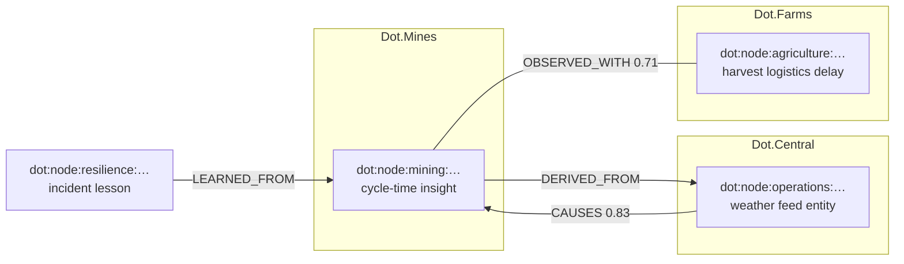
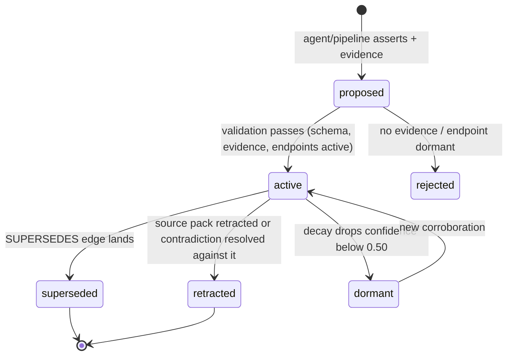

# Cross-Platform Relationship Model

Purpose: define how knowledge nodes from different platforms are connected inside the Dot.Brain knowledge graph — the edge taxonomy, how edges are created and scored, how they decay and supersede, and how the graph stays coherent as the ecosystem's platforms ([brain.platforms.md](brain.platforms.md) §2 for the current count) publish independently.

> **Related documents:** [brain.dkp.md](brain.dkp.md) — how nodes arrive · [brain.identity.md](brain.identity.md) — why the graph exists · [brain.platforms.md](brain.platforms.md) — who publishes · [brain.agents.md](brain.agents.md) — the Knowledge Agent curates this model · [schemas/entity.schema.json](schemas/entity.schema.json), [schemas/insight.schema.json](schemas/insight.schema.json) — node payload shapes.

---

## 1. Why relationships are the product

A Knowledge Pack from one platform is a fact. A verified edge between packs from *two* platforms is intelligence no single platform could produce. Dot.Mines observing rain-driven cycle-time loss is useful to Dot.Mines; the edge connecting it to Dot.Farms harvest-logistics delays and Dot.Central weather feeds is what makes the ecosystem smarter than its parts (Manifesto principle 1).

The graph is therefore optimized for **edge quality over node volume**: an unconnected node is a backlog item, not an asset.

## 2. Node and edge identity

- Nodes: `dot:node:<domain>:<uuid>` (per [brain.dkp.md](brain.dkp.md) §3). Nodes are created only from validated, signed Knowledge Packs or by the Knowledge Agent (derivations, with provenance).
- Edges: `dot:edge:<uuid>`. Every edge carries:

| Field | Meaning |
|---|---|
| `type` | One of the taxonomy in §3 |
| `source`, `target` | Node IDs (direction matters for asymmetric types) |
| `confidence` | 0.00–1.00, computed per §4 |
| `provenance` | Who/what asserted it: pack ID, agent ID, or human decision reference |
| `evidence` | ≥ 1 reference (pack, metric window, incident, ADR) — edges without evidence are rejected |
| `created`, `valid_until` | Temporal bounds; `valid_until` mandatory for OBSERVED_WITH and CAUSES |
| `status` | `proposed` → `active` → `superseded` \| `retracted` |

## 3. Edge taxonomy

Nine types. New types require an ADR (extensibility without taxonomy sprawl).

| Type | Direction | Meaning | Typical creator |
|---|---|---|---|
| `RELATES_TO` | symmetric | Weakest link; same topic/entity | ingestion (automatic) |
| `SAME_AS` | symmetric | Entity resolution: two nodes describe one real-world thing | Knowledge Agent |
| `PART_OF` | asymmetric | Compositional (truck → fleet → site) | ingestion / Knowledge Agent |
| `OBSERVED_WITH` | symmetric | Statistical co-occurrence, no causal claim | Data Agent |
| `CAUSES` | asymmetric | Causal claim — highest evidence bar (§4.2) | Reasoning Agent only |
| `CONTRADICTS` | symmetric | Conflicting claims; triggers conflict resolution ([brain.dkp.md](brain.dkp.md) §6) | validation pipeline |
| `SUPERSEDES` | asymmetric | Newer knowledge replaces older | Knowledge Agent |
| `DERIVED_FROM` | asymmetric | Provenance: insight built from these sources | any agent (mandatory on derivations) |
| `LEARNED_FROM` | asymmetric | Lesson extracted from incident/experiment (zero decay) | Resilience / Learning Agents |

## 4. Edge confidence

### 4.1 Formula
Edge confidence reuses the node formula from [brain.dkp.md](brain.dkp.md):

`edge_confidence = min(source_confidences) × assertion_strength × corroboration × age_decay`

- `min(source_confidences)` — an edge is never more confident than its weakest endpoint.
- `assertion_strength` — 0.60 automatic co-mention, 0.80 statistical test passed, 0.95 human-verified.
- `corroboration` — ×1.10 per independent confirming source (cap 1.30), ×0.70 if a CONTRADICTS edge is active.
- `age_decay` — per-type half-life: OBSERVED_WITH 90 days, CAUSES 365 days, structural types (PART_OF, SAME_AS, DERIVED_FROM) no decay, LEARNED_FROM λ = 0 (incident lessons never decay, per Manifesto principle 6).

### 4.2 The causal bar
`CAUSES` edges may only be created by the Reasoning Agent and require **all** of: (a) an existing OBSERVED_WITH edge with confidence ≥ 0.70; (b) a plausible mechanism written as a Why block ([brain.governance.md](brain.governance.md)); (c) either a natural experiment, an intervention outcome, or domain-expert sign-off. Anything less stays OBSERVED_WITH. Unexplainable ⇒ unshippable.

### 4.3 Thresholds

| Confidence | Effect |
|---|---|
| ≥ 0.80 | Usable in recommendations sent to platforms |
| 0.50–0.79 | Usable for internal reasoning; flagged "provisional" in explanations |
| < 0.50 | Dormant — retained for audit, excluded from inference |

## 5. Edge lifecycle

Nothing is deleted: superseded and retracted edges remain queryable for audit reconstruction ([brain.governance.md](brain.governance.md) §8), excluded from inference.

## 6. Cross-platform coherence rules

1. **Entity resolution before linking.** Two platforms naming the same customer/site/asset must be joined by `SAME_AS` (Knowledge Agent, ≥ 0.90 required) before domain edges attach; otherwise the graph forks silently.
2. **No transitive causal inference.** `A CAUSES B` and `B CAUSES C` does not auto-create `A CAUSES C`; the Reasoning Agent must re-clear the §4.2 bar.
3. **Contradiction is a first-class edge.** Conflicting cross-platform claims get a CONTRADICTS edge immediately, then flow to the [brain.dkp.md](brain.dkp.md) §6 resolution ladder (auto if Δconfidence ≥ 0.20, else human arbiter).
4. **Platform autonomy applies to edges.** An edge involving a platform's node never obliges that platform to anything; it only informs recommendations delivered as PRs.
5. **Privacy classification propagates.** An edge inherits the *most restrictive* classification of its endpoints.

## 7. Worked example — Kolomela, extended

From the [worked DKP example](templates/knowledge-pack.example.md): Dot.Mines publishes the Kolomela haul-truck cycle-time insight (confidence 0.83).

1. Ingestion auto-creates `RELATES_TO` edges to existing Dot.Central weather-feed and pit-dispatch nodes (assertion 0.60).
2. Data Agent runs co-occurrence over 6 months of `mining.cycle_time_p50` vs rainfall: passes, upgrades to `OBSERVED_WITH`, confidence `min(0.83, 0.91) × 0.80 × 1.10 = 0.73`.
3. Reasoning Agent finds a mechanism (waterlogged ramp segments → speed restrictions), plus a natural experiment (dry-season baseline), writes the Why block → `CAUSES` edge at `0.83 × 0.95 × 1.10 = 0.87`, human-approved by the Chief Knowledge Engineer.
4. Recommendation to Dot.Farms ("pre-position harvest logistics on 3-day rain forecasts") is generated citing the edge chain as evidence — delivered as a PR, Dot.Farms decides.
5. Six months later a drainage upgrade at Kolomela lands as a new pack; Knowledge Agent adds `SUPERSEDES`, the old CAUSES edge is archived, the audit trail stays intact.

## 8. Health metrics (owned by Data Agent, definitions in brain.metrics.md)

| Metric | Target |
|---|---|
| `graph.orphan_node_ratio` (nodes with zero active edges after 30 days) | < 10% |
| `graph.cross_platform_edge_ratio` (edges spanning ≥ 2 platforms) | ≥ 40% |
| `graph.causal_edge_survival_12m` (CAUSES edges not retracted within a year) | ≥ 85% |
| `graph.contradiction_resolution_p50` | ≤ 14 days |
| `graph.edge_evidence_completeness` | 100% (hard gate) |

---

## Change Log

| Version | Date | Author | Change |
|---|---|---|---|
| 1.0.0 | 2026-08-01 | Brain Document Generator (prompt 03, AI) | Initial relationship model: 9-type edge taxonomy, confidence formula, lifecycle, coherence rules, Kolomela worked example |
| 1.0.1 | 2026-08-10 | Brain core-doc sweep | §Purpose's "21+ platforms" hardcoded count (stale against brain.platforms.md's now-29-row registry) replaced with a pointer instead of a number that will just drift again |

## Open Questions

| Question | Owner → Approver |
|---|---|
| Should OBSERVED_WITH half-life be per-domain (mining weather patterns vs. market co-movements differ hugely)? | Data Agent → Chief Knowledge Engineer |
| Edge-count budget per node to prevent hub explosion around Dot.Central entities? | Knowledge Agent → Chief Knowledge Engineer |
| Do SAME_AS merges across platforms with different privacy classifications need an ethics-gate review? | Security Agent → Ethics Officer |
