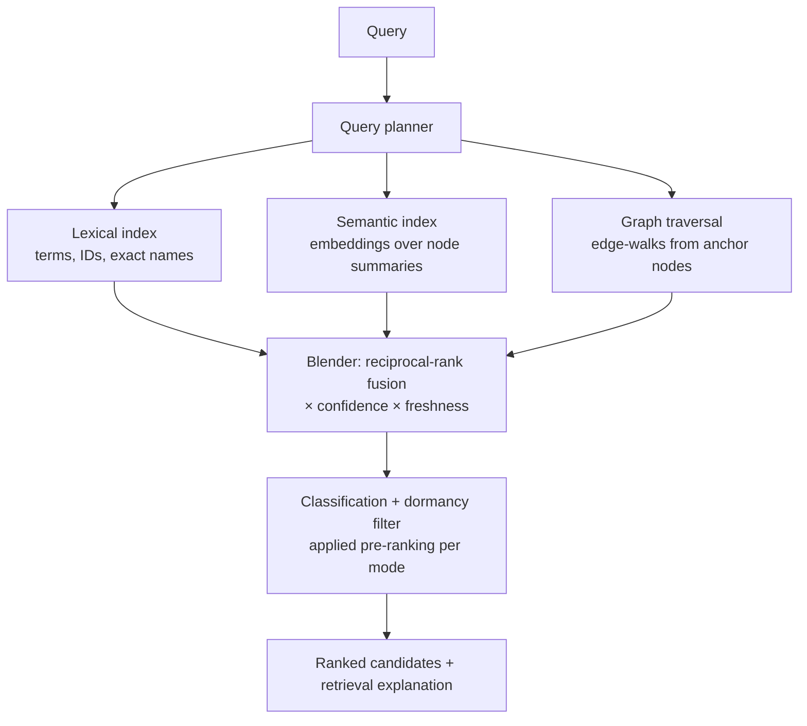

# Search & Retrieval Architecture

Purpose: define how anything in the knowledge graph is *found* — the three retrieval modes, how they blend into one ranked answer, how ranking respects confidence and classification, and why every index is disposable. Search is the read-side counterpart of ingestion: knowledge that cannot be found does not exist for practical purposes, whatever the graph says.

> **Related documents:** [brain.api.md](brain.api.md) — the `/v1/query/search` surface this backs · [brain.memory.md](brain.memory.md) — the retrieval contracts and temperature tiers searched over · [brain.relationships.md](brain.relationships.md) — the edges graph traversal walks · [brain.architecture.md](brain.architecture.md) §5 — indexes as Tier-3 disposable projections · [brain.security.md](brain.security.md) §2 — classification filtering.

---

## 1. Principles

1. **Indexes are projections, never truth.** Every index is rebuildable from graph + ledger ([brain.architecture.md](brain.architecture.md) T3: RTO 48 h, fully regenerable). Index corruption is an inconvenience, not an incident.
2. **Ranking is confidence-weighted, not popularity-weighted.** A frequently-retrieved wrong answer must not outrank a rarely-needed right one. Retrieval frequency affects *temperature* ([brain.memory.md](brain.memory.md)), never *rank*.
3. **Filtering before ranking.** Classification and dormancy are applied to the candidate set before scoring — a caller's ranking can never leak the existence-shape of knowledge they cannot see (beyond the visible `[restricted: n items]` count of [brain.api.md](brain.api.md) §3).
4. **Found ≠ believed.** Search returns candidates with confidence attached; consuming them in inference still goes through `retrieve.context` rules. Search widens the funnel; it never bypasses it.

## 2. Three retrieval modes, one blended answer

| Mode | Answers | Backing |
|---|---|---|
| **Lexical** | "the pack with ID X", "nodes mentioning Kolomela" — exact terms, identifiers, error codes | Inverted index over canonical fields |
| **Semantic** | "knowledge about weather-driven productivity loss" — meaning, not wording | Embedding index over node summaries; the embedding model is a versioned, registered artifact (swap = index rebuild, ADR if the model family changes); ontology alignment defers to [brain.semantic.md](brain.semantic.md) |
| **Graph traversal** | "everything within 2 hops of this entity via CAUSES/PART_OF" — structure | Live graph, bounded depth/degree per query budget |

Blending: reciprocal-rank fusion across modes, then multiplied by node confidence and a freshness factor (staleness relative to the domain's decay half-life — a 2-year-old mining pattern may be fresh; a 2-day-old market observation may not be).

## 3. What is searchable, by whom

The searchable universe per caller = the intersection of their [brain.api.md](brain.api.md) §3 clearance and [brain.memory.md](brain.memory.md) temperature:

| Caller | Default scope |
|---|---|
| Platforms | Hot + Warm, `public`/`ecosystem` + their named `restricted` grants; own-platform knowledge always fully visible to itself |
| Colony agents | Hot + Warm within namespace scope; superseded knowledge only via explicit supersession-chain flag |
| Governance/audit role | Everything including Cold (async, budgeted — Cold search is a provenance operation, not interactive) |

Raw events older than 30 days drop out of the default searchable set (they cooled by design, [brain.events.md](brain.events.md) §6) but remain reachable via ID lookup and provenance traversal.

## 4. Retrieval explanation

Search results are explainable like everything else: each candidate carries a one-line retrieval reason — *matched lexically on "Kolomela"* / *semantic similarity 0.87 to query* / *2 hops via CAUSES from your anchor* — plus the confidence and freshness factors applied. This is cheap to produce (the blender knows it) and pays twice: humans trust ranked lists they can interrogate, and the Testing Agent's relevance regression suite asserts on reasons, not just positions.

## 5. Freshness pipeline

Index updates ride the same flow as everything else: W1 graph write → index-update event on the internal bus → incremental index apply. SLO: node searchable ≤ 5 min after graph write (inside the 15-min ingest budget end-to-end). Supersession updates both entries atomically from the searcher's view — a window where both old and new rank as current is a defect, tested by the golden-pack suite. Full rebuilds are routine (quarterly, and on any embedding-model version bump), exercised as the T3 recovery drill.

## 6. Worked example — the Agriculture Agent searches before commissioning

From [brain.reasoning.md](brain.reasoning.md) §7 step 4: the I4 analogy candidate failed the threshold and became an open question for the Agriculture Agent. Its first act is a search:

1. Query: *"weather-driven delay patterns in logistics scheduling"* against Hot+Warm, `ecosystem` clearance.
2. Lexical finds the Kolomela pack (term: "rainfall"); semantic surfaces the Dot.Logistics N4-corridor `OBSERVED_WITH` edge ([brain.events.md](brain.events.md) §7) at similarity 0.84 — knowledge the agent didn't know to name; traversal walks 2 hops from the shared weather-feed entity and returns the CAUSES edge with its 0.82 confidence.
3. Blended top-3 all carry retrieval reasons; the N4 result — found only by the semantic mode — becomes the second corroborating context for the farm-side I2 the agent commissions.
4. Cross-platform edge discovered through search, not through anyone's prior knowledge: the ecosystem being smarter than its parts, mechanically.

## 7. Health metrics

Registered in [brain.metrics.md](brain.metrics.md): `graph.cross_platform_edge_ratio` (search is a primary driver of edge discovery), `governance.decision_trails_complete` (Cold search completeness). Also registered (§4.9): `search.freshness_p95` (≤ 5 min write-to-searchable), `search.relevance_regression_pass_rate` (100% on the golden query suite — curated by the Testing Agent, extended every time a user reports a miss).

---

## Change Log

| Version | Date | Author | Change |
|---|---|---|---|
| 1.0.0 | 2026-08-01 | Brain Document Generator (prompt 03, AI) | Initial architecture: 4 principles, three-mode blended retrieval, scope matrix, retrieval explanations, freshness pipeline, cross-platform discovery worked example |
| 1.0.1 | 2026-08-10 | Brain core-doc sweep | Open Questions still said the embedding-model-selection ADR was "still open" in brain.semantic.md — that document itself shows it was resolved 2026-08-01 via ADR-0011 (renumbered after an ADR-0010 collision with the roster-extension ADR). Corrected to match |

## Open Questions

| Question | Owner → Approver |
|---|---|
| ~~Register `search.freshness_p95` and `search.relevance_regression_pass_rate` in brain.metrics.md §4.9 (batch now holds 6 pending IDs with security's and events')~~ Registered in [brain.metrics.md](brain.metrics.md) §4.9 (1.2.0) | Architecture Agent → Chief Architect |
| ~~Embedding model selection and versioning policy — needs brain.semantic.md's ontology decisions first; ADR when chosen~~ Resolved 2026-08-01: both versioning policy (§4) and model selection are settled in [brain.semantic.md](brain.semantic.md) — the selection ADR renumbered to [adr/ADR-0011-embedding-model-registration.md](adr/ADR-0011-embedding-model-registration.md) after ADR-0010 was taken by the roster-extension ADR | Knowledge Agent → Chief AI Engineer |
| Per-query compute budgets for graph traversal (depth × degree caps) — tune from real query patterns | Architecture Agent → Chief Architect |
