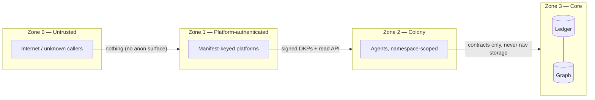

# Security, Privacy & Threat Model

Purpose: the threat model for the boundaries drawn in [brain.architecture.md](brain.architecture.md) §6, and the security policies that keep a knowledge system trusted for 20+ years. Framing premise: Dot.Brain's crown jewel is not data confidentiality alone — it is **integrity of knowledge**. An attacker who *poisons* the graph does more lasting damage than one who reads it.

> **Related documents:** [brain.architecture.md](brain.architecture.md) §6 — the boundaries defended here · [brain.api.md](brain.api.md) — the attack surface · [brain.workflows.md](brain.workflows.md) — the gates and the PR Generator token contract · [brain.dkp.md](brain.dkp.md) — signatures and validation · [brain.memory.md](brain.memory.md) §4.5 — crypto-shredding · [adr/ADR-0002-dkp-signature-scheme.md](adr/ADR-0002-dkp-signature-scheme.md), [adr/ADR-0006-audit-ledger-design.md](adr/ADR-0006-audit-ledger-design.md).

---

## 1. Security objectives, in priority order

1. **Integrity** — knowledge in the graph is what was validly published, transformed only by registered inference; the ledger is unbroken.
2. **Accountability** — every action attributable to a key, an agent, or a human; AI flagging immutable.
3. **Availability** — degraded per [brain.architecture.md](brain.architecture.md) principle 5: fail to "propose nothing", never to "propose unvalidated".
4. **Confidentiality** — classification honored end-to-end; restricted knowledge never crosses to an uncleared platform.

The ordering is deliberate: a brain that is briefly unavailable is inconvenient; a brain that confidently serves poisoned knowledge is catastrophic.

## 2. Trust zones & data classification

Classification levels (carried on every pack, node, edge; most-restrictive propagation per [brain.relationships.md](brain.relationships.md) §6.5): `public` → `ecosystem` (any registered platform) → `restricted` (named platforms) → `sensitive` (named humans + crypto-shredding envelope, [brain.memory.md](brain.memory.md) §4.5). Person-level data is refused at classification review during ingestion — the strongest privacy control is absence. The Revenue Reader enforces this twice: every dot-revenue/v1 response must declare its own classification, and a response exceeding the enrolling platform's manifest-declared `classification_ceiling` is rejected outright, not merely downgraded ([ADR-0018](adr/ADR-0018-cross-platform-read-access.md)).

## 3. Threat model

STRIDE-organized; each threat mapped to its standing control and its detection signal.

| # | Threat | Vector | Controls | Detection |
|---|---|---|---|---|
| T1 | **Knowledge poisoning** | Compromised platform key publishes plausible false packs | Trust scores cap blast radius (new/low-trust sources start 0.50 → low confidence → not recommendable); corroboration required to cross 0.80; CONTRADICTS auto-opens against established knowledge | Contradiction spike per source; `resilience` anomaly triage; Loop A accuracy collapse |
| T2 | **Signature forgery / replay** | Forged or replayed packs | Ed25519 over JCS (ADR-0002); pack IDs are UUIDs, duplicates ack'd as `DKP_DUPLICATE` without re-ingestion; key revocation ≤ 1 validation cycle | `DKP_SIG_INVALID` rate per source |
| T3 | **Ledger tampering** | Insider or compromised core rewrites history | Hash-chained append-only (ADR-0006); external anchor of chain heads (open question §7); T0 zero-RPO replicas | `governance.ledger_integrity_checks_passed` 4/4; any mismatch = incident, not finding |
| T4 | **Rogue agent** | Compromised/misaligned agent escalates | Namespace least-privilege ([brain.agents.md](brain.agents.md)); no self-merge (hard limit); gates non-self-passable; trust/probation; Governance pause switch | `colony.self_merge_violations = 0`; drift audit; override spike |
| T5 | **PR Generator abuse** | The one outbound capability turned malicious | Open-PR-only scoped tokens (no merge/push); render-don't-compose; ledger-before-action; per-platform budgets | Token-scope quarterly audit; platform-side reports; `identity.boundary_violations = 0` |
| T6 | **Classification leak** | Restricted knowledge reaches uncleared platform via inference chains | Most-restrictive edge propagation; Security gate in W4 inspects the *whole* provenance chain, not just the payload; visible redaction markers in API responses | Gate rejection logs; leak drills (2/year within `resilience.drills_passed`) |
| T7 | **Evidence-link abuse** | Leaked capability URL | Single-recommendation scope, receiving platform's classification ceiling, expiry; resolution logging | Anomalous resolution patterns (geo/volume) |
| T8 | **Prompt/content injection** | Malicious instructions embedded in pack free-text fields to steer agent processing | Free text is data, never instructions: agents process packs through schema-typed fields; generative Why-drafting reads only completed evidence chains ([brain.reasoning.md](brain.reasoning.md) §1); rubric review of agent outputs | Testing Agent adversarial golden packs in CI |
| T9 | **Learning-loop manipulation** | Gaming outcomes to shift trust/calibration (e.g., accept-then-revert PRs) | Step caps (±0.05/month); paired metrics; outcomes only from ledger-verified events; frozen floor unlearnable | Quarterly drift audit vs. golden benchmark |
| T10 | **Denial of service** | Ingestion or query flood | Per-key rate limits (`DKP_RATE_LIMITED`, `429`); queue-don't-drop; provenance (Cold) budgeted separately | Gateway saturation alerts → Resilience runbooks |

## 4. Key management

- **One key system ecosystem-wide** ([brain.api.md](brain.api.md) §3): platform Ed25519 keys registered in manifests, used for both publishing and API access.
- Rotation: annual routine, immediate on suspicion; old key marked `rotated` (packs it signed stay valid — signatures are historical facts), new key active after manifest PR merges.
- Revocation: effective at Gateway and API within one validation cycle; revoked-key attempts ledger-logged as security events.
- Brain-internal keys (agent credentials, PR tokens): 90-day rotation, scope-audited quarterly against the [brain.workflows.md](brain.workflows.md) §6 capability list. This list now includes the Revenue Reader's per-platform scoped tokens ([ADR-0018](adr/ADR-0018-cross-platform-read-access.md)) — same rotation and audit cadence, under a distinct token-naming convention from Guardian's health-check tokens so the two are never interchangeable.
- No shared secrets between platforms, ever; key ceremony records live in the ledger.

## 5. Security incident loop

Security incidents are incidents ([brain.resilience.md](brain.resilience.md) owns the machinery): same templates, same blameless review (ADR-0008), same λ = 0 verified lessons — with two additions: the Security Agent co-signs the post-incident review, and lessons with exploit detail get `restricted` classification (the fix propagates ecosystem-wide; the exploit recipe does not).

## 6. Worked example — T1 poisoning attempt, traced

A compromised Dot.Trading-adjacent key publishes 40 plausible packs over three weeks asserting a false correlation between a commodity index and Kolomela output, aiming to steer a Dot.Charts recommendation.

1. Packs validate cleanly (schema, signature — the key is real). Ingested at source trust 0.62.
2. I2 correlation on the claimed relationship fails against Dot.Central's independent data → CONTRADICTS edges open; corroboration factor ×0.70 pins chain confidence at 0.44 — below even provisional. **Nothing recommendable was ever produced.**
3. Contradiction-spike detection (3σ above the source's baseline) triages to the Security Agent; key owner contacted; compromise confirmed; key revoked within the cycle.
4. Loop A: `accuracy` collapse drops the source to 0.31 — even post-recovery, its packs need heavy corroboration for a year (trust rebuilds at ±0.05/month, by design).
5. All 40 nodes retracted (never deleted); the attack pattern becomes a verified lesson and an adversarial golden pack in the Testing Agent's CI suite. The attack made the ecosystem stronger — Manifesto principle 6, applied to an adversary.

## 7. Health metrics

Registered in [brain.metrics.md](brain.metrics.md): `identity.boundary_violations = 0` · `colony.self_merge_violations = 0` · `governance.ethics_gate_bypasses = 0` · `governance.ledger_integrity_checks_passed 4/4` · `resilience.drills_passed 8/8` (includes the two annual leak drills). Also registered (§4.9): `security.key_rotation_compliance` (100% within policy windows) and `security.mean_revocation_latency` (≤ 1 validation cycle, verified not assumed).

---

## Change Log

| Version | Date | Author | Change |
|---|---|---|---|
| 1.0.0 | 2026-08-01 | Brain Document Generator (prompt 03, AI) | Initial threat model: integrity-first objectives, trust zones, 4-level classification, 10 STRIDE threats with controls+detection, key management, poisoning worked example |

## Open Questions

| Question | Owner → Approver |
|---|---|
| External anchoring of ledger chain heads (public timestamping service?) to harden T3 beyond internal replication — needs an ADR | Security Agent → Chief Architect |
| ~~Register `security.key_rotation_compliance` and `security.mean_revocation_latency` in brain.metrics.md §4.9~~ Registered in [brain.metrics.md](brain.metrics.md) §4.9 (1.2.0) | Security Agent → Security Officer |
| ~~Crypto-shredding ADR~~ Resolved 2026-08-01 by [adr/ADR-0009-crypto-shredding-legal-erasure.md](adr/ADR-0009-crypto-shredding-legal-erasure.md) | Security Agent → Chief Architect + Ethics Officer |
