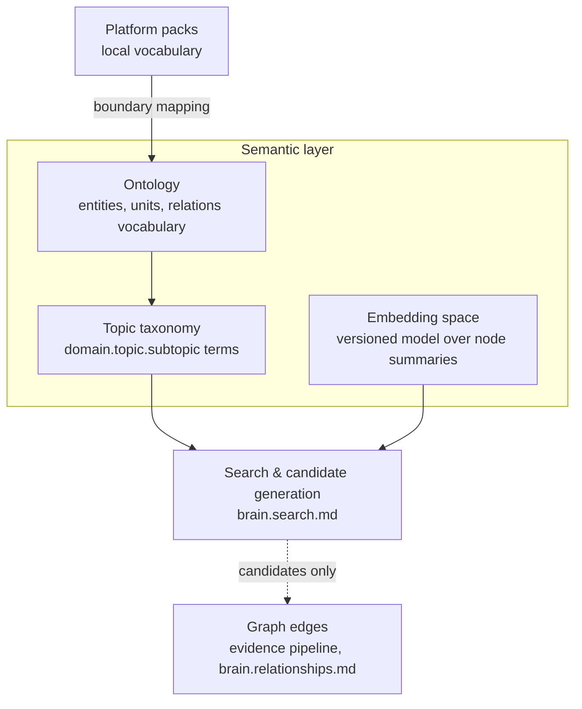

# Semantic Layer & Ontology

Purpose: how the Brain represents *meaning* — the shared vocabulary (ontology), the topic taxonomy that classifies knowledge, and the embedding space that finds it. This document is owed by [brain.search.md](brain.search.md)'s explicit deferral (embedding model as a versioned artifact; ontology alignment) and pays the debt with one governing rule: **similarity suggests, evidence asserts** — nothing produced by this layer ever outranks or bypasses the graph's evidence-based edges.

> **Related documents:** [brain.search.md](brain.search.md) §3 — the semantic index this layer powers · [brain.relationships.md](brain.relationships.md) — the evidence-based edges similarity is subordinate to · [brain.reasoning.md](brain.reasoning.md) — inference rules that may consume (never be replaced by) semantic candidates · [brain.dkp.md](brain.dkp.md) — packs carry taxonomy terms in their payloads · Reasoning + Knowledge Agent charters — co-ownership.

---

## 1. Principles

1. **Similarity suggests, evidence asserts.** Embedding proximity produces *candidates* — for edges, for search results, for duplicate detection. A candidate becomes graph fact only through the normal evidence pipeline; no edge type in [brain.relationships.md](brain.relationships.md) may cite "semantic similarity" as its sole evidence.
2. **The ontology is small and boring.** Shared vocabulary covers what platforms must agree on to interoperate (entities, units, topic terms); everything else stays in platform-local vocabulary mapped at the boundary. Ontology sprawl is a maintenance tax paid forever.
3. **Models are versioned artifacts, not settings.** The embedding model is registered like a schema: pinned version, golden-suite evaluation before adoption, ADR if the model *family* changes, full index rebuild on any swap (per [brain.search.md](brain.search.md) §6 — indexes are disposable, T3).
4. **Meaning drifts; the layer must notice.** Vocabulary and embedding quality are monitored, not assumed — a taxonomy term whose usage diverges from its definition is a contradiction to open, not a quirk to tolerate.

## 2. The three sub-layers

| Sub-layer | Contents | Change control |
|---|---|---|
| **Ontology** | Canonical entity types (platform, tenant, site, asset, person-cohort), unit definitions (SI + declared domain units), the nine edge-type meanings (defined in [brain.relationships.md](brain.relationships.md), referenced here) | PR by Knowledge Agent, Architecture review; additions cheap, renames are supersessions |
| **Topic taxonomy** | Hierarchical terms `<domain>.<topic>.<subtopic>` (e.g., `mining.haulage.cycle_time`) used in DKP payloads and tenant topic naming ([brain.dkp.md](brain.dkp.md) §transport) | Domain agents propose terms in their subtree; Knowledge Agent owns the root; a term used by ≥ 2 platforms is frozen against rename |
| **Embedding space** | One registered model version embedding node summaries (not raw payloads — summaries are classification-safe by construction) | §4 versioning policy |

## 3. Boundary mapping — platform vocabulary stays local

Platforms are not forced onto the ontology; their packs are *mapped* at validation:

1. Payload terms are matched against the taxonomy; exact matches pass through.
2. Unmatched terms get a `SAME_AS` **candidate** (embedding similarity ≥ 0.90 against existing taxonomy terms), routed to the Knowledge Agent — never auto-merged, because false `SAME_AS` merges are the worst graph corruption available (they silently pool evidence across distinct concepts).
3. Terms with no candidate become provisional platform-local terms, visible in search but flagged unmapped; the monthly taxonomy review promotes, maps, or leaves them.

Units are stricter: an unmapped unit fails validation (`DKP_SCHEMA_INVALID`) — quantities without agreed units are not knowledge.

## 4. Embedding model as a versioned artifact

- **Registration:** exactly one active model version, recorded with: model identifier, version, embedding dimension, evaluation scores on the golden query suite, adoption date, and the ADR if it was a family change.
- **Adoption gate:** a candidate model must beat or match the incumbent on `search.relevance_regression_pass_rate` (100% on the golden suite) *and* show no regression on the `SAME_AS`-candidate precision sample before swap.
- **Swap procedure:** full index rebuild (T3, routine per search §6); old and new indexes never serve blended results — the cutover is atomic from the searcher's view.
- **No cross-version comparison:** similarity scores from different model versions are incommensurable; any stored similarity value carries the model version that produced it, and candidates left pending across a swap are recomputed, not carried.

This resolves search's open question on versioning policy; model *selection* got its ADR at first registration, [ADR-0011](adr/ADR-0011-embedding-model-registration.md) (renumbered from a provisional "ADR-0010" once that number was taken by the roster-extension ADR).

## 5. What the semantic layer may and may not do

| Allowed | Forbidden |
|---|---|
| Rank search candidates (blended with confidence/freshness per search §4) | Set or adjust any confidence score |
| Propose `SAME_AS` / `RELATES_TO` candidates for review | Create any edge autonomously |
| Detect near-duplicate packs for the validator | Reject a pack on similarity alone |
| Cluster topics to suggest taxonomy terms | Rename or merge taxonomy terms in use |
| Surface "semantically adjacent but unlinked" node pairs as Research Agent leads | Feed similarity into inference rules I1–I7 as evidence ([brain.reasoning.md](brain.reasoning.md) forbids it — similarity is retrieval, not reasoning) |

## 6. Worked example — the near-miss merge

Dot.Farms packs use "moisture stress"; Dot.Agri-Lab packs use "water deficit stress." Embedding similarity: 0.93 → `SAME_AS` candidate raised.

1. Knowledge Agent review: agronomy definitions differ — moisture stress covers waterlogging *and* deficit; water deficit stress is one-directional. Candidate **rejected**; a `PART_OF` relationship is proposed instead through the normal evidence pipeline (definitional evidence: both platforms' published glossaries).
2. The rejection is logged with the similarity score — the golden `SAME_AS` precision sample gains a hard negative, so the next model evaluation must not re-promote this pair.
3. Counterfactual recorded in the review: had the merge auto-applied, waterlogging observations would have pooled into deficit-irrigation recommendations — evidence corruption invisible until a wrong recommendation shipped. This is why §3 never auto-merges.

## 7. Health metrics

Registered in [brain.metrics.md](brain.metrics.md): `search.relevance_regression_pass_rate` (the adoption gate) · `graph.edge_evidence_completeness = 100%` (no similarity-only edges — the §1 rule is testable). Also registered (§4.9): `semantic.same_as_candidate_precision` (≥ 0.80 on reviewed sample — below means the suggestion threshold or the model is wrong) and `semantic.unmapped_term_ratio` (reviewed monthly, declining — persistent growth means the taxonomy lags the ecosystem's actual domains).

---

## Change Log

| Version | Date | Author | Change |
|---|---|---|---|
| 1.0.0 | 2026-08-01 | Brain Document Generator (prompt 03, AI) | Initial layer spec: similarity-suggests-evidence-asserts rule, three sub-layers, boundary mapping with no-auto-merge rule, embedding versioning policy (resolves search's deferral), allowed/forbidden table, near-miss merge worked example |
| 1.0.1 | 2026-08-01 | DKP Architect (prompt 02, AI) | Both OQs struck: taxonomy root published (schemas/taxonomy.json), embedding model registered (ADR-0011) |
| 1.0.2 | 2026-08-10 | Brain core-doc sweep | §4's own body text still said model selection "still gets its ADR at first registration" — contradicting this same document's 1.0.1 changelog entry and Open Questions, which already record ADR-0011 as resolved. Corrected to match |

## Open Questions

| Question | Owner → Approver |
|---|---|
| ~~Register `semantic.same_as_candidate_precision` and `semantic.unmapped_term_ratio` in brain.metrics.md §4.9~~ Registered in [brain.metrics.md](brain.metrics.md) §4.9 (1.3.0) | Knowledge Agent → Chief AI Engineer |
| ~~First embedding-model registration needs its selection ADR (family, dimension, hosting) — ADR-0010 candidate~~ **Resolved 2026-08-01** by [adr/ADR-0011-embedding-model-registration.md](adr/ADR-0011-embedding-model-registration.md) (renumbered; 0010 taken by the roster extension) | Knowledge Agent → Chief AI Engineer |
| ~~Should the topic taxonomy root be published as a machine-readable artifact (schemas/taxonomy.json) for platform-side validation?~~ **Resolved 2026-08-01:** yes — published as [schemas/taxonomy.json](schemas/taxonomy.json) 1.0.0 | Architecture Agent → Chief Architect |
