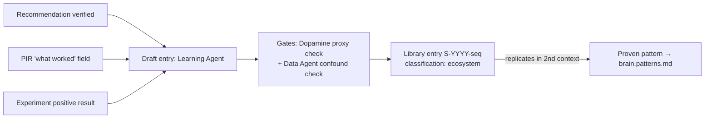

# Success Pattern Library

Purpose: the positive half of the incidents→assets symmetry. [brain.failures.md](brain.failures.md) turns what went wrong into permanent knowledge; this document does the same for what verifiably went *right* — defining what "success" means measurably per stakeholder, and how a win earns entry into the library with the same evidentiary rigor a failure earns entry into the catalog. A success that cannot say what it is measured against, and for whom, is an anecdote, not an asset.

> **Related documents:** [brain.failures.md](brain.failures.md) — the symmetric catalog · [brain.metrics.md](brain.metrics.md) — every success claim resolves against registered IDs · [brain.recommendations.md](brain.recommendations.md) — `verified` outcomes are the library's primary intake · [brain.dopemine.md](brain.dopemine.md) — success definitions are gate-checked against proxy laundering · [brain.learning.md](brain.learning.md) — Loop D propagates patterns.

---

## 1. Principle: a success is a verified prediction, not a good feeling

The library admits **verified outcomes only**: a claim of the form *"we predicted X, recommended Y, Y was adopted, and X materialized within the stated window, measured by registered metric IDs."* Three consequences:

1. **Celebration is not evidence.** Positive sentiment, executive praise, and community enthusiasm are telemetry ([brain.telemetry.md](brain.telemetry.md)) — they may prompt an investigation into *whether* a success occurred, but never constitute one.
2. **The counterfactual is mandatory.** Every entry states what was expected *without* the intervention (baseline, control, or pre-registered forecast). "Things improved after we acted" without a counterfactual is the post-hoc fallacy the confound rules in [brain.analytics.md](brain.analytics.md) exist to kill.
3. **Successes decay; patterns don't get λ=0 for free.** Unlike failure lessons (harm-avoidance is durable), a success pattern is context-bound: it carries normal age decay until it has **replicated in a second independent context**, at which point it is promoted to a *proven pattern* and handed to [brain.patterns.md](brain.patterns.md) with corroborated confidence.

## 2. What success means, per stakeholder

Success is not one number. Each stakeholder's definition, and the registered metrics that make it falsifiable:

| Stakeholder | Success means | Measured by |
|---|---|---|
| **Platform team** (engineer/operator) | A recommendation they adopted made their measured problem smaller | `dkp.recommendation_adoption`, per-recommendation `impact.metrics[]` deltas |
| **Executive Sponsor** | The Brain returns more value than it costs; duplicate effort avoided | Quarterly evolution report ROI line, `analytics.findings_packed_ratio` |
| **Colony** (agents) | Predictions land: confidence was calibrated, trust earned | `colony.trust_score_calibration`, `learning.verified_prediction_rate` (proposed) |
| **Ethics / gates** | Improvement happened *without* guard-metric harm — the conditional-pass proved out | `dopemine.gate_overturn_rate`, guard-metric flatness per entry |
| **End users / community** | Lived outcomes improved, aggregate-verified | Community-distilled packs (n ≥ 20 floor), platform domain metrics |

An entry must name **which stakeholder's definition it satisfies** — a colony win (well-calibrated prediction) that produced no platform value is still library-worthy, but must say so honestly.

## 3. Entry format and intake path

Entry `S-<year>-<seq>` mandatory fields: stakeholder definition satisfied (§2 row) · pre-registered expectation and counterfactual · intervention (recommendation/experiment IDs) · measured delta with registered metric IDs and window · guard metrics checked flat · confounds considered · **replication status** (`single-context` | `replicated` | `refuted`) · transferability hypothesis (where else this should work — the seed for Loop D propagation and I4 analogy transfer in [brain.reasoning.md](brain.reasoning.md)).

Three intake doors, no others: `verified` recommendation outcomes ([brain.recommendations.md](brain.recommendations.md) §4), the mandatory "what worked" field of PIRs ([brain.failures.md](brain.failures.md) — yes, failures feed the success library), and positive experiment results ([brain.experiments.md](brain.experiments.md)). Self-nominated wins with no verified artifact behind them are returned.

## 4. The dopemine boundary

Every entry passes the Dopamine Agent's proxy check before admission: does the claimed success optimize an outcome or a proxy? An entry celebrating "engagement up 30%" with no outcome ancestry is exactly the proxy laundering [brain.dopemine.md](brain.dopemine.md) §3 prohibits — the success library must not become the place where Goodharted wins get institutional memory. Symmetrically, a *refuted* entry (pattern failed on replication) is not deleted: it is re-marked `refuted` and retained, because "this looked like a win and wasn't" is failure-class knowledge filed where future pattern-matchers will look first.

## 5. Worked example — S-2026-001

The wet-season thread, closed on the positive side:

- **Intake:** the Kolomela haul-road recommendation reached `verified` — cycle-time false findings −64% against the E3 experiment's pre-registered −40% expectation ([brain.experiments.md](brain.experiments.md) §5).
- **Entry:** stakeholder = platform team (operator definition); counterfactual = E3 control arm; delta cited by registered domain metric IDs; guard metrics (maintenance backlog, operator workload) flat; confound (seasonal drying) excluded by the experiment window; replication status `single-context`; transferability hypothesis: any Dot.Farms/Dot.Mining site with lateritic haul roads and seasonal rainfall.
- **Dopamine check:** delta is an outcome (false findings against ground truth), not a proxy — pass.
- **Propagation:** Loop D routes the transferability hypothesis to the Sishen site as an I4 analogy candidate at 0.60 transfer factor — *not* as established truth. If Sishen verifies, S-2026-001 flips to `replicated`, gains corroboration, and graduates toward [brain.patterns.md](brain.patterns.md).

One entry, three documents' rigor, zero anecdote.

## 6. Health metrics

Registered (§4.9, 1.4.0): `success.entries_with_counterfactual = 100%` (an entry without one is a defect) and `success.replication_rate` (share of single-context entries tested in a second context within 12 months — an untested library is a scrapbook). `learning.lessons_effective` (shared with failures — the symmetry would be measured symmetrically) and `dkp.recommendation_adoption` (the library's upstream supply) are used above as live concepts but are **not yet registered** in brain.metrics.md — see Open Questions, alongside `learning.verified_prediction_rate` and `colony.trust_score_calibration` (§2).

---

## Change Log

| Version | Date | Author | Change |
|---|---|---|---|
| 1.0.0 | 2026-08-01 | Brain Document Generator (prompt 03, AI) | Initial library: verified-prediction principle, per-stakeholder success definitions, S-entry format with mandatory counterfactual and replication status, three intake doors, dopemine proxy boundary, refuted-entry retention, S-2026-001 example |
| 1.0.1 | 2026-08-10 | Brain core-doc sweep | §6 claimed `learning.lessons_effective` and `dkp.recommendation_adoption` were "Registered in brain.metrics.md" — neither is, anywhere. Corrected and consolidated with the pre-existing `learning.verified_prediction_rate`/`colony.trust_score_calibration` gaps into one Open Questions row |

## Open Questions

| Question | Owner → Approver |
|---|---|
| ~~Register `success.entries_with_counterfactual` and `success.replication_rate` in brain.metrics.md §4.9 (batch now 6 with failures' and operating's)~~ Registered in [brain.metrics.md](brain.metrics.md) §4.9 (1.4.0) | Learning Agent → Chief AI Engineer |
| `learning.verified_prediction_rate` (§2 colony row) is used but unregistered — separate metric or derivable from existing calibration IDs? | Learning Agent → Data Agent |
| Register `learning.lessons_effective`, `dkp.recommendation_adoption`, and `colony.trust_score_calibration` (§2, §6) — all three are used above as if registered but none actually are | Learning Agent → Chief AI Engineer |
| Replication threshold for pattern promotion: is one second context enough, or should high-stakes domains require two? | Learning Agent → Chief AI Engineer |
