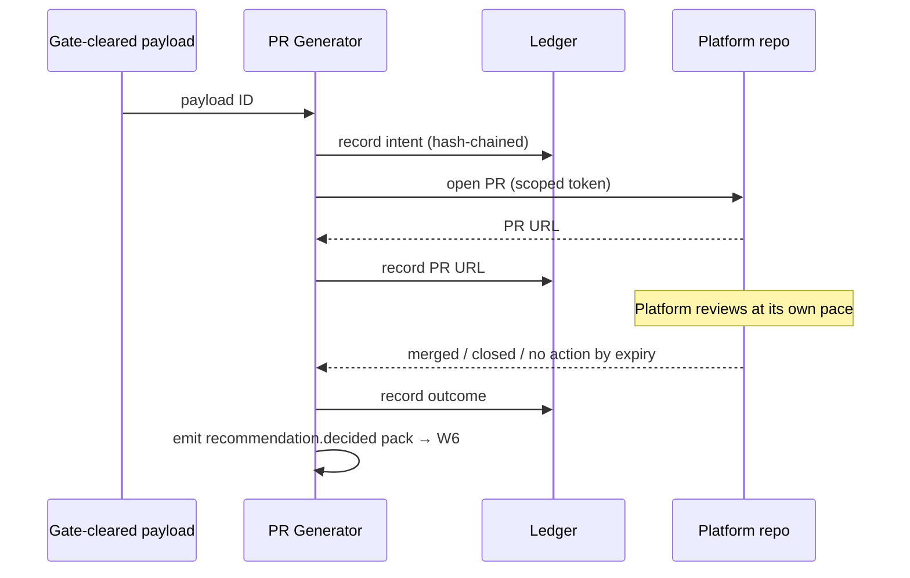

# Ingestion → Reasoning → PR Workflows

Purpose: the operational pipeline specification — how a Knowledge Pack becomes graph knowledge, how knowledge becomes a recommendation, and exactly how the PR Generator (the **only** component that writes outside Dot.Brain) is allowed to act. Where [brain.architecture.md](brain.architecture.md) defines components, this document defines the *sequences, gates, and failure behavior* between them.

> **Related documents:** [brain.architecture.md](brain.architecture.md) §4 — the data flow this operationalizes · [brain.dkp.md](brain.dkp.md) §4, §8 — validation rules and retry semantics · [brain.reasoning.md](brain.reasoning.md) — conclusion production · [brain.governance.md](brain.governance.md) — gates and decision rights · [brain.learning.md](brain.learning.md) §3 — the outcome return path · [schemas/recommendation.schema.json](schemas/recommendation.schema.json) — the payload the PR carries.

---

## 1. Pipeline overview

```mermaid
flowchart LR
    subgraph W1["W1 Ingestion"]
        A[Receive] --> B[Validate] --> C[Ledger + Graph write]
    end
    subgraph W2["W2 Enrichment"]
        D[Auto-edges] --> E[Triage → colony/signals]
    end
    subgraph W3["W3 Reasoning"]
        F[Inference chains] --> G[Conclusion review]
    end
    subgraph W4["W4 Recommendation"]
        H[Build payload] --> I[Gates: Dopamine · Security · Governance]
    end
    subgraph W5["W5 Delivery"]
        J[PR Generator] --> K[Platform decides]
    end
    subgraph W6["W6 Outcome"]
        L[Outcome pack] --> M[Learning loops]
    end
    C --> D
    E --> F
    G --> H
    I --> J
    K --> L
    M -.trust/calibration.-> B
```

Each workflow is independently pausable (Governance kill-switch, [brain.agents.md](brain.agents.md) override table); a paused stage queues, never drops — principle 5 of [brain.architecture.md](brain.architecture.md): fail toward "propose nothing".

## 2. W1 — Ingestion

1. Gateway authenticates the publisher key against the platform manifest; unknown or revoked key → `DKP_AUTH_FAILED`, no queue entry beyond the ledger record of the attempt.
2. Validation runs the full [brain.dkp.md](brain.dkp.md) §4 sequence (schema → JCS canonicalization → Ed25519 → trust lookup → classification). First failure short-circuits with its `DKP_*` code; the publisher retries per §8 semantics (exponential backoff, ≥ 4 h buffering).
3. Accepted pack: ledger entry first (T0), then graph node creation (T1). **Ledger-before-graph is invariant** — a node without a ledger entry is corruption, detected by the quarterly integrity check.
4. SLO: `dkp.ingest_latency_p95 ≤ 15 min` receive→node.

## 3. W2 — Enrichment

Automatic, no judgment: `RELATES_TO` edges from entity/topic matching (assertion 0.60), triage entry into `colony/signals` with domain routing (mining pack → Mining Agent claims). Anything requiring judgment — `SAME_AS` resolution, statistical upgrades — is claimed work for the responsible agent under W3, never inline in the ingest path.

## 4. W3 — Reasoning

Covered by [brain.reasoning.md](brain.reasoning.md); workflow-relevant contract only:
- Inference runs against `retrieve.context` ([brain.memory.md](brain.memory.md) §3) — reasoning never reads storage directly.
- Conclusions at ≥ 0.80 with a complete Why block advance to W4. Provisional conclusions (0.50–0.79) stay internal. I3 causal promotions and I4 analogy candidates park until their human sign-off lands (async — the pipeline does not block on humans; the conclusion waits, ledger-visible).

## 5. W4 — Recommendation gates

Payload assembly per [schemas/recommendation.schema.json](schemas/recommendation.schema.json): confidence, evidence chain, Why block, `impact.metrics[]` (each ID resolving against [brain.metrics.md](brain.metrics.md) — unresolvable ID fails the build, the measure-before-feature gate in mechanical form).

Then three serial gates, each a distinct agent, none self-passable:

| Gate | Agent | Rejects when |
|---|---|---|
| Ethics | Dopamine | Impact optimizes a prohibited engagement metric; manipulative framing; §5 checklist of [brain.governance.md](brain.governance.md) fails |
| Security | Security | Classification leak (payload exposes restricted knowledge to a platform not cleared for it); provenance chain crosses a privacy boundary |
| Governance | Governance | Decision-rights violation (e.g., recommendation exceeding what agents may propose without human co-sign); missing/expired human sign-offs from W3 |

A gate rejection returns the payload to its owning agent with the reason ledger-recorded; two rejections of the same payload escalate to a human. Gates *reject*, they never *edit* — no gate agent can quietly reshape a recommendation.

## 6. W5 — PR Generator (the sole outbound path)

The highest-stakes component gets the narrowest contract:

- **Capability:** per-platform scoped tokens that can open PRs and comment on its own PRs — nothing else. No merge, no push, no issue creation, no repo settings ([brain.architecture.md](brain.architecture.md) §6). Token scopes are audited quarterly against this list.
- **Input:** only gate-cleared W4 payloads, referenced by ID. The generator cannot compose content; it renders.
- **Rendering:** deterministic template — title (`[Dot.Brain] <one-line recommendation>`), body containing the Why block, confidence, evidence links (to Brain's read-only Query API, not raw internals), `impact.metrics[]` with targets, and the expiry date. Body ends with the standing footer: *"Dot.Brain proposes; you decide. This PR expires on <date> and will be recorded either way."*
- **Expiry:** 90 days default (platform manifests may override). Expired = closed by the generator with an `expired` label; counted in `dkp.pr_decision_rate` denominator.
- **Rate limit:** per-platform PR budget from the manifest (default 5 open concurrently) — respect for platform attention is part of autonomy.
- **Ledger:** open, comment, expire, and close events all hash-chained before the external action executes. External action failure (API error) retries with backoff; after 24 h it raises an incident, never silently drops.

## 7. W6 — Outcome return

The generator itself emits the `recommendation.decided` event pack (it is the one component that observes the decision), entering W1 like any other pack — the loop closes through the front door, satisfying [brain.learning.md](brain.learning.md) §3's no-side-channel rule. Realized-impact observations arrive later from the platform's own metric packs and join Loop B.

## 8. Failure matrix

| Failure | Behavior |
|---|---|
| Validation outage | Gateway queues; publishers buffer ≥ 4 h (ADR-0007 expectation); no unvalidated writes ever |
| Graph write fails after ledger write | Replay from ledger (ledger-before-graph makes this safe); T1 RTO 4 h |
| Gate agent unavailable | W4 queues; recommendations delay, never bypass — `governance.ethics_gate_bypasses = 0, always` |
| PR token compromised | Revoke at platform side kills the only capability; blast radius = spurious PRs, all ledger-visible; incident → Loop D |
| Human sign-off stalls > 30 days | Conclusion returns to owning agent to refresh evidence (staleness beats backlog) |

## 9. Health metrics

Registered in [brain.metrics.md](brain.metrics.md): `dkp.ingest_latency_p95 ≤ 15 min` (W1), `dkp.validation_rejection_rate ≤ 10%` (W1), `governance.ethics_gate_bypasses = 0` (W4), `dkp.pr_decision_rate ≥ 80%` / `dkp.pr_acceptance_rate ≥ 40%` (W5–W6), `identity.boundary_violations = 0` (W5 containment). Also registered (§4.9): `workflows.gate_rejection_rate` per gate — persistent near-zero suggests gates are rubber stamps, persistent high suggests upstream miscalibration; both are findings.

---

## Change Log

| Version | Date | Author | Change |
|---|---|---|---|
| 1.0.0 | 2026-08-01 | Brain Document Generator (prompt 03, AI) | Initial spec: six-workflow pipeline, three-gate recommendation review, PR Generator contract (scoped tokens, deterministic rendering, expiry, ledger-before-action), failure matrix |
| 1.0.1 | 2026-08-10 | Brain core-doc sweep | §9 still said `workflows.gate_rejection_rate` was "Proposed pending registration" despite the Open Questions section immediately below already recording it as resolved and registered — corrected to match |

## Open Questions

| Question | Owner → Approver |
|---|---|
| ~~Register `workflows.gate_rejection_rate` in brain.metrics.md~~ Resolved 2026-08-01: registered in [brain.metrics.md](brain.metrics.md) §4.9 | Architecture Agent → Chief Architect |
| Should platforms be able to subscribe to pre-PR "draft advisory" notifications (lower ceremony than a PR) without weakening the ledger trail? | Registry Agent → Chief Knowledge Engineer |
| PR budget default (5 concurrent) — evidence-based tuning once `dkp.pr_decision_rate` data exists | Data Agent → Chief Knowledge Engineer |
