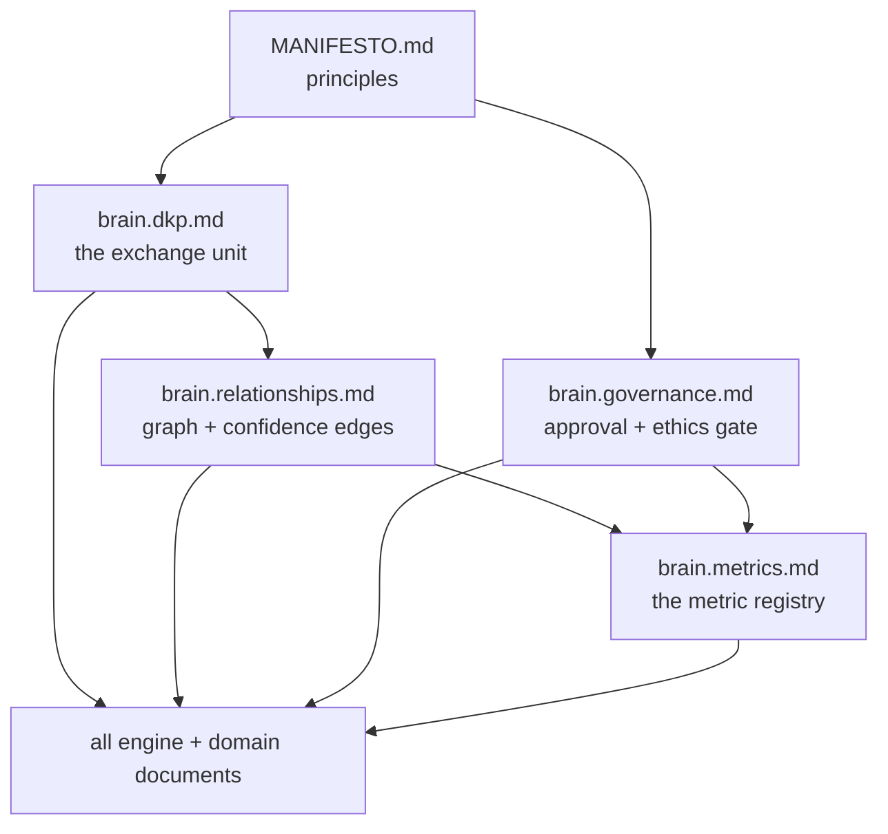

# CROSSREF — Cross-Reference Map

Purpose: the dependency map between documents — what each document *defines* for others and *consumes* from others. Direction convention: **"defines for" means the arrow's target must change if this document changes.** Use this before editing anything: the "defines for" column is your blast radius.

> **Related documents:** [INDEX.md](INDEX.md) — persona navigation · [GLOSSARY.md](GLOSSARY.md) — term canon · [../README.md](../README.md) — ownership matrix.

---

## 1. The dependency spine

Five documents anchor everything; edit these with maximum care:

## 2. Per-document reference table

| Document | Defines (canonical) for | Consumes (defers) from |
|---|---|---|
| [../MANIFESTO.md](../MANIFESTO.md) | Six principles — cited by every document | — |
| [../README.md](../README.md) | Ownership matrix, repo tree | brain.agents (roster) |
| [../brain.identity.md](../brain.identity.md) | Boundary model ("Brain proposes, platforms decide") | MANIFESTO |
| [../brain.dkp.md](../brain.dkp.md) | Pack format, signatures, versioning, DKP_* error codes, node confidence | ADR-0002 (signature scheme), ADR-0003 (dual semver), brain.security (classification) |
| [../brain.relationships.md](../brain.relationships.md) | 9 edge types, edge confidence, causal bar §4.2, coherence rules | brain.dkp (node confidence), ADR-0004 (conflict threshold) |
| [../brain.agents.md](../brain.agents.md) | 24-agent roster, trust scores, lifecycle, §8c gate-rejection example | brain.governance (approval tiers), agents/*.charter.md |
| [../brain.governance.md](../brain.governance.md) | Approval tiers T0–T4, §5 ethics-gate checklist, §6 compliance floors (n ≥ 20) | brain.security §2 (classification names), ADR-0006/0008/0009 |
| [../brain.resilience.md](../brain.resilience.md) | Incident/lesson lifecycle, drills | ADR-0007 (tiers), brain.telemetry (golden signals), brain.learning Loop D |
| [../brain.platforms.md](../brain.platforms.md) | Registry + onboarding invariant | brain.dkp, platforms/*.md (pending) |
| [../brain.metrics.md](../brain.metrics.md) | Every brain-level metric ID, target, namespace; §5 anti-gaming | brain.dopemine (prohibition policy), brain.telemetry (promotion path), all §4.9/§4.10 source docs |
| [../brain.architecture.md](../brain.architecture.md) | 4-layer model, component matrix, security boundaries | ADR-0007 (tier mapping), brain.events §5 (PR-outcome path) |
| [../brain.reasoning.md](../brain.reasoning.md) | I1–I7 inference rules, forbidden inferences, Why-block synthesis | brain.relationships (causal bar), brain.semantic §5 (similarity ban) |
| [../brain.learning.md](../brain.learning.md) | Loops A–D, guardrails, frozen floor | brain.dkp (outcome packs, DKP_REF_MISSING), brain.agents (trust formula) |
| [../brain.memory.md](../brain.memory.md) | Hot/Warm/Cold tiers, retrieval contracts, forgetting + never-forget set | ADR-0009 (erasure), ADR-0007 (recovery tiers) |
| [../brain.workflows.md](../brain.workflows.md) | W1–W6 pipeline, W4 gates, W5 PR Generator, ledger-before-* invariants | brain.governance §5 (gate checklist), brain.dopemine (gate policy), brain.api (tokens) |
| [../brain.api.md](../brain.api.md) | Endpoint contracts, capability URLs, API_* codes, §5 persona renderings | brain.personas (catalog), brain.security (classification filter) |
| [../brain.security.md](../brain.security.md) | Classification levels §2, STRIDE threats, key management | ADR-0002 (signatures), ADR-0006 (ledger), brain.telemetry (detection signals) |
| [../brain.events.md](../brain.events.md) | Event naming, envelope (occurred/observed), sequence counters, PR-outcome path decision | brain.dkp (transport), brain.telemetry (bus envelope reuse) |
| [../brain.search.md](../brain.search.md) | Retrieval modes, blending, freshness SLO, retrieval explanations | brain.semantic §4 (embedding versioning), brain.relationships (traversal), ADR-0007 (T3 indexes) |
| [../brain.semantic.md](../brain.semantic.md) | Ontology, topic taxonomy, embedding versioning §4, SAME_AS no-auto-merge, allowed/forbidden §5 | brain.relationships (edge canon), brain.search (golden suite) |
| [../brain.telemetry.md](../brain.telemetry.md) | Signal catalog, golden-signal definitions, retention/classification defaults, promotion gate §4 | brain.metrics §2 (the boundary), brain.dopemine (gate check in promotion), brain.memory (tiers), ADR-0009 |
| [../brain.analytics.md](../brain.analytics.md) | Analysis-product catalog, packing rule, confound mandate | brain.telemetry, brain.metrics §5 (Goodhart), brain.reasoning (no causal shortcut), brain.community §3 (floor) |
| [../brain.dopemine.md](../brain.dopemine.md) | Prohibited/preferred metric lists §2, proxy-laundering trace §3, gate-outcome learning | brain.governance §5 (checklist canon), brain.metrics §5, brain.agents §8c |
| [../brain.community.md](../brain.community.md) | Distillation pipeline, floor operationalization §3, reputation ≠ trust §4 | brain.governance §6 (floor canon), brain.dopemine (contribution-quality target), agents/community.charter.md |
| [../brain.cushion.md](../brain.cushion.md) | Cushion dimension registry, no-fabrication rule, shared UI pattern | — (deliberately standalone; distinct scope from brain.resilience, see brain.cushion.md's own boundary note) |
| [../brain.market_intelligence.md](../brain.market_intelligence.md) | Fact hierarchy, research-memory schema, reuse-before-research cost discipline, robots.txt/no-credential-bypass governance | brain.governance (escalation pattern reused, not a hard dependency) |
| [../brain.personas.md](../brain.personas.md) | Persona catalog + rendering contracts, extension procedure | brain.api §5 (serving surface), brain.learning Loop C (template evolution), brain.security §3 (persona ≠ permission) |
| [../brain.recommendations.md](../brain.recommendations.md) | Recommendation object, decision lifecycle, quality bar, terminal-state learning table | brain.workflows §5–7 (gates/delivery/outcome), brain.reasoning (anchoring conclusions), brain.api §4 (evidence links), brain.dopemine (target/guard rules), brain.metrics §1 (impact-block gate) |
| [../brain.experiments.md](../brain.experiments.md) | Pre-registration protocol, E1–E4 classes, evidence-class ranking, stopping rules | brain.metrics §1 (metric pre-registration), brain.reasoning I3 (result consumption), brain.governance (approval tiers + gates), brain.community §3 (E4 floor) |
| [../brain.evolution.md](../brain.evolution.md) | Four-layer change hierarchy, evolution/drift boundary, roster add/retire/split rules, versioned-artifact upgrade template | brain.experiments (E1/E2 test bench), brain.learning §6 (guardrails, golden-pack replay), ADR-0005 (roster precedent), brain.semantic §4 (upgrade pattern) |
| [../brain.failures.md](../brain.failures.md) | Failure taxonomy (F-KNOW…F-BOUND), blameless record format, verified-lesson promotion (λ=0 earned) | brain.resilience (incident lifecycle), ADR-0008 (blameless canon), brain.learning Loop D (propagation), brain.memory (never-forget set) |
| [../brain.operating_model.md](../brain.operating_model.md) | Nine-role human catalog, cadence table, escalation paths, colony-orientation guide | brain.governance (decision rights), brain.agents (roster), brain.learning Loop B (override weighting), brain.recommendations (expiry-is-an-answer) |
| [../brain.success.md](../brain.success.md) | Per-stakeholder success definitions, S-entry format (mandatory counterfactual, replication status), pattern-promotion path | brain.recommendations (verified outcomes intake), brain.failures (what-worked intake, symmetry), brain.experiments (positive results), brain.dopemine §3 (proxy check) |
| [../brain.patterns.md](../brain.patterns.md) | Proven-pattern format (applicability conditions, context sentinels), success/lesson/pattern boundary, retirement rules | brain.success (replicated S-entries intake), brain.relationships (corroboration/decay), brain.reasoning I4 (fallback grade), brain.evolution (ledgered retirement) |
| [../brain.business.md](../brain.business.md) | Quarterly ROI model, duplicate-effort-avoided honesty rules, value-chain proposals, no-metering exchange economics | brain.success (verified value numerator), brain.operating_model §3 (human cost side), brain.recommendations (impact declarations), agents/business.charter.md (calibration targets) |
| [../brain.design.md](../brain.design.md) | Calm-technology principles, surface standards (Why blocks/dashboards/notifications/reports), persona token-variant rendering | brain.personas §3 (contracts expressed), brain.dopemine (prohibitions restated positively), brain.learning Loop C (measurement boundary), brain.experiments E2 (design changes) |
| [../brain.vision.md](../brain.vision.md) | Five falsifiable stages with arrival evidence, anti-goals, quasi-frozen governance | MANIFESTO (principles served), brain.identity (destination link), brain.business §2 (crossover prediction), [../brain.future.md](../brain.future.md) (dated horizons) |
| [../brain.future.md](../brain.future.md) | Five dated horizons with sequencing rationale, rule-bound re-planning, extension surface and explicit non-reservations | brain.vision §2 (stage order constraint), brain.evolution §5 (entry mechanics), brain.business §2 (crossover date), brain.platforms (onboarding path) |

## 3. Hard invariants and where they're enforced

| Invariant | Defined in | Enforced at |
|---|---|---|
| Ledger before graph / before action | brain.workflows | W1, W5 |
| Reject never edit (gates) | brain.workflows §5 | W4 |
| Engagement metrics never targets | brain.dopemine §2 | W4 gate, DKP_DOPAMINE_METRIC_PROHIBITED at ingestion, telemetry promotion gate |
| n ≥ 20 aggregation floor | brain.governance §6 | community distillation, analytics cohorts, interaction telemetry |
| Reputation never sets trust | brain.community §4 | quarterly Governance audit |
| Similarity never sole evidence | brain.semantic §1 | edge validation (`graph.edge_evidence_completeness = 100%`) |
| Persona changes depth, not truth | brain.personas §1 | /v1/why rendering |
| Metrics registered before features | brain.metrics §1 | recommendation schema, experiment gate, Testing Agent sweep |
| No agent approves its own work | brain.agents | `colony.self_merge_violations = 0` |
| Lessons never decay | brain.learning Loop D | λ = 0, never-forget set |

## 4. Pending documents and who is waiting on them

| Pending | Blocked/waiting references |
|---|---|
| ~~platforms/*.md~~ **Complete (21 of 21, F-06 closed 2026-08-01)** | platform registry §4.8 domain-metric homes — dot-farms, dot-mines, dot-central, dot-emall, dot-billing, dot-analytics, dot-dopemine, dot-pulse, dot-notify, dot-hr, dot-ehail, dot-auction, dot-projects, dot-tasks, dot-charts, dot-finance, dot-plug, dot-memory, dot-agents, dot-design, dot-brain |

---

## Change Log

| Version | Date | Author | Change |
|---|---|---|---|
| 1.0.0 | 2026-08-01 | Brain Document Generator (prompt 03, AI) | Initial map: dependency spine, 25-document reference table, 10 hard invariants with enforcement points, pending-document ledger (closes F-04, part 2) |
| 1.0.1 | 2026-08-01 | Brain Document Generator (prompt 03, AI) | brain.recommendations.md published: row added to §2, struck from §4 |
| 1.0.2 | 2026-08-01 | Brain Document Generator (prompt 03, AI) | brain.experiments.md published: row added to §2, struck from §4 |
| 1.0.3 | 2026-08-01 | Brain Document Generator (prompt 03, AI) | brain.evolution.md published: row added to §2, removed from §4 |
| 1.0.4 | 2026-08-01 | Brain Document Generator (prompt 03, AI) | brain.failures.md published: row added to §2, removed from §4 |
| 1.0.5 | 2026-08-01 | Brain Document Generator (prompt 03, AI) | brain.operating_model.md published: row added to §2, removed from §4 |
| 1.0.6 | 2026-08-01 | Brain Document Generator (prompt 03, AI) | brain.success.md published: row added to §2, removed from §4 |
| 1.0.7 | 2026-08-01 | Brain Document Generator (prompt 03, AI) | brain.patterns.md published: row added to §2, removed from §4 |
| 1.0.8 | 2026-08-01 | Brain Document Generator (prompt 03, AI) | brain.business.md published: row added to §2, removed from §4 |
| 1.0.9 | 2026-08-01 | Brain Document Generator (prompt 03, AI) | brain.design.md published: row added to §2, removed from §4 |
| 1.0.10 | 2026-08-01 | Brain Document Generator (prompt 03, AI) | brain.vision.md published: row added to §2, removed from §4 |
| 1.0.11 | 2026-08-01 | Brain Document Generator (prompt 03, AI) | brain.future.md published: row added to §2, removed from §4. All brain.* documents now live — only platforms/ (F-06) remains pending |
| 1.0.12 | 2026-08-01 | Platform Integrator (prompt 05, AI) | F-06 begun: platforms/dot-farms.md and platforms/dot-mines.md published; pending ledger updated to 19 remaining |
| 1.0.13 | 2026-08-01 | Platform Integrator (prompt 05, AI) | platforms/dot-central.md published; loop-latency contract canonicalized there; 18 remaining |
| 1.0.14 | 2026-08-01 | Platform Integrator (prompt 05, AI) | platforms/dot-emall.md published; 17 remaining |
| 1.0.15 | 2026-08-01 | Platform Integrator (prompt 05, AI) | platforms/dot-billing.md published; settlement-latency seam canonicalized there; 16 remaining |
| 1.0.16 | 2026-08-01 | Platform Integrator (prompt 05, AI) | platforms/dot-analytics.md published; chain-view composition rules live there; 15 remaining |
| 1.0.17 | 2026-08-01 | Platform Integrator (prompt 05, AI) | platforms/dot-dopemine.md published; prohibited-metric list canonicalized there; 14 remaining |
| 1.0.18 | 2026-08-01 | Platform Integrator (prompt 05, AI) | platforms/dot-pulse.md published; discussion privacy gate lives there; 13 remaining |
| 1.0.19 | 2026-08-01 | Platform Integrator (prompt 05, AI) | platforms/dot-notify.md published; consent-scope and no-absence-trigger contracts live there; 12 remaining |
| 1.0.20 | 2026-08-01 | Platform Integrator (prompt 05, AI) | platforms/dot-hr.md published; four-tier PII field register and inference-resistance check live there; 11 remaining |
| 1.0.21 | 2026-08-01 | Platform Integrator (prompt 05, AI) | platforms/dot-ehail.md published; spatial-first publication discipline lives there; 10 remaining |
| 1.0.22 | 2026-08-01 | Platform Integrator (prompt 05, AI) | platforms/dot-auction.md published; listing-vs-lot handoff contract lives there; 9 remaining |
| 1.0.23 | 2026-08-01 | Platform Integrator (prompt 05, AI) | platforms/dot-projects.md and dot-tasks.md published (paired); phased-vs-recurring boundary canonical in dot-projects §1; 7 remaining |
| 1.0.24 | 2026-08-01 | Platform Integrator (prompt 05, AI) | platforms/dot-charts.md published; bidirectional compliance gate and MNPI boundary live there; 6 remaining |
| 1.0.25 | 2026-08-01 | Platform Integrator (prompt 05, AI) | platforms/dot-finance.md published; three-way money boundary and regulatory watch live there; 5 remaining |
| 1.0.26 | 2026-08-01 | Platform Integrator (prompt 05, AI) | platforms/dot-plug.md published; third-party boundary and host-manifest inheritance live there; 4 remaining |
| 1.0.27 | 2026-08-01 | Platform Integrator (prompt 05, AI) | platforms/dot-memory.md published; retrieval SLA contract and straggler-metric homes live there; 3 remaining |
| 1.0.28 | 2026-08-01 | Platform Integrator (prompt 05, AI) | platforms/dot-agents.md published; colony runtime contract and agent-assignment record live there; 2 remaining |
| 1.0.29 | 2026-08-01 | Platform Integrator (prompt 05, AI) | platforms/dot-design.md published; token-consumption contract and four inherited-OQ resolutions live there; 1 remaining |
| 1.0.30 | 2026-08-01 | Platform Integrator (prompt 05, AI) | platforms/dot-brain.md published; self-knowledge rules live there. F-06 complete — platforms/*.md ledger entry closed at 21 of 21 |
| 1.0.31 | 2026-08-01 | Repository Reviewer (prompt 07, AI) | Post-F-06 sweep: agent assignments promoted to brain.agents.md §1.1; 8 resolved OQs struck across brain.memory.md and 7 platform docs; GLOSSARY Charts disambiguation added |
| 1.0.32 | 2026-08-01 | Agent Colony Architect (prompt 04, AI) | F-07-01/F-07-04 cleared: four charters authored (people, logistics, delivery, extension), Marketplace narrowed, ADR-0010 added, roster 24 → 28 |
| 1.0.33 | 2026-08-01 | DKP Architect (prompt 02, AI) | F-07-02/F-07-06 cleared: schemas/taxonomy.json published (four consumer OQs struck), ADR-0011 embedding-model registration added |
| 1.0.34 | 2026-08-01 | Repository Reviewer (prompt 07, AI) | Second consecutive review: F-07-05 fixed (patterns condition-family queue), README matrix co-ownership noted; no blockers, all dimensions ≥ 4 — **repository declared internally consistent; cadence shifts to quarterly maintenance** |
| 1.0.35 | 2026-08-08 | Truth-reconciliation pass | brain.cushion.md and brain.market_intelligence.md published outside the quarterly-maintenance cadence (real work, not a scheduled document): rows added to §2 |

## Open Questions

| Question | Owner → Approver |
|---|---|
| Should this map be generated/verified by a CI link-checker rather than maintained by hand? | Repository Steward Agent → Chief Architect |
