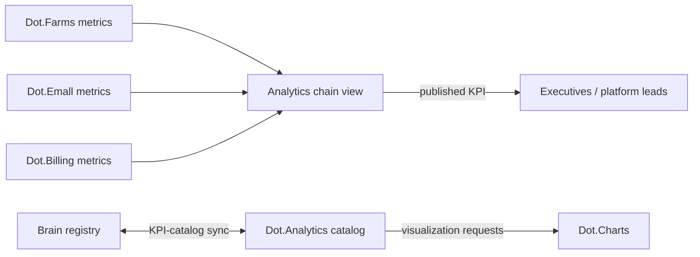

# Dot.Analytics

> **Platform-owned source:** [Dot.Analytics's wiki.md](https://github.com/sakhilebhayi/Dot.Analytics/blob/main/wiki.md) — the platform's own knowledge home. This document is Dot.Brain's ingested view; the wiki is authoritative for what the platform actually is.

## 1. Purpose & Business Domain

Business intelligence and KPI reporting across the ecosystem. Owns the reporting domain: KPI definitions as published to humans, dashboard products, and cross-platform composite views. Analytics does not own any operational data — every number it shows is derived from a metric owned elsewhere; its distinct contribution is *composition* (chain-level views, §6) and *presentation* (per brain.design.md). The boundary with the Brain itself matters most here: the Brain reasons over evidence; Analytics reports agreed KPIs. The KPI-catalog sync (§7 of the registry's gap column) is this document's closure.

## 2. Entities Owned

| Entity | Graph node type | Natural key | Notes |
|---|---|---|---|
| KPI definition | `entity:asset` | `kpi:<domain>:<name>` | Human-facing definition, always mapped to a source metric ID |
| Dashboard product | `entity:asset` | product ID | Question-shaped per design §4 |
| Composite view | `entity:asset` | view ID | Multi-platform assemblage, e.g. the chain view (§6) |
| View-usage observation | `observation` | product + window | Aggregate audience only |
| Reporting-accuracy outcome | `outcome` | KPI + period | Restated vs. first-published figures |

## 3. Events Emitted

| Event | Trigger | Consumers | Frequency |
|---|---|---|---|
| `analytics.kpi.published/restated` | KPI period close / correction | Brain ingestion, subscribing platforms | monthly cycles |
| `analytics.view.created/retired` | Composite-view lifecycle | Brain, Dot.Design | low |
| `analytics.catalog.synced` | KPI-catalog sync run (§7) | Brain registry, Dot.Charts | daily |

## 4. Knowledge Packs Published

| Payload type | Cadence | Example pack ID |
|---|---|---|
| observation (KPI-period aggregates, view-usage) | monthly / weekly | `dkp:analytics:obs:2026-07-01:0009` |
| insight (cross-KPI correlation findings) | per finding | `dkp:analytics:ins:2026-05-12:0001` |
| outcome (restatement / accuracy verifications) | per period | `dkp:analytics:out:2026-07-05:0002` |
| incident (reporting errors, restatements above threshold) | per incident | `dkp:analytics:inc:2026-04-02:0001` |

Analytics insights carry an inherited-provenance obligation: a cross-KPI correlation pack must cite the source platforms' pack IDs in its W5 chain, so graph confidence composes from the originals rather than restarting at Analytics' trust score.

## 5. Intelligence Consumed

| Recommendation type | Metric expected to move | Baseline |
|---|---|---|
| Dashboard rationalization (retire unused views) | `analytics.view_utilization_rate` | 2026 H1 |
| KPI-definition drift alerts | `analytics.restatement_rate` | 2026 H1 |
| Composite-view composition suggestions (which owned segments answer an executive question) | `analytics.view_utilization_rate` | per view |

## 6. Cross-Platform Relationships & the Chain View



**The harvest→payout chain view (delegated by Billing §6):** Analytics owns the composite `analytics.view:value-chain:agri` assembling four owned segments — Farms' `agriculture.harvest_logistics_delay_p50` and `produce_time_to_market_p50`, Emall's `commerce.listing_time_to_first_order_p50`, Billing's `finance.settlement_latency_p95` and `payout_delay_p50`. Composition rules: each segment cites its owning platform's metric ID unchanged (no re-derivation); the chain total is a *view*, never a new registered metric; a segment owner's restatement automatically restates the chain. This is the pattern for all future chain views — Analytics composes, never re-measures.

## 7. Tenancy Model & KPI-Catalog Sync (registry gap closed)

Tenant key = subscribing organization; views scoped per tenant, cross-tenant composites only from `ecosystem`-classified aggregates, floors inherited from each source platform (Analytics never relaxes a source floor — the strictest input floor governs the composite).

**KPI-catalog sync contract:** every Analytics KPI definition must map 1:1 to a registered metric ID (brain.metrics.md §4.8/§4.9 or a platform doc §11). Daily sync job diffs the catalog against the registry both ways: a KPI with no registered source metric is a **defect** (blocked from publication); a registered metric with no KPI is fine (not everything is reported). Renames and definition changes flow registry → catalog only; Analytics may not fork a definition. Sync results emitted as `analytics.catalog.synced` with a drift count; drift > 0 for two consecutive runs opens an F-KNOW incident.

## 8. Dopamine Surface

Shares: view-utilization and restatement-rate performance (its own product quality). Withheld: viewer leaderboards, "most-watched dashboard" rankings, per-user viewing streaks — attention to a dashboard is not an outcome, and rewarding it would manufacture exactly the busy-but-off-course failure vision's anti-goals name.

## 9. Active Recommendations

Maintained by the Registry Agent. Current: dashboard rationalization `open` (12 candidate views, expiry 2026-09-15); chain-view composition for the agri value chain `verified` — see §13.

## 10. Incident History Summary

One incident pack (2026-04): a KPI published from a stale metric definition after a registry rename — F-KNOW; direct cause of the sync contract in §7 (registry→catalog one-way flow, drift-count alarm). No consumed incidents yet.

## 11. Domain Metrics (registered per brain.metrics.md §4.8)

| ID | Type | Definition |
|---|---|---|
| `analytics.catalog_drift_count` | count | KPIs without a registered source metric, per sync run — target 0 |
| `analytics.restatement_rate` | ratio | Restated KPI-periods / published KPI-periods, quarterly |
| `analytics.view_utilization_rate` | ratio | Views opened by ≥ 1 intended audience member in period / active views |

## 12. Manifest (platform.dkp.json example)

```json
{
  "platform_id": "dot-analytics",
  "dkp_version": "1.0.0",
  "signing_key_ref": "vault://keys/dot-analytics/dkp-signing/v1",
  "publishes": ["observation", "insight", "outcome", "incident"],
  "subscribes": ["dashboard-rationalization", "kpi-drift-alert", "view-composition"],
  "schemas": { "knowledge-pack": "1.0.0", "metric": "1.0.0" },
  "default_classification": "ecosystem",
  "tenancy": {
    "key": "org_id",
    "aggregation_floor": 20,
    "floor_inheritance": "strictest-source"
  }
}
```

## 13. Worked round-trip

The value chain's final link — the view that makes the first three links visible:

1. **Pack:** `dkp:analytics:obs:2026-07-01:0009` — view-usage aggregates plus the assembled agri chain view's first full period; every segment cites its source pack ID (Farms/Emall/Billing outcome packs from the three prior round-trips), so W5 provenance composes.
2. **Validation → graph:** composite-view node linked to all five source metrics; the Brain can now see the chain end-to-end without any platform owning another's segment.
3. **PR back:** view-composition — add Billing's `payout_delay_p50` as the chain's terminal segment (it was initially drafted ending at settlement); confidence 0.81, impact `analytics.view_utilization_rate` for the chain view, guard `analytics.restatement_rate` flat.
4. **Outcome:** `dkp:analytics:out:2026-07-05:0002` — chain view opened by all four intended executive audiences in its first period; utilization 1.0 for the cohort; zero restatements. The 2026 wet-season story — harvest to payout, four platforms, three verified interventions — is now one legible view.

## Verified Infrastructure State (2026-08-07)

Confirmed directly against the real repo during the ecosystem-wide standardization + code-quality pass (full 26-platform summary: [brain.platforms.md](../brain.platforms.md) change log, v1.0.21):

- **Legal/branding/auth** — branded Markdown-mail theme, complete POPIA-aligned Privacy Policy/Terms/Cookie Policy naming **BluePin Inc**, guest auth pages restyled to match the welcome-page hero.
- **Laravel Boost** — `laravel/boost` ^2.5 installed; `.mcp.json`/`boost.json`/`CLAUDE.md` guideline block in place.
- **Code-quality pass** — Pint: 146 files reformatted, formatting-only. `composer audit`: patched 6 `league/commonmark` DoS advisories. `npm audit`: patched a moderate postcss path-traversal advisory. Full suite reconfirmed green (494 tests / 487 passed / 1070 assertions) after every change. (Ran on the `feature/ecosystem-sso` branch, consistent with the rest of this platform's recent work.)

## Autonomy Classification (brain.autonomy.md)

Per [brain.autonomy.md](../brain.autonomy.md) §2. Audited against the real codebase at `~/Dot/Dot.Analytics` on 2026-08-08 — not aspirational.

### Level 1 — Autonomous

- **Scheduled intelligence-engine runs** — `routes/console.php` schedules `analytics:run-engines` (`App\Console\Commands\RunIntelligenceEnginesCommand`) every 6 hours via `Schedule::command(...)->everySixHours()->withoutOverlapping()->onOneServer()`. It queries all teams and dispatches `App\Jobs\Analytics\RunIntelligenceEngineJob` per team/engine with no owner approval gate. Routine analytics/monitoring, matches the §2 Level 1 example list directly.
- **Executive briefing generation** — `routes/console.php` schedules `analytics:briefings` (`App\Console\Commands\GenerateBriefingsCommand`) daily at 06:00, weekly on Mondays at 06:30, and monthly on the 1st at 07:00. It calls `App\Actions\Analytics\GenerateExecutiveBriefingAction`, which queues `App\Jobs\Analytics\GenerateExecutiveBriefingJob` — an AI-generated summary written to `ExecutiveBriefing` records. Runs and publishes unattended; routine reporting.
- **Business DNA recompute** — `routes/console.php` schedules `analytics:recompute-dna` (`App\Console\Commands\RecomputeDnaCommand`) daily at 02:00, calling `App\Services\BusinessDnaService::computeForTeam()` for every team and dispatching `App\Jobs\Analytics\ComputeBusinessDnaJob`. Pure computation over already-ingested data, no external side effect.
- **Platform-snapshot ingestion** — `App\Jobs\Analytics\IngestPlatformSnapshotJob` (queued, not scheduled directly — dispatched on data-source events) validates payload quality and writes `AnalyticsSnapshot` rows. No owner involvement; read-and-record only.
- **Anomaly detection** — `App\Services\AnomalyDetectionService::detectForTeam()` runs Z-score and IQR checks over `ComputedMetric` history and automatically creates `AnalyticsAlert` records surfaced in the alerts panel. It only ever writes an alert for a user to see inside their own account — it takes no action against any system or account outside the tenant, so it clears the platform-operator bar for Level 1 (it is not "self-service"; there is no cross-account or infrastructure effect at all).
- **KPI-catalog sync** — the platform doc (§7) describes a daily `analytics.catalog.synced` job diffing the KPI catalog against the registry and blocking publication on drift; this is Analytics' own accepted knowledge doc, not something re-verified line-by-line against a scheduler entry in this audit, but it is consistent with the real `routes/console.php` scheduling pattern already confirmed above (dispatch-and-publish with no approval step) and involves no spend, contract, or irreversible action.

### Level 2 — Escalate

None found. Checked `app/Jobs/Analytics/*`, `app/Console/Commands/*`, `app/Services/*`, and `app/Http/Controllers/**` for anything that prepares an action and stops short of executing it pending owner approval (the defining Level 2 shape: Context → Evidence → Risk → Recommendation → Proposed Action). Nothing in the real code halts for approval — every automated pipeline found (engines, briefings, DNA, ingestion, anomaly alerts) runs straight through to completion. The closest candidate, the KPI-catalog drift check (§7), auto-blocks publication and opens an incident on its own rather than routing a proposal to a human for a yes/no — that is automated remediation, not an escalation gate, so it does not qualify either.

### Level 3 — Human Control

- **Deploys / CI pipeline** — `.github/workflows/ci.yml` runs tests, PHPStan, `composer audit`, and a Docker build (`Dockerfile`, `production` target) on push/PR to `main`/`develop`/`feature/**`, but the workflow only builds (`push: false`); there is no CD step that ships to production, no `fly.toml`/`Procfile`/deploy script in the repo. Every release is a manual, human-executed step outside this codebase.
- **Credential / signing-key rotation** — the platform manifest (§12, `platform.dkp.json`) references `signing_key_ref: vault://keys/dot-analytics/dkp-signing/v1`; no rotation job, command, or automated key-management code exists anywhere under `app/Console`, `app/Jobs`, or `app/Services`. Rotation is manual and external to the repo.
- **Auth/permission boundary changes** — `app/Policies/{TeamPolicy,DataSourcePolicy,CrossPlatformInsightPolicy}.php` and `auth:sanctum` middleware (`routes/api.php`) gate every API route, but editing these files, granting roles, or provisioning tenant access is a manual code/deploy change — no self-modifying authorization code exists.
- **Security-header / CSP policy changes** — `app/Http/Middleware/SecurityHeaders.php` hardcodes the CSP, HSTS, and permissions-policy values; changing them requires a manual code edit and deploy, not a runtime toggle.
- **Dependency and vulnerability patching** — the CI `security` job runs `composer audit` as a check only (no auto-patch step); the platform doc's Verified Infrastructure State (2026-08-07) records 6 `league/commonmark` and 1 `postcss` advisories patched by a human/agent session directly editing `composer.json`/`package.json`, not by any code in this repo.
- **Schema/data fixes and migrations** — all files under `database/migrations/` are applied manually via `php artisan migrate`; there is no auto-migrate-on-deploy or self-healing data-repair job in `app/Console` or `app/Jobs`.
- **Admin/destructive actions on tenant data** — `app/Http/Controllers/Api/V1/PlatformController.php` and `SavedReportController.php` expose delete/destroy endpoints gated behind `auth:sanctum` and the policies above; these are end-user self-service on their own tenant's data (out of scope for this operator-autonomy audit per the task framing), and no unattended/scheduled process in the codebase calls them — any operator-initiated deletion is manual.

### Gap summary

Every real Level 1 process found today is read/compute/report-and-store (ingest, compute DNA, run engines, generate briefings, raise alerts) — none of them touch money, external accounts, or another platform's data, so they clear the bar cheaply. There is no real Level 2 process yet because nothing in the codebase pauses an automated pipeline for human sign-off; the first genuine Level 2 candidate would be the KPI-catalog drift/incident path (§7) rewired to open an approval-gated proposal (Context → Evidence → Risk → Recommendation → Proposed Action per §2) instead of auto-blocking publication, giving the owner a real decision point rather than a fait accompli.

## Change Log

| Version | Date | Author | Change |
|---|---|---|---|
| 1.0.0 | 2026-08-01 | Platform Integrator (prompt 05, AI) | Initial integration package: reporting-domain ownership (composes, never re-measures), KPI-catalog sync contract (registry gap closed), agri chain view as delegated Analytics product, inherited-provenance rule for insight packs, strictest-source floor inheritance, 3 domain metrics, worked round-trip |
| 1.0.1 | 2026-08-01 | Repository Reviewer (prompt 07, AI) | Rendering-path OQ reworded (Charts misattribution corrected) and struck (resolved by dot-design.md §7.1) |
| 1.0.2 | 2026-08-01 | Repository Steward Agent | Linked to Dot.Analytics's own wiki.md (platform repo) as the platform-owned source of truth |
| 1.1.0 | 2026-08-08 | Platform Autonomy Classification sub-project | Added Autonomy Classification section per brain.autonomy.md §2 |

## Open Questions

| Question | Owner → Approver |
|---|---|
| ~~Chart rendering: does Dot.Charts consume the catalog directly or via Analytics view definitions?~~ **Resolved 2026-08-01** by [dot-design.md](dot-design.md) §7.1 — and reworded: the question was misattributed to Dot.Charts (a trading platform) during its domain correction; the real question was rendering-path policy. Answer: all consumers render via `analytics.view:*` endpoints, never the catalog directly | Analytics Agent → Chief Architect |
| Should chain-view composition rules (§6) be promoted to a pattern entry (P-) once a second chain view replicates them? | Architecture Agent → Chief Architect |
