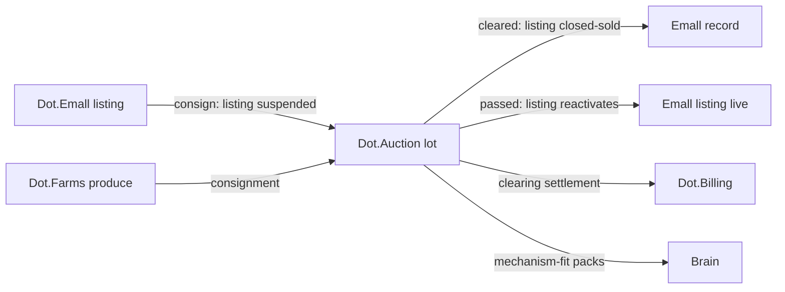

# Dot.Auction

> **Platform-owned source:** [Dot.Auction's wiki.md](https://github.com/sakhilebhayi/Dot.Auction/blob/main/wiki.md) — the platform's own knowledge home. This document is Dot.Brain's ingested view; the wiki is authoritative for what the platform actually is.

## 1. Purpose & Business Domain

Competitive price discovery: timed auctions, sealed-bid tenders, and clearing events for goods and contracts across the ecosystem. Owns the auction domain: lots, bids, and clearing outcomes. The boundary with Emall is mechanism, not merchandise: Emall matches posted-price listings; Auction discovers prices competitively. **Auction-mechanism scoping** (registry gap, closed in §2/§7) answers what the Brain may learn from auctions — clearing outcomes and mechanism performance, never bidder behavior — because bid data is strategic information whose leakage distorts the very markets the platform exists to make fair.

## 2. Entities Owned (mechanism scoping — registry gap closed)

| Entity | Graph node type | Natural key | Notes |
|---|---|---|---|
| Auction house | `entity:site` | house ID | Tenant root (org running auctions) |
| Auction event | `entity:process` | event ID | Mechanism-attributed: english, dutch, sealed-bid, tender |
| Lot | `entity:asset` | lot ID | May reference an Emall listing (§6) |
| Clearing outcome | `outcome` | lot + event | Cleared/passed, clearing price vs. reserve/estimate — **the publishable unit** |
| Mechanism-performance observation | `observation` | mechanism × category × window | Aggregate only |
| Bid | — | — | **Never graphed, never published, not even in aggregate within an open event.** Bid histories publish only as post-clearing distributional aggregates (§7) |

Scoping resolution: the Brain learns *which mechanisms clear which categories at what efficiency* — mechanism-level knowledge. Individual bidding behavior, bidder identities, and within-event dynamics are excluded at the type level (the HR/Ehail exclusion pattern, applied to strategic rather than personal data).

## 3. Events Emitted

| Event | Trigger | Consumers | Frequency |
|---|---|---|---|
| `auction.lot.cleared/passed` | Clearing | Brain, Dot.Emall (listing release, §6), Dot.Billing | per event |
| `auction.event.settled` | All lots resolved + settlement handoff | Dot.Billing, Dot.Analytics | per event |
| `auction.reserve.not_met` | Lot passed at reserve | Brain (aggregate), consignor platform | per event |

## 4. Knowledge Packs Published

| Payload type | Cadence | Example pack ID |
|---|---|---|
| observation (clearing-rate, price-vs-estimate aggregates by mechanism × category) | per event batch | `dkp:auction:obs:2026-07-18:0008` |
| insight (mechanism-fit findings) | per finding | `dkp:auction:ins:2026-06-30:0001` |
| outcome (recommendation verifications) | per verified recommendation | `dkp:auction:out:2026-07-29:0001` |
| incident (mechanism failures, scoping-gate events) | per incident | `dkp:auction:inc:2026-04-25:0001` |

Publication timing rule: nothing about an event publishes until it settles — even aggregates from a live event could inform bidders still in it. Post-clearing, bid distributions publish only as coarse quantiles at n ≥ 20 distinct bidders per category × window.

## 5. Intelligence Consumed

| Recommendation type | Metric expected to move | Baseline |
|---|---|---|
| Mechanism-selection (which format for which category — the flagship) | `auction.clearing_rate` | 2026 H1, per category |
| Reserve-setting guidance (category-level bands, never lot-level prices) | `auction.reserve_met_rate` | per category |
| Event-timing (schedule against demand windows — Emall/Ehail seasonal signals) | `auction.bidder_participation_p50` | per category |

## 6. Cross-Platform Relationships & the Listing-vs-Lot Handoff (Emall's filed question, answered)



**The handoff contract:** consignment is a *state transition with an ownership transfer*, not a copy. When an Emall listing is consigned, Emall suspends it (state `consigned`, pointer to the lot ID) and **Auction owns the lot exclusively for the event's duration** — one sellable thing, one owner at a time, no dual-listing window. On clearing: Auction emits `auction.lot.cleared`, Emall closes the listing as sold-at-auction (order record referencing the clearing, settlement flows to Billing exactly like an Emall order). On pass: ownership reverts, the listing reactivates at its prior state. Emall's `unsold_expiry` clock is suspended during consignment — an auction attempt is not marketplace staleness.

## 7. Tenancy Model & Strategic-Data Discipline

Tenant key = auction house; consignor data scoped to the consignor's platform of origin. The scoping gates:

| Gate | Rule |
|---|---|
| Settlement-before-publication | No event data publishes until `auction.event.settled` |
| Bid exclusion | Individual bids never publish; post-clearing distributions as quantiles only, n ≥ 20 distinct bidders per category × window |
| Bidder anonymity | Bidder identities never leave the platform, including to consignors — post-event, a consignor learns the clearing price, not who bid |
| Reserve confidentiality | Reserve prices publish only as met/not-met rates, never as values |
| Cross-category intersection | Bid-distribution cells checked against clearing-outcome cells before publication (small-market re-identification of dominant bidders) |

## 8. Dopamine Surface

Auctions are intrinsically the most dopaminergic mechanism in commerce — the countdown, the outbid notification, the winner's rush are the *product*. The line: mechanics intrinsic to the mechanism (bid status, closing time) are legitimate because hiding them would break the auction; mechanics *layered onto* it fail the acid test and are withheld — synthetic urgency (fake bidder-count inflation, artificial deadline extensions to provoke bidding wars beyond published soft-close rules), losing-bidder re-engagement nudges ("you were outbid last week — come back"), win streaks. Outbid notifications exist but are classed under Notify's *actionable decision* trigger — they fire on a domain event (a bid), never on absence. Shared: clearing-rate and estimate-accuracy performance per category.

## 9. Active Recommendations

Maintained by the Registry Agent. Current: mechanism-selection `verified` — see §13; event-timing against harvest windows `open` (expiry 2026-09-12).

## 10. Incident History Summary

One incident pack (2026-04): a draft observation pack included per-lot bid counts for a three-bidder rural equipment category — dominant-bidder re-identification risk caught by the intersection gate; published as a near-miss (Pulse/HR precedent), lesson hardened the n ≥ 20 bidder floor from guidance to manifest rule. Consumed: Emall's taxonomy-validation lesson (lot categories use the shared taxonomy — fourth consumer waiting on schemas/taxonomy.json).

## 11. Domain Metrics (registered per brain.metrics.md §4.8)

| ID | Type | Definition |
|---|---|---|
| `auction.clearing_rate` | ratio | Lots cleared / lots offered, per mechanism × category |
| `auction.reserve_met_rate` | ratio | Lots meeting reserve / lots with reserve, per category |
| `auction.bidder_participation_p50` | count | Distinct bidders per lot, median, per category × window |

## 12. Manifest (platform.dkp.json example)

```json
{
  "platform_id": "dot-auction",
  "dkp_version": "1.0.0",
  "signing_key_ref": "vault://keys/dot-auction/dkp-signing/v1",
  "publishes": ["observation", "insight", "outcome", "incident"],
  "subscribes": ["mechanism-selection", "reserve-setting-guidance", "event-timing"],
  "schemas": { "knowledge-pack": "1.0.0", "metric": "1.0.0" },
  "default_classification": "ecosystem",
  "tenancy": {
    "key": "house_id",
    "aggregation_floor": 20,
    "publication_rules": [
      { "rule": "settlement-before-publication", "enforcement": "reject-at-ingestion" },
      { "rule": "no-individual-bids", "min_bidders_for_distribution": 20, "enforcement": "reject-at-ingestion" },
      { "rule": "no-reserve-values", "enforcement": "reject-at-ingestion" }
    ]
  }
}
```

## 13. Worked round-trip

1. **Pack:** `dkp:auction:obs:2026-07-18:0008` — clearing aggregates for agricultural-equipment lots across mechanisms: sealed-bid tenders clearing at 0.54 while timed english auctions cleared the same category at 0.81 with higher price-vs-estimate; 14 events, 27 distinct bidder-cohorts (all §7 gates pass, post-settlement).
2. **Validation → graph:** `OBSERVED_WITH` edge between mechanism type and clearing rate for the category, 0.72; corroborated by Emall's posted-price velocity data for the same category (×1.10 → 0.79) — thin-demand categories clear better with visible competition.
3. **PR back (mechanism-selection):** default agricultural-equipment consignments to timed english format; confidence 0.79 → provisional band, so it ships as a suggested default the auction house confirms per event; impact `auction.clearing_rate` +15% predicted, guard `auction.reserve_met_rate` flat, expiry 60 days.
4. **Outcome:** `dkp:auction:out:2026-07-29:0001` — clearing rate +19% verified across 9 subsequent events; guard held; confidence re-scored to 0.84, and the recommendation graduates from provisional to recommendable — the corpus's first in-document demonstration of the 0.79→0.84 band crossing working as designed.

## Verified Infrastructure State (2026-08-07)

Confirmed directly against the real repo during the ecosystem-wide standardization + code-quality pass (full 26-platform summary: [brain.platforms.md](../brain.platforms.md) change log, v1.0.21):

- **Legal/branding/auth** — branded Markdown-mail theme, complete POPIA-aligned Privacy Policy/Terms/Cookie Policy naming **BluePin Inc**, guest auth pages restyled to match the welcome-page hero.
- **Laravel Boost** — `laravel/boost` ^2.5 installed; `.mcp.json`/`boost.json`/`CLAUDE.md` guideline block in place.
- **Code-quality pass** — Pint: 24 files reformatted, formatting-only. `composer audit`: patched 6 `league/commonmark` DoS advisories. `npm audit`: patched postcss path-traversal + shell-quote ReDoS (via concurrently). Full suite reconfirmed green (67 tests / 60 passed / 135 assertions) after every change.

## Autonomy Classification (brain.autonomy.md)

Per [brain.autonomy.md](../brain.autonomy.md) §2. Audited against the real codebase at `~/Dot/Dot.Auction` on 2026-08-08 — not aspirational.

### Level 1 — Autonomous

None found. Checked: `app/Console/Commands` does not exist; `bootstrap/app.php` registers `routes/console.php` for commands but defines no `->withSchedule()` call, and `routes/console.php` contains only the stock `inspire` Artisan command — there is no scheduler running any operator-side process. `app/Jobs` and `app/Listeners` do not exist — no queued or event-driven background work runs unattended, even though `QUEUE_CONNECTION=database` is configured (a queue with nothing dispatched to it). The three real `App\Notifications` classes (`AuctionEndingSoonNotification`, `AuctionWonNotification`, `OutbidNotification`) are database-channel, in-app notifications; only `OutbidNotification` fires automatically today, and it fires synchronously from `App\Livewire\Auctions\BidPanel::placeBid()` inside an end user's own bidding request — that is a user acting on their own transaction, not a platform-operator autonomy process, per this audit's scope. `AuctionEndingSoonNotification` and `AuctionWonNotification` are unwired (no sweep/settlement job invokes them — see wiki.md §6, §7 roadmap and each class's own doc comment).

### Level 2 — Escalate

None found. Checked for any code path that analyzes/prepares an action and stops short of executing it pending human sign-off (e.g. a proposed price change, a flagged listing, a draft recommendation surfaced for approval): no such construct exists in `app/Http/Controllers`, `app/Livewire`, `app/Policies`, or `app/Actions` — every controller/Livewire action either executes immediately within a normal end-user request (place bid, toggle watchlist, create team) or is gated by an `AuctionPolicy`/`TeamPolicy` authorization check that answers "can this user do this to their own data," not "does this action need operator sign-off before it runs." There is no admin-review queue, moderation panel, or approval-gated action anywhere in the app.

### Level 3 — Human Control

- **Deploys and releases** — no CI/CD exists to make this anything but manual: `find .github/workflows` and repo-wide searches for `*deploy*`, `Dockerfile`, or `Procfile` return nothing. Every release documented in the wiki.md Change Log (e.g. `wiki.md` v0.3.0, v0.4.0 entries) was a manually-run, manually-committed pass by Sakhile Bhayi / an AI session acting on his behalf, not an automated pipeline.
- **Schema/data fixes and migrations** — `database/migrations/*` (e.g. the `auctions`, `bids`, `auction_categories`, `watchlists`, `auction_items` tables per wiki.md §3) run only via a human invoking `php artisan migrate`; no migration-runner automation exists in the repo.
- **Credential and secret rotation** — `.env` holds `QUEUE_CONNECTION`, DB, and mail credentials in plaintext at the repo root with no rotation tooling; `EcosystemAuthController` (`app/Http/Controllers/Auth/EcosystemAuthController.php`) consumes Sanctum personal-access tokens minted and revoked entirely outside this codebase — token issuance/rotation is a manual operator action on whatever system mints them.
- **Security patching** — `composer.json`/`composer.lock` and `package.json`/`package-lock.json` dependency updates are manual (`composer audit`/`npm audit` fixes recorded in the "Verified Infrastructure State (2026-08-07)" section above were a human-initiated pass, not a scheduled dependabot/renovate job — no such bot config exists in the repo).
- **Admin/moderation actions** — there is no admin role, admin controller, or moderation surface in `app/Http/Controllers` or `app/Livewire` at all; any dispute, fraudulent-listing takedown, or reserve/policy override today can only happen by a human operator acting directly on the database or codebase, since `AuctionPolicy` only authorizes ordinary sellers/bidders against their own auctions.
- **The unbuilt settlement moment** — per wiki.md §6/§7, "on `ends_at` passing, resolve winner, flip `status` to `ended`" has no job at all yet, so today an auction's actual close is whatever a human notices and acts on by hand.

### Gap summary

The platform has zero background execution surface today — no scheduler entry, no `app/Jobs`, no `app/Listeners`, no CI/CD — so there is nothing for a Level 1 process to run on. The first real Level 1 candidate is the already-scoped-but-unbuilt auction settlement job (wiki.md §6: resolve winner on `ends_at`, flip status, emit a settlement event) paired with the `AuctionEndingSoonNotification` sweep; building both as an actual Laravel scheduled command/queued job (not just the notification classes that exist today) would give the platform its first process an operator doesn't have to run or notice by hand.

## Change Log

| Version | Date | Author | Change |
|---|---|---|---|
| 1.0.0 | 2026-08-01 | Platform Integrator (prompt 05, AI) | Initial integration package: mechanism scoping closed (mechanism-level knowledge in, bidder behavior excluded at type level), listing-vs-lot handoff contract answering Emall's filed question (exclusive ownership transfer, suspended expiry clock), settlement-before-publication rule, intrinsic-vs-layered dopamine line, 3 domain metrics, worked round-trip with provisional-band graduation |
| 1.0.1 | 2026-08-01 | Repository Reviewer (prompt 07, AI) | Sealed-bid regulatory OQ struck (resolved by dot-finance.md regulatory watch) |
| 1.0.2 | 2026-08-01 | DKP Architect (prompt 02, AI) | Taxonomy OQ struck (schemas/taxonomy.json published) |

| 1.0.3 | 2026-08-01 | Repository Steward Agent | Linked to Dot.Auction's own wiki.md (platform repo) as the platform-owned source of truth |
| 1.1.0 | 2026-08-08 | Platform Autonomy Classification sub-project | Added Autonomy Classification section per brain.autonomy.md §2 |

## Open Questions

| Question | Owner → Approver |
|---|---|
| ~~Lot categories via shared taxonomy — fourth consumer waiting on schemas/taxonomy.json (with Emall, semantic, Pulse)~~ **Resolved 2026-08-01:** [schemas/taxonomy.json](../schemas/taxonomy.json) published; `auction.lot.category` frozen | Knowledge Agent → Chief Knowledge Engineer |
| **Flagged 2026-08-01:** sealed-bid/procurement disclosure rules were assumed to come from Dot.Finance's regulatory watch — that watch turned out not to exist (see [dot-finance.md](dot-finance.md) §12). Disclosure-rule sourcing needs a new owner. | Registry Agent → Chief Knowledge Engineer |
| ~~Sealed-bid tender data for public-sector procurement: does regulatory disclosure law override the reserve-confidentiality gate? Coordinate with dot-finance's regulatory watch~~ **Resolved 2026-08-01** by [dot-finance.md](dot-finance.md): governed by jurisdiction rule packs (`reg:<jurisdiction>:<domain>:<rule>`) under the regulatory watch | Security Agent → Security Officer |
