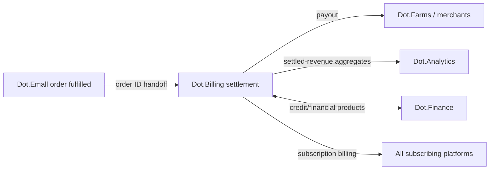

# Dot.Billing

> **Platform-owned source:** [Dot.Billing's wiki.md](https://github.com/sakhilebhayi/Dot.Billing/blob/main/wiki.md) — the platform's own knowledge home. This document is Dot.Brain's ingested view; the wiki is authoritative for what the platform actually is.

## 1. Purpose & Business Domain

Payments and subscriptions — settlement of marketplace orders, recurring subscription billing, payout scheduling to merchants and producers, and dunning. Owns the settlement domain: money movement records and their timing. Financial products and credit belong to Dot.Finance; matching and orders to Dot.Emall (§6). Billing's knowledge is the most sensitive in the value chain — its aggregation configuration (§7) is stricter than the ecosystem default and is this document's registry-gap closure.

## 2. Entities Owned

| Entity | Graph node type | Natural key | Notes |
|---|---|---|---|
| Billing account | `entity:site` | `dot:node:finance:account:<id>` | Tenant root (merchant/subscriber) |
| Settlement | `entity:process` | settlement ID | Joins Emall order ID — the chain's handoff key |
| Payout | `entity:process` | account + cycle | Producer/merchant disbursement |
| Subscription | `entity:asset` | account + plan | Recurring billing lifecycle |
| Settlement-latency observation | `observation` | corridor + window | Aggregate only, per §7 |
| Dunning outcome | `outcome` | account + case | Recovery vs. churn ground truth |

## 3. Events Emitted

| Event | Trigger | Consumers | Frequency |
|---|---|---|---|
| `finance.settlement.completed/failed` | Settlement close | Brain ingestion, Dot.Emall, Dot.Analytics | ~10³/day |
| `finance.payout.scheduled/released` | Payout cycle | Brain, Dot.Farms/merchants (via platform UX) | daily cycles |
| `finance.subscription.renewed/lapsed` | Subscription lifecycle | Brain, Dot.Analytics | ~10²/day |
| `finance.dunning.opened/closed` | Recovery case | Brain (aggregate only) | low |

## 4. Knowledge Packs Published

> **Target contract below is still aspirational** (settlement/payout domains this codebase doesn't model yet — see [wiki.md](https://github.com/sakhilebhayi/Dot.Billing/blob/main/wiki.md) §4/§8). **What's real as of 2026-08-02:** Dot.Billing cleared DKP onboarding step 1 — a real signing key, a manifest validated against `schemas/platform-manifest.schema.json`, a hand-run publish command, and one committed, independently-verified `metric` pack for `billing.invoice_payment_success_rate`. See [os/19-Knowledge-Packs.md](../os/19-Knowledge-Packs.md) §4a and [Dot.Billing's wiki.md](https://github.com/sakhilebhayi/Dot.Billing/blob/main/wiki.md) §7 for the real account; §12 below remains the illustrative target manifest, not what's actually committed (the real one has a different, simpler shape — no `publishes`/`tenancy` fields exist in the normative schema).

| Payload type | Cadence | Example pack ID |
|---|---|---|
| observation (settlement-latency/payout aggregates) | daily batch | `dkp:billing:obs:2026-07-20:0027` |
| insight (settlement-pattern findings) | per finding | `dkp:billing:ins:2026-06-15:0002` |
| outcome (recommendation verification) | per verified recommendation | `dkp:billing:out:2026-07-31:0001` |
| incident (settlement failures, payout delays) | per incident | `dkp:billing:inc:2026-03-08:0001` |

All Billing packs default to classification `restricted` (money-movement patterns are competitively and criminally sensitive); insights suitable for wider reuse are re-published as `ecosystem` derivatives after the Security gate confirms the §7 floors held.

## 5. Intelligence Consumed

| Recommendation type | Metric expected to move | Baseline |
|---|---|---|
| Settlement-corridor routing | `finance.settlement_latency_p95` | 2026 H1, per corridor |
| Payout-cycle optimization (seasonal producers — the Farms harvest cashflow case) | `finance.payout_delay_p50` | 2026 wet season |
| Dunning-approach selection | `finance.dunning_recovery_rate` | 2026 H1 |

## 6. Cross-Platform Relationships & the Settlement-Latency Seam



**Settlement-latency seam (named by the Emall round-trip):** the chain metric `order fulfilled → settlement completed` crosses the Emall/Billing boundary. Canonical statement: the seam metric is `finance.settlement_latency_p95`, owned *here* (Billing owns the clock from fulfilment event receipt); Emall's obligation is emitting `commerce.order.fulfilled` within its own event contract. A chain-level view (harvest → listing → order → settlement → payout) is an Analytics product, assembled from each platform's owned metrics — no platform owns another's segment.

## 7. Tenancy Model & Aggregation-Floor Configuration (registry gap closed)

Tenant key = billing account ID; topics `finance.<tenant>.<event>`. Floors — stricter than the ecosystem default, in two tiers:

| Data class | Floor | Rationale |
|---|---|---|
| Settlement/payout aggregates | **n ≥ 50 distinct accounts** per corridor × window | Money-movement patterns de-anonymize at smaller n; intersection-attack rule applies with the wider margin |
| Dunning/recovery aggregates | **n ≥ 100 distinct accounts**, quarterly windows only | Financial-distress signals are `sensitive`-adjacent; smallest publishable cell deliberately coarse |
| Subscription lifecycle aggregates | n ≥ 20 (ecosystem default) | Plan-level churn is low-sensitivity |

Floors are manifest-declared (below) so validation enforces them at ingestion, not by reviewer memory.

## 8. Dopamine Surface

Shares: on-time payout reliability (platform's own performance, outcome-anchored). Explicitly withheld: everything user-facing — payment streaks, spend milestones, dunning-pressure nudges. Billing is the one platform whose engagement mechanics could do direct financial harm; its dopamine surface is minimal by policy, not by omission.

## 9. Active Recommendations

Maintained by the Registry Agent. Current: payout-cycle optimization for seasonal producers `open` (expiry 2026-08-30); settlement-corridor routing `verified` — see §13.

## 10. Incident History Summary

One incident pack (2026-03): payout batch delayed by a corridor outage — F-INFRA; lesson: corridor health checks moved ahead of batch commit, propagated to Finance's payment-adjacent workflows. Consumed: Central's alert-precision tuning pattern for its own corridor monitors.

## 11. Domain Metrics (registered per brain.metrics.md §4.8)

| ID | Type | Definition |
|---|---|---|
| `finance.settlement_latency_p95` | duration | Fulfilment event receipt to settlement completed, p95 per corridor — the seam metric |
| `finance.payout_delay_p50` | duration | Settlement completed to payout released, median |
| `finance.dunning_recovery_rate` | ratio | Recovered cases / opened cases, quarterly |

## 12. Manifest (platform.dkp.json example)

```json
{
  "platform_id": "dot-billing",
  "dkp_version": "1.0.0",
  "signing_key_ref": "vault://keys/dot-billing/dkp-signing/v1",
  "publishes": ["observation", "insight", "outcome", "incident"],
  "subscribes": ["settlement-routing", "payout-cycle-optimization", "dunning-approach"],
  "schemas": { "knowledge-pack": "1.0.0", "metric": "1.0.0" },
  "default_classification": "restricted",
  "tenancy": {
    "key": "account_id",
    "aggregation_floor": 20,
    "floor_overrides": [
      { "data_class": "settlement", "floor": 50 },
      { "data_class": "dunning", "floor": 100, "min_window": "quarter" }
    ]
  }
}
```

## 13. Worked round-trip

The value chain's third link, closed:

1. **Pack:** `dkp:billing:obs:2026-07-20:0027` — settlement-latency aggregates, Northern Cape corridor, 4 weeks, 61 distinct accounts (≥ 50 floor holds); signed, `restricted`.
2. **Validation → graph:** corridor-latency nodes; `OBSERVED_WITH` edge between harvest-season order surges (Emall's demand packs — cross-corroboration ×1.10) and settlement queue depth at 0.69.
3. **PR back:** settlement-corridor routing — pre-scale corridor capacity in the harvest-peak window the Farms/Emall chain already predicts; confidence 0.80, impact `finance.settlement_latency_p95` −20% predicted, guard `finance.payout_delay_p50` flat, expiry 30 days.
4. **Outcome:** `dkp:billing:out:2026-07-31:0001` verifies −24% settlement latency; a producer-facing effect lands one link upstream — Farms' `agriculture.produce_time_to_market_p50` improves without Farms changing anything. Three links verified; the chain-level Analytics product (§6) can now be assembled from owned segments.

## Verified Infrastructure State (2026-08-07)

Confirmed directly against the real repo during the ecosystem-wide standardization + code-quality pass (full 26-platform summary: [brain.platforms.md](../brain.platforms.md) change log, v1.0.21):

- **Legal/branding/auth** — branded Markdown-mail theme, complete POPIA-aligned Privacy Policy/Terms/Cookie Policy naming **BluePin Inc**, guest auth pages restyled to match the welcome-page hero.
- **Laravel Boost** — `laravel/boost` ^2.5 installed; `.mcp.json`/`boost.json`/`CLAUDE.md` guideline block in place.
- **Code-quality pass** — Pint: 26 files reformatted, formatting-only. `composer audit`: patched 6 `league/commonmark` DoS advisories. `npm audit`: patched postcss path-traversal + shell-quote ReDoS (via concurrently). Full suite reconfirmed green (67 tests / 60 passed / 116 assertions) after every change.

## Autonomy Classification (brain.autonomy.md)

Per [brain.autonomy.md](../brain.autonomy.md) §2. Audited against the real codebase at `~/Dot/Dot.Billing` on 2026-08-08 — not aspirational.

### Level 1 — Autonomous

None found. Checked: `routes/console.php` (only the stock `inspire` Artisan command; no `Schedule::` calls anywhere in the real app tree), `app/Console/Commands/` (one command — `PublishDkpMetricPack` — deliberately hand-run, not scheduled, per its own docblock), `app/Jobs/` (directory does not exist — no queued jobs), `app/Notifications/` (`InvoiceDueNotification` and `PaymentFailedNotification` both exist but are explicitly documented as "not yet wired to any automatic trigger — dispatch manually"), and `.github/` at the repo root (no workflow files; the only `.github` directories present are inside `node_modules`, not platform code). No process in this codebase executes on its own without a human initiating it.

### Level 2 — Escalate

None found. An escalation process requires a system that analyses and prepares an action and presents it for approval (Context → Evidence → Risk → Recommendation → Proposed Action per §2). Nothing in the codebase assembles or routes a proposal: `app/Services/AiBillingService.php` (`analyzeSpend()`) generates plain-language spend commentary for the end-user dashboard via a direct Claude API call, with canned fallback copy on failure — it produces read-only insight text, not a proposed action awaiting operator sign-off. `app/Services/PaymentReliabilityCalculator.php` is the same pattern (see Level 3 note below). Neither writes anywhere, triggers a workflow, or blocks on approval; both are single-shot read computations rendered straight into a Livewire view (`app/Livewire/Billing/UsageDashboard.php`, `app/Livewire/Billing/PaymentReliability.php`).

### Level 3 — Human Control

- **DKP metric pack publishing** — `app/Console/Commands/PublishDkpMetricPack.php`. Signs and writes one JSON knowledge pack; the class docblock states it is "deliberately not a scheduled job or pipeline" and requires a human to run `php artisan dkp:publish-metric` with `--contributor-email`/`--contributor-name`, plus a signing key manually placed at the path in `storage/app/private/README.md`. Security-credential ownership (the Ed25519 signing key) and knowledge-publication authority stay with the operator.
- **Payment Reliability Calculator** — `app/Services/PaymentReliabilityCalculator.php`, surfaced via `app/Livewire/Billing/PaymentReliability.php`. Confirmed read-only: it computes an on-time-payment "cushion" percentage plus a hypothetical `what_if` projection from existing `BillingInvoice` rows and returns an array to a Blade view. It writes nothing, sends nothing, and triggers no downstream action — it is end-user self-service insight (a subscriber's own team viewing their own payment reliability), not operator-facing automation, so it does not itself qualify for Level 1 or Level 2 classification under this program (which classifies platform-operator autonomy, not end-user read views). Any future version that acted on this number (e.g. auto-adjusting credit terms) would need its own Level 2/3 classification at build time.
- **Ecosystem SSO login** — `app/Http/Controllers/Auth/EcosystemAuthController.php`. Consumes a Sanctum personal access token scoped `ecosystem:read`, single-use (deleted on use), expiry-checked, then logs the user in. Token issuance and the `ecosystem:read` ability grant happen outside this codebase; account/session authority stays manual.
- **Invoice access authorization** — `app/Policies/BillingInvoicePolicy.php` and `app/Policies/TeamPolicy.php`, enforced in `app/Http/Controllers/Billing/InvoiceController.php` via `Gate::authorize('view', $invoice)`. Team membership (who can see which team's invoices) is Jetstream-managed, human-administered.
- **Route-level auth gating** — `routes/web.php` guards `/dashboard` and `/invoices/{invoice}` with `auth:sanctum`, the Jetstream auth-session middleware, and `verified`; `bootstrap/app.php` registers no custom middleware beyond framework defaults. Session and credential handling remain entirely human/framework-controlled, no autonomous logic layered on top.
- **AI spend commentary** — `app/Services/AiBillingService.php`. Direct, unauthenticated-by-default (falls back to canned copy without an API key) call to the Claude Messages API for plain-language insights shown to the end user on `UsageDashboard`. No write path, no action taken on the operator's behalf — content generation only, reviewed by no one before display, but also changes nothing; included here because it is the platform's only outbound AI call and its API key is a credential the operator holds manually via `config('services.anthropic.api_key')`.

### Gap summary

Dot.Billing's first real Level 1 process would need three things this codebase doesn't yet have: an event or scheduler trigger (no `Schedule::` calls or queued `Jobs` exist to hang automation off), a write action tied to that trigger (today every computation — `PaymentReliabilityCalculator`, `AiBillingService` — stops at rendering a value, it never calls `->save()`, sends a notification, or calls out to another platform), and a bounded, monitored blast radius so it's safe to run unattended (the settlement/payout/dunning domains §1 of this document flags as still aspirational are exactly where that would first matter). The two Notification classes (`InvoiceDueNotification`, `PaymentFailedNotification`) are the nearest scaffolding — wiring them to real invoice/payment lifecycle events would be routine reporting/monitoring (Level 1 by the §2 examples), not the settlement-domain automation that would need Level 2 escalation.

## Change Log

| Version | Date | Author | Change |
|---|---|---|---|
| 1.0.0 | 2026-08-01 | Platform Integrator (prompt 05, AI) | Initial integration package: settlement-domain ownership, seam-metric canonical statement, two-tier aggregation-floor configuration (registry gap closed, manifest-enforced), restricted-by-default classification, minimal dopamine surface by policy, 3 domain metrics, worked round-trip |
| 1.1.0 | 2026-08-02 | Sakhile Bhayi | §4 flagged: the target contract below is still aspirational, but Dot.Billing has now cleared real DKP onboarding step 1 (key, manifest, publish script, one verified signed pack) — see os/19-Knowledge-Packs.md §4a. |
| 1.2.0 | 2026-08-08 | Platform Autonomy Classification sub-project | Added Autonomy Classification section per brain.autonomy.md §2 |

| 1.0.1 | 2026-08-01 | Repository Steward Agent | Linked to Dot.Billing's own wiki.md (platform repo) as the platform-owned source of truth |

## Open Questions

| Question | Owner → Approver |
|---|---|
| `restricted`-to-`ecosystem` derivative re-publication: does the Security gate need a standing checklist for Billing derivatives, or per-pack review at current volumes? | Security Agent → Security Officer |
| **Moot 2026-08-01:** the `finance.*` vs `finproduct.*` metric-namespace coordination with Dot.Finance no longer applies — `finproduct.*` was retracted when Dot.Finance's doc was rewritten to match its actual (much smaller) scope; see [dot-finance.md](dot-finance.md) §12. No action needed, noted for anyone tracing the old coordination. | — |
| Dunning floor (n ≥ 100, quarterly) — validate against POPIA/GDPR guidance once the legal-identity open question (brain.identity.md) resolves | Security Agent → Security Officer |
