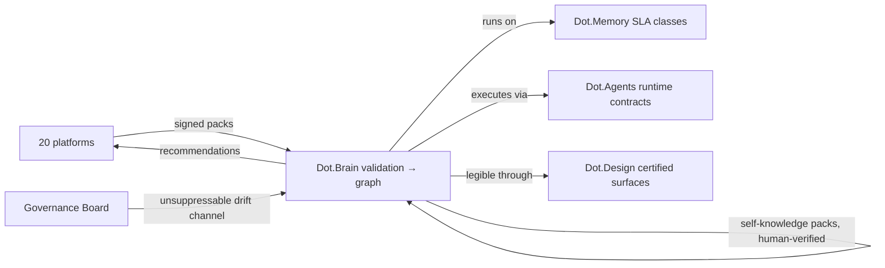

# Dot.Brain

## 1. Purpose & Business Domain

The collective intelligence layer itself — the knowledge graph, confidence engine, pack validation pipeline, and recommendation loop that the other twenty platform docs describe from the outside. This doc describes it from the inside, under the same contract it imposes on everyone else: **the Brain is a platform of the ecosystem, not above it.** It registers in its own registry, homes its metrics under §4.8 like any tenant, and publishes packs about its own operation under trust rules it did not exempt itself from. The registry's standing open question — *should dot-brain publish self-knowledge packs, and under which trust rules?* — is answered here (§4, §7): yes, under **stricter** rules than any tenant, because a system that recommends transparency while operating opaquely fails its own MANIFESTO. This closes the "self-referential doc pending" gap and completes F-06 at 21 of 21.

## 2. Entities Owned

| Entity | Graph node type | Natural key | Notes |
|---|---|---|---|
| Knowledge pack (validated) | per payload type | pack ID | Custody, not authorship — content belongs to the publisher |
| Confidence assessment | `assessment` | edge ID + revision | The Brain's own epistemics, graphed and auditable |
| Recommendation | `recommendation` | PR ID | Full lifecycle: open → shipped/escalated → verified/failed/expired |
| Loop observation | `observation` | loop stage × window | Self-knowledge telemetry (§4) |
| Tenant knowledge content | — | — | **Never owned.** The Brain holds custody under publisher tenancy; claiming tenant content as its own entity would collapse the entire tenancy model |

## 3. Events Emitted

| Event | Trigger | Consumers | Frequency |
|---|---|---|---|
| `brain.pack.validated` / `brain.pack.rejected` | Validation pipeline verdict | Publishing platform | continuous |
| `brain.recommendation.issued` | PR passes recommendable line (≥ 0.80) or ships provisional with confirmation | Target platform, assigned agent | per PR |
| `brain.confidence.decayed` | Edge crosses a decision-relevant threshold downward | Consumers of that knowledge | scheduled |
| `brain.self.calibration_drift` | Self-knowledge finds systematic confidence miscalibration (§13) | Governance Board — mandatory, cannot be suppressed | rare |

## 4. Knowledge Packs Published (self-knowledge, OQ answered)

The Brain publishes about its own operation — loop telemetry, never tenant content:

| Payload type | Cadence | Example pack ID |
|---|---|---|
| observation (loop-stage aggregates: validation latency, verification rates, decay volumes) | weekly | `dkp:brain:obs:2026-07-06:0021` |
| insight (calibration findings: where stated confidence diverges from realized outcomes) | per finding | `dkp:brain:ins:2026-06-25:0004` |
| outcome (self-recommendation verifications) | per period | `dkp:brain:out:2026-07-30:0001` |
| incident (miscalibration, validation-pipeline defects, wrongly-shipped recommendations) | per incident | `dkp:brain:inc:2026-02-17:0001` |

Trust rules — stricter than any tenant (the OQ's second half): self-knowledge packs are validated by the same pipeline but **verified by humans, never by the Brain's own confidence engine** (no self-grading); calibration insights require Governance Board acknowledgment before influencing thresholds; `brain.self.calibration_drift` is unsuppressable.

## 5. Intelligence Consumed

The Brain consumes its own self-knowledge — with the human-verification firewall of §4:

| Recommendation type | Metric expected to move | Baseline |
|---|---|---|
| Threshold calibration (recommendable line, corroboration multipliers) | `brain.calibration_error` | 2026 H1 |
| Validation-pipeline tuning | `brain.pack_validation_p95` | per payload type |
| Decay-schedule adjustment per domain volatility | `brain.recommendation_verification_rate` | per domain |

## 6. Cross-Platform Relationships



The Brain's own dependencies are contracts published by its tenants: it retrieves under Memory's SLA classes, executes under Agents' runtime contracts, and renders through Design's certified components. The infrastructure trio governs the governor.

## 7. Tenancy Model

Tenant key for all custodied content = publishing platform, always — custody never converts to ownership. The Brain's own self-knowledge packs are tenant-free loop telemetry with one absolute rule, enforced by construction: **no tenant content, identifier, or derivable aggregate may appear in a `dkp:brain:*` pack.** A self-knowledge pack describes the pipeline, never what flowed through it. Trust: dot-brain carries no trust score in its own registry (`—`) — scoring itself with its own engine is the self-grading §4 prohibits; its standing is the Governance Board's semi-annual attestation instead.

## 8. Dopamine Surface

None — and structurally prohibited from acquiring one. The Brain must never be incentivized to maximize its own engagement (recommendation counts, acceptance rates as targets — the proxy failure applied to itself would be the ecosystem's terminal failure mode). The verification rate is reported honestly, including the failed-closure record every platform doc carries.

## 9. Active Recommendations

Maintained by the Registry Agent. Current: decay-schedule adjustment `verified` — see §13; validation-pipeline batching for high-volume observation packs `open` (expiry 2026-09-30).

## 10. Incident History Summary

One incident pack (2026-02): a corroboration-multiplier bug applied ×1.10 twice for a single second source, inflating four edges past the recommendable line; one recommendation shipped that should have stayed provisional (it happened to verify, which made the audit finding *more* important, not less — right outcome, wrong process). Produced the human-verification firewall of §4 and the graph-wide corroboration re-audit. The corpus's founding argument for why the Brain cannot grade itself.

## 11. Domain Metrics (registered per brain.metrics.md §4.8)

| ID | Type | Definition |
|---|---|---|
| `brain.calibration_error` | ratio | Mean absolute gap between stated confidence and realized verification rate, per confidence band, quarterly |
| `brain.pack_validation_p95` | duration | Pack submission → validation verdict, p95 per payload type |
| `brain.recommendation_verification_rate` | ratio | Shipped recommendations verified at expiry / all shipped, per domain, quarterly |

## 12. Manifest (platform.dkp.json example)

```json
{
  "platform_id": "dot-brain",
  "dkp_version": "1.0.0",
  "signing_key_ref": "vault://keys/dot-brain/dkp-signing/v1",
  "publishes": ["observation", "insight", "outcome", "incident"],
  "subscribes": ["threshold-calibration", "pipeline-tuning", "decay-adjustment"],
  "schemas": { "knowledge-pack": "1.0.0", "metric": "1.0.0" },
  "default_classification": "ecosystem",
  "tenancy": {
    "key": "infrastructure",
    "aggregation_floor": 0,
    "publication_rules": [
      { "rule": "no-tenant-content-in-self-packs", "enforcement": "by-construction" },
      { "rule": "human-verification-only-no-self-grading", "enforcement": "governance" },
      { "rule": "calibration-drift-unsuppressable", "enforcement": "by-construction" }
    ]
  }
}
```

## 13. Worked round-trip (the loop examining the loop)

1. **Pack:** `dkp:brain:ins:2026-06-25:0004` — calibration finding: edges in fast-moving domains (trading, logistics) verify at rates matching much lower confidence bands by expiry — the uniform decay schedule under-decays volatile domains.
2. **Validation → graph:** edge between domain volatility and calibration error, 0.77; corroborated by the same pattern in two independent quarters (×1.10 → 0.85). **Human-verified** per §4 — the Governance Board's reviewer confirmed the realized-rate data independently.
3. **PR back (decay adjustment):** domain-volatility-indexed decay schedules (trading edges decay ~2× faster than agronomy edges); confidence 0.85, impact `brain.calibration_error` −30% predicted in volatile domains, guards: no edge's decay slows (strictly conservative change), verification-rate tracking per domain for two quarters, Governance Board acknowledgment obtained before threshold effect.
4. **Outcome:** `dkp:brain:out:2026-07-30:0001` — calibration error −36% in trading/logistics bands verified, stable domains unaffected. The Brain's stated confidence now means the same thing in every domain — the loop, having run twenty-one times through twenty-one platforms, finally ran once through itself.

## Autonomy Classification (brain.autonomy.md)

Per [brain.autonomy.md](../brain.autonomy.md) §2. Audited against Dot.Brain's own real repository on 2026-08-08 — not aspirational.

### Level 1 — Autonomous

None found. Checked every real, runnable process in this repository for anything that executes without a human or a Claude session manually invoking it:

- `services/market-research/src/cli.js` — its own README states plainly: "Scheduled/continuous monitoring -- this is invoked on-demand only" (`services/market-research/README.md`, "What's not implemented"). Every research run requires an explicit `node src/cli.js research ...` invocation.
- `services/intervention-log/src/cli.js` — its README states: "No automatic detection of interventions -- every entry is asserted by a Claude session or the owner; nothing here infers that an intervention happened" (`services/intervention-log/README.md`, "What's NOT implemented").
- No `.github/workflows/` directory exists anywhere in this repository (checked at repo root — no `.github/` at all).
- No `scripts/` directory exists at the repo root.
- No root-level `package.json` exists, and neither service's `package.json` (`services/market-research/package.json`, `services/intervention-log/package.json`) defines anything beyond a `test` script — no scheduled or postinstall automation.
- No cron configuration, launchd plist, or task-runner config was found anywhere in the repository.

The knowledge-pack ingestion → validation → recommendation-PR loop described in §3–§6 above (`brain.pack.validated`, `brain.recommendation.issued`, the DKP manifest) is the aspirational contract this document describes for the wider ecosystem; no code implementing pack validation, confidence scoring, or PR generation exists in `services/` or anywhere else in this repository today. It is not counted here as a real Level 1 process.

### Level 2 — Escalate

None found. A Level 2 process requires something that analyses a situation and prepares a proposal for human approval before it executes (per brain.autonomy.md §2: "Context → Evidence → Risk → Recommendation → Proposed Action"). Neither real CLI does this:

- `services/intervention-log/src/cli.js log` only records an intervention a human or session already asserts happened — it does not analyse anything or propose an action for approval.
- `services/market-research/src/cli.js research` fetches and stores structured findings on request; it does not generate a proposal awaiting sign-off, and explicitly has no scheduled/autonomous trigger to begin with (see Level 1).

The recommendation/PR machinery in §3–§6 above would be the natural home for a real Level 2 process (a proposal a human approves before it "ships"), but as with Level 1, no such pipeline is implemented in this repository's actual code.

### Level 3 — Human Control

- **Registering a new `brain.*.md` document.** Adding a document and reflecting it in `README.md`, `indexes/INDEX.md`, `indexes/CROSSREF.md`, and `indexes/GLOSSARY.md` is entirely manual. `README.md` (line 53) describes the step as "drop one manifest-driven knowledge document in `platforms/`" with no automated check that the four registration points stay in sync. `os/12-README-Automation.md` §2 is explicit about the ceiling on today's automation: "No CI runner is available in this session's working environment... this document proposes a manual convention that works today with zero new infrastructure" — and names the future CI job as "recommended, not built" (§4). No lint, hook, or workflow in this repository enforces registration consistency today.
- **Invoking `services/market-research/src/cli.js`.** Every run is a manual `node src/cli.js research ...` command — no scheduler triggers it (`services/market-research/README.md`).
- **Invoking `services/intervention-log/src/cli.js`.** Every `log`/`list`/`streak` call is manual, run by "a Claude session or the owner" (`services/intervention-log/README.md`).
- **Committing to this repository.** All `git commit`/`git push` actions require the operator or an assisting session to run them directly; there is no `.github/workflows/` or other CI/CD that commits, merges, or deploys anything automatically.
- **Logging an Owner Intervention Log entry itself.** Per brain.autonomy.md §8 and `services/intervention-log/README.md`, every entry is a human- or session-asserted claim — nothing in the codebase infers or detects that an intervention occurred, so the act of logging is itself Level 3.

### Gap summary

For Dot.Brain to have its first real Level 1 process, something in this repository would need to run without any human or Claude session manually starting it — for example, a cron entry or a `.github/workflows/` job that periodically executes `services/market-research/src/cli.js` against a standing watchlist, or a lint/CI check that automatically verifies `indexes/INDEX.md`, `indexes/CROSSREF.md`, and `indexes/GLOSSARY.md` stay in sync with the `brain.*.md` files on every commit. Neither exists today: the repository has no `.github/workflows/`, no `scripts/`, and no cron or task-scheduler configuration of any kind.

## Change Log

| Version | Date | Author | Change |
|---|---|---|---|
| 1.0.0 | 2026-08-01 | Platform Integrator (prompt 05, AI) | Initial self-referential integration package: registry self-knowledge OQ answered (yes, under stricter-than-tenant rules — human verification only, no self-grading, unsuppressable drift channel), custody-not-ownership tenancy, no trust self-score (Governance Board attestation instead), 3 domain metrics, calibration round-trip. Completes F-06 at 21 of 21 |
| 1.1.0 | 2026-08-08 | Platform Autonomy Classification sub-project | Added Autonomy Classification section per brain.autonomy.md §2 |

## Open Questions

| Question | Owner → Approver |
|---|---|
| Governance Board attestation cadence: is semi-annual sufficient once self-knowledge recommendations begin altering thresholds, or should threshold-affecting periods trigger interim attestation? | Governance Agent → Chief Intelligence Architect |
| Should self-knowledge packs be published externally (ecosystem transparency report) or remain internal to governance? | Governance Agent → Governance Board |
