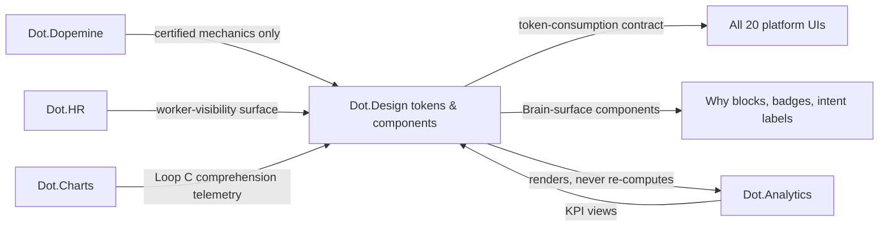

# Dot.Design

> **Platform-owned source:** [Dot.Design's wiki.md](https://github.com/sakhilebhayi/Dot.Design/blob/main/wiki.md) — the platform's own knowledge home. This document is Dot.Brain's ingested view; the wiki is authoritative for what the platform actually is.

## 1. Purpose & Business Domain

Enterprise design system: the shared component library, design tokens, and rendering surfaces every platform's UI is built from — including the Brain's own human-facing surfaces (Why blocks, confidence badges, recommendation cards, dashboards). Owns the presentation domain. Dot.Design is where Brain intelligence becomes *legible*: a recommendation the human can't comprehend is a recommendation that can't be honestly accepted, so comprehension is treated as a measurable outcome, not a styling concern. The **token-consumption contract** (registry gap) is closed in §7, and this session settles the four inherited open questions other platforms parked at Design's door (§7.1).

## 2. Entities Owned

| Entity | Graph node type | Natural key | Notes |
|---|---|---|---|
| Design token | `entity:asset` | token ID + version | Color, type, spacing, motion — the contract's unit (§7) |
| Component | `entity:asset` | component ID + version | Includes the Brain-surface components (Why block, confidence badge, intent label) |
| Consumption record | `observation` | platform × token-set × version | Which platform consumes which tokens at which version |
| Comprehension observation | `observation` | component × surface × window | Aggregated comprehension telemetry — never per-user |
| Individual interaction traces | — | — | **Never graphed.** Comprehension is measured in aggregate (n ≥ 50); per-user reading behavior is not the Brain's business |

## 3. Events Emitted

| Event | Trigger | Consumers | Frequency |
|---|---|---|---|
| `design.token.breaking_change` | Major version of a consumed token set | All consuming platforms (contract §7 notice period) | rare |
| `design.component.certified` | Brain-surface component passes comprehension gate | Registry Agent | per release |
| `design.consumption.drift_detected` | Platform pinned > 2 majors behind | Owning platform, Design Lead | monthly scan |

## 4. Knowledge Packs Published

| Payload type | Cadence | Example pack ID |
|---|---|---|
| observation (consumption + comprehension aggregates) | weekly | `dkp:design:obs:2026-07-06:0008` |
| insight (comprehension findings — what makes Brain output legible) | per finding | `dkp:design:ins:2026-06-02:0003` |
| outcome (comprehension-gate verifications) | per release | `dkp:design:out:2026-07-21:0001` |
| incident (breaking-change fallout, accessibility regressions) | per incident | `dkp:design:inc:2026-04-14:0001` |

## 5. Intelligence Consumed

| Recommendation type | Metric expected to move | Baseline |
|---|---|---|
| Component-variant suggestions (which Why-block layouts drive comprehension) | `design.why_block_comprehension_rate` | 2026 H1 |
| Token-migration sequencing (which consumers to migrate first) | `design.consumption_drift_count` | monthly |
| Accessibility prioritization (evidence-ranked remediation) | `design.a11y_defect_escape_rate` | per release |

## 6. Cross-Platform Relationships



## 7. Tenancy Model & Token-Consumption Contract (registry gap closed)

Tenant key = consuming platform for consumption records; comprehension telemetry keyed by org with n ≥ 50 floors. The **token-consumption contract** — how twenty platforms consume one design system without either freezing it or being broken by it:

| Term | Contract |
|---|---|
| Versioned consumption | Platforms pin token-set versions; nothing ships unpinned. Consumption records make the dependency graph queryable — the Brain knows exactly who breaks if a token changes |
| Breaking-change notice | Major versions require 90-day notice via `design.token.breaking_change` + a published migration pack; the notice period is contract, not courtesy |
| Drift ceiling | Pinning > 2 majors behind trips `design.consumption.drift_detected` — staying old is a choice with a visible cost, not a silent default |
| Brain-surface certification | Components rendering Brain output (Why blocks, confidence badges, intent labels) must pass the comprehension gate (aggregate comprehension ≥ threshold in trial) before certification; uncertified components cannot render recommendations |
| Extension inheritance | Dot.Plug extensions consuming tokens inherit this contract via host-manifest inheritance — no separate regime |

### 7.1 Inherited open questions — settled

| Origin | Question | Resolution |
|---|---|---|
| Dopemine | Intent-label wording standard | Intent labels state *what the mechanic optimizes for* in outcome terms ("celebrates verified task completion"), never engagement terms ("keeps your streak alive"). Wording is part of the certified component — Dopemine certifies the mechanic, Design certifies the label; neither ships without the other |
| Analytics | Do consumers render KPIs via catalog directly or via Analytics views? | Via views, always. Design components bind to `analytics.view:*` endpoints and never re-compute from the catalog — one rendering path, so a restated KPI restates everywhere at once. (Analytics' Charts-flavored OQ wording was misattributed during the Charts domain correction; this is the answer to the real question) |
| HR | Worker-visibility channel — where do workers see what the Brain knows about their work structure? | A certified `my-work-structure` surface component: renders the org's *structural* facts affecting the worker (role coverage, cert requirements, shift structures), sourced only from HR's open-tier fields, with a plain-language "what the Brain does not see" panel listing HR's prohibited tier verbatim. Transparency rendered as a component, not a policy document |
| Charts | Loop C — does gate-passed disclosure actually produce comprehension? | Measured, not assumed: disclosure components carry aggregate comprehension telemetry (n ≥ 50); a disclosure that passes the compliance gate but scores below the comprehension floor is returned to Charts as a defect — legally sufficient but incomprehensible fails Loop C |

## 8. Dopamine Surface

Design is the *enforcement surface* for Dopemine's certification: only certified mechanics get components, and the prohibited-pattern list is mechanically checked at the component library gate (a variable-ratio reward can't be built with certified components). Withheld from Design's own tooling: adoption leaderboards across teams. Shared: comprehension and accessibility outcomes per component.

## 9. Active Recommendations

Maintained by the Registry Agent. Current: Why-block variant recommendation `verified` — see §13; token-migration sequencing for the 3 drifted consumers `open` (expiry 2026-10-01).

## 10. Incident History Summary

One incident pack (2026-04): a minor-version motion-token change triggered vestibular-disorder complaints — "minor" by API surface, breaking by human impact. Lesson encoded: accessibility-affecting changes are always treated as major regardless of semver mechanics. Consumed: Dopemine's prohibited-pattern list (component-gate enforcement), Pulse's five-gate pattern (comprehension telemetry floors).

## 11. Domain Metrics (registered per brain.metrics.md §4.8)

| ID | Type | Definition |
|---|---|---|
| `design.why_block_comprehension_rate` | ratio | Users correctly identifying a recommendation's primary evidence in aggregate trials / all trials, per component version (n ≥ 50) |
| `design.consumption_drift_count` | count | Platforms pinned > 2 majors behind, monthly |
| `design.a11y_defect_escape_rate` | ratio | Accessibility defects found post-release / total found, per release |

## 12. Manifest (platform.dkp.json example)

```json
{
  "platform_id": "dot-design",
  "dkp_version": "1.0.0",
  "signing_key_ref": "vault://keys/dot-design/dkp-signing/v1",
  "publishes": ["observation", "insight", "outcome", "incident"],
  "subscribes": ["component-variant", "token-migration-sequencing", "a11y-prioritization"],
  "schemas": { "knowledge-pack": "1.0.0", "metric": "1.0.0" },
  "default_classification": "ecosystem",
  "tenancy": {
    "key": "org_id",
    "aggregation_floor": 50,
    "publication_rules": [
      { "rule": "comprehension-aggregate-only", "floor": 50, "enforcement": "manifest" },
      { "rule": "no-individual-interaction-traces", "enforcement": "by-construction" }
    ]
  }
}
```

## 13. Worked round-trip

1. **Pack:** `dkp:design:obs:2026-07-06:0008` — comprehension aggregates across Why-block variants: the variant leading with the *verified outcome* ("this worked at 3 similar sites") outperforms the variant leading with confidence scores — humans anchor on precedent, not probability.
2. **Validation → graph:** `OBSERVED_WITH` edge between evidence-ordering and comprehension rate, 0.76; corroborated by the same ordering effect in Charts' disclosure telemetry — an independent surface (×1.10 → 0.84).
3. **PR back (component variant):** make outcome-first ordering the default Why-block layout (confidence score retained, repositioned); confidence 0.84, impact `design.why_block_comprehension_rate` +15 pts predicted, guards: no comprehension drop in any single org above floor, a11y audit clean, expiry 60 days.
4. **Outcome:** `dkp:design:out:2026-07-21:0001` — comprehension +19 pts verified across surfaces; Charts disclosure comprehension improved as a passive benefit. The surface layer teaching the Brain how to be understood.

## Verified Infrastructure State (2026-08-07)

Confirmed directly against the real repo during the ecosystem-wide standardization + code-quality pass (full 26-platform summary: [brain.platforms.md](../brain.platforms.md) change log, v1.0.21):

- **Legal/branding/auth** — branded Markdown-mail theme, complete POPIA-aligned Privacy Policy/Terms/Cookie Policy naming **BluePin Inc**, guest auth pages restyled to match the welcome-page hero.
- **Laravel Boost** — `laravel/boost` ^2.5 installed; `.mcp.json`/`boost.json`/`CLAUDE.md` guideline block in place.
- **Code-quality pass** — Pint: 7 files reformatted, formatting-only. `composer audit`: patched 6 `league/commonmark` DoS advisories. `npm audit`: patched postcss path-traversal + shell-quote ReDoS (via concurrently). Full suite reconfirmed green (58 tests / 51 passed / 106 assertions) after every change.

## Autonomy Classification (brain.autonomy.md)

Per [brain.autonomy.md](../brain.autonomy.md) §2. Audited against the real codebase at `~/Dot/Dot.Design` on 2026-08-08 — not aspirational.

The real repository is a Laravel 11 + Jetstream/Fortify SaaS scaffold (canvas-based AI graphic design tool per the pre-existing "Domain mismatch" open question below), not the enterprise design-token/component-library system most of this document describes. This audit covers only what actually exists in code: `routes/console.php`, `routes/web.php`, `routes/api.php`, `bootstrap/app.php`, `app/` (Actions, Http/Controllers, Models, Policies, Providers — no `app/Jobs`, `app/Notifications`, `app/Console`, or `app/Http/Middleware` directories exist), `.github/` (an `agents/docs-manager.agent.md` routing doc only — no `workflows/` directory), and `docs/DEVOPS.md` (a CI/CD *specification*, confirmed unimplemented: no `.github/workflows/*.yml` file exists on disk).

### Level 1 — Autonomous
None found. Checked for: scheduled commands (`routes/console.php` defines only the Laravel-stock `inspire` command — no business-logic schedule; no `app/Console/Kernel.php` or `app/Console/Commands/`), queued jobs (no `app/Jobs/` directory; `QUEUE_CONNECTION=database` is configured and `composer.json`'s `dev` script runs `artisan queue:listen`, but no `ShouldQueue` job class exists anywhere in `app/` for it to process), and notifications (no `app/Notifications/` directory; `MAIL_MAILER=log`, so no outbound channel is even wired). Nothing in the real codebase runs on its own without a human or an end-user HTTP request triggering it.

### Level 2 — Escalate
None found. Checked for: any code path that prepares a consequential action and stops for operator approval before executing (the Level 2 Context → Evidence → Risk → Recommendation → Proposed Action pattern). No such gate exists — every action-producing code path in `app/Http/Controllers/` (`ComponentController`, `DesignTokenController`, `TokenConsumptionRecordController`, `TokenSetController`, `EcosystemAuthController`) executes synchronously and immediately for the authenticated end user who called it; there is no queued-for-operator-review step, no draft/approval model, and no admin-approval UI in the repo.

### Level 3 — Human Control
- **Deployment and release** — `composer.json`'s `setup` script (`composer install` → `.env` bootstrap → `artisan key:generate` → `artisan migrate --force` → `npm install` → `npm run build`) is a manual, operator-run sequence. No CI/CD pipeline exists to run it: `docs/DEVOPS.md` §2 specifies a `.github/workflows/ci.yml`, but `find .github -type f` shows only `.github/agents/docs-manager.agent.md` — the workflow file does not exist on disk. Every deploy is Sakhile Bhayi running these commands by hand.
- **Database migrations** — `artisan migrate --force` in the same `setup` script; there is no automated migration runner (no post-deploy hook, no workflow) — an operator must execute it.
- **Local process orchestration** — `composer.json`'s `dev` script hand-starts four processes (`php artisan serve`, `php artisan queue:listen`, `php artisan pail`, `npm run dev`) via `concurrently`; there is no supervisor/systemd config or containerized process manager in the repo (no `docker-compose.yml`, `Caddyfile`, or supervisor config found at the repo root), so keeping the queue worker alive in any real environment is a manual operator responsibility.
- **Dependency/security patching** — the prior verified pass recorded in this document's "Verified Infrastructure State (2026-08-07)" section (`composer audit` / `npm audit` fixes, Pint reformatting) was a manually run, human-initiated audit — no scheduled or CI-triggered audit job exists in the repo to do this on its own.
- **Auth/credential issuance** — `app/Http/Controllers/Auth/EcosystemAuthController.php` consumes a pre-issued Sanctum `PersonalAccessToken` scoped to `ecosystem:read` for cross-platform SSO login; the token itself must be minted and distributed by an operator/process outside this repo (no token-issuance endpoint exists here) — credential ownership stays with a human per brain.autonomy.md §2.
- **Team/account destructive actions** — `app/Actions/Jetstream/DeleteTeam.php` and `app/Actions/Jetstream/DeleteUser.php` perform permanent deletion, gated by `TeamPolicy` (`app/Policies/TeamPolicy.php`) to the resource-owning end user, not an autonomous platform process — consistent with Level 3's "permanent deletion" example, though the human holding control here is the account owner, not the platform operator, so this is noted rather than counted toward operator autonomy.

### Gap summary
The platform has zero automated processes today — no scheduler, no queue-consuming job, no notification channel — so there is nothing to promote to Level 1 or 2 yet. The first real Level 1 candidate would be standing up `docs/DEVOPS.md`'s already-specified `.github/workflows/ci.yml` (tests/lint run on push with no human trigger) and/or an `app/Console/Commands/` scheduled task with an actual queued `app/Jobs/` class behind it (e.g. the `docs/AI-INTEGRATION.md`-specified queued AI-generation job) — both are currently documented intent in `docs/`, not code.

## Change Log

| Version | Date | Author | Change |
|---|---|---|---|
| 1.0.0 | 2026-08-01 | Platform Integrator (prompt 05, AI) | Initial integration package: token-consumption contract closed (versioned pinning, 90-day breaking notice, drift ceiling, Brain-surface comprehension certification, Plug inheritance), four inherited OQs settled (intent-label wording, single rendering path via Analytics views, worker-visibility component, Loop C comprehension measurement), 3 domain metrics, worked round-trip |

| 1.0.1 | 2026-08-01 | Repository Steward Agent | Linked to Dot.Design's own wiki.md (platform repo) as the platform-owned source of truth |

| 1.0.2 | 2026-08-08 | Platform Autonomy Classification sub-project | Added Autonomy Classification section per brain.autonomy.md §2 |

## Open Questions

| Question | Owner → Approver |
|---|---|
| Comprehension-gate threshold: single ecosystem-wide floor or per-surface floors (a regulator-facing disclosure vs. a farm dashboard read very differently)? | UX Agent → Governance Board |
| Localization: does comprehension certification hold per language, and who funds trials for low-volume locales? | Design Platform Lead → Governance Board |
| **Domain mismatch (flagged 2026-08-01):** Dot.Design's actual repository implements a canvas-based AI graphic design tool (Canva-style: projects, canvases, AI image generation) — not the enterprise design-token/component-library system this document describes. Needs human reconciliation before this doc's contents are treated as authoritative. See [Dot.Design's wiki.md](https://github.com/sakhilebhayi/Dot.Design/blob/main/wiki.md) for what's actually built. | Registry Agent → Chief Knowledge Engineer |
