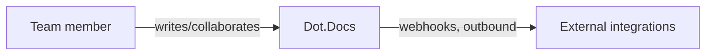

# Dot.Docs

> **Platform-owned source:** [Dot.Docs's wiki.md](https://github.com/sakhilebhayi/Dot.docs/blob/main/wiki.md) — the platform's own knowledge home. This document is Dot.Brain's ingested view; the wiki is authoritative for what the platform actually is.

## 1. Purpose & Business Domain

A real-time collaborative document/wiki platform (Notion/Confluence-shaped): documents with version history, threaded comments, AI-assisted writing (OpenAI `gpt-4o`, not Anthropic Claude as earlier docs claimed — corrected), slash commands, templates, and inbound/outbound webhooks. Genuine Reverb-broadcast presence and collaboration events back this, not a simulated realtime layer.

## 2. Entities Owned

| Entity | Graph node type | Natural key | Notes |
|---|---|---|---|
| Document | `entity:asset` | document ID | Core content unit |
| DocumentVersion | `observation` | document × version | Full version history with diff/restore |
| DocumentCollaborator | `entity:process` | document × user | Real-time presence/collaboration |
| Comment | `entity:asset` | comment ID | Threaded, document-scoped |
| DocumentTemplate | `entity:asset` | template ID | Global, team, or author-scoped visibility |
| DocumentSlashCommand | `entity:asset` | command ID | In-editor slash-command catalog |
| DocumentWebhook | `entity:process` | webhook ID | Outbound integration point |
| AiSuggestion | `observation` | suggestion ID | AI-assist output, logged |

## 3. Events Emitted

Real-time Reverb broadcast events for presence/collaboration exist within the app but are not yet DKP-mapped ecosystem events — internal only, not published outward.

## 4. Knowledge Packs Published

None. No DKP manifest or publish pipeline exists.

## 5. Intelligence Consumed

None currently subscribed.

## 6. Cross-Platform Relationships

No cross-platform data exchange with other Dot Ecosystem platforms yet beyond shared ecosystem SSO and the shared `infodot` database.

## 7. Tenancy Model

Team/collaborator-scoped. The integration pass found and closed two real IDOR gaps: `VersionHistory`'s diff/preview actions used unscoped `DocumentVersion::find($id)` (cross-document content disclosure), and `TemplateGallery::useTemplate()` used unscoped `DocumentTemplate::findOrFail($id)` (could pull another team's private template). Both fixed to match the visibility rules already used elsewhere in the app.

## 8. Dopamine Surface

None identified as in-scope; not audited for engagement mechanics this pass (not this platform's stated purpose).

## 9. Active Recommendations

None — no Knowledge Pack publishing yet.

## 10. Incident History Summary

None recorded as a live incident. Real findings from the 2026-08-02 integration pass: `.env.example` had `DB_DATABASE` commented out, silently falling back to a nonexistent `laravel` database instead of the shared `infodot` instance — fixed before it could cause a real outage.

## Verified Infrastructure State (2026-08-07)

Confirmed directly against the real repo during the ecosystem-wide standardization + code-quality pass (full 26-platform summary: [brain.platforms.md](../brain.platforms.md) change log, v1.0.21):

- **Legal/branding/auth** — branded Markdown-mail theme, complete POPIA-aligned Privacy Policy/Terms/Cookie Policy naming **BluePin Inc**, guest auth pages restyled to match the welcome-page hero.
- **Laravel Boost** — `laravel/boost` ^2.5 installed. Boost's own install banner ("Let's give **Laravel** a Boost") surfaced a pre-existing, unrelated cosmetic gap: `.env`'s `APP_NAME` is still the stock `Laravel` value — already documented in this repo's own mail-theme code comments, not touched. `.mcp.json`/`boost.json`/`CLAUDE.md` guideline block in place.
- **Code-quality pass** — Pint: 43 files reformatted, formatting-only. `composer audit`: **23 advisories across 9 packages**, all patched — same combination and fix as dot-press: `laravel/framework` (signed-URL/CRLF), `dompdf/dompdf` → 3.1.6, `symfony/*` transitive, `league/commonmark` baseline. `npm audit`: patched `ws` uninitialized-memory-disclosure + memory-exhaustion DoS (12 issues); separately, `package.json` had the same unusual `axios` upper-bound pin (`>=1.11.0 <=1.14.0`) found on dot-forms, blocking 7 real advisories — loosened to `^1.19.0`, usage confirmed minimal (`bootstrap.js` only), `npm run build` verified clean (TipTap + Alpine + Echo stack). Full suite reconfirmed green (43 passed / 4 skipped / 82 assertions) after every change.

## Autonomy Classification (brain.autonomy.md)

Per [brain.autonomy.md](../brain.autonomy.md) §2. Audited against the real codebase at `~/Dot/Dot.docs` on 2026-08-08 — not aspirational.

### Level 1 — Autonomous

- **Daily notification digest** — `app/Console/Commands/SendDailyDigest.php` (`notifications:digest`), scheduled via `routes/console.php` (`Schedule::command('notifications:digest')->dailyAt('08:00')`). Runs unattended on a cron trigger, queries users with unread notifications, and emails a summary via `DailyDigestNotification`. Routine reporting/notification — no owner review needed for it to run or to decide who receives it.
- **Queued in-app/email notification delivery** — `app/Notifications/CommentPostedNotification.php` and `app/Notifications/MentionedInCommentNotification.php`, both `implements ShouldQueue`, dispatched automatically when a `Comment` is posted (via `app/Events/CommentPosted.php`) with no human step in between. Routine, low-stakes, user-to-user notification traffic.
- **Per-request authorization enforcement** — `app/Policies/DocumentPolicy.php` and `app/Policies/TeamPolicy.php`, evaluated automatically on every request via Laravel's policy gate (no custom middleware directory exists; `bootstrap/app.php`'s `withMiddleware()` closure is empty, so `auth:sanctum` / `verified` / Jetstream's session guard plus these policies are the real access-control surface). Access allow/deny decisions execute without the operator being in the loop for any individual request — this is what "safe automated remediation"-class routine operation looks like here.

### Level 2 — Escalate

None found. I checked for anything matching the L2 examples in brain.autonomy.md §2 (significant spending, pricing changes, partnerships, contract changes, high-value sales, sensitive customer communications, material resource allocation, significant hiring): there is no billing/payments integration, no queued job or controller action that prepares a high-stakes action and pauses for operator sign-off, and `app/Jobs/` and `app/Listeners/` are both empty. The one candidate — `app/Services/WebhookService.php` firing outbound HTTP calls to user-configured third-party URLs on document save/export — executes synchronously and immediately with no approval gate at all (it's per-document, owner-configured, and logs failures rather than escalating them), so as implemented it doesn't rise to a genuine Level 2 "prepare and wait for approval" pattern; it also doesn't match any L2 example category. There is currently no code path in Dot.docs that presents Context → Evidence → Risk → Recommendation → Proposed Action and waits for a human.

### Level 3 — Human Control

- **No CI/CD pipeline exists.** `find .github -type f` returns nothing and `ls -la .github` fails (directory absent) as of 2026-08-08. Every deploy, dependency-security pass, and formatting pass documented in this file's own "Verified Infrastructure State" section (Pint reformat, `composer audit` fixing 23 advisories, `npm audit` fixing the `ws` and `axios` issues) was run manually by a human-directed session, not by an automated pipeline. This remains true today.
- **Background worker & broadcast-server operation.** `config/queue.php` defaults to `QUEUE_CONNECTION=database` (confirmed in `.env` and `.env.example`), and the queued notifications above depend on a running `php artisan queue:work` process; `routes/channels.php` and `app/Broadcasting/DocumentPresenceChannel.php` depend on a running Reverb broadcast server for the realtime presence/collaboration events described in this file's §3. No `Procfile`, supervisor config, or any process-manager file was found anywhere in the repo (`find . -iname "Procfile*" -o -iname "supervisor*"` returns nothing outside `vendor`/`node_modules`). Keeping these processes alive and monitored is currently a manual operator responsibility.
- **Credential and environment configuration.** `.env` / `.env.example` hold the OpenAI API key, database credentials, and app secrets directly; there is no automated secret-rotation or credential-issuance process in the codebase. Per brain.autonomy.md §2, security credential ownership is explicitly non-delegable.
- **Open security reviews already flagged as human-only in this document's own §"Open Questions".** The public `/shared/{uuid}` password/expiry routes (`routes/web.php`) and `Document::cachedContent()`'s caching strategy under concurrent/private access are both recorded above as unreviewed and routed to a human Security/Architecture Agent — that routing is itself the correct Level 3 call, not a gap.

### Gap summary

Level 2 has no real occupant today because Dot.docs has no workflow that both (a) prepares a materially consequential action automatically and (b) blocks on operator approval before executing it — everything automated here is low-stakes and fires immediately (Level 1), and everything higher-stakes (deploys, dependency patching, credential handling) is entirely manual with no automation attempting it at all (Level 3). The first real Level 1→2 boundary would need something like: outbound webhook *registration* (not delivery) requiring approval before a new third-party endpoint starts receiving document data, or a CI/CD pipeline that runs `composer audit`/`npm audit`/tests automatically and opens a human-approved deploy gate instead of the current fully-manual pass.

## Change Log

| Version | Date | Author | Change |
|---|---|---|---|
| 1.1.0 | 2026-08-08 | Platform Autonomy Classification sub-project | Added Autonomy Classification section per brain.autonomy.md §2 |
| 1.0.0 | 2026-08-02 | Repository Steward Agent | Initial registration. Platform audited: SSO contract verified, DB_DATABASE misconfiguration fixed, two real IDOR gaps closed (VersionHistory, TemplateGallery), favicon wired into the main app-shell layout (previously missing), README corrected (Laravel 12→13, Anthropic→OpenAI, unshipped Redis/Horizon/Scout/Meilisearch removed). |

## Open Questions

| Question | Owner → Approver |
|---|---|
| `Document::cachedContent()`'s public-only caching strategy — reviewed for correctness under private/collaborative documents? | Docs Platform Lead → Architecture Agent |
| The public `/shared/{uuid}` password/expiry routes were not fully security-reviewed this pass — worth a dedicated look. | Docs Platform Lead → Security Agent |
