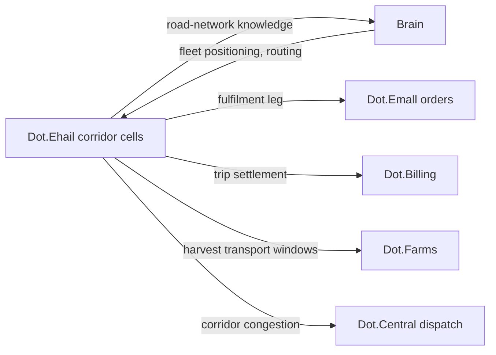

# Dot.Ehail

> **Platform-owned source:** [Dot.Ehail's wiki.md](https://github.com/sakhilebhayi/Dot.Ehail/blob/main/wiki.md) — the platform's own knowledge home. This document is Dot.Brain's ingested view; the wiki is authoritative for what the platform actually is.

## 1. Purpose & Business Domain

Ride-hailing and light logistics: passenger trips, courier deliveries, and fleet operations for owner-operators and fleet companies. Owns the movement domain: vehicles, trips, corridors, and fleet economics. Ehail's data problem is location: a trip trace is simultaneously operational gold (corridor knowledge, demand patterns) and a movement diary of identifiable people — drivers *and* passengers. The corpus's aggregation discipline applies with a spatial twist (§7): floors are counted in **distinct vehicles and distinct trips per corridor-cell × window**, and precision is degraded spatially (corridor cells, not coordinates) before it is degraded statistically. The fleet entity model (registry gap) is closed in §2.

## 2. Entities Owned (fleet entity model — registry gap closed)

| Entity | Graph node type | Natural key | Notes |
|---|---|---|---|
| Fleet | `entity:site` | `dot:node:logistics:fleet:<id>` | Tenant root — from single owner-operator (fleet of 1) to company fleets |
| Vehicle | `entity:asset` | fleet + VIN | Class-attributed (sedan, van, bakkie, truck) |
| Driver role-assignment | `entity:process` | assignment ID | Links a driver *role* to a vehicle-shift; the person behind it is HR-style excluded (no individual node) |
| Corridor cell | `entity:site` | geohash-5 cell + road class | The spatial publication unit — trips aggregate to cells, never to traces |
| Trip (operational) | — | — | **Never graphed individually.** Platform-internal; only corridor-cell aggregates cross |
| Corridor observation | `observation` | cell × vehicle-class × window | ≥ 30 vehicles, ≥ 100 trips per cell-window |
| Delivery outcome | `outcome` | recommendation + period | Verification ground truth |

The model resolves the gap's core question: the graph's unit is the **fleet and the corridor, not the vehicle-journey**. Individual trips follow employment records (HR §2) in having no graph representation by design.

## 3. Events Emitted

| Event | Trigger | Consumers | Frequency |
|---|---|---|---|
| `logistics.trip.completed/cancelled` | Trip lifecycle | Brain (cell aggregates only), Dot.Billing | ~10⁴/day |
| `logistics.corridor.congestion_shift` | Cell-level travel-time regime change | Brain, Dot.Central, subscribing fleets | low |
| `logistics.fleet.utilization_cycle` | Fleet reporting cycle | Brain, Dot.Analytics | daily |

## 4. Knowledge Packs Published

| Payload type | Cadence | Example pack ID |
|---|---|---|
| observation (corridor-cell travel-time/demand aggregates) | daily batch | `dkp:ehail:obs:2026-07-14:0021` |
| insight (corridor-regime findings) | per finding | `dkp:ehail:ins:2026-06-25:0001` |
| outcome (recommendation verifications) | per verified recommendation | `dkp:ehail:out:2026-07-30:0001` |
| incident (safety events, aggregation-gate events) | per incident | `dkp:ehail:inc:2026-05-05:0001` |

Corridor knowledge is Ehail's distinctive export: no other platform observes road-network conditions continuously. Mines' haul-road findings were pit-internal; Ehail covers the public network between farm gate, market, and depot — the physical substrate of the Farms→Emall value chain's fulfilment leg.

## 5. Intelligence Consumed

| Recommendation type | Metric expected to move | Baseline |
|---|---|---|
| Fleet-positioning (pre-position by predicted cell demand) | `logistics.pickup_wait_p50` | 2026 H1, per cell class |
| Corridor-routing (avoid regime-shifted cells) | `logistics.trip_duration_vs_estimate` | per corridor |
| Maintenance-scheduling (vehicle-class wear patterns — Mines' moisture-indexed inspection pattern P-2026-001 is a candidate transfer, pending condition checks: public roads ≠ lateritic haul roads, so C fails on road-surface condition; recorded as a known non-transfer candidate rather than silently analogized) | `logistics.vehicle_downtime_rate` | 2026 H1 |

## 6. Cross-Platform Relationships



Seams: trip payment is Billing's (Ehail owns the trip record, Billing the settlement — same pattern as Emall orders); Emall fulfilment delivery is a Ehail trip with an order reference; Farms' harvest-logistics delay has a public-road component that Ehail's corridor cells can now explain — a three-platform evidence join (Farms delay × Ehail corridor × Emall listing timing) available to Analytics.

## 7. Tenancy Model & Location-Sensitive Publication

Tenant key = fleet; owner-operators are fleets of one, protected by the same floors as company drivers (no small-fleet carve-out — a fleet of one is maximally identifiable). Publication discipline, spatial-first:

| Gate | Rule |
|---|---|
| Spatial degradation | Publication unit is the geohash-5 corridor cell; no coordinates, traces, or origin-destination pairs ever publish |
| Cell floor | ≥ 30 distinct vehicles AND ≥ 100 trips per cell × window; sparse cells merge to neighbors or suppress |
| O-D exclusion | Origin-destination *pairs* are prohibited even in aggregate — pair patterns re-identify at much larger n than single-cell counts |
| Temporal floor | Minimum window 1 hour urban, 24 hours rural (rural cells are sparse and identifying) |
| Driver/passenger exclusion | Per-person data (ratings, earnings, behavior) never publishes; HR's work-not-workers principle applies to drivers verbatim |

## 8. Dopamine Surface

Withheld: driver earnings leaderboards and acceptance-rate pressure (rate-metric leaderboards — the gig-economy instantiations of the prohibited list, named explicitly because the industry default is to deploy them), streak bonuses on consecutive trips (loss-framed streaks driving fatigued driving — a *safety* failure mode, not just an ethical one), passenger surge-gamification. Shared: fleet-level utilization and safety-incident-free performance, cell-level demand forecasts to fleets (legible, collective, decision-shaped).

## 9. Active Recommendations

Maintained by the Registry Agent. Current: fleet-positioning `verified` — see §13; corridor-routing for two regime-shifted rural cells `open` (expiry 2026-08-25).

## 10. Incident History Summary

One incident pack (2026-05): a rural cell-window published with 4 vehicles — floor breach caught post-publication by a consuming platform's validation (defense in depth working from the consumer side); pack revoked per lifecycle rules, cell-merge logic fixed, published as an incident with the revocation chain intact. Consumed: HR's region-rollup lesson (direct input to the cell-merge fix) and Central's alert-precision pattern for congestion-shift events.

## 11. Domain Metrics (registered per brain.metrics.md §4.8)

| ID | Type | Definition |
|---|---|---|
| `logistics.pickup_wait_p50` | duration | Request to pickup, median, per cell class |
| `logistics.trip_duration_vs_estimate` | ratio | Actual / estimated trip duration, p50 per corridor |
| `logistics.vehicle_downtime_rate` | ratio | Vehicle-days unavailable / fleet vehicle-days, monthly |

## 12. Manifest (platform.dkp.json example)

```json
{
  "platform_id": "dot-ehail",
  "dkp_version": "1.0.0",
  "signing_key_ref": "vault://keys/dot-ehail/dkp-signing/v1",
  "publishes": ["observation", "insight", "outcome", "incident"],
  "subscribes": ["fleet-positioning", "corridor-routing", "maintenance-scheduling"],
  "schemas": { "knowledge-pack": "1.0.0", "metric": "1.0.0" },
  "default_classification": "ecosystem",
  "tenancy": {
    "key": "fleet_id",
    "aggregation_floor": 30,
    "publication_rules": [
      { "rule": "spatial-cell-only", "cell": "geohash-5", "enforcement": "reject-at-ingestion" },
      { "rule": "no-origin-destination-pairs", "enforcement": "reject-at-ingestion" },
      { "rule": "cell-trip-floor", "min_trips": 100, "enforcement": "reject-at-ingestion" }
    ]
  }
}
```

## 13. Worked round-trip

1. **Pack:** `dkp:ehail:obs:2026-07-14:0021` — corridor-cell demand and travel-time aggregates for Northern Cape market-town cells during the harvest-transport window; 47 vehicles, 380 trips per qualifying cell-window (all §7 gates pass).
2. **Validation → graph:** `OBSERVED_WITH` edge between Farms' harvest-dispatch windows and cell demand spikes 2–4 hours later, 0.73; corroborated by Emall's order-fulfilment timing (×1.10 → 0.80) — the fulfilment leg's physics made visible.
3. **PR back (fleet-positioning):** pre-position van-class vehicles to market-town cells in the 2-hour window after harvest-dispatch peaks; confidence 0.80, impact `logistics.pickup_wait_p50` −25% predicted for those cell-windows, guards: `logistics.vehicle_downtime_rate` flat, no driver-hours ceiling breach, expiry 45 days.
4. **Outcome:** `dkp:ehail:out:2026-07-30:0001` — −29% pickup wait verified against non-positioned cell cohort; guards held. Downstream, Farms' `agriculture.produce_time_to_market_p50` gains its third contributing platform — the value chain's fulfilment leg now has corridor-level evidence Analytics can join into the chain view.

## Verified Infrastructure State (2026-08-07)

Confirmed directly against the real repo during the ecosystem-wide standardization + code-quality pass (full 26-platform summary: [brain.platforms.md](../brain.platforms.md) change log, v1.0.21):

- **Legal/branding/auth** — branded Markdown-mail theme, complete POPIA-aligned Privacy Policy/Terms/Cookie Policy naming **BluePin Inc**, guest auth pages restyled to match the welcome-page hero.
- **Laravel Boost** — `laravel/boost` ^2.5 installed; `.mcp.json`/`boost.json`/`CLAUDE.md` guideline block in place.
- **Code-quality pass** — Pint: 19 files reformatted, formatting-only. `composer audit`: patched 6 `league/commonmark` DoS advisories. `npm audit`: patched postcss path-traversal + shell-quote ReDoS (via concurrently). Full suite reconfirmed green (63 tests / 56 passed / 117 assertions) after every change.

## Autonomy Classification (brain.autonomy.md)

Per [brain.autonomy.md](../brain.autonomy.md) §2. Audited against the real codebase at `~/Dot/Dot.Ehail` on 2026-08-08 — not aspirational.

### Level 1 — Autonomous

- **Automatic in-app ride-completion notification.** `app/Observers/RideObserver.php`, registered in `app/Providers/AppServiceProvider.php::boot()` (`Ride::observe(RideObserver::class)`), fires whenever a `Ride.status` transitions to `completed`. It dispatches `App\Notifications\RideCompletedNotification` (database channel only) to the ride's passenger and driver with no operator step in between — no approval, no queue, no manual trigger. This is routine, reversible, low-risk notification/reporting behavior with a real automatic trigger in code, so it qualifies as Level 1 under the "routine ... reporting" example class. It is the only process found anywhere in the repo that both (a) is real (not planned) and (b) runs with zero operator involvement.

No other qualifying process was found: `routes/console.php` contains only Laravel's stock `inspire` Artisan command (no `app/Console/Kernel.php`, no `schedule()` method, no cron entries anywhere in the repo), there is no `app/Jobs/` directory (no queue worker–driven business process despite `QUEUE_CONNECTION=database` being configured in `.env`), and no CI/CD pipeline exists (`.github/workflows/` is absent) that could auto-deploy or auto-remediate anything.

### Level 2 — Escalate

None found. Level 2 requires a system that analyses and *prepares* an action for a named human to approve before it executes (Context → Evidence → Risk → Recommendation → Proposed Action). Checked: `app/Notifications/DriverApplicationSubmittedNotification.php` is the closest candidate — it's built for a driver-application review workflow — but its own docblock states it is "not yet wired to any automatic trigger — dispatch manually ... until driver onboarding has real observer/event wiring." No controller, observer, or job in the repo calls it; there is no code path that prepares a driver-approval decision for Sakhile Bhayi (or anyone) to approve. `grep -rli "approve|approval" app` returns zero matches — driver `status` (`pending`/`approved` on `DriverProfile`) has no approve/reject controller or action anywhere; it can only be changed by hand (console/DB), which makes it Level 3, not Level 2 (there is no automated proposal stage, only a manual field). No recommendation, pricing, spend, or partnership logic exists in the codebase at all (`app/Actions/` is Jetstream/Fortify account-management boilerplate only — team invites, password resets, profile updates — none of it ecosystem- or business-decision-facing).

### Level 3 — Human Control

- **Driver application approval.** `DriverProfile.status` (`app/Models/DriverProfile.php`, fillable `status`) has no code path that transitions it from `pending` to `approved` — no controller, Livewire component, or console command touches it. Every approval is a manual, out-of-band operator action (direct DB/Tinker edit today). `DriverApplicationSubmittedNotification` (`app/Notifications/DriverApplicationSubmittedNotification.php`) exists to alert an operator that a decision is needed but must itself be dispatched by hand, per its docblock.
- **Deployment / CI-CD.** No `.github/workflows/` directory exists anywhere in the repo (confirmed by direct search). There is no automated test-gate, build, or deploy pipeline; every release, migration run, and environment change is a manual operator action.
- **Security credential and key management.** `.env` / `.env.example` hold `QUEUE_CONNECTION`, `BROADCAST_CONNECTION`, `MAIL_MAILER`, and Sanctum/Jetstream secrets directly on disk with no vault or rotation automation in this repo; the manifest referenced from `platforms/dot-ehail.md` §12 (`vault://keys/dot-ehail/dkp-signing/v1`) is aspirational for this platform — no signing-key code exists in `~/Dot/Dot.Ehail` itself. Credential issuance and rotation are manual operator actions.
- **Ecosystem SSO token issuance.** `app/Http/Controllers/Auth/EcosystemAuthController.php` only *consumes* a pre-issued Sanctum `PersonalAccessToken` (validates the `ecosystem:read` ability, logs the user in, deletes the token). Nothing in this repo issues, scopes, or revokes ecosystem tokens proactively — that authority sits entirely with whichever human/process mints the token upstream, i.e. Sakhile Bhayi/ops, not this platform.
- **Knowledge Pack publishing pipeline.** Per `wiki.md` §5/§8 and confirmed absent in code: `logistics.trip.completed`/`cancelled` and the other events in this doc's §3 have no publishing pipeline in the repo. Any corridor-cell aggregation, floor-gate enforcement, or pack signing described in §7/§12 of this document is manual/non-existent today, not an automated Level 1 or Level 2 process.

### Gap summary

The platform's only real automatic process (Level 1 ride-completion notification) is a passive side-effect, not a decision. For a first genuine Level 1 *business* process to exist, the platform needs at minimum: a scheduled command or queued job (neither directory exists yet) that does real autonomous work — e.g. an automated driver-application pre-screen that checks license/ID validity and either auto-approves low-risk applications or escalates to Level 2 for Sakhile Bhayi's review — backed by an actual approve/reject code path, which does not exist today (`DriverProfile.status` has none).

## Change Log

| Version | Date | Author | Change |
|---|---|---|---|
| 1.0.0 | 2026-08-01 | Platform Integrator (prompt 05, AI) | Initial integration package: fleet entity model closed (fleet + corridor cell as graph units, individual trips excluded by design), spatial-first publication discipline (geohash-5 cells, O-D pair prohibition, dual floors), gig-economy prohibited-list instantiations named, P-2026-001 recorded as non-transfer candidate with failed condition, 3 domain metrics, worked round-trip |

| 1.0.1 | 2026-08-01 | Repository Steward Agent | Linked to Dot.Ehail's own wiki.md (platform repo) as the platform-owned source of truth |

| 1.0.2 | 2026-08-08 | Platform Autonomy Classification sub-project | Added Autonomy Classification section per brain.autonomy.md §2 |

## Open Questions

| Question | Owner → Approver |
|---|---|
| Geohash-5 cell size (~5 km) vs. urban density — should urban cells refine to geohash-6 with proportionally raised floors? | Logistics Agent → Security Officer |
| The three-platform evidence join (Farms × Ehail × Emall) — assemble as an Analytics chain-view extension, and does it trip patterns' second-chain-view P-entry trigger? | Analytics Agent → Chief Architect |
