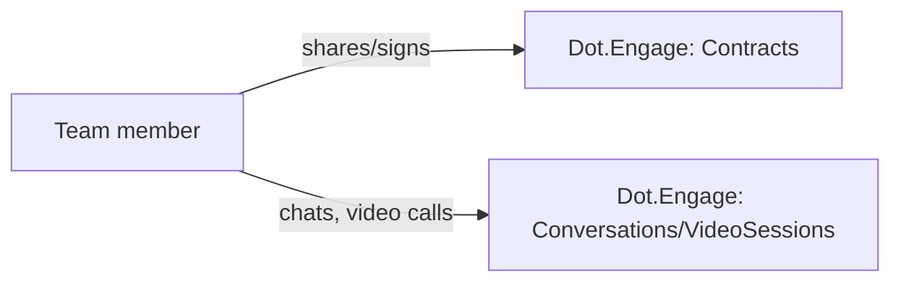

# Dot.Engage

> **Platform-owned source:** [Dot.Engage's wiki.md](https://github.com/sakhilebhayi/Dot.Engage/blob/main/wiki.md) — the platform's own knowledge home. This document is Dot.Brain's ingested view; the wiki is authoritative for what the platform actually is.

## 1. Purpose & Business Domain

**Domain correction (2026-08-02):** despite the ecosystem registry's `campaign` icon suggesting a marketing/engagement-campaign product, the real, built codebase is a contract-sharing, real-time chat, and video-call document-signing platform — not CRM/proposals/scheduling as an earlier README claimed. Real entities: Contract, ContractSignature, ContractVersion, Conversation, Message, VideoSession, VideoSessionSignature. The icon/name mismatch is a registry-side issue, not a code issue — flagged for whoever owns `os/Appendix.md`'s icon mapping.

## 2. Entities Owned

| Entity | Graph node type | Natural key | Notes |
|---|---|---|---|
| Contract | `entity:asset` | contract ID | Team-scoped |
| ContractVersion | `observation` | contract × version | Versioned document content |
| ContractSignature | `outcome` | signature ID | Signing record |
| Conversation | `entity:process` | conversation ID | Real-time chat, team-scoped |
| Message | `observation` | message ID | Chat message |
| VideoSession | `entity:process` | session ID | Live video-call, team-scoped |
| VideoSessionSignature | `outcome` | session × signature | In-call document signing |

## 3. Events Emitted

Two dead events found during integration: `VideoSessionStarted` and `ContractShared` are declared and have listeners registered, but nothing in the codebase actually dispatches them — flagged as a real gap, not fixed (dispatch-point decision belongs to the platform team).

## 4. Knowledge Packs Published

None. No DKP manifest or publish pipeline exists.

## 5. Intelligence Consumed

None currently subscribed.

## 6. Cross-Platform Relationships

No cross-platform data exchange with other Dot Ecosystem platforms yet beyond shared ecosystem SSO and the shared `infodot` database.

## 7. Tenancy Model

Team-scoped via `team_id` on Contract/Conversation/VideoSession. The integration pass found and fixed the most severe issue across all 7 newly-integrated platforms' dashboard code: a prior commit added `/dashboard` stat queries (`Contract::count()`, `Conversation::whereNotNull(...)->count()`, etc., plus actual `recentContracts`/`activeConversations` record listings) with **zero team scoping** — every team's dashboard showed every other team's aggregate counts and actual contract/conversation records. This was a live, exploitable cross-tenant data leak, not a theoretical one. Fixed by scoping every query to `Auth::user()->currentTeam->id`. Also closed a missing-authorization gap in three Livewire components (`VersionHistory`, `InCallDocumentViewer`, `ParticipantList`) that performed by-ID lookups with no Policy check.

## 8. Dopamine Surface

Explicitly checked given the platform's name and original "engagement" framing — clean. No streak/badge/points/leaderboard/dark-pattern mechanics found anywhere in the codebase; the notification/unread-count components are plain inbox-style counters, not attention-capture loops. Consistent with the manifesto's ethical-engagement principle.

## 9. Active Recommendations

None — no Knowledge Pack publishing yet.

## 10. Incident History Summary

**Real, live cross-tenant data leak** (§7) — the most severe finding across this 7-platform integration batch. Closed 2026-08-02, same day it was found, before any known exploitation. Introduced by an incomplete prior "fix" commit (`5dae85f`) that added the dashboard queries without team scoping.

## Verified Infrastructure State (2026-08-07)

Confirmed directly against the real repo during the ecosystem-wide standardization + code-quality pass (full 26-platform summary: [brain.platforms.md](../brain.platforms.md) change log, v1.0.21):

- **Legal/branding/auth** — branded Markdown-mail theme, complete POPIA-aligned Privacy Policy/Terms/Cookie Policy naming **BluePin Inc**, guest auth pages restyled to match the welcome-page hero.
- **Laravel Boost** — `laravel/boost` ^2.5 installed; `.mcp.json`/`boost.json`/`CLAUDE.md` guideline block in place.
- **Code-quality pass** — Pint: 69 files reformatted, formatting-only. `composer audit`: this platform had the largest blast radius found in the pass — **25 advisories across 10 packages**, all patched: `laravel/framework` (temporary signed-URL path confusion, CRLF injection in the default email validation rule — CVE-2026-48019), `dompdf/dompdf` → 3.1.6 (6 issues: SVG file-existence leak, resource-exhaustion DoS ×2, local file read, chroot bypass), `spatie/laravel-medialibrary` → 11.23.0 (file-upload restriction bypass CVE-2026-48557, SSRF CVE-2026-48555), `symfony/http-foundation`/`http-kernel`/`mailer`/`mime`/`routing` (transitive, CRLF/SMTP injection, HEAD-request auth bypass, route-requirement bypass), `league/commonmark` (baseline DoS set). `npm audit`: patched Vite `server.fs.deny` bypass and `launch-editor` NTLMv2 hash disclosure. Full suite reconfirmed green (92 passed / 145 assertions) after every change.

## Autonomy Classification (brain.autonomy.md)

Per [brain.autonomy.md](../brain.autonomy.md) §2. Audited against the real codebase at `~/Dot/Dot.Engage` on 2026-08-08 — not aspirational.

### Level 1 — Autonomous

These are real, scheduled, non-destructive, bounded operations that already run without Sakhile Bhayi in the loop, per `routes/console.php` and the commands/jobs it invokes:

- **`dotengage:clean-expired-sessions`** (`app/Console/Commands/CleanExpiredVideoSessions.php`) — hourly via `Schedule::command(...)->hourly()`. Marks video sessions stale for >24h as `ended` and dispatches `ArchiveVideoSession`. Reversible-in-effect (status flip + archival, no deletion), bounded query, logs every run to `storage/logs/clean-expired-sessions.log`. Routine monitoring/remediation per the Level 1 examples list.
- **`dotengage:retry-failed-uploads`** (`app/Console/Commands/RetryFailedContractUploads.php`) — every 15 minutes. Re-dispatches `ProcessContractUpload` for contracts stuck in `draft` >30 minutes, capped at `--limit=50`. Bounded, idempotent-safe (job only flips status/records size), logged.
- **`dotengage:team-activity-report`** (`app/Console/Commands/GenerateTeamActivityReport.php`) — monthly on the 1st at 06:00. Read-only aggregation (contract/message/session counts per team) written to a log/table, no side effects on data. Routine analytics/reporting per the Level 1 examples list.
- **Queued jobs triggered by the above / by normal contract flow** — `ProcessContractUpload`, `ArchiveVideoSession`, `GenerateSignedContractPdf`, `DispatchSignedContractEmail` (all in `app/Jobs/`) — each is a bounded, single-record, retry-capped (`tries`/`backoff` set), logged operation (file-existence check + status update, signature promotion, PDF generation, templated email dispatch). None commits funds, alters permissions, or is irreversible.
- **Transactional notifications** (`app/Notifications/*.php`: `ContractSharedNotification`, `ContractSignedNotification`, `NewMessageNotification`, `SignatureRequestedNotification`, `VideoSessionInviteNotification`) — templated mail+database notifications fired by normal in-app events, no owner review needed per send. Routine, low-risk, addressed to the acting users themselves.

### Level 2 — Escalate

None found. Checked: `routes/console.php` (the only three scheduled commands, all Level 1), `app/Jobs/*.php` (four jobs, all bounded/routine), `app/Notifications/*.php` (five notifications, all routine/transactional), `routes/api.php` and `routes/web.php` (all mutation is via Livewire components behind `auth:sanctum`+`verified`, not a scheduled/autonomous operator process), and `app/Policies/*.php` (authorization checks, not autonomous actions). There is no process in this codebase that prepares a consequential action and pauses for Sakhile Bhayi's approval before executing — the platform has no Level 2 escalation surface at all today (e.g. nothing analogous to "significant spending" or "sensitive customer communications" requiring pre-execution sign-off).

### Level 3 — Human Control

- **Deployment / release** — no CI/CD pipeline exists in the repo: `find . -iname "*.yml" -o -iname "*.yaml"` (excluding `vendor/`, `node_modules/`) returns nothing, and there is no `.github/` directory. Every deploy is manual-only by omission, not by policy — Sakhile Bhayi (or whoever runs deploy commands) is the only path to production today.
- **Security-credential / dependency-vulnerability remediation** — the `composer audit`/`npm audit` patching documented in "Verified Infrastructure State (2026-08-07)" above (Laravel CVE-2026-48019, dompdf, spatie/laravel-medialibrary CVE-2026-48557/CVE-2026-48555, symfony transitive CRLF/auth-bypass fixes) was a manual, human-directed pass — no automated dependency-update/patch pipeline exists in the repo to make this recurring without a human driving it.
- **Cross-tenant data-leak / IDOR remediation** (`## 7. Tenancy Model`, `## 10. Incident History Summary`) — the live cross-tenant dashboard leak (unscoped `Contract::count()` etc. in `routes/web.php`) and the missing-authorization gaps in `VersionHistory`, `InCallDocumentViewer`, `ParticipantList` Livewire components were found and fixed by a human-directed audit pass, not by any autonomous remediation process. No self-healing/auto-detection mechanism for tenant-scoping regressions exists in the codebase today.
- **Broadcast-authorization audit** (`routes/channels.php`) — explicitly flagged as un-audited in this platform doc's Open Questions; until audited, any change here is Level 3 by default since it gates who can listen on private/team channels (security-credential-adjacent, per §2's examples).
- **Contract/video-session domain and schema decisions** — e.g. whether to wire the two dead events (`VideoSessionStarted`, `ContractShared`) documented in `## 3. Events Emitted`, or the `os/Appendix.md` icon-mismatch fix in Open Questions — these are architecture/strategic-direction decisions reserved for a human per §2's "strategic direction" example, not something any current process executes.

### Gap summary

The platform has zero Level 2 processes today because nothing in the codebase currently prepares a consequential, reversible-but-risky action and pauses for approval before executing it — its only autonomous behavior (Level 1) is scheduled maintenance/reporting, and everything else observed is either a routine transactional side effect or fully manual (Level 3). The first real Level 2 process would need to be built around one of the existing manual Level 3 flows — most plausibly dependency/CVE patching (`composer audit`/`npm audit` results already exist as raw material) surfaced as a Context → Evidence → Risk → Recommendation → Proposed Action proposal that Sakhile Bhayi approves before it's applied, rather than the current fully-manual pass.

## Change Log

| Version | Date | Author | Change |
|---|---|---|---|
| 1.1.0 | 2026-08-08 | Platform Autonomy Classification sub-project | Added Autonomy Classification section per brain.autonomy.md §2 |
| 1.0.0 | 2026-08-02 | Repository Steward Agent | Initial registration. Platform audited: real domain corrected (contract/chat/video-signing, not CRM), a live cross-tenant dashboard data leak fixed, three Livewire IDOR gaps closed, favicon added (was completely missing), README corrected. |

## Open Questions

| Question | Owner → Approver |
|---|---|
| `os/Appendix.md`'s `campaign` icon for this platform no longer matches its real domain — should it be updated to something contract/signing-related? | Registry Agent → Chief Knowledge Engineer |
| `VideoSessionStarted`/`ContractShared` events are declared but never dispatched — should they be wired now, or is this intentionally deferred? | Engage Platform Lead → Architecture Agent |
| `routes/channels.php` broadcast-authorization callbacks were not audited this pass. | Engage Platform Lead → Security Agent |
