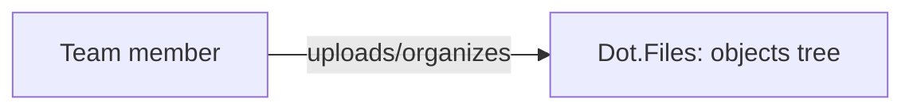

# Dot.Files

> **Platform-owned source:** [Dot.Files's wiki.md](https://github.com/sakhilebhayi/Dot.Files/blob/main/wiki.md) — the platform's own knowledge home. This document is Dot.Brain's ingested view; the wiki is authoritative for what the platform actually is.

## 1. Purpose & Business Domain

A team-scoped file and folder manager: upload, organize into folders, search, download. Built on a single self-referential `objects` table (polymorphic File/Folder via `staudenmeir/laravel-adjacency-list`) rather than separate tables per type. One Livewire component (`FileBrowser`) drives the whole UI. No previews, versioning, granular sharing, or S3 backing exist yet, despite earlier README claims to the contrary — corrected during this platform's integration pass.

## 2. Entities Owned

| Entity | Graph node type | Natural key | Notes |
|---|---|---|---|
| Object (File/Folder) | `entity:asset` | object ID | Polymorphic, self-referential tree; team-scoped |

## 3. Events Emitted

None currently. No domain events are dispatched — uploads/renames/deletes persist directly with no event bus integration. Roadmap, not shipped.

## 4. Knowledge Packs Published

None. No DKP manifest, signing key, or publish pipeline exists.

## 5. Intelligence Consumed

None currently subscribed.

## 6. Cross-Platform Relationships

No cross-platform integration exists beyond the shared ecosystem SSO (InfoDot handoff, verified working) and the shared `infodot` PostgreSQL database.

## 7. Tenancy Model

Team-scoped via `team_id` on the `objects` table, enforced consistently — the integration-pass security scan found every by-ID lookup already routed through `Obj::forCurrentTeam()` or an explicit Policy check.

## 8. Dopamine Surface

None. A file manager has no engagement mechanics in scope.

## 9. Active Recommendations

None — no Knowledge Pack publishing yet, so nothing for the Registry Agent to act on.

## 10. Incident History Summary

None recorded. One real defect (a migration typo, `contrained()` instead of `constrained()`, which would fatal on first real `php artisan migrate`) was found and fixed during this platform's 2026-08-02 integration pass — caught before it ever reached a real environment, not a live incident.

## Verified Infrastructure State (2026-08-07)

Confirmed directly against the real repo during the ecosystem-wide standardization + code-quality pass (full 26-platform summary: [brain.platforms.md](../brain.platforms.md) change log, v1.0.21):

- **Legal/branding/auth** — branded Markdown-mail theme, complete POPIA-aligned Privacy Policy/Terms/Cookie Policy naming **BluePin Inc**, guest auth pages restyled to match the welcome-page hero.
- **Laravel Boost** — `laravel/boost` ^2.5 installed; `.mcp.json`/`boost.json`/`CLAUDE.md` guideline block in place.
- **Code-quality pass** — this platform was one of only two in the ecosystem (with InfoDot) missing `laravel/pint` entirely despite Boost's own `pint/core` guideline assuming its presence — installed it as part of this pass. Pint: 31 files reformatted, formatting-only. `composer audit`: patched 6 `league/commonmark` DoS advisories. `npm audit`: patched postcss path-traversal (2 rounds — a `postcss` and later a `shell-quote` advisory each needed their own `npm audit fix` pass). Full suite reconfirmed green (5 passed / 9 assertions) after every change. (This repo's `public/build/*` and `storage/objects.index` are tracked but not part of this pass's scope — pre-existing Vite build-hash churn was reverted before each commit, not shipped.)

## Autonomy Classification (brain.autonomy.md)

Per [brain.autonomy.md](../brain.autonomy.md) §2. Audited against the real codebase at `~/Dot/Dot.Files` on 2026-08-08 — not aspirational.

### Level 1 — Autonomous

**GitHub dependency-review CI check** (`.github/workflows/dependency-review.yml`) — runs the official `actions/dependency-review-action@v1` on every pull request, scanning changed `composer.json`/`package.json`/lockfile manifests for known-vulnerable package versions and surfacing the result on the PR without any operator action to trigger it. This is a real, currently-shipping process, but it only informs a merge decision (or blocks a merge if configured as required); it does not itself change production data or execute an action with business consequence, so it clears the Level 1 bar on operator-approval grounds. No other qualifying process exists: `app/Console/Commands/`, `app/Jobs/`, `app/Notifications/`, `app/Listeners/`, `app/Events/`, and `app/Services/` are all empty directories or absent entirely (confirmed by direct `find`), `routes/console.php` contains only Laravel's stock `inspire` demo command, and `QUEUE_CONNECTION=sync` in `.env.example` / `config/queue.php` means there is no real background worker to run anything autonomously even if a job existed.

### Level 2 — Escalate

None found. A Level 2 process requires the system to analyze and *prepare* a consequential action for human approval before executing it (Context → Evidence → Risk → Recommendation → Proposed Action). Dot.Files has no such proposal-generation logic anywhere in the codebase — no pending-approval queue, no admin-review inbox, no staged/draft-state model. The only human-in-the-loop actions in the app (team member invites via `app/Actions/Jetstream/AddTeamMember.php`, team/user deletion via `app/Actions/Jetstream/DeleteTeam.php` and `DeleteUser.php`) are direct, synchronous, end-user-triggered actions with no system-prepared analysis step — they are end-user self-service, not operator escalation, and out of scope per this audit's operator-autonomy framing.

### Level 3 — Human Control

- **Cross-tenant SSO token handoff / auth bridging** — `app/Http/Controllers/Auth/EcosystemAuthController.php` accepts a Sanctum personal-access token from another Dot platform, validates its `ecosystem:read` ability and expiry, deletes the token, and logs the bearer in directly (`Auth::login($user)`). This is a security-credential trust boundary between platforms; any change to its validation logic is Level 3 (security credential ownership / cross-entity boundary per brain.autonomy.md §1).
- **Authorization policy definitions** — `app/Policies/FilePolicy.php` (download gate: `$user->currentTeam && $file->team_id === $user->currentTeam->id`) and `app/Policies/TeamPolicy.php` (ownership checks for team CRUD, member add/remove/update). These encode the tenancy boundary confirmed in the platform's "Tenancy Model" section above; editing them is a security-control change reserved for the platform owner, never autonomous.
- **Middleware/auth stack composition** — `bootstrap/app.php`'s `withMiddleware()` block (registers `AuthenticateSession`, `EnsureCurrentTeam`, proxy-trust headers, the `verified` alias) and the individual middleware in `app/Http/Middleware/` (`Authenticate.php`, `TrustProxies.php`, `TrustHosts.php`, `EncryptCookies.php`, `VerifyCsrfToken.php`). These are security-settings-equivalent: changing them alters what the platform trusts and how sessions/CSRF/proxies are validated.
- **Dependency and package upgrades** — `composer.json` / `package.json` version bumps, and manually running `composer audit` / `npm audit fix` as documented in "Verified Infrastructure State" above. The dependency-review CI check (Level 1) only *flags* vulnerable packages on a PR; a human still decides whether and how to remediate, merge, or override.
- **Database migrations** — everything under `database/migrations/`, including the real `contrained()` → `constrained()` typo fix logged in Incident History above. Running `php artisan migrate` against a real environment is a manual, operator-controlled act; nothing in this codebase runs migrations autonomously (no CI deploy step, no scheduled command found).
- **Branding/legal content edits** — `resources/markdown/{terms,policy,cookies}.md` and the Jetstream auth-page views referenced in "Verified Infrastructure State." Legal-document content is a legal-agreement/regulatory concern, never autonomous per brain.autonomy.md §2's Level 3 examples.

### Gap summary

Dot.Files has no queue worker (`QUEUE_CONNECTION=sync`), no scheduled commands, no notification classes, and no proposal/approval data model — so it has neither a real Level 1 background process with business consequence nor any real Level 2 escalation flow today. The platform's first genuine Level 1 candidate would be something low-stakes and currently-missing, e.g. a scheduled command that scans `objects` for orphaned rows or expired ecosystem-auth tokens and cleans them up with no data-loss risk; a real Level 2 flow would require adding a staged/pending-approval state (e.g. to team deletion or bulk file deletion) plus the Context→Evidence→Risk→Recommendation→Proposed Action presentation this document's §2 requires before any such action could execute.

## Change Log

| Version | Date | Author | Change |
|---|---|---|---|
| 1.0.0 | 2026-08-02 | Repository Steward Agent | Initial registration. Platform audited during the ecosystem-wide integration pass: SSO contract verified against the shared standard, one real migration-typo bug fixed, branding completed (3 of 4 auth pages were on the default Jetstream placeholder), README corrected to match real code (no S3/previews/versioning/Reverb). |
| 1.1.0 | 2026-08-08 | Platform Autonomy Classification sub-project | Added Autonomy Classification section per brain.autonomy.md §2 |

## Open Questions

| Question | Owner → Approver |
|---|---|
| Should file versioning and previews be built, or is the platform intentionally scoped to plain storage+organize? | Files Platform Lead → Chief Architect |
| The wiki flags legacy Bootstrap/now-ui-kit CSS and a CDN-loaded FilePond script mixed into the Tailwind layout — cleanup or intentional? | Files Platform Lead → UX Agent |
