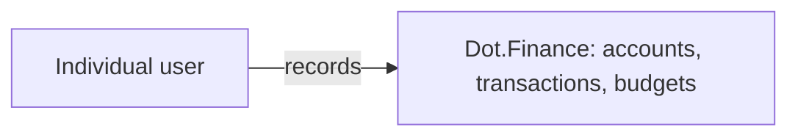

# Dot.Finance

> **Platform-owned source:** [Dot.Finance's wiki.md](https://github.com/sakhilebhayi/Dot.Finance/blob/main/wiki.md) — the platform's own knowledge home. This document is Dot.Brain's ingested view; the wiki is authoritative for what the platform actually is.

## 1. Purpose & Business Domain

Personal finance tracking for individual ecosystem users: accounts, categorized transactions, and budgets. A user connects or records their accounts, transactions are tagged by category, and budgets track spend against a period. This is materially smaller in scope than earlier revisions of this document assumed — see §12 for what changed and why.

**Superseded scope note:** version 1.x of this document described Dot.Finance as the ecosystem's financial-products platform (credit, insurance, savings) and the host of a shared "regulatory watch" service consumed by Dot.Charts, Dot.Auction, Dot.Billing, and Dot.HR. Neither exists in the actual codebase. That content is preserved in this file's git history, not carried forward — treat it as an unbuilt design, not a deprecated feature. §12 tracks the resulting ripple: the regulatory watch's former subscribers each need their own reconciliation.

## 2. Entities Owned

| Entity | Graph node type | Natural key | Notes |
|---|---|---|---|
| Account | `entity:asset` | account ID | A tracked financial account (bank, cash, card) |
| Transaction | `observation` | transaction ID | A single categorized inflow/outflow on an account |
| Category | `entity:asset` | category ID | User-defined or default transaction categorization |
| Budget | `entity:asset` | budget ID + period | Spend ceiling per category per period |

Notably absent versus prior scope: no credit facility, insurance product, or regulatory-rule entities — none of that domain is implemented. No aggregate/portfolio entities either; today's model is single-account, single-user.

## 3. Events Emitted

None. No domain events are dispatched in the current codebase — transactions and budget changes are persisted directly with no event bus integration. **Roadmap**, not shipped.

## 4. Knowledge Packs Published

None. There is no DKP manifest, no signing key, and no publishing pipeline in this repository. Dot.Finance is `registered` in name only — it has not published a single pack.

## 5. Intelligence Consumed

None currently subscribed.

## 6. Cross-Platform Relationships

Dot.Finance is currently an isolated, single-user application with no ecosystem integration. It does not consume Farms' rainfall data, does not host a regulatory watch, and is not wired to Billing, Charts, Auction, or HR. Every cross-platform relationship in the prior version of this document was aspirational.

## 7. Tenancy Model

Single-user, not multi-tenant. Each account/transaction/budget belongs to one user, with no organization or team scoping layer — a departure from the org-tenant pattern used elsewhere in the ecosystem (e.g. Billing, HR). If Dot.Finance grows toward the ecosystem's registered platform norms, tenancy will likely need to move to an org-scoped model; tracked as an open question in §13.

## 8. Dopamine Surface

Budget-vs-actual visibility only (a category over/under its period budget). No gamification, no streaks, no rewards mechanics exist or are planned by default — the manifesto's prohibition on financial engagement mechanics (spend milestones, utilization gamification, borrow-again nudges) applies here as a hard constraint on any future feature, not a description of anything currently in scope.

## 9. Active Recommendations

None. No Knowledge Packs have been published, so the Registry Agent has nothing to act on.

## 10. Incident History Summary

None recorded. The single incident described in the prior version of this document (a parametric crop-insurance basis-gap) belonged to the unbuilt financial-products domain and has been removed along with it — no such trigger, product, or incident exists.

## 11. Domain Metrics

None registered. The `finproduct.*` metrics defined in the prior version of this document (`finproduct.repayment_on_schedule_rate`, `finproduct.parametric_basis_gap`, `finproduct.regwatch_ack_latency_p95`) measured a domain that doesn't exist in code; they are retracted, not renamed. If a personal-finance metric set is wanted (e.g. budget-adherence rate), it should be proposed fresh against what's actually built.

## 12. What Changed From v1.x, and Its Ripple

This document was rewritten 2026-08-01 after comparing it against Dot.Finance's actual repository (see [wiki.md](https://github.com/sakhilebhayi/Dot.Finance/blob/main/wiki.md)) and finding the two described unrelated products: v1.x's financial-products/regulatory-watch platform versus the shipped personal-finance tracker. Per human decision, this document was brought in line with reality (option b) rather than treating the gap as a build backlog for this platform (option a).

**Orphaned dependencies — each needs its own reconciliation, not fixed here:**

| Dependent | What it assumed from Dot.Finance | Status |
|---|---|---|
| [dot-charts.md](dot-charts.md) §6/§13 | Joint ownership of the compliance/MNPI gate and instrument-mapping regulatory feed, via the regulatory watch | Broken — Charts' compliance gate has no regulatory-rule source. Needs its own review. |
| [dot-auction.md](dot-auction.md) | Sealed-bid/procurement disclosure rules sourced from the regulatory watch | Broken — same cause. |
| [dot-billing.md](dot-billing.md) | `finproduct.*` vs `finance.*` metric-namespace coordination with Dot.Finance | Moot — `finproduct.*` no longer exists; no coordination needed, but Billing's doc still references it. |

Checked and *not* affected: `brain.governance.md` and `dot-hr.md` do not reference Dot.Finance's regulatory watch — no cross-reference to fix there.

This document does not resolve those four; each owning platform should re-review its own doc against this change during its next touch.

## Verified Infrastructure State (2026-08-07)

Confirmed directly against the real repo during the ecosystem-wide standardization + code-quality pass (full 26-platform summary: [brain.platforms.md](../brain.platforms.md) change log, v1.0.21):

- **Legal/branding/auth** — branded Markdown-mail theme, complete POPIA-aligned Privacy Policy/Terms/Cookie Policy naming **BluePin Inc**, guest auth pages restyled to match the welcome-page hero.
- **Laravel Boost** — `laravel/boost` ^2.5 installed; `.mcp.json`/`boost.json`/`CLAUDE.md` guideline block in place.
- **Code-quality pass** — Pint: 8 files reformatted, formatting-only. `composer audit`: patched 6 `league/commonmark` DoS advisories. `npm audit`: patched postcss path-traversal and shell-quote ReDoS (via concurrently). Full suite reconfirmed green (64 tests / 57 passed / 120 assertions) after every change.

## Autonomy Classification (brain.autonomy.md)

Per [brain.autonomy.md](../brain.autonomy.md) §2. Audited against the real codebase at `~/Dot/Dot.Finance` on 2026-08-08 — not aspirational.

### Level 1 — Autonomous

None found. Dot.Finance has no real automation the operator can currently stay out of the loop for — every operational task listed below still needs a human. There is no scheduled command (`routes/console.php` defines only the stock `inspire` Artisan command; `bootstrap/app.php`'s `withMiddleware()` closure is empty and there is no `app/Console/Kernel.php`, `app/Jobs/`, or `app/Notifications/` directory), no queued job, no outbound notification, and no CI/CD pipeline (no `.github/workflows`, `Dockerfile`, or deploy config in the repo root). The CRUD flows in `app/Http/Controllers/{Account,Transaction,Category,Budget}Controller.php` and the read-only `ReserveRunwayCalculator` service (`app/Services/ReserveRunwayCalculator.php`) are end-user self-service — the user acting on their own data — not platform-operator automation, so they are excluded from this classification per Step 2's distinction, not counted here as Level 1.

### Level 2 — Escalate

None found — no code path currently prepares a decision and routes it for approval; anything resembling this today is fully manual, not semi-automated. `ReserveRunwayCalculator::calculate()` produces a reserve-runway figure and a "what-if" projection (`app/Services/ReserveRunwayCalculator.php`), but it is served directly to the end user as their own read-only insight, not surfaced to the platform operator for a go/no-go decision — it does not qualify.

### Level 3 — Human Control

- **Deploys.** No CI/CD or deploy pipeline exists in the repository (no `.github/workflows`, `Dockerfile`, or `fly.toml`); every deploy is a manual operator action.
- **Database schema changes and data fixes.** All migrations and any ad hoc data correction run manually via Artisan/tinker; nothing automates or self-heals schema or data state.
- **Dependency and security patching.** The 2026-08-07 `composer audit`/`npm audit` remediation (documented above under Verified Infrastructure State) was a manual pass by an operator/agent session — no automated patch pipeline exists to repeat it.
- **User and team administration (Jetstream/Fortify).** `app/Actions/Jetstream/{DeleteUser,DeleteTeam,RemoveTeamMember,AddTeamMember,InviteTeamMember,UpdateTeamName,CreateTeam}.php` and `app/Actions/Fortify/{CreateNewUser,UpdateUserPassword,ResetUserPassword,UpdateUserProfileInformation}.php` are standard Jetstream/Fortify scaffolding gated by policies (`app/Policies/TeamPolicy.php`) that check `ownsTeam`/`belongsToTeam` — these execute in response to the account owner's own actions inside the app, not the platform operator, but any operator-side account recovery, credential rotation, or forced account action on a user's behalf would go through this same manual path with no autonomous alternative.
- **Security credential ownership.** Sanctum API tokens and application secrets (`.env`) are managed manually; no rotation automation exists.
- **Ecosystem auth integration.** `app/Http/Controllers/Auth/EcosystemAuthController.php` handles the `/auth/ecosystem` route — any change to how it trusts or verifies ecosystem identity is a manual, human-reviewed code change, not a runtime-configurable or self-adjusting process.

### Gap summary

Dot.Finance has zero scheduled jobs, queued jobs, or notification channels in its codebase today, so there is no existing automated process to promote to Level 1 — the first candidate would be a genuinely operator-facing scheduled job (e.g., an automated dependency-audit check, or an automated backup/health-check command registered in `routes/console.php`) that runs and reports without requiring Sakhile Bhayi to invoke it manually.

## Change Log

| Version | Date | Author | Change |
|---|---|---|---|
| 1.0.0 | 2026-08-01 | Platform Integrator (prompt 05, AI) | Initial integration package: three-way money boundary (settlement/instruments/products) drawn canonically, regulatory watch closed as a hosted service with versioned machine-checkable rule packs and gate-acknowledgment change control, three queued questions answered, individual credit data excluded at type level, `finproduct.*` namespace resolving the Billing prefix flag, 3 domain metrics, worked round-trip |
| 1.0.1 | 2026-08-01 | Repository Steward Agent | Linked to Dot.Finance's own wiki.md (platform repo) as the platform-owned source of truth |
| 2.0.0 | 2026-08-01 | Repository Steward Agent (human-directed reconciliation) | Full rewrite to match the actual repository: replaced the financial-products/regulatory-watch platform description with the real personal-finance tracker (accounts, transactions, categories, budgets); retracted `finproduct.*` metrics and the regulatory watch; documented the resulting orphaned dependencies in Charts, Auction, Billing, and governance/HR docs (§12) |
| 2.1.0 | 2026-08-08 | Platform Autonomy Classification sub-project | Added Autonomy Classification section per brain.autonomy.md §2 |

## Open Questions

| Question | Owner → Approver |
|---|---|
| Dot.Charts, Dot.Auction, Dot.Billing, and the governance/HR regulatory overlap each assumed Dot.Finance's regulatory watch — who now owns that function, if anyone: rebuild it here, home it elsewhere, or drop the dependency from each? | Registry Agent → Chief Knowledge Engineer |
| Should Dot.Finance move to org-scoped tenancy to match the ecosystem norm, or stay single-user and accept it may never register real Knowledge Packs under the current DKP tenancy model? | Finance Platform Lead → Chief Architect |
| Is a personal-finance tracker in scope for this ecosystem's platform roster at all, or should Dot.Finance's registry entry be retired and the "financial platform" niche re-opened for a future build? | Registry Agent → Executive Sponsor |
