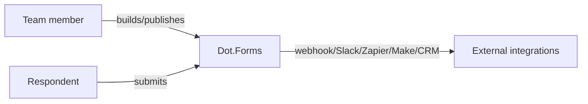

# Dot.Forms

> **Platform-owned source:** [Dot.Forms's wiki.md](https://github.com/sakhilebhayi/Dot.Forms/blob/main/wiki.md) — the platform's own knowledge home. This document is Dot.Brain's ingested view; the wiki is authoritative for what the platform actually is.

## 1. Purpose & Business Domain

A team-scoped form-builder: field builder, publish/draft/archive lifecycle, per-form collaborator roles, versioning with revert, CSV/XLSX export, GDPR per-user data export, and outbound dispatch on submission (webhook, Slack, Zapier, Make, CRM connectors). AI form generation via OpenAI with an honest heuristic fallback (not a faked result when the AI call is unavailable), plus a separate non-LLM rule-based submission analyzer.

## 2. Entities Owned

| Entity | Graph node type | Natural key | Notes |
|---|---|---|---|
| Form | `entity:asset` | form ID | Draft/published/archived lifecycle |
| FormVersion | `observation` | form × version | Versioned with revert |
| Submission | `observation` | submission ID | Per-response record |
| FormCollaborator | `entity:process` | form × user | Role-based collaboration |
| IntegrationDispatch | `entity:process` | dispatch ID | Webhook/Slack/Zapier/Make/CRM outbound |

## 3. Events Emitted

Internal dispatch events exist (submission → integration fan-out) but are not yet DKP-mapped ecosystem events.

## 4. Knowledge Packs Published

None. No DKP manifest or publish pipeline exists.

## 5. Intelligence Consumed

None currently subscribed.

## 6. Cross-Platform Relationships

No cross-platform data exchange with other Dot Ecosystem platforms yet beyond shared ecosystem SSO and the shared `infodot` database.

## 7. Tenancy Model

Team-scoped. The integration pass's IDOR-focused security scan found this already correctly enforced: every by-ID form/submission/version lookup routes through team/form relations with `Gate::authorize` plus explicit team-match checks in every `mount()`. No fix needed here.

## 8. Dopamine Surface

None identified as in-scope.

## 9. Active Recommendations

None — no Knowledge Pack publishing yet.

## 10. Incident History Summary

None recorded as a live incident. Real finding from the 2026-08-02 integration pass: `.env.example` had `DB_DATABASE` commented out despite `DB_USERNAME=infodot` already being set — fixed to `DB_DATABASE=infodot`. The SSRF gap flagged in that same pass (see 1.0.0 changelog) was closed in a follow-up second pass the same day — see 1.1.0.

## Verified Infrastructure State (2026-08-07)

Confirmed directly against the real repo during the ecosystem-wide standardization + code-quality pass (full 26-platform summary: [brain.platforms.md](../brain.platforms.md) change log, v1.0.21):

- **Legal/branding/auth** — branded Markdown-mail theme, complete POPIA-aligned Privacy Policy/Terms/Cookie Policy naming **BluePin Inc**, guest auth pages restyled to match the welcome-page hero (this platform's own wiki v0.7.0 entry covers this in full).
- **Laravel Boost** — `laravel/boost` ^2.5 installed via `composer require --dev --ignore-platform-req=php` (`phpoffice/phpspreadsheet`, pinned by `maatwebsite/excel` 3.1.68, requires `php <8.5.0`; this ecosystem's default PHP is 8.5.9); `.mcp.json`/`boost.json`/`CLAUDE.md` guideline block in place.
- **Code-quality pass** — Pint: 17 files reformatted, formatting-only. `composer audit`: **26 advisories across 9 packages**, all patched via `composer update laravel/framework phpoffice/phpspreadsheet symfony/polyfill-intl-idn league/commonmark --with-dependencies --ignore-platform-req=php`: `laravel/framework` (signed-URL path confusion, CRLF injection), `phpoffice/phpspreadsheet` → 1.30.6 (9 issues — most notably SSRF/RCE via `IOFactory::load` with a user-controlled filename, plus XSS via NumberFormat `@` substitution and multiple memory-exhaustion DoS vectors), `symfony/*` transitive bumps, `league/commonmark` baseline set. `npm audit`: patched Vite path-traversal/file-read advisories and `launch-editor` NTLMv2 disclosure; separately, `package.json` had `axios` pinned to an unusual `>=1.11.0 <=1.14.0` upper bound blocking 7 real axios advisories (prototype pollution, proxy-credential leak on redirect) — loosened to `^1.19.0` after confirming minimal usage (`bootstrap.js` default headers only) and a clean `npm run build`. Full suite reconfirmed green (36 passed / 3 skipped / 74 assertions) after every change.

## Autonomy Classification (brain.autonomy.md)

Per [brain.autonomy.md](../brain.autonomy.md) §2. Audited against the real codebase at `~/Dot/Dot.Forms` on 2026-08-08 — not aspirational.

### Level 1 — Autonomous

- **`forms:close-expired` scheduled command** (`app/Console/Commands/CloseExpiredForms.php`, scheduled `->everyMinute()->withoutOverlapping()` in `routes/console.php`) — every minute, unpublishes any published form whose `settings['close_at']` has passed. Non-destructive (sets `is_published = false`, reversible by republishing), no owner approval in the loop today, routine operational housekeeping. Matches §2's "safe automated remediation, routine analytics."
- **`AnalyzeFormSubmissionsJob`** (`app/Jobs/AnalyzeFormSubmissionsJob.php`, queued on `dotforms.queues.ai`) — runs `AiSubmissionAnalyzer` (rule-based, non-LLM per §1 of this doc) read-only over a form's submissions. No side effects outside the response payload; routine analytics.
- **`NewFormSubmissionNotification`** (`app/Notifications/NewFormSubmissionNotification.php`, queued mail) — sends the form owner a routine "you got a submission" email automatically on every submission. No approval gate, no irreversible or high-stakes action.
- **`FormSubmissionIntegrationDispatcher`** (`app/Services/FormSubmissionIntegrationDispatcher.php`) — on submission, automatically POSTs to whichever webhook/Slack/Zapier/Make/CRM URLs a team configured, with `App\Support\SsrfGuard` re-validated at dispatch time (not just save time) and redirects disabled. Runs without owner approval by design; the guard is what keeps this safe enough to be Level 1 rather than something that needs a human in the loop per submission.
- **`GenerateAiFormBlueprintJob`** (`app/Jobs/GenerateAiFormBlueprintJob.php`, queued on `dotforms.queues.ai`) — calls `AiFormGenerator` (OpenAI, with an honest heuristic fallback per §1) to draft a form from a prompt. Output is a draft blueprint only, not a published/live artifact, so it executes without owner approval.

### Level 2 — Escalate

None found. Checked: routes (`routes/web.php`, `routes/api.php`, `routes/console.php`), all jobs in `app/Jobs/`, all services in `app/Services/` (incl. `app/Services/Ai/*`), and the notification in `app/Notifications/`. Nothing in the real codebase performs spending, pricing, contract, partnership, high-value-sale, sensitive-customer-communication, or material-resource-allocation actions that would need a human-approval gate before executing — the platform's real automated actions (scheduled close, notifications, integration dispatch, AI drafting/analysis) are all bounded, reversible, and already Level 1 by design. There is no proposal/approval workflow (no "pending approval" state, no `Gate::authorize`-then-hold pattern) anywhere in the codebase for any action.

### Level 3 — Human Control

- **Deployment has no CI/CD pipeline.** `find .github/workflows`, `find . -iname "*.yml"` (excluding `vendor/`/`node_modules/`), and searches for `dependabot*`/`renovate*` all returned nothing in `~/Dot/Dot.Forms`. There is no automated build/test/deploy workflow file in the repo at all — every deploy, migration run, and cache/queue restart today is a manual operator action (the platform doc's "Verified Infrastructure State" §, e.g. the 2026-08-07 Pint/`composer audit`/`npm audit` pass, was executed by a human-directed session, not a scheduled job).
- **Dependency/security patching is manual.** The `composer update ... --with-dependencies` and `npm audit fix`-equivalent work recorded in this doc's "Verified Infrastructure State" section was run by hand during an ad hoc pass; no `dependabot.yml`/`renovate.json` or scheduled `composer audit` command exists in `app/Console/Commands/` or `routes/console.php` to catch the next CVE automatically.
- **Secrets/credentials management** — `.env`/`.env.example` (OpenAI API key, mail credentials, DB credentials, `DOTFORMS_*` config in `config/dotforms.php`) are edited and rotated by hand; nothing in the codebase provisions or rotates these.
- **The custom-CSS theming sanitizer** (flagged in this doc's Open Questions) is explicitly pending a human security review before it's trusted with untrusted input at scale — that review itself is a Level 3, non-delegable act, not an automatable one.

### Gap summary

The platform's first real Level 1 process already exists (four, in fact — see above); the actual gap is Level 2. Nothing today prepares an action, presents Context → Evidence → Risk → Recommendation → Proposed Action, and waits for operator sign-off — the codebase has no notion of a "pending approval" state at all. Building one meaningful Level 2 candidate (e.g. auto-proposing a dependency/security patch batch for operator approval instead of requiring an ad hoc audit pass, or holding a new/changed outbound-integration URL for approval before the SsrfGuard-checked dispatcher ever POSTs to it) would give this platform its first real escalation workflow.

## Change Log

| Version | Date | Author | Change |
|---|---|---|---|
| 1.0.0 | 2026-08-02 | Repository Steward Agent | Initial registration. Platform audited: SSO contract verified, DB_DATABASE misconfiguration fixed, favicon/branding consistency completed across two parallel layout systems, IDOR scan came back clean, README corrected (Laravel version, OpenAI vs. Anthropic, unshipped Reverb/Scout/Horizon claims removed). |
| 1.1.0 | 2026-08-02 | Sakhile Bhayi | **SSRF gap closed** — `App\Support\SsrfGuard` rejects webhook/CRM URLs resolving to loopback/private/link-local addresses (incl. cloud metadata endpoints), enforced at both settings-save time and dispatch time; outbound requests no longer follow redirects. |
| 1.2.0 | 2026-08-08 | Platform Autonomy Classification sub-project | Added Autonomy Classification section per brain.autonomy.md §2 |

## Open Questions

| Question | Owner → Approver |
|---|---|
| The custom-CSS sanitizer for form theming is non-exhaustive — worth a dedicated review before this handles untrusted input at scale. | Forms Platform Lead → Security Agent |
