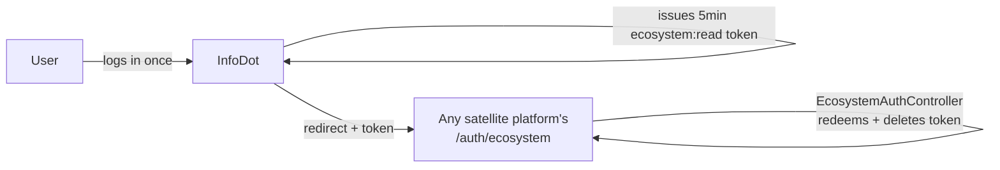

# InfoDot

> **Platform-owned source:** [InfoDot's wiki.md](https://github.com/sakhilebhayi/InfoDot/blob/main/wiki.md) — the platform's own knowledge home. This document is Dot.Brain's ingested view; the wiki is authoritative for what the platform actually is.

> **Registry gap closed 2026-08-07:** InfoDot had no row in [brain.platforms.md](../brain.platforms.md) and no document in this directory despite being the ecosystem's hub — every other platform's `EcosystemAuthController` exists to receive tokens *this* platform issues. Added as part of the ecosystem-wide truth-reconciliation pass; see brain.platforms.md's change log.

## 1. Purpose & Business Domain

InfoDot is the **hub of the Dot Ecosystem** — the central identity provider that lets a user log in once and move between every connected Dot platform without re-authenticating. It issues short-lived Sanctum handoff tokens (5 min TTL, `ecosystem:read` ability, one-time use) via `EcosystemTokenController`/`EcosystemWidget`; every satellite platform's `EcosystemAuthController` redeems them via its own `/auth/ecosystem` endpoint. InfoDot also carries its own community/knowledge-base product on top of that hub role: a public Q&A section (Questions), a public Solutions/how-to hub (Solutions + Steps), threaded comments and polymorphic likes on both, a lightweight social graph (Associates), and a team-scoped "Team Drive" storage layer (Obj/File/Folder) that is modeled and migrated but has no controller wired to it yet. Laravel 12, PHP 8.4/8.5, Livewire 3, Jetstream 5 with Teams, PostgreSQL.

## 2. Entities Owned

| Entity | Graph node type | Natural key | Notes |
|---|---|---|---|
| User / PersonalAccessToken | `entity:identity` | user ID / token | Source of truth for ecosystem-wide identity; issues the one-time `ecosystem:read` handoff tokens every satellite platform consumes |
| Question / Solution / Step | `entity:asset` | content ID | Public, globally-browsed Q&A and how-to content (not team-scoped by design) |
| Comment / Like | `observation` | polymorphic ID | Threaded engagement on Questions/Solutions |
| Associates | `entity:process` | user × associate | Bidirectional follow/connection edge |
| Obj / File / Folder | `entity:asset` | `team_id` scoped | "Team Drive" storage layer — modeled and team-scoped (`HasTeamScope`) but no controller wired to it yet |

## 3. Events Emitted

No DKP-mapped ecosystem events yet. The one real cross-platform signal is the SSO handoff itself (token issuance → satellite redemption), which is a synchronous HTTP handoff, not a published event.

## 4. Knowledge Packs Published

None. No DKP manifest or publish pipeline exists — same gap as every other platform in the ecosystem (see §10).

## 5. Intelligence Consumed

None currently subscribed.

## 6. Cross-Platform Relationships

InfoDot is the single point every other platform in the registry (§2 of brain.platforms.md) depends on for authentication. `config/ecosystem.php` lists every registered satellite, grouped by category, for the dashboard launcher widget.

## 7. Tenancy Model

Mixed by design, audited directly against migrations rather than assumed: `Obj`/`File`/`Folder` are genuinely team-scoped (`team_id` column, `HasTeamScope` global scope, mirroring Dot.Notify/Dot.Finance's pattern). `Questions`/`Solutions`/`Steps`/`Comment`/`Like`/`Associates` are deliberately **not** team- or user-scoped for reads — they're public community content keyed by `user_id` for authorship display only; scoping them would break the product (every user needs to see everyone's questions).

## 8. Dopamine Surface

None identified as in-scope.

## 9. Active Recommendations

None — no Knowledge Pack publishing yet.

## 10. Incident History Summary

None recorded as a live incident. Real findings from prior passes: a stale `PDO::MYSQL_ATTR_SSL_CA` deprecation banner (PHP 8.5 vs. an unused `mysql` connection block evaluated regardless of active driver) — fixed; a missing `postcss.config.js` meant Tailwind was never actually compiling through Vite, so no Tailwind-based page could have rendered styled in production — fixed; 6 pre-existing `guzzlehttp/guzzle` advisories (1 high, 5 medium) — fixed via `composer update guzzlehttp/guzzle guzzlehttp/psr7 guzzlehttp/promises --with-all-dependencies`.

## 11. Verified Infrastructure State (2026-08-07)

Confirmed directly against the real repo during the ecosystem-wide standardization + code-quality pass (see brain.platforms.md's 2026-08-07 change log entry for the full 26-platform summary; InfoDot was the pilot for all three workstreams before rollout to the other 25):

- **Legal/branding/auth standardization** — branded Markdown-mail theme (dark charcoal/gold, real logo, hardcoded hex for email-client compatibility); complete POPIA-aligned Privacy Policy, Terms & Conditions, and new Cookie Policy naming **BluePin Inc** as the responsible party; all 7 guest auth pages (login, register, forgot/reset-password, confirm-password, two-factor-challenge, verify-email) now share the welcome page's full-bleed photo hero and gold/charcoal token system via `authentication-card.blade.php`. Piloted here first, then propagated to all 25 sibling platforms.
- **Laravel Boost** — `laravel/boost` ^2.5 installed; `.mcp.json`/`boost.json`/appended `CLAUDE.md` guideline block in place.
- **Code-quality pass** — Pint (was already present): 86 files reformatted, formatting-only. `composer audit`: patched 6 `league/commonmark` DoS/link-filter advisories (incl. CVE-2026-71488), safely within the existing `^2.8.1` constraint. `npm audit`: patched picomatch ReDoS + postcss path-traversal advisories. Full suite reconfirmed green (87 passed / 7 skipped / 228 assertions) after every change, both passes.

## Autonomy Classification (brain.autonomy.md)

Per [brain.autonomy.md](../brain.autonomy.md) §2. Audited against the real codebase at `~/Dot/InfoDot` on 2026-08-08 — not aspirational.

### Level 1 — Autonomous

None found. Checked every place a background, no-approval process could live: `app/Console/Kernel.php`'s `schedule()` method is empty (only the commented-out default `inspire` example); there is no `app/Console/Commands/` directory for the `$this->load()` call to discover; `app/Jobs/` does not exist and `.env.example` sets `QUEUE_CONNECTION=sync`, so nothing actually runs asynchronously today; `app/Notifications/` contains only `DatabaseNotificationChannel.php` (a channel implementation, not a triggered notification with its own dispatch logic); `.github/workflows/ci.yml` runs tests on push/PR only, with no deploy, auto-merge, or dependency-bot job (no `dependabot.yml` at the repo root — the only hits are inside third-party `node_modules/*/`.github/`, which are vendored, not InfoDot's own). No operator-facing process currently executes on this platform without a human directly running the command.

### Level 2 — Escalate

None found. Checked for any propose-then-approve pipeline (a bot opening a PR for human review, a staged/pending-approval queue, a draft-and-notify workflow): none exists. CI (`.github/workflows/ci.yml`) is a binary pass/fail gate a human reads, not a system that assembles Context → Evidence → Risk → Recommendation → Proposed Action for approval. The dependency-security patches recorded in §10 (guzzlehttp, league/commonmark, picomatch/postcss) were applied by a human running `composer audit` / `composer update` / `npm audit` directly, per the incident history — not proposed by automation and approved.

### Level 3 — Human Control

- **Ecosystem trust-boundary curation** — `config/ecosystem.php`. The registry of which satellite platforms are trusted to receive `ecosystem:read` handoff tokens (27 entries, each with an `active` flag and URL) is a hand-edited PHP array. Adding, removing, or toggling a platform's trust changes InfoDot's SSO trust boundary and requires a manual code change plus deploy — there is no admin UI or self-service registration route for it (confirmed absent from `routes/web.php`).
- **SSO token issuance/redemption contract** — `app/Http/Controllers/Api/EcosystemTokenController.php` (`issue()`) and `app/Http/Controllers/Auth/EcosystemAuthController.php` (`handle()`). These implement the actual credential logic: Sanctum `PersonalAccessToken` creation with the `ecosystem:read` ability, TTL (`config('ecosystem.handoff_ttl', 5)`), and one-time-use deletion on redemption. Any change to TTL, ability scope, or revocation semantics is security-credential code; only a human developer edits and ships it — nothing autonomously modifies or rotates this contract.
- **Deployment/release to production** — `.github/workflows/ci.yml` has a single `tests` job (checkout → install → migrate → test); there is no deploy job anywhere in `.github/`. Shipping any change, including to the two items above, is a manual human action outside this repo's automation.
- **Secrets and credential management** — `APP_KEY`, `SANCTUM_STATEFUL_DOMAINS`, database credentials, and the per-platform `DOT_*_URL` env vars (referenced throughout `config/ecosystem.php`) are set directly by a human in the deployment environment; `.env` is not committed, and no secrets-rotation or vault-integration code exists in the repo.
- **Dependency/security patching** — per §10's Incident History, the guzzlehttp, league/commonmark, and picomatch/postcss fixes were each applied by a human running `composer audit`/`composer update --with-all-dependencies` or `npm audit fix` directly and re-running the test suite before considering the fix done; no automated patch-and-PR bot exists in this repo.

### Gap summary

For InfoDot's first real Level 1 process to exist, it would need at least one operator-facing background task that runs and completes without human review today — e.g., a scheduled command wired into `app/Console/Kernel.php`'s currently-empty `schedule()` (stale-handoff-token cleanup would be a natural first candidate, since expired tokens are only ever deleted on redemption, not proactively), or a real queued job once `QUEUE_CONNECTION` moves off `sync`. None of that infrastructure is wired up yet.

## Change Log

| Version | Date | Author | Change |
|---|---|---|---|
| 1.1.0 | 2026-08-08 | Platform Autonomy Classification sub-project | Added Autonomy Classification section per brain.autonomy.md §2 |
| 1.0.0 | 2026-08-07 | Dot.Brain truth-reconciliation pass | Initial registration — InfoDot had no platform document or registry row despite being the ecosystem's SSO hub; every other registered platform's cross-platform relationship depends on it. Backfilled §1–10 from InfoDot's own wiki.md (v1.3.0) and CLAUDE.md; added §11 documenting the verified 2026-08-07 legal/Boost/code-quality infrastructure pass. |

## Open Questions

| Question | Owner → Approver |
|---|---|
| Domain-agent home unresolved — InfoDot is infrastructure/identity, not a commerce/content vertical like its siblings; needs the same kind of resolution brain.platforms.md §6 already tracks for Dot.Notify. | Governance Agent → Chief AI Engineer |
| Whether the 7 platforms InfoDot's own `config/ecosystem.php` lists as "never reviewed" (Dot.Files, Dot.docs, Dot.Forms, Dot.Sheet, Dot.Engage, Dot.Press, Dot.Tutor) actually implement the `/auth/ecosystem` contract byte-for-byte — InfoDot's own CLAUDE.md flags this as asserted, not checked. | InfoDot Platform Lead → Registry Agent |
