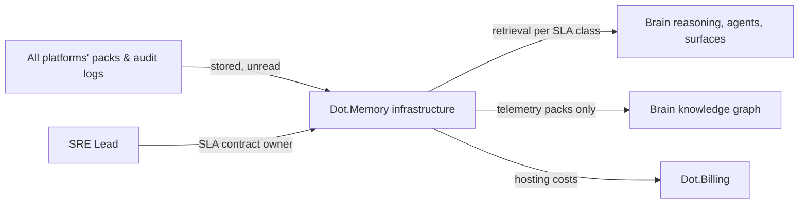

# Dot.Memory

> **Platform-owned source:** [Dot.Memory's wiki.md](https://github.com/sakhilebhayi/Dot.Memory/blob/main/wiki.md) — the platform's own knowledge home. This document is Dot.Brain's ingested view; the wiki is authoritative for what the platform actually is.

## 1. Purpose & Business Domain

Storage and retrieval infrastructure: the persistence substrate the Brain itself runs on — knowledge-graph storage, vector indexes for semantic retrieval, pack archives, and the audit trails every other platform's gates write to. Owns the retrieval domain. Dot.Memory is the corpus's most self-referential integration: the platform *hosting* the knowledge graph also publishes packs *into* it. The resolution is strict layer separation — **Dot.Memory the infrastructure stores knowledge without reading it; Dot.Memory the platform publishes only its own operational telemetry.** Its packs are about latency and durability, never about the content it stores; a storage platform that mined its tenants' knowledge would be the ecosystem's deepest possible trust violation. The **retrieval SLA contract** (registry gap) is closed in §7, and brain.memory.md's two straggler metrics get their operational home in §11.

## 2. Entities Owned

| Entity | Graph node type | Natural key | Notes |
|---|---|---|---|
| Storage tier | `entity:asset` | tier ID | hot (working context) / warm (indexed archive) / cold (compliance archive) |
| Index | `entity:asset` | index ID + version | Graph, vector, and audit-log indexes |
| Retrieval class | `entity:asset` | `retr:<consumer-class>:<tier>` | The SLA contract's unit (§7) |
| Retrieval observation | `observation` | class × tier × window | Latency/failure aggregates — telemetry, never content |
| Durability outcome | `outcome` | audit period | Verified restore tests, integrity checks |
| Stored content | — | — | **Never read, never published.** The infrastructure/platform separation at type level: content belongs to its publishing platform |

## 3. Events Emitted

| Event | Trigger | Consumers | Frequency |
|---|---|---|---|
| `memory.sla.breach` | Retrieval class misses contract (§7) | Affected consumers, SRE Lead | low — target 0 |
| `memory.tier.migration_completed` | Content aging between tiers | Owning platform (their content, their notice) | daily cycles |
| `memory.integrity.check_completed` | Scheduled durability verification | Security Agent, audit log | weekly |

## 4. Knowledge Packs Published

| Payload type | Cadence | Example pack ID |
|---|---|---|
| observation (retrieval-performance aggregates) | weekly | `dkp:memory:obs:2026-07-06:0010` |
| insight (access-pattern findings — shapes, never content) | per finding | `dkp:memory:ins:2026-06-11:0001` |
| outcome (SLA and durability verifications) | per period | `dkp:memory:out:2026-07-28:0001` |
| incident (SLA breaches, integrity events) | per incident | `dkp:memory:inc:2026-01-22:0001` |

Access-pattern insights describe *shapes* (e.g. "graph traversals deeper than 4 hops account for 80% of hot-tier latency tail") — pack IDs, query text, and result content never appear; the telemetry pipeline is architecturally unable to include them (separate plane from the data path).

## 5. Intelligence Consumed

| Recommendation type | Metric expected to move | Baseline |
|---|---|---|
| Index-strategy suggestions (which index types fit observed access shapes) | `memory.context_latency_p95` | 2026 H1 |
| Tier-policy tuning (aging thresholds vs. observed re-retrieval rates) | `memory.cold_retrieval_failures` | 2026 H1 |
| Capacity forecasting (growth-driven provisioning) | `memory.sla_attainment_rate` | per tier |

## 6. Cross-Platform Relationships



The layering note that prevents future confusion: dot-central's two-lane contract (operational ≤ 30 s, knowledge lane standard) is about *platform-to-platform* paths; Dot.Memory's SLA classes (§7) are about *Brain-internal* retrieval. Central's operational lane never touches Memory — that was the point of keeping the Brain out of real-time paths. Memory's contracts serve the Brain's own loops: agent context assembly, surface rendering, audit access.

## 7. Tenancy Model & Retrieval SLA Contract (registry gap closed)

Tenant key = owning platform (content tenancy mirrors publisher, always); Memory's own telemetry is tenant-free infrastructure data, floors n/a by construction (no persons, no orgs in the payload). The **retrieval SLA contract** — four classes, each a named contract with a consumer-visible dashboard:

| Class | Serves | Contract | Breach consequence |
|---|---|---|---|
| `retr:agent-context:hot` | Colony agents assembling working context | p95 ≤ 800 ms, p99 ≤ 2 s | `memory.sla.breach` + degraded-mode flag: agents disclose stale-context risk in outputs |
| `retr:surface:hot` | Human-facing surfaces (Why blocks, dashboards) | p95 ≤ 1.5 s | Surface renders cached-with-timestamp rather than blocking |
| `retr:audit:warm` | Gate audit-log access (Charts' regulator queries, governance reviews) | p95 ≤ 30 s, completeness guaranteed | Escalation to SRE Lead + Security Agent — audit access failure is a governance event, not just an ops event |
| `retr:archive:cold` | Compliance retrieval, historical re-verification | ≤ 24 h, zero-loss | Integrity incident, mandatory pack |

Contract governance: SLA definitions are owned by the SRE Lead, reviewed semi-annually; consumers acknowledge class assignments (Finance's gate-acknowledgment pattern applied to infrastructure); degraded-mode behaviors are part of the contract — *how retrieval fails is specified, not improvised.*

## 8. Dopamine Surface

Near-empty by nature, and kept that way: infrastructure has no end users to engage. Withheld even at team level: uptime-streak celebrations (loss-framed streaks make on-call engineers hide small incidents — the decertified-streak lesson applied to operations). Shared: SLA attainment and durability verification results, published plainly. The honest dashboard *is* the dopamine surface.

## 9. Active Recommendations

Maintained by the Registry Agent. Current: index-strategy suggestion `verified` — see §13; tier-policy tuning for audit-log aging `open` (expiry 2026-09-15).

## 10. Incident History Summary

One incident pack (2026-01, the corpus's oldest): a hot-tier index rebuild during business hours pushed agent-context p95 to 4.1 s for two hours — agents continued answering on stale context *without disclosure*, which is how the degraded-mode flag became part of the SLA contract rather than an ops nicety. The incident predates most platform integrations and is cited by the SLA contract's design as its founding evidence. Consumed: Notify's attention-economics finding (informing which SLA breaches alert humans vs. land in digests).

## 11. Domain Metrics (registered per brain.metrics.md §4.8 — homing the brain.memory.md stragglers)

| ID | Type | Definition |
|---|---|---|
| `memory.context_latency_p95` | duration | Agent-context assembly retrieval latency, p95 per class — **straggler from brain.memory.md OQ, now homed** |
| `memory.cold_retrieval_failures` | count | Cold-tier retrievals failing or exceeding 24 h contract, per quarter — **straggler from brain.memory.md OQ, now homed** |
| `memory.sla_attainment_rate` | ratio | Retrieval-class windows meeting contract / all class-windows, monthly |

The two stragglers were proposed in brain.memory.md before any platform doc existed to home them; per the §4.8 convention (platform docs home their operational metrics), they register here. brain.memory.md and brain.metrics.md strike their tracking OQs on next touch.

## 12. Manifest (platform.dkp.json example)

```json
{
  "platform_id": "dot-memory",
  "dkp_version": "1.0.0",
  "signing_key_ref": "vault://keys/dot-memory/dkp-signing/v1",
  "publishes": ["observation", "insight", "outcome", "incident"],
  "subscribes": ["index-strategy", "tier-policy-tuning", "capacity-forecast"],
  "schemas": { "knowledge-pack": "1.0.0", "metric": "1.0.0" },
  "default_classification": "ecosystem",
  "tenancy": {
    "key": "infrastructure",
    "aggregation_floor": 0,
    "publication_rules": [
      { "rule": "telemetry-only-no-content", "note": "telemetry plane architecturally separated from data plane", "enforcement": "by-construction" },
      { "rule": "degraded-mode-disclosure", "enforcement": "contract" }
    ]
  }
}
```

## 13. Worked round-trip

1. **Pack:** `dkp:memory:obs:2026-07-06:0010` — retrieval-shape aggregates: deep graph traversals (> 4 hops) dominate the agent-context latency tail; 92% originate from confidence-chain walks re-deriving W5 provenance already computed at pack validation.
2. **Validation → graph:** `OBSERVED_WITH` edge between traversal depth and p95 tail, 0.75; corroborated by two independent windows before and after a traffic doubling (×1.10 → 0.83) — the shape holds under load growth.
3. **PR back (index-strategy):** materialize validated provenance chains as a precomputed index (write-time cost for read-time depth); confidence 0.83, impact `memory.context_latency_p95` −40% predicted for chain-walk retrievals, guards: write-path latency flat, `memory.sla_attainment_rate` flat-or-better across all classes, expiry 45 days.
4. **Outcome:** `dkp:memory:out:2026-07-28:0001` — chain-walk p95 −47% verified; write-path guard held; overall agent-context p95 improved 22%. Every platform's round-trip in this corpus ran through the retrieval this recommendation just made faster — infrastructure improving the loop that improves everything else.

## Verified Infrastructure State (2026-08-07)

Confirmed directly against the real repo during the ecosystem-wide standardization + code-quality pass (full 26-platform summary: [brain.platforms.md](../brain.platforms.md) change log, v1.0.21):

- **Legal/branding/auth** — branded Markdown-mail theme, complete POPIA-aligned Privacy Policy/Terms/Cookie Policy naming **BluePin Inc**, guest auth pages restyled to match the welcome-page hero.
- **Laravel Boost** — `laravel/boost` ^2.5 installed; `.mcp.json`/`boost.json`/`CLAUDE.md` guideline block in place.
- **Code-quality pass** — Pint: 10 files reformatted, formatting-only. `composer audit`: patched 6 `league/commonmark` DoS advisories. `npm audit`: already clean. Full suite reconfirmed green (14 tests / 14 passed / 502 assertions) after every change.

## Autonomy Classification (brain.autonomy.md)

Per [brain.autonomy.md](../brain.autonomy.md) §2. Audited against the real codebase at `~/Dot/Dot.Memory` on 2026-08-08 — not aspirational.

### Level 1 — Autonomous

None found. Checked every category the classification covers, and none has an implemented, unattended process:

- **Scheduled commands** — `routes/console.php` registers exactly one command, the framework's stock `inspire` (an inspirational quote), and nothing else. No `app/Console/Commands` directory exists, so there is no `Schedule::` cron entry anywhere to run autonomously.
- **Queued jobs** — `QUEUE_CONNECTION=database` is configured and a `jobs` table migration exists (`database/migrations/0001_01_01_000002_create_jobs_table.php`), but no `app/Jobs` directory exists. The queue infrastructure is provisioned; no job class has been written to run on it.
- **Notifications** — a `notifications` table migration exists (`database/migrations/2026_08_01_100001_create_notifications_table.php`), but no `app/Notifications` directory exists. Nothing dispatches a notification.
- **The §3/§10 event and pack pipeline** described in this same document (`memory.sla.breach`, `memory.tier.migration_completed`, `memory.integrity.check_completed`, `dkp:memory:*` packs) — grepped the full `app/`, `config/`, `routes/`, `database/` trees for these identifiers: zero matches. They are DKP-registry documentation of an intended pipeline, not code that runs it.
- **CI/CD** — no `.github/workflows` directory (or any other CI config) exists in the repo. There is no pipeline to run autonomously in the first place.

### Level 2 — Escalate

None found. A Level 2 process requires code that analyses a situation and prepares a Context → Evidence → Risk → Recommendation → Proposed Action package for human approval. No such preparation path exists anywhere in the app — there is no queued job, command, or service class that builds a proposal object; the SLA-breach and degraded-mode behaviors this document describes in §7/§10 are, per the Level 1 grep above, unimplemented. The two real controllers in the app (`IndexController`, `DurabilityController`) are both read-only `view()` renders with no side effects to escalate.

### Level 3 — Human Control

- **Deployment.** No CI/CD pipeline exists (`.github/workflows` absent) and `composer.json`'s `"setup"` script (`composer.json` scripts block) — `composer install`, `key:generate`, `migrate --force`, `npm install`, `npm run build` — is a manual sequence a human runs by hand. Nothing in the repo triggers a deploy or a migration on its own.
- **Ecosystem auth token issuance.** `app/Http/Controllers/Auth/EcosystemAuthController.php` *consumes* a Sanctum `PersonalAccessToken` carrying the `ecosystem:read` ability (validates it, logs the tokenable user in, deletes the token) — but grepping the full `app/` and `database/` trees turns up no code path that *issues* one of these tokens. Minting an ecosystem-auth token is a manual, out-of-band operator action; the app has no self-service or automated issuance/rotation flow.
- **Database migrations.** `php artisan migrate --force` runs only as a step in the manual `composer run setup` sequence above — there is no scheduled or CI-triggered migration runner.
- **Middleware/kernel changes.** `bootstrap/app.php`'s `withMiddleware()` closure is empty (framework defaults only); any change to auth/permission middleware is a direct code edit and deploy, done by a human, not a runtime-configurable or self-adjusting process.

### Gap summary

Every piece of infrastructure a Level 1 process would need — a `jobs` table, a `notifications` table, `QUEUE_CONNECTION=database` — is already provisioned, but no job, command, or notification class has been written against it. The first real Level 1 candidate is the platform's own documented weekly `memory.integrity.check_completed` durability check (§3): it would need an actual `app/Console/Commands` class, a `Schedule::command()` entry in `routes/console.php` (or a queued job), and a write path into `durability_outcomes` — none of which exist in the codebase today.

## Change Log

| Version | Date | Author | Change |
|---|---|---|---|
| 1.0.0 | 2026-08-01 | Platform Integrator (prompt 05, AI) | Initial integration package: infrastructure/platform layer separation (stores without reading; telemetry-only publication by construction), retrieval SLA contract closed (four classes with specified degraded modes, SRE-owned, consumer-acknowledged), brain.memory.md straggler metrics homed, Central two-lane layering clarified, 3 domain metrics, worked round-trip |
| 1.0.1 | 2026-08-01 | Repository Steward Agent | Linked to Dot.Memory's own wiki.md (platform repo) as the platform-owned source of truth |
| 1.1.0 | 2026-08-08 | Platform Autonomy Classification sub-project | Added Autonomy Classification section per brain.autonomy.md §2 |

## Open Questions

| Question | Owner → Approver |
|---|---|
| Regulator direct access to `retr:audit:warm` (Charts' audit log): mediated through Charts or a standing read path with its own authentication? | Security Agent → Security Officer |
| Cold-tier retention horizons per content class: align with Finance's regulatory watch jurisdiction rules once retention regulations are encoded | Memory Agent → Security Officer |
