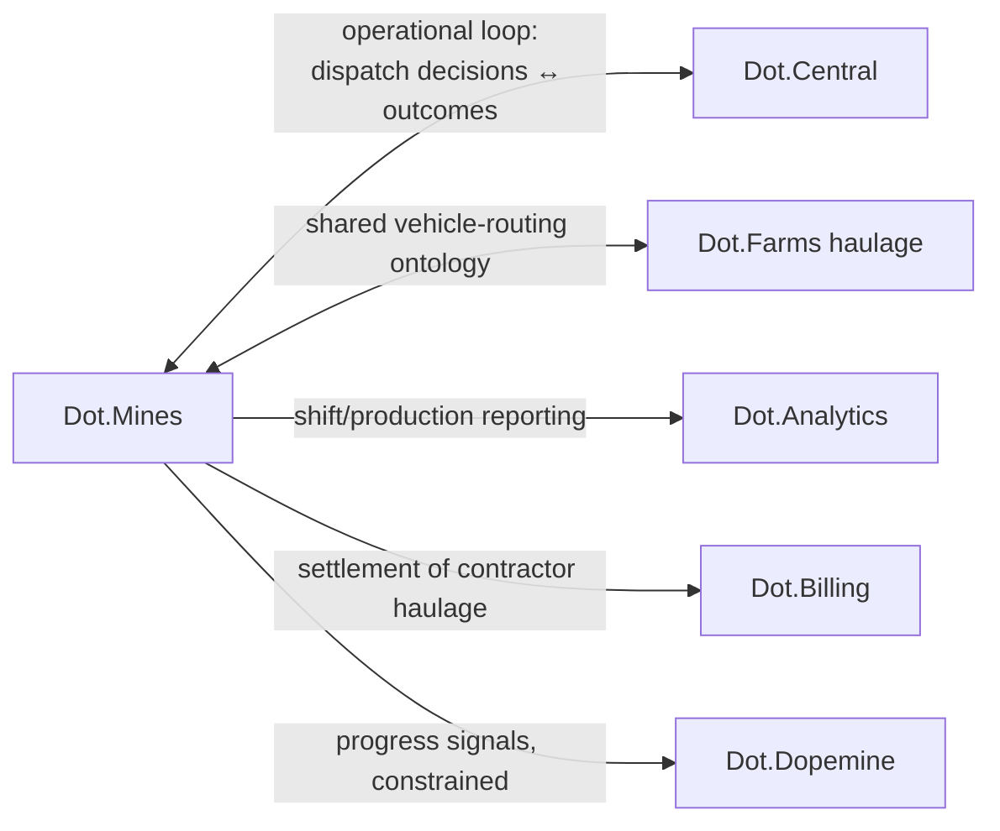

# Dot.Mines

> **Platform-owned source:** [Dot.Mines's wiki.md](https://github.com/sakhilebhayi/mines/blob/main/wiki.md) — the platform's own knowledge home. This document is Dot.Brain's ingested view; the wiki is authoritative for what the platform actually is.

## 1. Purpose & Business Domain

Mining ERP for open-pit operations — haul-cycle management, machine and shift scheduling, pit planning, maintenance, and safety — serving mine planners, dispatchers, and operators. Owns the mining operational domain; real-time dispatch intelligence is the Dot.Central operational loop (§6). This is the platform behind the repository's canonical worked thread (Kolomela wet-season cycle-time) and the [knowledge-pack example](../templates/knowledge-pack.example.md).

## 2. Entities Owned

| Entity | Graph node type | Natural key | Notes |
|---|---|---|---|
| Mine site | `entity:site` | `dot:node:mining:site:<id>` | Tenant root (Kolomela, Sishen, …) |
| Machine | `entity:asset` | site + fleet number | Trucks, loaders, drills |
| Pit / bench | `entity:asset` | site + pit code | Carries road-base attributes (lateritic flag = P-2026-001 condition C) |
| Shift | `entity:process` | site + date + shift code | Crew and dispatch context |
| Haul cycle | `entity:process` | machine + timestamp | The `mining.cycle_time_p50` unit of record |
| Inspection finding | `observation` | route + timestamp | Moisture-indexed under the wet-season pattern |
| Incident | `outcome` | site + incident ID | Feeds the failure-catalog path |

## 3. Events Emitted

| Event | Trigger | Consumers | Frequency |
|---|---|---|---|
| `mining.haulcycle.completed` | Cycle close | Brain ingestion, Dot.Central | ~10⁴/day |
| `mining.inspection.finding` | Road/equipment inspection | Brain, maintenance planning | ~10²/day |
| `mining.shift.summary` | Shift end | Brain, Dot.Analytics | 2–3/site/day |
| `mining.incident.reported` | Safety/operational incident | Brain (incident path), Dot.Central | low, paged |

## 4. Knowledge Packs Published

| Payload type | Cadence | Example pack ID |
|---|---|---|
| observation (cycle/inspection telemetry) | hourly batch | `dkp:mines:obs:2026-07-22:0410` |
| insight (operational correlations) | per finding | `dkp:mines:ins:2026-03-11:0007` — the wet-season insight |
| outcome (verification packs) | per verified recommendation | `dkp:mines:out:2026-06-28:0003` — the −64% verification |
| incident (lessons) | per incident | `dkp:mines:inc:2026-02-04:0001` |

## 5. Intelligence Consumed

| Recommendation type | Metric expected to move | Baseline |
|---|---|---|
| Inspection scheduling (moisture-indexed) | `mining.false_finding_rate` | pre-E3 2026 |
| Haul-route optimization | `mining.cycle_time_p50` | per site/pit |
| Maintenance windowing | `mining.unplanned_downtime_hours` | 2026 H1 |
| Dispatch load-balancing (via Dot.Central) | `mining.cycle_time_p50` | per shift |

## 6. Cross-Platform Relationships



The Mines↔Central loop is the ecosystem's tightest: Central consumes Mines events in near-real-time and returns dispatch recommendations; both share the Mining domain agent, and packs crossing the loop still take the front door (no side channel, per the boundary invariant).

## 7. Tenancy Model

Tenant key = site ID; topics `mining.<tenant>.<event>`. Cross-site reasoning from published packs only — the Kolomela→Sishen transfer ran as an I4 analogy then a replication, never as raw cross-tenant reads. Contractor data (haulage partners) carries sub-tenant tagging; contractor-identifiable aggregation observes the n ≥ 20 floor.

## 8. Dopamine Surface

Shares: shift-completion quality, safety-checklist completeness (outcome-anchored only). Explicitly withheld: individual operator speed rankings — a leaderboard on cycle time is a proxy that pays for haste with safety, pre-rejected under dopemine §2's acid test.

## 9. Active Recommendations

Maintained by the Registry Agent. Current: moisture-indexed inspection scheduling `verified` (Kolomela, Sishen); maintenance-windowing proposal `open`, expiry 2026-08-14.

## 10. Incident History Summary

Two incident packs (2026): dispatch misroute (F-PROC class, lesson propagated to Central), moisture-sensor outage (F-INFRA, drove the P-2026-001 sensor-coverage sentinel). Consumed: F-KNOW-2026-001's near-miss lesson (this platform's data was its subject).

## 11. Domain Metrics (registered per brain.metrics.md §4.8)

| ID | Type | Definition |
|---|---|---|
| `mining.cycle_time_p50` | duration | Median haul-cycle time, per site/pit — the canonical example's home |
| `mining.false_finding_rate` | ratio | Inspection findings not confirmed on follow-up |
| `mining.unplanned_downtime_hours` | gauge | Machine-hours lost to unplanned maintenance |
| `mining.cost_per_false_finding` | ratio | Platform-attested dispatch cost — the [brain.business.md](../brain.business.md) §5 pricing input |

## 12. Manifest (platform.dkp.json example)

```json
{
  "platform_id": "dot-mines",
  "dkp_version": "1.0.0",
  "signing_key_ref": "vault://keys/dot-mines/dkp-signing/v1",
  "publishes": ["observation", "insight", "outcome", "incident"],
  "subscribes": ["inspection-scheduling", "haul-route-optimization", "maintenance-windowing", "dispatch-balancing"],
  "schemas": { "knowledge-pack": "1.0.0", "metric": "1.0.0" },
  "tenancy": { "key": "site_id", "aggregation_floor": 20, "subtenant": "contractor_id" }
}
```

## 13. Worked round-trip

The canonical thread, restated as the test fixture:

1. **Pack:** `dkp:mines:ins:2026-03-11:0007` — insight: wet-season moisture correlates with false cycle-time findings, Kolomela, evidence 3 seasons of observations; signed, `ecosystem`, metric IDs resolve against §11.
2. **Validation → graph:** insight node; `OBSERVED_WITH` edge moisture↔false-findings at 0.72; E3 experiment promotes to `CAUSES` 0.83.
3. **PR back:** moisture-indexed inspection scheduling — confidence 0.83, impact `mining.false_finding_rate` −40% predicted, guards (maintenance backlog, operator workload) declared, expiry 30 days. Accepted at Kolomela.
4. **Outcome:** `dkp:mines:out:2026-06-28:0003` verifies −64%; S-2026-001 opens, Sishen replication follows, P-2026-001 promotes — one pack ID traceable from field observation to proven pattern.

## Autonomy Classification (brain.autonomy.md)

Per [brain.autonomy.md](../brain.autonomy.md) §2. Audited against the real codebase at `~/Dot/mines` on 2026-08-08 — not aspirational.

### Level 1 — Autonomous

- **Real-time monitoring/alert pipeline**, `app/Services/RealtimeEventScheduler.php`, registered from `app/Providers/AppServiceProvider.php:45`. Runs on the Laravel scheduler with no owner approval at any step: location updates every 10s (`MachineLocationUpdateJob`), alert generation every 30s (`AlertGenerationJob`), geofence crossing detection every 30s (`GeofenceCrossingDetectionJob`), machine status monitoring every 20s (`MachineStatusMonitoringJob`). All read metrics/integration data and either broadcast an event or write an `Alert`/`GeofenceEntry` row — none writes back to physical equipment or takes an irreversible action.
- **Route speed and machine-idle monitoring**, `app/Jobs/RouteSpeedMonitoringJob.php` and `app/Jobs/MachineIdleMonitoringJob.php`, scheduled directly in `routes/console.php` (`everyFiveMinutes()` / `everyTenMinutes()`, `withoutOverlapping()->onOneServer()`). Both only read `machine_metrics` and create an `Alert` record (`createSpeedViolationAlert()`, `createIdleAlert()`) with dedup guards against duplicate alerts. Routine automated monitoring, matches brain.autonomy.md §2's own example.
- **Operator fatigue alerting**, `app/Services/RealTimeAlertService.php::dispatchFatigueAlert()` → `app/Notifications/OperatorFatigueAlert.php`. Creates an `Alert` and emails the team automatically once a fatigue score crosses "high"/"critical" — no approval gate before the notification goes out. It informs humans to act (`This operator should be relieved...`); it does not itself relieve, reassign, or stop the operator.
- **AI recommendation/insight generation**, `app/Console/Commands/RunAIAnalysis.php` (`ai:analyze`) → `App\Services\AI\AIOptimizationService::runComprehensiveAnalysis()`. Writes `AIRecommendation` and insight rows and prints a savings estimate; it does not execute anything against machines, routes, or dispatch — output is informational, reviewed later at `/ai-optimization`. Analytics/reporting generation itself is Level 1; what a human does with the recommendation is Level 3 (see below).
- **Fuel Reserve Runway cushion**, `app/Services/FuelReserveRunwayCalculator.php` + `app/Livewire/FuelCushion.php`. Confirmed read-only: `calculate()` only sums `FuelTank`/`FuelTransaction` rows and returns a display array (`days`, `basis`, `what_if`); the Livewire component only assigns the result to a public property for `resources/views/livewire/fuel-cushion.blade.php` to render. No write, no dispatch, no alert side-effect — this is end-user insight, not operator-facing automation, and is included here only to document that it was checked, not because it is itself a Level 1 process.
- **Manufacturer integration sync**, `app/Console/Commands/SyncDueIntegrations.php` (`integrations:sync-due`), scheduled every 5 minutes in `routes/console.php` and dispatching `App\Jobs\SyncIntegrationMachinesJob` for whichever of the 25 connected manufacturer integrations has its own configured `sync_interval` elapsed (Bell: 15 min, most others: 5 min). Added 2026-08-10, after this section's original 2026-08-08 audit date — previously nothing scheduled machine/metric sync at all; it only ran on a manual "Sync Now" click or a direct API call. Read/write is scoped to `Integration`/machine/metric rows only, no owner approval in the loop, routine synchronization per §2's own examples.

### Level 2 — Escalate

None found. Checked: `app/Jobs/*` (9 job classes as of 2026-08-10, up from 8 at the original 2026-08-08 audit — the addition is `SyncIntegrationMachinesJob`, dispatched by the new `integrations:sync-due` command above; all 9 are either monitoring/alert generation or read-only sync, none stage a consequential action pending approval), `app/Console/Commands/*` (8 commands as of 2026-08-10, up from 6 at the original audit — the two additions are `integrations:sync-due` above and `data-quality:check`, see Level 3 below; none of the 8 produce a pending-approval action object), `app/Livewire/AIOptimizationDashboard.php` (`implementRecommendation()`/`rejectRecommendation()` — these only flip an `AIRecommendation.status` flag after a human has already carried out the change themselves; the system never proposes-then-executes on approval), and `app/Livewire/BillingPortal.php` (`subscribe()`, `cancelSubscription()`, `switchBillingCycle()` — all fire immediately on the acting user's own click, with no separate operator-approval step). There is no code path anywhere in the app where the system prepares an action and a distinct approval step triggers its execution — the Context→Evidence→Risk→Recommendation→Proposed Action shape brain.autonomy.md §2 requires for Level 2 does not exist in this codebase yet.

### Level 3 — Human Control

- **Shift changes**, `app/Console/Commands/PerformShiftChange.php` (`shift:change {team_id} {shift_type} {--default-mine-area=}`) → `app/Services/ShiftService.php::performShiftChange()`. Not scheduled anywhere — `app/Console/Kernel.php:25` has `// $schedule->command('shift:change 1 day')->dailyAt('06:00');` commented out, and no controller/Livewire component invokes the command or the service. It snapshots machine assignments and production metrics inside a `DB::transaction`; only a human running the artisan command triggers it.
- **AI recommendation implementation**, `app/Livewire/AIOptimizationDashboard.php::implementRecommendation()`. The actual operational change (rerouting, dispatch, maintenance action) is carried out by a human outside the system entirely; the button only records that it happened (`$recommendation->markAsImplemented(auth()->user())`) and is gated by `AIRecommendationPolicy::update()`.
- **Billing/subscription actions**, `app/Livewire/BillingPortal.php` (`subscribe()`, `manageBilling()`, `cancelSubscription()`, `resumeSubscription()`, `switchBillingCycle()`). Financial commitments; no automated code path calls any of these — a human must click.
- **Machine/equipment control**: confirmed absent. Searched `app/Services` and `app/Jobs` for any send-command/remote-control pattern (`sendCommand`, `controlMachine`, `dispatchToMachine`, `remoteControl`) — no matches. This platform only reads telemetry and writes alerts/recommendations; it never issues a command back to physical mining equipment, so real machine control stays fully manual by construction.
- **Destructive data operations**: confirmed absent from automation. Searched `app/Console` and `app/Jobs` for `forceDelete`/`truncate(` — no matches; nothing in the job/command layer permanently deletes data unattended.
- **Deployment / CI-CD**: `.github/workflows/` contains only `dependabot.yml` and `delete-old-runs.yml` — no auto-deploy workflow exists; `deploy/queue-worker.service` and `deploy/queue-worker.supervisord.conf` are operator-run infrastructure config, not an automated pipeline.
- **Data quality diagnostics**, `app/Console/Commands/DataQualityCheck.php` (`data-quality:check {team?}`). Checks a team's (or every team's) stored production/fuel/machine-telemetry data for missing/impossible/stale/duplicate values. Not scheduled anywhere (absent from `routes/console.php`) — a human runs it by hand, reads the output, and decides what (if anything) to fix. Read-only diagnostic, not itself consequential, but its trigger is entirely manual today.

### Gap summary

No Level 2 process exists today because nothing in the codebase stages a proposed action for approval before executing it — `AIOptimizationService` stops at generating recommendations, and the dashboard's "implement" button only logs that a human already acted. The platform's first real Level 1 process (the monitoring/alert jobs above) already exists; the first real Level 2 process would require building an actual propose→approve→execute path — e.g. an `AIRecommendation` with a `pending_approval` state whose "implement" action, once an authorized approver confirms it, actually calls a service to make the change (route reassignment, maintenance scheduling) instead of just flipping a status flag after the fact.

## Change Log

| Version | Date | Author | Change |
|---|---|---|---|
| 1.0.0 | 2026-08-01 | Platform Integrator (prompt 05, AI) | Initial integration package: entities, events, packs, consumed intelligence, Central loop, tenancy with sub-tenants, dopamine surface with withheld-leaderboard decision, 4 domain metrics registered, manifest, canonical round-trip |
| 1.0.1 | 2026-08-01 | Platform Integrator (prompt 05, AI) | Loop-latency OQ resolved: canonical two-lane contract lives in dot-central.md §6 |
| 1.0.2 | 2026-08-01 | Repository Steward Agent | Linked to Dot.Mines's own wiki.md (platform repo) as the platform-owned source of truth |
| 1.1.0 | 2026-08-08 | Platform Autonomy Classification sub-project | Added Autonomy Classification section per brain.autonomy.md §2 |
| 1.1.1 | 2026-08-10 | Platform Autonomy Classification sub-project | Refreshed against real code post-1.1.0: added `integrations:sync-due` (new 2026-08-10 Level 1 process, `App\Jobs\SyncIntegrationMachinesJob`) to Level 1; added `data-quality:check` (real, unscheduled, previously undocumented) to Level 3; corrected the Level 2 section's job/command counts from 8/6 to 9/8 accordingly. Found via a spot-check of first-pass autonomy audits against live code, not a fresh full re-audit — the Level 2/3 conclusions otherwise stand |

## Open Questions

| Question | Owner → Approver |
|---|---|
| ~~Dot.Central shares the Mining domain agent — does the Mines↔Central loop need its own latency contract in both platform docs, or one canonical statement in dot-central.md?~~ Resolved 2026-08-01: one canonical statement in [dot-central.md](dot-central.md) §6 (two-lane contract); this doc defers there | Registry Agent → Chief Knowledge Engineer |
| **Naming discrepancy (flagged 2026-08-01):** this registry entry is `dot-mines`, but the actual GitHub repository is named `mines` (no `Dot.` prefix) — github.com/sakhilebhayi/mines. Registry should either rename the repo or record the alias formally. | Registry Agent → Chief Knowledge Engineer | Registry Agent → Chief Knowledge Engineer |
| Contractor sub-tenant floor: is n ≥ 20 right for small contractor pools, or does it need the Dot.HR-style stricter review? | Security Agent → Security Officer |
