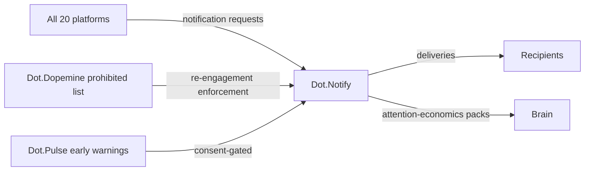

# Dot.Notify

> **Platform-owned source:** [Dot.Notify's wiki.md](https://github.com/sakhilebhayi/Dot.Notify/blob/main/wiki.md) — the platform's own knowledge home. This document is Dot.Brain's ingested view; the wiki is authoritative for what the platform actually is.

## 1. Purpose & Business Domain

The ecosystem's notification and messaging infrastructure: delivery of alerts, digests, and messages on behalf of every other platform, across channels (in-app, email, SMS, push). Owns the delivery domain: channels, consent, delivery outcomes. Notify originates almost nothing — it is the shared last mile — which makes its knowledge unusually valuable: it is the only platform that sees *attention economics across the whole ecosystem* (what gets delivered, opened, acted on, or ignored, everywhere). Its governance posture follows directly: the last mile is where dopemine's three-trigger rule and re-engagement prohibition are physically enforced (§8), and where Pulse's cross-org consent seam lands (§7).

## 2. Entities Owned

| Entity | Graph node type | Natural key | Notes |
|---|---|---|---|
| Channel registration | `entity:asset` | recipient + channel | Consent state lives here |
| Notification class | `entity:asset` | `notif:<platform>:<class>` | Each mapped to a design §6 trigger type |
| Delivery | `entity:process` | delivery ID | Sent → delivered → opened → acted |
| Consent record | `entity:asset` | recipient + scope | Includes cross-org early-warning scope (§7) |
| Delivery-outcome observation | `observation` | class × cohort × window | Aggregate only, n ≥ 50 |

## 3. Events Emitted

| Event | Trigger | Consumers | Frequency |
|---|---|---|---|
| `messaging.delivery.acted/ignored` | Recipient action or timeout | Brain (aggregate), originating platform | ~10⁴/day |
| `messaging.class.throttled` | Class exceeds precision floor (§8) | Originating platform, Brain | low |
| `messaging.consent.granted/revoked` | Consent change | Originating platforms (scope-relevant) | ~10²/day |

## 4. Knowledge Packs Published

| Payload type | Cadence | Example pack ID |
|---|---|---|
| observation (per-class precision/fatigue aggregates) | weekly | `dkp:notify:obs:2026-07-06:0015` |
| insight (attention-economics findings across platforms) | per finding | `dkp:notify:ins:2026-06-10:0001` |
| outcome (recommendation verifications) | per verified recommendation | `dkp:notify:out:2026-07-22:0001` |
| incident (delivery failures, consent breaches) | per incident | `dkp:notify:inc:2026-02-14:0001` |

The attention-economics insight is Notify's distinctive contribution: only Notify can observe that, e.g., recipients who receive > N actionable alerts per day act on progressively fewer of them regardless of source platform — evidence no single platform can produce, feeding design's notification-precision standards ecosystem-wide.

## 5. Intelligence Consumed

| Recommendation type | Metric expected to move | Baseline |
|---|---|---|
| Class-throttling (demote low-precision classes to digest) | `messaging.notification_precision` | 2026 H1, per class |
| Channel-selection (which channel a class actually gets acted on) | `messaging.action_rate_p50` | per class |
| Send-window optimization (timing, never frequency-pressure) | `messaging.action_rate_p50` | per cohort |

## 6. Cross-Platform Relationships & Domain-Agent Assignment (registry gap closed)



**Domain-agent assignment (the registry gap):** Notify had no obvious colony agent — it is infrastructure, not a knowledge domain. Resolution: the **Documentation Agent** takes Notify as its platform assignment. Rationale: both own the same problem — getting the right information to the right person at the right moment without noise — and design §6's notification triggers are a documentation-legibility concern, not an engagement one. The alternative (a new dedicated Messaging Agent) was rejected as colony sprawl for a platform that originates no domain knowledge. Recorded here as the canonical assignment; brain.agents.md picks it up on next touch.

## 7. Tenancy Model & the Consent Seam

Tenant key = organization; recipient consent is per-person, per-scope, and travels with the recipient across platforms (one consent store, queried by scope). The **Pulse early-warning seam** (inherited OQ, resolved): a cross-org topic signal destined for a domain platform's human lead is a *new consent scope* — `cross-org-early-warning` — granted by the receiving lead themselves, default off, one-tap revocable. Pulse never addresses individuals; it requests delivery to a role, and Notify resolves role → consented recipient. If no recipient has the scope enabled, the signal lands in the platform's ordinary governance digest instead — consent gaps degrade to slower channels, never to silence or to nagging.

Aggregation floor n ≥ 50 recipients per class × cohort × window; open/action behavior is behavioral data and inherits the stricter floor.

## 8. Dopamine Surface (the enforcement point)

Notify is where notification governance becomes physical: design §6's three legitimate triggers (actionable decision, guard breach, requested digest) are the only accepted request types — a platform cannot send what Notify has no request class for. The prohibited-list re-engagement pattern ("we miss you", inactivity nudges, unread-count pressure) is enforced structurally: **no notification class may trigger on recipient absence.** Trigger conditions must reference domain events, never recipient-behavior gaps; validation rejects class registrations whose trigger predicate reads recipient-activity fields. Withheld from its own surface: open-rate leaderboards across platforms, recipient responsiveness scores. Shared: per-class precision — visible to each originating platform as their own quality signal.

## 9. Active Recommendations

Maintained by the Registry Agent. Current: class-throttling `verified` — see §13; channel-selection review for SMS-heavy classes `open` (expiry 2026-09-05).

## 10. Incident History Summary

One incident pack (2026-02): a platform's alert class fired on a misconfigured threshold, sending 40× normal volume in one day — F-INFRA with a fatigue tail measurable in the following week's action rates (the incident pack quantified attention as a depletable resource, later cited by design's dwell-guard work). Lesson: per-class rate ceilings added to class registration. Consumed: Central's alert-precision tuning pattern.

## 11. Domain Metrics (registered per brain.metrics.md §4.8)

| ID | Type | Definition |
|---|---|---|
| `messaging.notification_precision` | ratio | Deliveries acted on / deliveries sent, per class — the ecosystem's fatigue guard |
| `messaging.action_rate_p50` | duration | Delivery to recipient action, median, per class |
| `messaging.consent_coverage_rate` | ratio | Role-addressed requests resolving to a consented recipient / all role-addressed requests |

## 12. Manifest (platform.dkp.json example)

```json
{
  "platform_id": "dot-notify",
  "dkp_version": "1.0.0",
  "signing_key_ref": "vault://keys/dot-notify/dkp-signing/v1",
  "publishes": ["observation", "insight", "outcome", "incident"],
  "subscribes": ["class-throttling", "channel-selection", "send-window-optimization"],
  "schemas": { "knowledge-pack": "1.0.0", "metric": "1.0.0" },
  "default_classification": "ecosystem",
  "tenancy": {
    "key": "org_id",
    "aggregation_floor": 50,
    "publication_rules": [
      { "rule": "no-absence-triggers", "enforcement": "reject-at-class-registration" }
    ]
  }
}
```

## 13. Worked round-trip

1. **Pack:** `dkp:notify:obs:2026-07-06:0015` — per-class precision aggregates showing one platform's informational alert class at 0.04 precision (96% ignored) while its digest class sat at 0.61; n = 212 recipients.
2. **Validation → graph:** `OBSERVED_WITH` edge between class volume and cross-class action-rate depression for the same recipients, 0.74 — the fatigue effect is per-recipient, not per-class, corroborating the 2026-02 incident finding (×1.10 → 0.81).
3. **PR back (class-throttling):** demote the 0.04-precision class to daily digest; confidence 0.81, impact `messaging.notification_precision` for the class and recovery of neighboring classes' action rates, guard: no missed guard-breach alerts (that class untouched), expiry 30 days.
4. **Outcome:** `dkp:notify:out:2026-07-22:0001` — demoted class's digest precision 0.58; neighboring actionable classes' action rate +11% verified — attention freed measurably. The finding generalizes and is published as the attention-economics insight in §4, feeding `design.notification_precision` standards.

## Verified Infrastructure State (2026-08-07)

Confirmed directly against the real repo during the ecosystem-wide standardization + code-quality pass (full 26-platform summary: [brain.platforms.md](../brain.platforms.md) change log, v1.0.21):

- **Legal/branding/auth** — branded Markdown-mail theme, complete POPIA-aligned Privacy Policy/Terms/Cookie Policy naming **BluePin Inc**, guest auth pages restyled to match the welcome-page hero.
- **Laravel Boost** — `laravel/boost` ^2.5 installed; `.mcp.json`/`boost.json`/`CLAUDE.md` guideline block in place.
- **Code-quality pass** — Pint: 32 files reformatted, formatting-only. `composer audit`: patched 6 `league/commonmark` DoS advisories. `npm audit`: patched postcss path-traversal + shell-quote ReDoS (via concurrently). Full suite reconfirmed green (84 tests / 77 passed / 181 assertions) after every change.

## Autonomy Classification (brain.autonomy.md)

Per [brain.autonomy.md](../brain.autonomy.md) §2. Audited against the real codebase at `~/Dot/Dot.Notify` on 2026-08-08 — not aspirational.

### Level 1 — Autonomous

None found. Checked `routes/console.php` (only the stock Laravel `inspire` command — no scheduled commands or `Schedule::` calls in `bootstrap/app.php`), `app/` for a `Jobs/` directory (none exists — no queued jobs), and `.github/` for CI/CD workflows (directory does not exist — no automated pipeline runs unattended). The one process that looks automated at a glance — `POST /webhooks/{token}` in `app/Http/Controllers/WebhookInboundController.php`, which verifies an inbound webhook's HMAC signature and auto-creates a `NotifyInboundEvent` plus a matching `NotifyLog` row when an active `NotifyRule` exists — stops short of actually executing anything: the log is created in `queued` status only. The controller's own inline comment states dispatching to a channel driver "is the pre-existing send pipeline gap noted in wiki.md, not something introduced here." An operation that never delivers a notification does not qualify as an autonomous operator process.

### Level 2 — Escalate

None found. Checked `app/Services/AiNotifyService.php` (calls the Anthropic API to draft a notification template's subject/body/variables) and its only caller, `app/Livewire/Notify/TemplateEditor.php::generate()`. The generated draft is held in Livewire component state (`$generatedSubject`, `$generatedBody`) and displayed back to the logged-in user; nothing persists or executes until the same user manually triggers the separate `saveTemplate()` action from the UI. This is synchronous, same-request human-operated drafting inside an authenticated Livewire form — not a background process presenting Context → Evidence → Risk → Recommendation → Proposed Action for a separate approver to release. It is Level 3 (human-operated tooling), not Level 2 (system-prepared, human-approved autonomous process).

### Level 3 — Human Control

- **Channel and template management** — `app/Livewire/Notify/ChannelManager.php` (`addChannel`, `toggleChannel`, `deleteChannel`) and `app/Livewire/Notify/TemplateEditor.php` (`generate`, `saveTemplate`): every channel registration, activation toggle, deletion, and AI-drafted template save is a synchronous `wire:click` action a logged-in operator performs by hand; nothing runs without that click.
- **AI template drafting** — `app/Services/AiNotifyService.php`: calls `https://api.anthropic.com/v1/messages` directly with `curl` inside the request cycle to draft copy; the draft is inert until a human clicks save (see Level 2 rationale above).
- **Notification delivery pipeline** — `app/Http/Controllers/WebhookInboundController.php`: verifies inbound webhook signatures and creates a `NotifyLog` in `queued` status, but there is no channel-driver dispatch anywhere in the codebase (no `app/Jobs/`, no mailer/SMS/push send call found), so every queued notification currently requires a human/manual mechanism to actually reach a recipient.
- **Ecosystem SSO handoff** — `app/Http/Controllers/Auth/EcosystemAuthController.php::handle()`: consumes a one-time Sanctum personal access token scoped `ecosystem:read`, deletes it, and logs the bearer in — a security-credential-adjacent operation, inherently Level 3 per brain.autonomy.md §2's "security credential ownership" example.
- **Team/access authorization** — `app/Policies/TeamPolicy.php`: every mutating team action (`update`, `addTeamMember`, `updateTeamMember`, `removeTeamMember`, `delete`) is gated on `$user->ownsTeam($team)`, i.e. a specific human owner's authority, not an automated actor.
- **Code-quality/dependency remediation** — the 2026-08-07 verified-infrastructure pass (Pint reformatting, `composer audit`/`npm audit` patching) recorded above was a manual, human-run pass; no CI/CD workflow exists in the repo (`.github/` absent) to make this run unattended in the future.

### Gap summary

For a first real Level 1 process to exist, Dot.Notify needs a queue worker or scheduled job that actually dispatches a `queued` `NotifyLog` to its channel driver (email/SMS/push/webhook/Slack/in-app) end-to-end without a human click, plus a CI/CD pipeline (currently absent — no `.github/workflows/`) so dependency/security patching and test runs happen unattended instead of the manual pass recorded 2026-08-07.

## Change Log

| Version | Date | Author | Change |
|---|---|---|---|
| 1.0.0 | 2026-08-01 | Platform Integrator (prompt 05, AI) | Initial integration package: delivery-domain ownership, domain-agent assignment gap closed (Documentation Agent, sprawl alternative rejected), Pulse cross-org consent scope resolved (default-off, role-addressed, degrade-to-digest), structural no-absence-trigger enforcement, attention-economics insight channel, 3 domain metrics, worked round-trip |

| 1.0.1 | 2026-08-01 | Repository Steward Agent | Linked to Dot.Notify's own wiki.md (platform repo) as the platform-owned source of truth |

| 1.1.0 | 2026-08-08 | Platform Autonomy Classification sub-project | Added Autonomy Classification section per brain.autonomy.md §2 |

## Open Questions

| Question | Owner → Approver |
|---|---|
| Per-class rate ceilings: fixed at registration or adaptive to observed precision? | Documentation Agent → UX Architect |
| SMS channel costs are per-message — should channel-selection recommendations carry a cost term (coordinate with business ROI model)? | Business Agent → Executive Sponsor |
