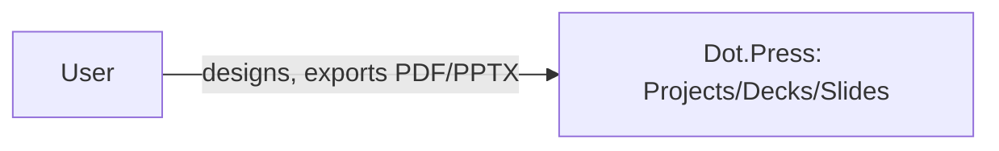

# Dot.Press

> **Platform-owned source:** [Dot.Press's wiki.md](https://github.com/sakhilebhayi/Dot.Press/blob/main/wiki.md) — the platform's own knowledge home. This document is Dot.Brain's ingested view; the wiki is authoritative for what the platform actually is.

## 1. Purpose & Business Domain

**Domain correction (2026-08-02):** despite the ecosystem registry's `newspaper` icon suggesting a newsroom/CMS product, the real, built codebase is a presentation/slide-deck design tool (Canva/Google-Slides-shaped): a Konva+Tiptap canvas editor, AI slide generation/rewrite with an honest `mock` fallback (not a fabricated result), PDF/PPTX export, and a full authorized CRUD API backed by 5 Policies. Real entities: Project, Deck, Slide, Asset, AiUsageLog. Architecturally distinct from its 6 siblings: this app uses Jetstream's Inertia+Vue 3 stack, not Livewire — a genuine divergence, not an oversight (`config/jetstream.php: 'stack' => 'inertia'`).

## 2. Entities Owned

| Entity | Graph node type | Natural key | Notes |
|---|---|---|---|
| Project | `entity:asset` | project ID | User-owned, no team-sharing yet |
| Deck | `entity:asset` | deck ID | Belongs to a Project |
| Slide | `entity:asset` | slide ID | Belongs to a Deck |
| Asset | `entity:asset` | asset ID | Uploaded media |
| AiUsageLog | `observation` | log ID | AI generation/rewrite calls, cost tracking |

## 3. Events Emitted

None currently mapped to DKP.

## 4. Knowledge Packs Published

None. No DKP manifest or publish pipeline exists.

## 5. Intelligence Consumed

None currently subscribed.

## 6. Cross-Platform Relationships

No cross-platform data exchange with other Dot Ecosystem platforms yet beyond shared ecosystem SSO and the shared `infodot` database.

## 7. Tenancy Model

Single-`user_id`-owned (no team-sharing model built yet). Every by-ID controller action in `app/Http/Controllers/Api/` authorizes via one of 5 Policies, consistently scoped by real ownership chains — the integration pass's security scan came back clean, no IDOR found.

## 8. Dopamine Surface

None identified as in-scope.

## 9. Active Recommendations

None — no Knowledge Pack publishing yet.

## 10. Incident History Summary

None recorded as a live incident. Real defect found and fixed during the 2026-08-02 integration pass: `/dashboard` was completely broken — `routes/web.php` rendered a Blade view (`dashboard`) that doesn't exist in this Inertia-based app (only an Inertia page component, `Dashboard.vue`, exists). Fixed by switching to `Inertia::render('Dashboard', [...])` with the exact prop shape the Vue component expects — verified by reading `Dashboard.vue` directly, not guessed. Also removed a dead Livewire-stack layout file (`@livewireStyles`/`@livewire(...)` directives) left over despite this app having no `livewire/livewire` dependency at all.

## Verified Infrastructure State (2026-08-07)

Confirmed directly against the real repo during the ecosystem-wide standardization + code-quality pass (full 26-platform summary: [brain.platforms.md](../brain.platforms.md) change log, v1.0.21):

- **Legal/branding/auth** — branded Markdown-mail theme, complete POPIA-aligned Privacy Policy/Terms/Cookie Policy naming **BluePin Inc**, guest auth pages restyled to match the welcome-page hero.
- **Laravel Boost** — `laravel/boost` ^2.5 installed (auto-detected Inertia + Vue guidelines, not Livewire — this is the one platform in the pass running that stack); `.mcp.json`/`boost.json`/`CLAUDE.md` guideline block in place.
- **Code-quality pass** — Pint: 11 files reformatted, formatting-only. `composer audit`: **23 advisories across 9 packages**, all patched — `laravel/framework` (signed-URL/CRLF), `dompdf/dompdf` → 3.1.6, `symfony/*` transitive, `league/commonmark` baseline (same combination as dot-engage minus medialibrary). `npm audit`: patched Vite path-traversal/file-read advisories and `ws` uninitialized-memory-disclosure + memory-exhaustion DoS (12 issues total). Verified `npm run build` still succeeds post-fix (Inertia + Vue stack). Full suite reconfirmed green (54 passed / 4 skipped / 116 assertions) after every change.

## Autonomy Classification (brain.autonomy.md)

Per [brain.autonomy.md](../brain.autonomy.md) §2. Audited against the real codebase at `~/Dot/Dot.Press` on 2026-08-08 — not aspirational.

### Level 1 — Autonomous

- **AI-prompt safety moderation** — `app/Services/Ai/SafetyGuard.php`, called synchronously from `AiController::generateSlide`/`rewriteText` (`app/Http/Controllers/Api/AiController.php`). Blocks empty/oversized prompts and pattern-matched unsafe content (weapons, hate speech, CSAM, malware requests) before any AI call is made, on every request, with no owner approval or review step. Blocked attempts are logged to `AiUsageLog` for audit but nothing pauses for Sakhile Bhayi to act.
- **Abuse-rate throttling** — `RateLimiter::for('ai'|'export'|'collab', ...)` in `app/Providers/AppServiceProvider.php`, enforced via `throttle:ai`/`throttle:export`/`throttle:collab` middleware on the routes in `routes/api.php`. Per-user/per-IP request caps (AI: 20/min via `config/ai.php`'s `AI_RATE_LIMIT_PER_MINUTE`; export: 10/min; collab: 120/min) execute automatically with no operator involvement — this is the platform's only real automated abuse remediation.

### Level 2 — Escalate

None found. Checked: `app/Console/Commands` doesn't exist (no scheduled artisan commands), `app/Jobs` doesn't exist and no class in `app/` implements `ShouldQueue` (nothing is queued despite `QUEUE_CONNECTION=database` being configured — the queue is provisioned but unused), `app/Notifications` doesn't exist and no code calls Laravel's `Notification` facade or extends `Notification`. There is no process anywhere in the codebase that assembles a proposal and then waits on an authorized human before executing it — the Context → Evidence → Risk → Recommendation → Proposed Action shape brain.autonomy.md §2 requires for Level 2 has nothing to attach to yet.

### Level 3 — Human Control

- **Deployment** — no CI/CD exists in the real repo. `find .github -type f` returns nothing, and a root-level scan turns up no `Dockerfile`, `*.toml`, `Procfile`, or `vercel.json`. `CLAUDE.md`'s "Deployment" rule names Laravel Cloud as the intended target but no automated deploy pipeline is wired up — every deploy is a manual operator action.
- **Environment/secret provisioning & app-key generation** — `composer.json`'s `scripts.setup` (`.env` copy, `artisan key:generate`, `artisan migrate --force`, `npm install && npm run build`) is a one-shot manual bootstrap script an operator runs by hand; nothing re-runs it or rotates `APP_KEY`/`ANTHROPIC_API_KEY` automatically.
- **Database migrations in production** — `artisan migrate --force` only runs as part of the manual `composer setup` script above; there is no deploy hook or scheduled command that runs migrations unattended.
- **Dependency security patching** — per this file's "Verified Infrastructure State (2026-08-07)" section, the 23 `composer audit` advisories and 12 `npm audit` issues found on 2026-08-07 were triaged and patched by hand during a manual pass; no `dependabot.yml` or equivalent exists in the real repo (`find . -iname "dependabot*"` only matches a third-party package inside `node_modules/`, not project config), so there is no automated dependency-update or vulnerability-patch process — every patch cycle requires an operator.
- **AI provider cutover** (`mock` → `anthropic`) — `config/ai.php`'s `'provider' => env('AI_PROVIDER', 'mock')` is a manually-set environment variable; flipping the platform from its honest mock fallback to live Anthropic calls (and provisioning `ANTHROPIC_API_KEY`) is an operator decision with no code path that does it automatically.

### Gap summary

The platform has zero queued jobs, scheduled commands, or notifications to promote into a Level 2 escalation flow — before a first real Level 2 process can exist, something would need to be built that assembles a Context → Evidence → Risk → Recommendation → Proposed Action package (e.g. a dependency-patch proposal drawn from `composer audit`/`npm audit` output) and holds it for Sakhile Bhayi's approval instead of either running unattended or requiring him to run the audit by hand today.

## Change Log

| Version | Date | Author | Change |
|---|---|---|---|
| 1.1.0 | 2026-08-08 | Platform Autonomy Classification sub-project | Added Autonomy Classification section per brain.autonomy.md §2 |
| 1.0.0 | 2026-08-02 | Repository Steward Agent | Initial registration. Platform audited: real domain corrected (slide-deck design tool, not newsroom), a fully broken /dashboard route fixed (wrong frontend stack assumption), SSO contract verified clean, security scan came back clean, README corrected, stale `TASK_LIST.md` "real-time collaboration" claim scoped down to what's actually built (cache-based presence + optimistic locking). |

## Open Questions

| Question | Owner → Approver |
|---|---|
| `os/Appendix.md`'s `newspaper` icon no longer matches this platform's real domain — should it be updated? | Registry Agent → Chief Knowledge Engineer |
| Should team-sharing be added, or is single-user ownership the intended model for this platform? | Press Platform Lead → Chief Architect |
