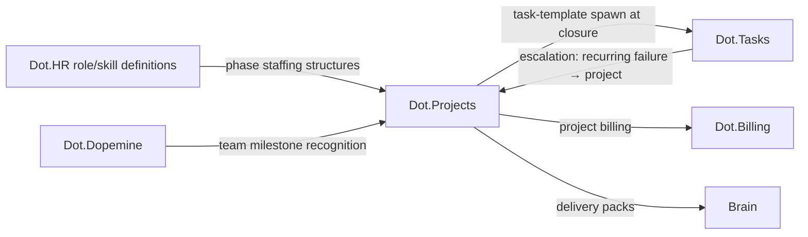

# Dot.Projects

> **Platform-owned source:** [Dot.Projects's wiki.md](https://github.com/sakhilebhayi/Dot.Projects/blob/main/wiki.md) — the platform's own knowledge home. This document is Dot.Brain's ingested view; the wiki is authoritative for what the platform actually is.

## 1. Purpose & Business Domain

Project and programme delivery: multi-phase initiatives with budgets, milestones, dependencies, and cross-team coordination. Owns the delivery domain at the *initiative* granularity. The boundary with Dot.Tasks is temporal and structural: **Projects owns work with phases and end dates; Tasks owns work that recurs.** A project is finished or failed; an operational task queue is never finished, only healthy or unhealthy. Handoff: a project may *spawn* recurring task templates at closure (the thing it built now needs operating), and Tasks escalates a recurring failure into a project when the fix exceeds routine capacity. One unit of work lives in exactly one platform at a time — the exclusive-ownership rule (Auction §6) applied to work instead of merchandise.

## 2. Entities Owned

| Entity | Graph node type | Natural key | Notes |
|---|---|---|---|
| Project | `entity:process` | project ID | Phase-attributed, end-dated |
| Milestone | `entity:process` | project + milestone | The team-mechanic anchor (§8) |
| Dependency edge | `entity:process` | predecessor + successor | Cross-project dependencies publishable as structures |
| Delivery observation | `observation` | project-cohort × phase-type × window | n ≥ 20 projects per cell |
| Delivery outcome | `outcome` | project + closure | On-time/on-budget/descoped ground truth, incl. failed closures |

Individual contributor assignments follow HR's work-not-workers rule: the graph sees roles on phases, never named people.

## 3. Events Emitted

| Event | Trigger | Consumers | Frequency |
|---|---|---|---|
| `delivery.milestone.reached/slipped` | Milestone resolution | Brain, Dot.Notify (actionable class), Dot.Analytics | ~10²/week |
| `delivery.project.closed` | Closure (any verdict) | Brain, Dot.Billing (project billing), Dot.Tasks (template spawn) | low |
| `delivery.dependency.blocked` | Cross-project block | Brain, both project leads | low |

## 4. Knowledge Packs Published

| Payload type | Cadence | Example pack ID |
|---|---|---|
| observation (phase-duration, slip-pattern aggregates) | monthly | `dkp:projects:obs:2026-07-01:0005` |
| insight (delivery-pattern findings) | per finding | `dkp:projects:ins:2026-06-18:0001` |
| outcome (recommendation verifications) | per verified recommendation | `dkp:projects:out:2026-07-26:0001` |
| incident (delivery failures worth ecosystem lessons) | per incident | `dkp:projects:inc:2026-06-01:0001` |

Failed-closure honesty rule: failed and descoped projects publish in the same aggregates as successes — a delivery evidence base built only from survivors is the success-theater failure mode failures §3 names.

## 5. Intelligence Consumed

| Recommendation type | Metric expected to move | Baseline |
|---|---|---|
| Phase-estimate calibration (historical phase-type durations vs. plans) | `delivery.schedule_calibration` | 2026 H1 |
| Dependency-risk alerts (structural patterns that precede blocks) | `delivery.blocked_dependency_rate` | 2026 H1 |
| Role-coverage checks at phase gates (HR skills-coverage consumption, §6) | `delivery.milestone_on_time_rate` | per phase type |

## 6. Cross-Platform Relationships



**HR consumption contract:** Projects consumes HR's `open`-tier role and skill definitions to express phase staffing as *role structures* ("this phase type needs 2× role:maintenance:planner"), and HR's aggregate skills-coverage packs to warn when a planned phase's role demand exceeds regional coverage — structure meeting structure; no individual data crosses in either direction.

## 7. Tenancy Model

Tenant key = organization; cross-org programmes (e.g. a mine expansion with contractor orgs) use explicit data-sharing scopes per participating org, defaulting to own-slice visibility. Aggregation floor n ≥ 20 projects per cell; small portfolios roll up to sector cohorts (HR's rollup lesson, applied to portfolios).

## 8. Dopamine Surface

Home of the corpus's verified team-milestone mechanic (dopemine §13: milestone recognition, outcome-coupled at 0.71→0.78, deployed with visible intent labels). Deployment terms here: team granularity only, fires on `delivery.milestone.reached` (a domain event — Notify's no-absence rule satisfied by construction), recognition content references the milestone, never individual velocity. Withheld: individual contributor throughput surfaces, cross-team delivery leaderboards (rate-metric pattern), slip-shaming surfaces (a slipped milestone triggers a *decision* notification to the lead, not a public red wall).

## 9. Active Recommendations

Maintained by the Registry Agent. Current: phase-estimate calibration `verified` — see §13; dependency-risk alert for a three-project construction cluster `open` (expiry 2026-08-20).

## 10. Incident History Summary

One incident pack (2026-06): a programme's phase estimates were systematically copied from a prior project without condition checks — an uncondition-checked-citation failure at the project level, caught when slip patterns diverged; lesson mirrored patterns §5 discipline into delivery practice (estimates cite *comparable-condition* history or are marked unanchored). Consumed: dopemine's milestone-mechanic certification.

## 11. Domain Metrics (registered per brain.metrics.md §4.8)

| ID | Type | Definition |
|---|---|---|
| `delivery.milestone_on_time_rate` | ratio | Milestones reached by planned date / milestones due, monthly |
| `delivery.schedule_calibration` | ratio | Actual / planned phase duration, p50 per phase type — 1.0 is perfect calibration |
| `delivery.blocked_dependency_rate` | ratio | Dependency edges blocked ≥ 1 week / active edges, monthly |

## 12. Manifest (platform.dkp.json example)

```json
{
  "platform_id": "dot-projects",
  "dkp_version": "1.0.0",
  "signing_key_ref": "vault://keys/dot-projects/dkp-signing/v1",
  "publishes": ["observation", "insight", "outcome", "incident"],
  "subscribes": ["phase-estimate-calibration", "dependency-risk-alert", "role-coverage-check"],
  "schemas": { "knowledge-pack": "1.0.0", "metric": "1.0.0" },
  "default_classification": "ecosystem",
  "tenancy": {
    "key": "org_id",
    "aggregation_floor": 20,
    "publication_rules": [
      { "rule": "include-failed-closures", "enforcement": "audit" },
      { "rule": "no-individual-contributors", "enforcement": "reject-at-ingestion" }
    ]
  }
}
```

## 13. Worked round-trip

1. **Pack:** `dkp:projects:obs:2026-07-01:0005` — phase-duration aggregates for infrastructure-maintenance phase types across 34 mining and agri projects, failed closures included.
2. **Validation → graph:** `OBSERVED_WITH` edge between wet-season execution windows and civil-works phase overruns, 0.70; corroborated by Mines' weather-window observations (×1.10 → 0.77) — the Kolomela moisture thread surfacing in a fourth domain.
3. **PR back (phase-estimate calibration):** apply a wet-season multiplier band (1.25–1.4×) to civil-works phase estimates scheduled in rainfall windows; confidence 0.80, impact `delivery.schedule_calibration` toward 1.0, guard `delivery.milestone_on_time_rate` flat-or-better, expiry 90 days.
4. **Outcome:** `dkp:projects:out:2026-07-26:0001` — calibration for treated phase types moved 1.31 → 1.08 verified against untreated cohort; guard improved. Logged as potential second-context evidence toward P-2026-001's condition family (seasonal-moisture effects on scheduled work), pending patterns review.

## Verified Infrastructure State (2026-08-07)

Confirmed directly against the real repo during the ecosystem-wide standardization + code-quality pass (full 26-platform summary: [brain.platforms.md](../brain.platforms.md) change log, v1.0.21):

- **Legal/branding/auth** — branded Markdown-mail theme, complete POPIA-aligned Privacy Policy/Terms/Cookie Policy naming **BluePin Inc**, guest auth pages restyled to match the welcome-page hero.
- **Laravel Boost** — `laravel/boost` ^2.5 installed; `.mcp.json`/`boost.json`/`CLAUDE.md` guideline block in place.
- **Code-quality pass** — Pint: 27 files reformatted, formatting-only. `composer audit`: patched 6 `league/commonmark` DoS advisories. `npm audit`: patched postcss path-traversal + shell-quote ReDoS (via concurrently). Full suite reconfirmed green (69 tests / 62 passed / 123 assertions) after every change.

## Autonomy Classification (brain.autonomy.md)

Per [brain.autonomy.md](../brain.autonomy.md) §2. Audited against the real codebase at `~/Dot/Dot.Projects` on 2026-08-08 — not aspirational.

### Level 1 — Autonomous

- **Daily milestone due-soon reminder.** `app/Console/Commands/CheckMilestonesDueSoon.php`, scheduled via `Schedule::command('projects:check-milestones-due')->dailyAt('07:00')` in `routes/console.php`. Runs unattended every day: queries milestones due within the next two days that aren't yet `completed`, dedupes against notifications already sent for the same milestone in the last 24 hours (so a re-run or a missed-schedule catch-up doesn't spam), and dispatches an in-app `MilestoneDueSoonNotification` (`app/Notifications/MilestoneDueSoonNotification.php`, database channel, synchronous) to the project's owner and members. Non-destructive, informational, idempotent, no spend/legal/security stakes — the operator (Sakhile Bhayi) is never in the loop for this to run correctly. This matches §2's L1 examples of routine monitoring and reporting.

### Level 2 — Escalate

None found. Checked: `app/Jobs/` does not exist (zero queued jobs of any kind in the codebase, despite `queue:listen` being wired into the local `composer dev` script), so there is no job pipeline that could stage a prepared-but-unexecuted action. Grepped the full `app/` tree for `approv|pending_review|escalat` — zero matches. No model, migration, controller, or policy carries a pending/awaiting-approval state. There is currently no real process in Dot.Projects that prepares an action and holds it for authorised human sign-off before executing.

### Level 3 — Human Control

- **Deployment.** No `.github/` directory, no CI/CD workflow file, no Dockerfile, no Procfile, and no deploy script exist anywhere in the repo. `composer.json`'s `setup` script (`composer install` → `.env` copy → `key:generate` → `migrate --force` → `npm install` → `npm run build`) is a local bootstrap script, not a pipeline — nothing invokes it against production. Shipping a change to this platform is entirely manual today and stays with the operator by default (§2: nothing may execute Level-3-adjacent, unautomated operations on its own).
- **Dependency security patching.** The verified-infrastructure note in this same document (§"Verified Infrastructure State (2026-08-07)") records `composer audit` / `npm audit` fixes (6 `league/commonmark` DoS advisories, postcss/shell-quote issues) applied by hand during a manual pass — there is no scheduled or CI-gated audit job in the codebase (`app/Console/Commands/` contains only `CheckMilestonesDueSoon.php`) that would catch the next advisory without an operator (or an agent acting for one) running it.
- **Ecosystem SSO token issuance and revocation.** `app/Http/Controllers/Auth/EcosystemAuthController.php` consumes a pre-issued Sanctum personal access token scoped to `ecosystem:read` to log a user in and then deletes the token (single use). The controller only *consumes* tokens; nothing in the repo shows where or how `ecosystem:read` tokens are minted, rotated, or revoked at scale — that credential-issuance authority (§2 L3: "security credential ownership") is not automated anywhere in this codebase and stays manual/out-of-repo.
- **Database migrations.** `php artisan migrate` (`--force` in the setup script, `--graceful` in `post-create-project-cmd`) is triggered by a human or an agent acting under human instruction; there is no scheduled or CI-triggered migration runner.

### Gap summary

The platform's only automated process (the milestone reminder) is read-and-notify with no write side effects, so it never needed an approval gate — that's why no Level 2 process exists yet. The first real Level 1 candidate with actual escalation stakes would need a process that *writes* on the operator's behalf (e.g., an automated dependency-security-patch bot that opens a PR, or a CI/CD pipeline that deploys after tests pass) plus a `Jobs/`-based staging step that holds the prepared action for sign-off before Dot.Projects would have a genuine Level 2 process to classify.

## Change Log

| Version | Date | Author | Change |
|---|---|---|---|
| 1.0.0 | 2026-08-01 | Platform Integrator (prompt 05, AI) | Initial integration package: project/task boundary (phased vs. recurring, exclusive ownership, spawn/escalate handoffs), HR structure-to-structure consumption contract, failed-closure honesty rule, verified team-milestone mechanic deployment terms, 3 domain metrics, worked round-trip |

| 1.0.1 | 2026-08-01 | Repository Steward Agent | Linked to Dot.Projects's own wiki.md (platform repo) as the platform-owned source of truth |

| 1.1.0 | 2026-08-08 | Platform Autonomy Classification sub-project | Added Autonomy Classification section per brain.autonomy.md §2 |

## Open Questions

| Question | Owner → Approver |
|---|---|
| Wet-season calibration finding: does it qualify as replication evidence for P-2026-001's condition family or a sibling pattern? | Architecture Agent → Chief Architect |
| Cross-org programme scopes: standard scope templates or per-programme negotiation? | Delivery Agent → Chief Architect |
