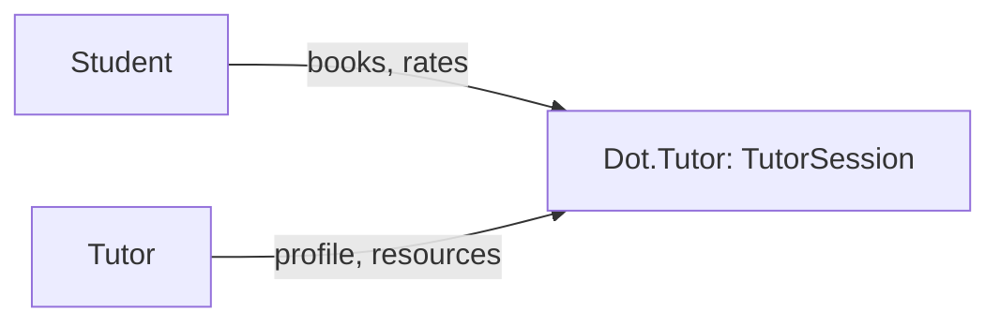

# Dot.Tutor

> **Platform-owned source:** [Dot.Tutor's wiki.md](https://github.com/sakhilebhayi/Dot.Tutor/blob/main/wiki.md) — the platform's own knowledge home. This document is Dot.Brain's ingested view; the wiki is authoritative for what the platform actually is.

## 1. Purpose & Business Domain

A tutoring marketplace: `TutorProfile`, `TutorSession`, `Subject`, `LessonResource`, `SessionRating` are fully modeled, a real dark-themed ops dashboard queries them, and — as of a 2026-08-02 second pass — a real booking flow exists (browse tutors, view a profile, book a session, view/cancel it), so a prospective student can now actually create a session through this app. `LessonResource` upload and `SessionRating` still have no UI, and no session ever progresses past `pending` to `confirmed`/`completed` yet. Earlier README claims of AI summaries, learning paths, video classrooms, S3, Scout, and Redis/Horizon do not exist in the codebase — corrected during integration.

## 2. Entities Owned

| Entity | Graph node type | Natural key | Notes |
|---|---|---|---|
| TutorProfile | `entity:asset` | profile ID | One per tutoring user |
| TutorSession | `entity:process` | session ID | Booking record — created via the real booking flow (`TutorBookingController`) as of 2026-08-02 |
| Subject | `entity:asset` | subject ID | Catalog |
| LessonResource | `entity:asset` | resource ID | Attached to sessions/subjects |
| SessionRating | `outcome` | rating ID | Post-session feedback |

## 3. Events Emitted

None currently.

## 4. Knowledge Packs Published

None. No DKP manifest or publish pipeline exists.

## 5. Intelligence Consumed

None currently subscribed.

## 6. Cross-Platform Relationships

No cross-platform data exchange with other Dot Ecosystem platforms yet beyond shared ecosystem SSO and the shared `infodot` database.

## 7. Tenancy Model

Single-`user_id`-owned; no `team_id` or admin role exists in this schema. The integration pass found and fixed a real, live gap: `/dashboard` queried `TutorSession` with zero scoping — any logged-in user could see every other user's session details (who they're paired with, subject, time, and dollar amount). Fixed: session-list queries now scope to the signed-in user's own sessions (as student or as the owning tutor profile); aggregate KPI counts stay platform-wide since they carry no PII. **The booking UI built 2026-08-02 shipped `TutorSessionPolicy` from day one** — `showSession`/`cancel` gate on it, and `TutorProfile::show()` only exposes `approved` profiles by ID — so the by-ID surface this section flagged as unaudited no longer exists unaudited.

## 8. Dopamine Surface

Not yet applicable — the booking flow (§7) is transactional (browse → book → view/cancel), with no progress/streak/achievement surface built. Worth a dedicated pass once session completion (rate/review) exists, per Dot.Brain's ethical-engagement manifesto.

## 9. Active Recommendations

None — no Knowledge Pack publishing yet.

## 10. Incident History Summary

**Real, live cross-user data disclosure** (§7) on session pairing/subject/amount — closed 2026-08-02, same day found. Also resolved during integration: a branding question about whether `dot.logos10.png` in this repo was the owner's personal brand mark (as assumed based on a same-named file elsewhere) — verified directly by viewing the image; it is genuinely Dot.Tutor's own logo (teacher icon + "dot.tutor" wordmark), a filename coincidence, not a misattribution. Used as the real logo.

## Verified Infrastructure State (2026-08-07)

Confirmed directly against the real repo during the ecosystem-wide standardization + code-quality pass (full 26-platform summary: [brain.platforms.md](../brain.platforms.md) change log, v1.0.21):

- **Legal/branding/auth** — branded Markdown-mail theme, complete POPIA-aligned Privacy Policy/Terms/Cookie Policy naming **BluePin Inc**, guest auth pages restyled to match the welcome-page hero.
- **Laravel Boost** — `laravel/boost` ^2.5 installed; `.mcp.json`/`boost.json`/`CLAUDE.md` guideline block in place.
- **Code-quality pass** — Pint: 9 files reformatted, formatting-only. `composer audit`: patched 6 `league/commonmark` DoS advisories. `npm audit`: patched postcss path-traversal + shell-quote ReDoS (via concurrently). Full suite reconfirmed green (52 tests / 45 passed / 91 assertions) after every change.

## Autonomy Classification (brain.autonomy.md)

Per [brain.autonomy.md](../brain.autonomy.md) §2. Audited against the real codebase at `~/Dot/Dot.Tutor` on 2026-08-08 — not aspirational.

### Level 1 — Autonomous

None found. Checked every location a Level 1 process would live: `app/Console/Commands/` does not exist (only `routes/console.php`'s stock `inspire` Artisan demo command); `bootstrap/app.php`'s `withRouting()`/`withMiddleware()` calls register no `->withSchedule()` block, so nothing runs on a cron; `app/Jobs/` does not exist — `QUEUE_CONNECTION=database` is configured in `.env.example` but there is no Job class anywhere in the codebase to dispatch onto it; `app/Notifications/` does not exist, so no automated email/SMS/push ever fires (`MAIL_MAILER=log` in `.env.example` confirms mail isn't even wired to a real transport). There is no unattended process on this platform today.

### Level 2 — Escalate

None found. A Level 2 process requires a system that analyses, prepares an action, and stages it for human approval (Context → Evidence → Risk → Recommendation → Proposed Action). No such staging/approval surface exists in the code: there is no admin or moderation controller, no pending-approval queue model, and no notification-to-approver flow. The one candidate — `TutorProfile.status` moving to `'approved'` — is read in three places (`app/Http/Controllers/TutorBookingController.php:26,46,63`) but written nowhere in application code or `database/seeders/DatabaseSeeder.php`; it is set directly against the database (e.g. via `artisan tinker`), which is manual execution, not a system preparing a proposal for review — so it classifies as Level 3, not Level 2.

### Level 3 — Human Control

- **Deployment.** No CI/CD pipeline exists — `.github/` is absent from the repo, and there is no `Dockerfile`, `docker-compose.yml`, `Procfile`, `fly.toml`, or deploy script of any kind. Every deploy is a manual operator action outside version control.
- **Dependency/security patching.** The 2026-08-07 `composer audit` (6 `league/commonmark` DoS advisories) and `npm audit` (postcss path-traversal, shell-quote ReDoS) patches recorded above were a manual, human-run pass — there is no Dependabot config, no scheduled audit command, and no `app/Console/Commands/` entry that would make this recurring or unattended.
- **Tutor profile approval.** `TutorProfile.status = 'approved'` gates marketplace visibility (`TutorBookingController::browse`/`show`, `app/Http/Controllers/TutorBookingController.php:26,46,63`) but no controller, form, or admin UI ever writes that value — it is set directly in the database by an operator (`artisan tinker` or a raw update), with no review workflow around it.
- **Session lifecycle progression.** `TutorSession.status` starts at `'pending'` on booking (`TutorBookingController.php:84`) and the only other transition in the codebase is `'cancelled'` (`TutorBookingController.php:112`). Nothing in `app/Jobs/`, `app/Console/Commands/`, or the controllers ever moves a session to `'confirmed'` or `'completed'` — that state change, if it happens at all today, is a manual database edit by an operator.
- **Ecosystem SSO token issuance.** `EcosystemAuthController::handle()` (`app/Http/Controllers/Auth/EcosystemAuthController.php`) *consumes* a pre-issued `ecosystem:read` Sanctum token per login request automatically — that per-request consumption is end-user-facing and out of scope for this operator-autonomy audit — but nothing in this repo shows how such tokens get *minted* in the first place; that issuance path is external to Dot.Tutor and, absent evidence otherwise, is operator-controlled.

### Gap summary

Dot.Tutor has zero unattended operator processes today — no scheduled commands, no queued jobs, no notification classes, and no CI/CD, despite `QUEUE_CONNECTION=database` already being configured in `.env.example`. The platform's first real Level 1 candidate would be small and low-risk: a scheduled `app/Console/Commands/` job that auto-transitions past-due `pending` sessions to a `no_show`/`expired` state (pure internal bookkeeping, no money movement, no customer-facing side effects), registered via `bootstrap/app.php`'s `->withSchedule()` and covered by a test — that alone would move this platform from "no automation exists" to "one narrow, auditable Level 1 process exists."

## Change Log

| Version | Date | Author | Change |
|---|---|---|---|
| 1.0.0 | 2026-08-02 | Repository Steward Agent | Initial registration. Platform audited: SSO contract verified, a live cross-user session-data disclosure fixed on /dashboard, branding resolved (confirmed dot.logos10.png is this platform's real logo, not a misplaced personal mark), leftover "coming soon" template removed, README corrected to match the real (booking-UI-incomplete) state. |
| 1.1.0 | 2026-08-02 | Sakhile Bhayi | **Booking flow built** (`TutorBookingController`, `TutorSessionPolicy`, browse/show/store/cancel routes and views) — the platform's core missing piece from 1.0.0 is closed. §1/§2/§7/§8 updated; open question about booking-UI priority resolved (it shipped). |
| 1.2.0 | 2026-08-08 | Platform Autonomy Classification sub-project | Added Autonomy Classification section per brain.autonomy.md §2 |

## Open Questions

| Question | Owner → Approver |
|---|---|
| Should tutoring sessions gain `team_id` scoping (e.g. for tutoring organizations), or stay single-user? | Tutor Platform Lead → Chief Architect |
| No session ever progresses past `pending` to `confirmed`/`completed`, and `LessonResource`/`SessionRating` still have no UI — next priority for a third pass? | Tutor Platform Lead → Executive Sponsor |
| `composer.json` still names the project `laravel/laravel`; a dead `ANTHROPIC_API_KEY` config exists with no service class using it. | Tutor Platform Lead → Repository Steward Agent |
